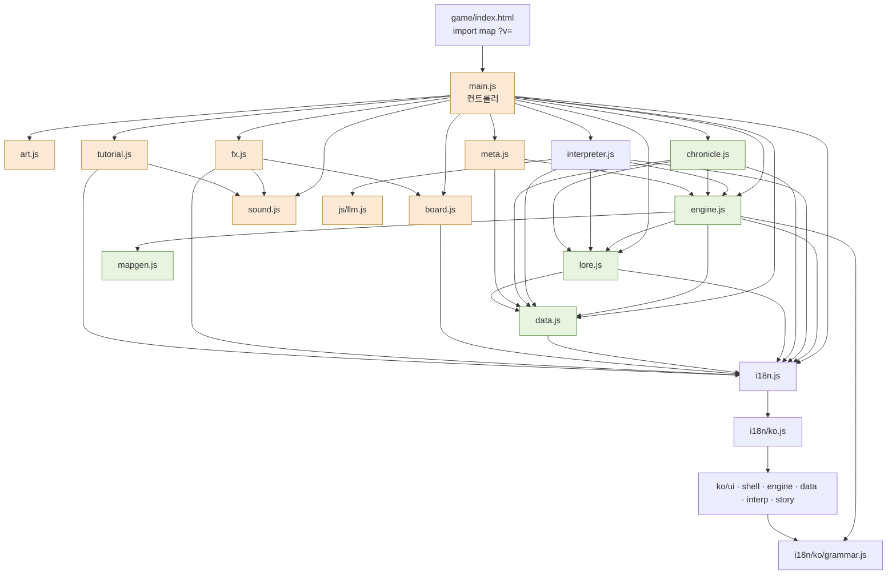
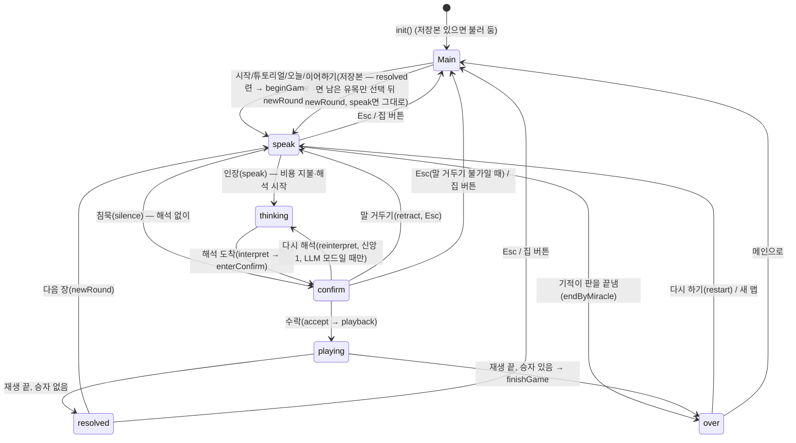

# 04. 소프트웨어 구조 — 모듈 · 상태 · 결정론 · 화면 컨트롤러

> 웹판(정적 ES 모듈, 빌드 없음)의 **현재 구조**를 적는다. 규칙 자체는 [02 규칙](02-rules.md), 데이터 값은 [03 데이터](03-data.md), 해석기는 [05 해석기](05-interpreter.md), 화면과 연출은 [06 UI/UX](06-ui-ux.md), 판 밖 저장은 [07 진행](07-progression.md)에 있다.
> 기준: 커밋 `448f553` (2026-09-30), 명세 검토 수정 `e68a240`까지 반영. 코드와 문서가 다르면 **코드가 기준**이다. 인용은 `파일:줄` 형식 (`engine.js`는 `js/game/engine.js`). `e68a240`에서 줄이 밀린 곳(`engine.js` 460행 뒤 +4~5, `main.js` 1591행 뒤 +5·2190행 뒤 +10, `interpreter.js` 193행 뒤 +10) 중 이번에 고치지 않은 인용은 `448f553` 기준이다.

---

## 0. 한눈에

- **진입점**: `game/index.html`이 import map으로 모든 모듈 주소 뒤에 `?v=202609300826`을 붙이고(`game/index.html:14-42`), `<script type="module" src="../js/game/main.js?v=…">`(`game/index.html:177`)로 컨트롤러를 연다. 배포할 때 `v`를 바꿔 브라우저 캐시를 깬다. 루트 `index.html`은 `game/index.html`로 넘기는 리다이렉트뿐이다.
- **층**: 데이터(`data.js`, 언어팩) → 순수 규칙(`engine.js`, `mapgen.js`, `lore.js`) → 해석(`interpreter.js`, `llm.js`) · 기록(`chronicle.js`) · 저장(`meta.js`) → 표현(`board.js`, `art.js`, `fx.js`, `sound.js`, `tutorial.js`) → 컨트롤러(`main.js`).
- **핵심 원칙**: 수치·판정은 전부 `engine.js`가 한다. LLM은 엔진이 만든 "가능한 행동 목록"에서 고르기만 한다(`engine.js:1-2`). 엔진은 DOM·시간·`Math.random`을 쓰지 않고 시드 RNG 두 흐름과 문자열 해시만 쓴다 → 같은 시드와 같은 입력이면 같은 결과.
- **주의**: `main.js`(UI)도 규칙 일부를 갖고 있다 — 계시 비용 지불, 이름 붙이기 시점, 은총(청원·이름), 외면당한 청원 벌칙, 신학 노트, 말한 기적의 표적, 갈림길 기본 선택, 자동 노동에 계시의 교리 넘기기(`autoFill(…, result.doctrine)` — 남은 손 하나가 그 뜻을 따른다), 계명 새긴 뒤 재배치, 판결, 말 거두기 비용 등(§4.4). 이식할 때는 이 부분을 규칙 층으로 옮겨야 한다.

---

## 1. 모듈 지도

### 1.1 `js/` 파일별 책임

| 파일 | 줄 | 층 | 책임 | 주요 export | 부작용·순수성 |
|---|---|---|---|---|---|
| `js/llm.js` | 58 | 외부 I/O | Chrome Prompt API(`LanguageModel`) 래퍼: 가용성, 시스템 프롬프트 세션 생성(언어 지정 실패 시 재시도), JSON 스키마 강제 스트리밍 응답 | `hasLanguageModel`, `availability`, `createBaseSession`, `promptJSON` | 비동기 I/O. `performance.now()`로 시간 측정 |
| `js/game/main.js` | 2388 | 컨트롤러 | 단계 상태 기계, 모든 화면 그리기, 입력·단축키, 해결 재생, 모달, 설정, 메타 연동, 디버그 훅 | 없음 (모듈 끝에서 `init()` 실행, `main.js:2388`) | DOM·타이머·localStorage·클립보드. `Math.random`은 시드 뽑기에만 (`main.js:90`) |
| `js/game/engine.js` | 1453 | 규칙 | 상태 생성, 육각 좌표, 가능한 행동, 명령 검증, 자동 노동(계시 교리를 헤아린 한 손 포함), 율법파 오토마(행군·결집·막별 공격·원정대 후퇴·대체 마을·대성당 공사 중 수도 공격), 장 시작·해결·유지, 굳은 율법·포위·메아리, 기적, 발견지, 예언, 석판, 소명, 막, 계명, 갈림길, 승점·승패(남은 자 규칙 포함), 저장 직렬화 | `createState`, `startRound`, `legalActions`, `validateOrders`, `autoFill`, `planEnemy`, `enemyIntent`, `resolveRound`, `castMiracle`, `recordRevelation`, `score`, `scoreBreakdown`, `checkVictory`, `snapshot`, `serializeState`, `hydrateState`, `rand`, `d6`, `cathedralVillages`, `marchRange`, `siegeOf`, `enemyZeal`, `lawGuardOf`, `isEcho` 등 전체 88개 (`updateLiturgy`는 없어졌다) | **결정론적**, DOM 없음. 상태를 제자리에서 바꾼다(불변 아님). `t()`로 로그 문장을 만든다. 모듈 변수 `currentAct` 하나(`engine.js:859`) |
| `js/game/data.js` | 395 | 데이터 | 지형·비용·규칙 수치·교리·사건·갈림길·미라·기적·율법 카드·지도자·난이도·맵 크기·튜토리얼·경외·은사·시련·승천·RULESET | `TERRAIN`, `COST`, `RULES`, `EVENTS`, `DILEMMAS`, `MIRA`, `MIRACLES`, `LAW_CARDS`, `ENEMY_LEADERS`, `DIFFICULTY`, `MAP_SIZES`, `TUTORIAL`, `AWE_LEVELS`, `BLESSINGS`, `TRIALS`, `ASCENSION`, `RULESET` 등 54개 | 순수. 이름·문장은 로드 시 `t()`로 한 번 채운다 |
| `js/game/mapgen.js` | 187 | 규칙 | 시드 맵 생성(점대칭, 사막 제한, 수도 주변 자원 보장), 발견지·지형 특징·전생 유적 자리 | `generateMap`, `placeSites`, `placeFeatures`, `placeLegacy`, `capitalsFor`, `tileLabel`, `mapStats` | 순수. 자체 `mulberry32` 난수(§3.3) |
| `js/game/lore.js` | 112 | 규칙(글) | 문자열 해시 선택, 명사 추출, 인용·말투·이름·예언·기적·계명 파싱, 지도자 대사 | `hashPick`, `nouns`, `frequentNoun`, `citedWords`, `parseMiracle`, `parseCommandment`, `detectTone`, `parseNaming`, `parseProphecy`, `leaderLine` (`findLiturgy`는 없어졌다) | 순수. 정규식 원본은 언어팩 `kw.*` |
| `js/game/interpreter.js` | 277 | 해석 | LLM 프롬프트·스키마 조립과 호출(`interpretWithLLM(state, text, signal)` — 중단 신호는 `main.js`가 건다), 석판(키워드) 해석기("~지 말고" 나누기, 제외어, 양의 말이면 두 곳, 채집은 많이 나는 칸부터, 알아들었으나 지금 못 하는 일 `heard`), 말→행동 연결, 신학 노트 추출, 해석문 다듬기 | `buildPrompt`, `interpretWithLLM`, `interpretWithTablet`, `linkWords`, `extractLesson`, `cleanSpeech`, `llmStatus`, `prepareLLM`, `voiceOf`, `describeLesson` | LLM 부분은 비동기 I/O와 모듈 세션 캐시(`base`, `preparing`). 석판·연결·노트는 순수 |
| `js/game/chronicle.js` | 151 | 기록 | 판 결과 유형, 에필로그·칭호, 결정적 장면, 주사위 운, 판 요약, 업적 목록과 평가 | `outcomeKind`, `epilogue`, `summarizeGame`, `decisiveScene`, `diceLuck`, `topRevelations`, `topDoctrine`, `ACHIEVEMENTS`, `evaluateAchievements`, `closestAchievement` | 상태를 읽기만 한다. `summarizeGame`만 `new Date()` 사용 |
| `js/game/meta.js` | 167 | 저장 | localStorage `gsg.*` 읽기·쓰기(모두 try/catch), 이어하기, 서고, 업적, 오늘의 계시, 정경, 세라의 과제, 최고 기록, 경외, 도감, 어휘집, 시련, 승천, 내보내기 | `get`, `set`, `saveGame`, `loadGame`, `clearSave`, `pushHistory`, `dailyConfig`, `bestKey` 외 — 전부 [07](07-progression.md) | localStorage·`Date` |
| `js/game/board.js` | 192 | 표현 | 육각 보드 SVG 그리기(액자, 타일, 안개, 건물, 이름, 표식, 율법파의 뜻 고리, 예감, 선택 고리, 미플 — 한 칸에 같은 편 미플이 여럿이면 부채꼴로 벌림), 국경선, 좌표 변환 | `renderBoard`, `borderEdges`, `tileCenter`, `tileToHost`, `markerToScreen` | DOM. 모듈 `WeakMap lastEdges`로 새 국경선만 번지게 한다 |
| `js/game/art.js` | 248 | 표현 | 손으로 그린 SVG `<defs>`(그라디언트·무늬·필터·심볼) 문자열과 주입 | `ART`, `installArt`, `icon` | DOM 주입 한 번 |
| `js/game/fx.js` | 847 | 표현 | 연출: 대기(`wait`), 떠오르는 글, 고리, 건물 솟음, 흔들림, 섬광, 번개, 비, 불꽃, 토큰 비행, 장 제목, 3D 주사위, 타자기, 인장·빛기둥, 종료 화면, 배경 먼지, 미플 비행, 카메라 초점, 행동 띠, 숫자 올림, 기울기, 빛줄기, 특전 카드, 양피지 툴팁 | `motion`, `setReduced`, `wait`, `chapter`, `rollDice`, `castRevelation`, `endScreen`, `flyMeeples`, `focusTile`, `actionBanner`, `perkReveal`, `installTips` 외 | DOM·Web Animations. `Math.random` 허용(모양만). 로드 시 `gsg.motion`을 읽고 body 클래스를 붙인다(`fx.js:8-19`) |
| `js/game/sound.js` | 408 | 표현 | Web Audio 합성 효과음·배경음악(버스·잔향·덕킹·분위기), 볼륨 | `sfx`, `music`, `unlockAudio`, `soundOn`/`setSound`, `musicOn`/`setMusic`, `volume`/`setVolume`, `duck`, `levels` | 오디오. `Math.random` 허용. 로드 시 첫 입력에 오디오를 여는 리스너 등록(`sound.js:100`), 탭이 숨으면 멈춤(`sound.js:88`) |
| `js/game/tutorial.js` | 185 | 표현 | 튜토리얼 안내자 "사관 세라": 단계(`phase`)·장별 대사, 강조 고리, 계시 예시 넣기 | `Tutorial`(class), `NPC` | DOM |
| `js/game/i18n.js` | 49 | 데이터 | 언어 결정(`gsg.lang` → 브라우저 언어 → ko), 언어팩 로드(ko가 아니면 top-level `await import`), `t(key, vars)` | `t`, `has`, `lang`, `LOCALES`, `setLang` | 로드 시 한 번 언어 확정. 빠진 키는 경고 후 키 문자열 반환 |

### 1.2 언어팩 `js/game/i18n/`

`i18n/ko.js`가 여섯 묶음을 펼쳐 합친다(`i18n/ko.js:9`). 값은 문자열(`{name}` 자리 채움), 배열, 또는 `vars`를 받는 함수다(`i18n.js:33-42`). 한국어 조사 도우미는 `ko/grammar.js`.

| 파일 | 키 접두사 (개수) | 쓰는 곳 |
|---|---|---|
| `ko/ui.js` | `ui.*` 568, `kw.ui.*` 2 | `main.js`, `index.html` 정적 글(`data-i18n*`) |
| `ko/shell.js` | `shell.*` 6 | `fx.js`, `board.js` |
| `ko/engine.js` | `eng.*` 79, `log.*` 80, `kw.*` 7 | `engine.js`(행동 설명·거부 사유·로그·승패 문구) |
| `ko/data.js` | `data.*` 331, `kw.data.*` 26 | `data.js` |
| `ko/interp.js` | `interp.*` 13, `kw.*` 58 | `interpreter.js`, `lore.js` (프롬프트, 석판·말의 장치 정규식) |
| `ko/story.js` | `story.*` 84, `tut.*` 33 | `chronicle.js`, `tutorial.js` |
| `ko/grammar.js` | — | `josa(name, 받침형, 무받침형)`, `batchim(w)` (`engine.js`도 직접 import해 다시 내보낸다, `engine.js:14,300`) |

합계 1287키 (`node tools/i18n-check.mjs` 결과, `e68a240`). 번역 규칙은 [../i18n.md](../i18n.md).

`e634489` 뒤에 생긴 키: `ui.heard.*`(알아들은 말 줄), `ui.law.guard`·`ui.law.rally`·`ui.law.march`(율법 카드 뒷면 메모), `ui.chip.heeded`·`ui.chip.heededTip`, `ui.echo.tip`, `ui.faithCostEcho`, `ui.rules.core`·`core1~5`, `ui.rules.enemy3`·`enemy4`; `log.rally`·`log.echo`·`log.attackRetreat`·`log.lawGuard`·`log.remnant`; `interp.tablet.cannot`; `kw.tablet.wallExcept`·`villageExcept`·`templeExcept`, `kw.tablet.gatherAny`, `kw.many`, `kw.dontAnd`, `kw.dontAndNeg`, `kw.fear`; `story.lose.edict`; `ui.fx.rally`·`ui.fx.guard`(결집·굳은 율법 재생 글, `e68a240`). 지운 규칙의 키 `log.liturgy`, `kw.liturgyStrip`, `ui.tag.liturgy`, `ui.tag.odd`, `ui.grace.odd`, `ui.grace.otherDeed`, `ui.verdict.odd`는 `e68a240`에서 지웠다(1292 → 1287키). `ui.verdict.text`의 `grade === 'odd'` 갈래만 옛 저장본의 판결을 읽으려고 남아 있다.

### 1.3 의존 그래프



순환 의존은 없다. `mapgen.js`, `sound.js`, `art.js`, `llm.js`는 아무것도 import하지 않는다. `main.js`의 `?debug`에서만 `sound.js`·`engine.js`를 동적 import한다(`main.js:2383-2384`).

### 1.4 순수성 규칙

| 모듈 | 허용 | 금지 |
|---|---|---|
| `engine.js`, `mapgen.js`, `lore.js`, `data.js` | 시드 RNG(`rand`/`mulberry32`), `hashPick`, `t()` | `Math.random`, `Date`, DOM, localStorage, 비동기 |
| `chronicle.js` | 위 + `new Date()`(요약 날짜만) | 상태 변경 |
| `interpreter.js` | 석판·연결·노트는 순수. LLM 호출은 비결정적 I/O | 상태 변경(읽기만) |
| `main.js`, `fx.js`, `sound.js`, `board.js`, `tutorial.js` | DOM, 타이머, `Math.random`(연출·음악·새 시드) | 엔진 규칙 수치를 직접 바꾸기 — 단, §4.4의 예외가 실제로 있다 |

`Math.random`이 나오는 곳은 `fx.js`(파편·흔들림·번개 모양·색종이·먼지), `sound.js`(잡음·음악 즉흥), `main.js:90`(`randomSeed()`: 새 시드 1~999998)뿐이다. 규칙으로 강제하는 린트는 없고 주석으로 지킨다(`engine.js:20-22`, `lore.js:2`, `docs/tickets/WAVE1-REVIEW.md` "결정론").

### 1.5 게임 밖 페이지

| 파일 | 용도 |
|---|---|
| `index.html` (루트) | `game/index.html`로 리다이렉트. 제목이 옛 이름 "계시록: 말씀의 전쟁" 그대로다 |
| `check.html` | 브라우저가 내장 모델을 쓸 수 있는지 점검 |
| `lab/interpret.html`, `lab/scenario.js` | 해석기 프롬프트 실험 페이지와 고정 시나리오 |
| `lab/playtest.js` | 게임 페이지(`?debug&play`)에 주입하는 브라우저 자동 플레이어(§5.3) |
| `.claude/launch.json` | 로컬 서버 `python -m http.server 8080` (Prompt API는 보안 컨텍스트가 필요해 `file://`로는 안 된다) |

---

## 2. 상태 객체

상태는 평범한 JS 객체 하나(`state`)다. `createState(config)`가 만들고(`engine.js:66-166`), 모든 엔진 함수가 제자리에서 바꾼다. 카드·사건은 `data.js`의 객체 참조를 그대로 담는다(저장할 때만 id로 바꾼다).

### 2.1 `config` — 판 설정

`createState`는 `{ ...DEFAULT_CONFIG, ...config }`로 합친다. `DEFAULT_CONFIG = { mode: 'standard', size: 5, difficulty: 'normal', seed: 2026 }`(`engine.js:64`).

| 필드 | 타입 | 뜻 | 누가 넣나 |
|---|---|---|---|
| `mode` | `'standard' \| 'tutorial'` | 튜토리얼이면 3×3 고정 맵·고정 덱 | `main.js` |
| `size` | 4·5·6·7 | 맵 한 변. 장 수는 `MAP_SIZES[size].rounds` | 설정·도전·시련 |
| `difficulty` | `'easy' \| 'normal' \| 'hard'` | 율법파 추가 행동·시작 자원·공개 범위 | 설정·도전·시련 |
| `seed` | 정수 1~999999 | 모든 결정론의 뿌리 | 설정·오늘·도전·시련 |
| `veteran` | bool | 서고에 판이 하나라도 있으면 true → "두 번째 판부터" 규칙 켜짐 | `main.js:271` (오늘·시련·새 맵은 true 고정, 도전은 `v` 파라미터) |
| `trial` | `TRIALS` 키 \| 없음 | 시련 규칙 비틀기 | `startTrial` (`main.js:965`) |
| `daily` | `'YYYY-MM-DD'` \| 없음 | 오늘의 계시. 숨은 말 선택에 쓰인다 | `meta.dailyConfig` |
| `challenge` | `{ target }` \| 없음 | 도전 링크 판. 소명 없음 | `main.js:280` |
| `canon` | `{ text, doctrine }` \| null | 정경: 시작 교리 +1, 프롬프트 한 줄 | `meta.getCanon()[0]` |
| `god` | `{ name, sigil }` \| null | 신의 이름·상징 | `godConfig()` (`main.js:209`) |
| `legacy` | `{ quote, epithet, god, doctrine }` \| null | 전생의 유적 내용 | `legacyFor()` (`main.js:202`) |
| `blessing` | `BLESSINGS` 키 \| null | 은사 | `blessingPick()` |
| `ascension` | 0~5 | 승천 단계 (어려움만) | 설정 (새 맵 버튼은 열린 단계로 잘라 넘긴다, `main.js:845`) |

`config` 전체가 저장 파일에 들어가고, `restart()`는 같은 `config`로 다시 만든다(`main.js:505`). 모드별 조합은 [07 §16](07-progression.md).

### 2.2 최상위 필드 (`createState`, `engine.js:71-87`)

"hydrate 기본값"은 옛 저장본을 불러올 때 `hydrateState`가 채우는 값이다(`engine.js:1124-1132`). "—"는 기본값 없이 저장본에 반드시 있어야 하는 필드.

| 필드 | 타입 | 초기값 | 뜻 | hydrate 기본값 |
|---|---|---|---|---|
| `config` | object | 합친 설정 | §2.1 | — |
| `tutorial` | bool | `mode === 'tutorial'` | | — |
| `rows`, `cols` | int | 맵 크기 | 튜토리얼 3×3 | — |
| `rng` | `{ deck: int32, dice: int32 }` | `deck = seed ^ 0x5bd1e995`, `dice = seed` (튜토리얼 seed 7) | 두 RNG 흐름의 현재 상태 (§3) | — |
| `round` | int | 0 | 현재 장. `startRound`가 +1 | — |
| `maxRounds` | int | 튜토리얼 5 / `TRIALS[trial].rounds` / `MAP_SIZES[size].rounds` / 12 | 마지막 장 | — |
| `enemyBonus` | int | `DIFFICULTY[d].enemyBonus` (튜토리얼 0) | 율법파 행동 수 보너스 | — |
| `tiles` | Tile[] | 행 우선 순서 | §2.4 | — |
| `tileAt` | `{ [id]: Tile }` | | `tiles`의 색인. **저장하지 않고** 불러올 때 다시 만든다 | 재구성 |
| `sides` | `{ player: Side, enemy: Side }` | §2.3 | | — (`cathedral`·`edict`만 기본 0) |
| `eventDeck` | Event[] | 미리 나눈 덱 | **배열 끝이 맨 위**(`pop`으로 뽑는다) | — |
| `lawDeck` | LawCard[] | 미리 나눈 덱 | 끝이 맨 위 | — |
| `event` | Event \| null | null | 이번 장 계절 (갈림길·미라 포함) | — |
| `lawCard` | LawCard \| null | null | 이번 장 율법 카드 | — |
| `rainActive` | bool | false | 단비를 내린 장 (가뭄 벌칙 무효) | — |
| `leader` | string \| null | 튜토리얼은 null | `ENEMY_LEADERS` 키 | — |
| `bannedWords` | string[] | `[]` | 이번 장 봉인된 말 (0~1개) | `[]` |
| `bannedNext` | string \| null | null | 검열 카드가 다음 장에 봉인할 말 | null |
| `eventChoice` | `[id, id]` \| null | null | 지혜 궁극: 고를 수 있는 두 계절 | null |
| `priest` | string | `'loyal'` | 대사제 성향 (`PRIESTS` 키) | `'loyal'` |
| `names` | `{ [tileId]: string }` | `{}` | 이름 붙인 땅 (최대 `RULES.maxNames`=3) | `{}` |
| `lessons` | `{ word, type, gather, build }[]` | `[]` | 신학 노트 (최대 3, `main.js:740`가 넣는다) | `[]` |
| `petition` | object \| null | null | 청원 `{ from, text, need, alt?, keys }` — `keys`는 정규식 **원본 문자열** | — |
| `petitionIgnored` | int | 0 | 연속으로 외면한 청원 수 | 0 |
| `prophecy` | object \| null | null | 봉인한 예언 `{ kind, rounds, sealed, due, base:{villages,hp,pop,converted,captured} }` | null |
| `grace` | `{ round, used }` | `{0,0}` | 장당 은총 사용량 | `{0,0}` |
| `roundMods` | object | `{}` | 이번 장 한정 효과: `gatherBonus`, `attackBonus`, `ark`, `tongues`, `pillar` | `{}` |
| `miracleHand` | string[] | `FIRST_HAND` 또는 시드 손패 | 기적 손패 | `FIRST_HAND` 복사 |
| `miracleOffer` | string[] \| null | null | 기적 드래프트 제안 셋 | null |
| `pendingSite` | tileId \| null | null | 선택이 필요한 발견지(유목민) | null |
| `judgement` | string | `'classic'` | 심판의 기준 (`JUDGEMENTS` 키) | `'classic'` |
| `wrath` | 0~3 | 0 | 신의 분노 | 0 |
| `streak` | `{ doctrine, n }` \| null | null | 같은 교리 연속 | null |
| `vowNext` | `'attack'` \| null | null | 공격을 금한 서원·도발 → 다음 장 율법파가 `REACT.vow`로 반응 | null |
| `reacted` | string \| null | null | 이번 장 율법 카드를 바꾸게 한 "들은 말"(교리 또는 `'vow'`) | null |
| `lawGuard` | `{ preach: 0~2, attack: 0~2 }` | `{ preach:0, attack:0 }` | 굳은 율법: 계시로 **직접** 명령한(`auto` 아닌) 선교·공격을 연달아 둔 장 수. 명령한 장마다 +1(최대 2), 쉬면 0. 다음 장 플레이어의 그 행동에 방어 +n(`lawGuardOf`). `resolveRound` 끝의 `updateLawGuard`가 갱신(튜토리얼 제외, 오를 때 `log.lawGuard`) | `{ preach:0, attack:0 }` |
| `rally` | bool | false | 율법파의 결집: `recordHistory`가 분노가 차는 장(`wrathRound`)부터 플레이어가 8점 이상 앞서면 켜고 4점 이내로 좁혀지면 끈다(켜질 때 `log.rally`, `fx.kind: 'rally'`). 켜져 있으면 율법파 행동 +1(`actionLimit`)·계획 규칙 앞에 공격 하나(대성당 공사 중 수도 공격 다음, `planEnemy`) | false (`e68a240`부터. 그 전에는 hydrate하지 않아 옛 저장본이 첫 해결 전까지 `undefined`였다 — 거짓으로 읽혀 동작은 같았다) |
| `edictOn` | bool | `veteran && !tutorial` | 율법 석판 규칙 | false |
| `destiny` | `{ id, done }` \| null | 베테랑이면 첫 제안 | 소명 | null |
| `destinyOffer` | string[3] \| null | 베테랑이면 셋 | 1장에만 고를 수 있다 | null |
| `holyId` | tileId \| null | 성지 칸 (튜토리얼 null) | | null |
| `commandments` | string[] | `[]` | 새긴 계명 (최대 2) | `[]` |
| `saints` | `{ name, kind }[]` | `[]` | 성인 (최대 2, `preacher`·`guardian`) | `[]` |
| `deeds` | `{ [name]: { preach, guard } }` | `{}` | 이름 있는 신도의 공적 | `{}` |
| `fallen` | string[] | `[]` | 쓰러진 이름 | `[]` |
| `silentRun` | int | 0 | 연속 침묵 | 0 |
| `legends` | `{ [tileId]: { name, quote, round } }` | `{}` | 전설이 된 땅 (최대 3) | `{}` |
| `miraDone` | bool | false | 분열의 예언자가 나왔나 | false |
| `miraQuote` | string \| null | null | 미라가 비트는 지난 계시 | null |
| `bloodKills` | int | 0 | 플레이어 공격 승리 수 (3의 배수마다 석판 +1) | 0 |
| `pendingDilemma` | optionId \| null | null | 비용을 먼저 치른 갈림길 선택 (해결 끝에 결과) | null |
| `sacred` | `{ word, clue }` \| null | 오늘의 계시만 `hashPick(SACRED_WORDS,'sacred',daily)` | 숨은 말 | null |
| `stats` | object | `{ converted:0, captured:0, miracles:0, prophecies:0, petitions:0 }` | 판 통계. 나중에 `turned`, `starved`, `vows`, `sacred`가 필요할 때 생긴다 | 같은 기본 객체 |
| `miracleUsed` | bool | false | 이번 장 기적을 썼나 | — |
| `reinterpretUsed` | bool | false | 이번 장 다시 해석/말 거두기를 썼나 | — |
| `log` | LogEntry[] | `[]` | 모든 사건 기록 (§2.5) | — (`snap`은 null로) |
| `revelations` | `{ round, text, doctrine, echo? }[]` | `[]` | 내린 계시. 직전 계시를 띄어쓰기·문장부호만 빼고 그대로 되풀이하면(`isEcho`) `echo: true`로 남고 교리는 오르지 않는다(`recordRevelation`) | — |
| `history` | `{ round, ps, es, res, text, verdict? }[]` | `[]` | 장마다 승점·살림 (그래프·회고). `verdict`는 `'full' \| 'half' \| 'miss'` (옛 저장본에는 `'odd'`가 있을 수 있다) | `[]` |
| `winner` | `'player' \| 'enemy' \| 'draw'` \| null | null | | — |
| `winReason` | string | `''` | 표시용 문구(언어팩) | — |
| `winKind` | string \| null | null | 원인 코드: `doom`·`capital`·`cathedral`·`faith`·`convertAll`·`edict`·`extinct`·`bothExtinct`·`score`·`tutorial`. 튜토리얼 밖에서는 남은 자 규칙(`remnant`, `checkVictory` 첫머리 — 신도가 0이면 수도 내구도 -1(플레이어는 대성당도 한 단계)·신도 1명 복귀, 내구도가 0이 되면 상대의 `capital` 승리) 때문에 `convertAll`·`extinct`·`bothExtinct`가 나오지 않는다 | null |

(예전의 죽은 필드 `oddUsed`·`liturgy`는 `e68a240`에서 `createState`·`hydrateState` 모두에서 지웠다. 옛 저장본에 있으면 읽는 곳 없이 남는다.)

`createState` 밖에서 생기는 필드:

| 필드 | 생기는 곳 | 뜻 |
|---|---|---|
| `first` | `startRound` (`engine.js:598`) | 선공 진영: 홀수 장 `'player'`, 짝수 장 `'enemy'` |
| `dilemmaPick` | `startRound`가 null로, `main.js:2198`가 버튼 선택으로 | 갈림길 버튼 선택 |
| `stats.turned` · `stats.starved` · `stats.vows` · `stats.sacred` | `engine.js:1206, 1275, 1451, 1043` | 개종으로 넘어온 마을, 굶은 횟수, 지킨 서원, 숨은 말 찾음 |

### 2.3 진영 `Side` (`engine.js:125-130`)

| 필드 | 초기값 | 뜻 |
|---|---|---|
| `food`, `wood`, `stone`, `faith`, `pop` | `PLAYER_START` / `DIFFICULTY[d].enemyStart` / `TUTORIAL.start` | 자원과 신도 수 |
| `templeLevel` | 1 | 신전 단계 (최대 3) |
| `capitalHp` | 3 (`CAPITAL_HP`) | 수도 내구도 |
| `faithless` | 0 | 신앙 0으로 버틴 장 수 |
| `cathedral` | 0 | 대성당 공사 단계 (플레이어만 오른다. 다음 단계에 마을 `cathedral + 1`개가 필요하다 — `cathedralVillages`. 수도가 맞거나 남은 자 규칙이 걸리면 1단계부터 한 단계 내려간다) |
| `edict` | 0 | 율법 석판 (율법파만 쓴다) |
| `doctrine` | `{ peace:0, war:0, abundance:0, wisdom:0 }` | 교리 (최대 6). 율법파의 교리는 늘 0 |

시작 뒤 보정: 시련 `earth` 풍요 1, 시련 `last` 율법파 신도 +2·식량 +8, 승천 1+ 율법파 신도 +1·식량 +4, 은사 `granary` 식량 +2, 정경 교리 +1(오늘·어려움·튜토리얼 제외) — `engine.js:157-163`.

### 2.4 칸 `Tile` (`engine.js:91-95`)

| 필드 | 타입 | 뜻 |
|---|---|---|
| `id` | `'A1'`… | 행 글자(`ABCDEFGHI`) + 열 번호(1부터) |
| `r`, `c` | int | 0부터. 홀수 행이 오른쪽으로 반 칸 밀린다 |
| `terrain` | `plain`·`forest`·`mountain`·`river`·`hill`·`desert` | 수도·마을 칸은 `plain`. 성지는 `hill`로 덮는다 |
| `owner` | `'player' \| 'enemy'` \| null | |
| `building` | `'capital' \| 'village'` \| null | 주인 있는 칸은 반드시 건물이 있다 |
| `wall` | bool | 성벽 |
| `revealed` | bool | 플레이어 시야 (율법파는 안개를 모른다) |
| `site` | `{ id, found }` \| 없음 | 발견지 (`nomads`·`altar`·`spring`·`bones`·`legacy`) |
| `feature` | `'oasis' \| 'quarry'` \| null \| 없음 | 영구 지형 |
| `faithMarks` | `{ side, n, round }` \| null \| 없음 | 마을에 쌓인 믿음의 표식 (n=2면 넘어온다) |

### 2.5 기록 `LogEntry` (`engine.js:860-862`)

```js
{ round, side, text, dice, fx, act, snap }
```

| 필드 | 뜻 |
|---|---|
| `side` | 엔진: `'player'`·`'enemy'`. UI가 넣는 줄: `'god'`(계시 원문), `'priest'`(해석문), `'leader'`(지도자 반박) — `main.js:703-704, 757` |
| `text` | 표시 문장 (언어팩으로 만든 완성문 — 저장본에 그대로 남는다) |
| `dice` | `{ attacker, attackerBonus, defender, defenderBonus, win }` \| null |
| `fx` | 연출 정보 `{ tile?, kind, gain?, icon?, capture?, convert?, capital?, up?, label?, doctrine? }` \| null. `kind`: `gain`·`fail`·`build`·`cathedral`·`treasure`·`explore`·`preach`·`attack`·`blocked`·`birth`·`loss`·`warn`·`grace`·`prophecy`·`lightning`·`rain`·`bounty`·`bless`·`wrath`·`edict`·`streak`·`dilemma`·`saint`·`legend`·`commandment`·`site`·`doctrine`·`ban`·`rally`(율법파의 결집)·`guard`(굳은 율법). `rally`·`guard`는 `e68a240`부터 `playFx`의 제 연출(율법파 수도에 붉은 링 + `ui.fx.rally`/`ui.fx.guard`, 700ms)을 탄다 — 그 전에는 결집이 `wrath`를 빌려 쓰고 `guard`는 기본 400ms였다 |
| `act` | 이 줄을 만든 행동의 `key`(`'type:tile:자원 또는 건물'`, 예 `'gather:B2:food'`). `resolveRound`가 모듈 변수 `currentAct`로 채운다 — 판결·전설·단어 연결이 쓴다 |
| `snap` | 이 일이 일어난 **직후**의 보드 스냅숏(§2.7). UI가 넣는 줄에는 없다(외면당한 청원 줄만 예외, `main.js:770`) |

`history` 항목(`engine.js:915-918`): `{ round, ps, es, res: { food, wood, stone, faith, pop }, text: null }` — `text`는 `main.js:741-742`가 계시로, `verdict`는 재생 뒤 `main.js:1374`이 판결 등급으로 채운다.

### 2.6 행동 객체 (참고)

`legalActions`가 만드는 행동: `{ type, tile, gather?, build?, side, key, text }`. `` key = `${type}:${tile}:${gather ?? build ?? ''}` `` (`engine.js:379`). 자동 노동은 `auto: true`가 붙고, 그중 계시의 교리를 헤아려 고른 한 손(`autoFill`의 `doctrine` 인자)은 `heeded: true`도 붙는다(확인 화면 칩 "뜻을 헤아림"). 대성당 공사가 1단계 이상이면 `legalActions`가 율법파에게 플레이어 수도 공격을 (닿는 범위에 없어도) 더하고 `crusade: true`를 붙인다(표식일 뿐 읽는 곳은 없다, `key`는 보통 공격과 같다). 행동 규칙은 [02](02-rules.md).

### 2.7 보기(view)와 스냅숏 — 재생 메커니즘

엔진은 한 장을 **즉시 끝까지** 해결한다. 화면은 그 결과를 로그 순서대로 "다시 틀어" 보여 준다. 이를 위해:

1. `snapshot(state)`(`engine.js:850-855`)는 보드에 보이는 것만 복사한다: `tiles`(칸마다 얕은 복사 + `faithMarks` 복사), `sides`(JSON 깊은 복사).
2. `logEvent`는 로그 한 줄을 남길 때마다 `snap: snapshot(state)`를 붙인다(`engine.js:861`). 즉 **모든 로그 줄이 그 순간의 보드**를 들고 있다.
3. `main.js`의 `makeView(snap)`(`main.js:1301-1303`)은 `{ ...state, tiles: snap.tiles, sides: snap.sides, tileAt: 재구성 }` — 스냅숏에 없는 필드(이름·전설·교리 외 모든 것)는 **현재(해결 후) 상태**를 그대로 쓴다.
4. 전역 `view`(보드용)와 `matView`(매트용)가 있고, `V() = view ?? state`(`main.js:93`). 보드·툴팁은 `V()`, 매트는 `matView ?? V()`를 그린다(`main.js:1821`).
5. 재생(`playback`, `main.js:1305-1392`): 시작 때 `view = makeView(before)`(수락 직전 스냅숏) → 로그마다 `matView = 이전 view; view = makeView(log.snap)` → 보드를 새 스냅숏으로 그리고 연출(`playFx`)을 기다린 뒤 `matView = null`로 매트를 갱신한다. 그래서 토큰이 날아가 도착한 **뒤에** 매트 숫자가 오른다. `snap`이 없는 줄(계시·해석문·반박·저장본에서 불러온 옛 줄)은 건너뛴다(`main.js:1333`).
6. 기적도 같은 방식: `before = makeView(snapshot(state))`로 매트를 붙잡아 두고 연출 뒤 풀어 준다(`main.js:1646-1657`).
7. 끝나면 `view = null` → 다시 실제 상태를 그린다.

선점 막힘 줄을 합칠 때 칸 이름도 그 줄의 스냅숏으로 계산한다(`blockedName`, `main.js:1151-1154`).

### 2.8 저장과 불러오기

**직렬화** (`engine.js:1102-1134`):

```js
export const SAVE_VERSION = 1;
export function serializeState(state) {
  const { tileAt, ...rest } = state;
  return {
    ...rest,
    log: state.log.map(({ snap, ...l }) => l),
    event: state.event?.id ?? null, lawCard: state.lawCard?.id ?? null,
    eventDeck: state.eventDeck.map((c) => c.id), lawDeck: state.lawDeck.map((c) => c.id),
  };
}
```

- 버리는 것: `tileAt`(재구성), 모든 로그의 `snap`(크고 재생에만 쓴다).
- 카드는 id로: 사건은 `EVENTS` → `DILEMMAS` → `'mira'`면 `MIRA` 순으로 찾고, 율법은 `LAW_CARDS`에서 찾는다. 못 찾으면 `eng.unknownCard` 오류를 던진다(`engine.js:1122`).
- 그 밖의 모든 필드(`config`, `rng`, `tiles`, `sides`, `stats`, `log` 본문, `history` …)는 JSON 그대로. `rng` 값은 부호 있는 32비트 정수(음수일 수 있다).
- `hydrateState`는 §2.2의 기본값을 채워 옛 저장본을 살린다(새 필드를 더할 때 저장 형식을 바꾸지 않는 방침 — `WAVE2-REVIEW.md`). 저장본의 규칙 판(`RULESET`)은 기록하지 않는다.

**저장 봉투** (`meta.js:18-29`): localStorage `gsg.save.v1` = `{ v: SAVE_VERSION, savedAt: ms, uiPhase, s: serializeState(state) }`.

- `saveGame(state, uiPhase)`는 튜토리얼이거나 판이 끝났으면 저장하지 않는다.
- `uiPhase`: `'speak'`(장이 시작돼 계시를 기다림) 또는 `'resolved'`(해결 재생이 끝남 → 불러오면 다음 장부터).
- `loadGame()`은 `v !== SAVE_VERSION`이면 무시(null), hydrate가 실패하면 저장을 지우고 null.

**저장 시점** (`main.js`):

| 시점 | uiPhase | 줄 |
|---|---|---|
| 장 시작(`newRound`, `startRound` 직후) | speak | 479 |
| 소명 선택 뒤, 기적 드래프트 뒤 (speak 중일 때) | speak | 1245, 1256 |
| 갈림길 버튼 선택 | speak | 2198 |
| 기적 사용 성공 (카드·번개 표적) | speak | 1655, 1670 |
| 해결 재생 끝 (유목민 선택 모달을 기다린 뒤) | resolved | 1382 |
| 판 끝 | 저장 삭제 | 779, 1382 |

계시를 적은 뒤(`thinking`·`confirm`·`playing`)에는 저장하지 않는다. 그 사이 새로고침하면 마지막 `speak` 저장으로 돌아가므로 계시 비용이 되돌아온다(의도된 동작으로 보인다).

**이어 가기** (`resumeLoaded`, `main.js:287-308`, `async`): `resolved`면 `newRound()` — 다만 `state.pendingSite`(풀리지 않은 유목민 선택)가 남아 있으면 먼저 `phase='speak'`·`pending=null`로 그리고 `showSiteChoice()`를 기다린 뒤 넘어간다(`main.js:293-298`). `speak`면 `startRound`를 다시 부르지 않고 `phase='speak'`로 그리며 "이어서" 장 제목을 띄운다. 드래프트·소명 선택이 남아 있으면 다시 띄운다.

**말 거두기**도 같은 직렬화를 쓴다: 계시를 내리기 직전 `speakSnap = { state: JSON.stringify(serializeState(state)), text, cost }`(`main.js:520`), 거두면 `hydrateState(JSON.parse(...))`로 되돌린다(`main.js:687`). 이때 이번 장 이전 로그의 `snap`도 사라진다(재생에는 영향 없음).

---

## 3. 결정론

### 3.1 원칙

- 같은 `config`(특히 `seed`)와 같은 입력(계시로 정해진 명령·버튼 선택)이면 같은 결과. LLM 해석 자체는 비결정적이지만, 해석 **결과**(명령 목록)가 같으면 엔진 결과는 같다.
- 난수는 **두 흐름**으로 나눈다: `deck`(덱 섞기·드래프트)과 `dice`(주사위·탐험). 덱은 판 시작에 미리 다 나눠 두므로 플레이가 달라도 같은 시드면 같은 계절·율법 순서가 나온다(`engine.js:20-22`).
- 글·이야기의 선택(지도자, 사제, 청원자 이름, 대사, 칭호 …)은 난수를 쓰지 않고 **문자열 해시**로 고른다. 글을 늘리거나 대사를 추가해도 판 결과가 바뀌지 않게 하려는 것이다(`lore.js:2`).
- 맵·발견지·지형 특징·유적 자리는 각자 **별도 시드**의 `mulberry32`로 굴려, 새 기능이 기존 맵을 바꾸지 않게 한다(`mapgen.js:126, 146, 167`).

### 3.2 RNG 원문 (그대로 옮길 것)

`engine.js:23-37`:

```js
export function rand(state, stream = 'dice') {
  let t = (state.rng[stream] = (state.rng[stream] + 0x6d2b79f5) | 0);
  t = Math.imul(t ^ (t >>> 15), t | 1);
  t ^= t + Math.imul(t ^ (t >>> 7), t | 61);
  return ((t ^ (t >>> 14)) >>> 0) / 4294967296;
}
export const d6 = (state) => 1 + Math.floor(rand(state) * 6);
function shuffle(state, list) {
  const a = [...list];
  for (let i = a.length - 1; i > 0; i--) {
    const j = Math.floor(rand(state, 'deck') * (i + 1));
    [a[i], a[j]] = [a[j], a[i]];
  }
  return a;
}
```

`mapgen.js:11-19` (같은 알고리즘의 클로저판 — Mulberry32):

```js
function mulberry32(seed) {
  let s = seed | 0;
  return () => {
    let t = (s = (s + 0x6d2b79f5) | 0);
    t = Math.imul(t ^ (t >>> 15), t | 1);
    t ^= t + Math.imul(t ^ (t >>> 7), t | 61);
    return ((t ^ (t >>> 14)) >>> 0) / 4294967296;
  };
}
```

덱 만들기 `engine.js:169-173`:

```js
function dealDeck(state, pool, n) {
  const deck = [];
  while (deck.length < n) deck.unshift(...shuffle(state, pool));
  return deck;
}
```

— 섞은 묶음을 **앞에** 붙이므로 처음 섞은 묶음이 배열 끝(=먼저 뽑힘)에 온다.

세부 의미 (비트 단위로 맞추려면):

- 상태는 부호 있는 32비트(`| 0`)로 저장된다. `>>>`는 부호 없는 오른쪽 시프트, `Math.imul`은 32비트 곱의 하위 32비트.
- `t ^= t + Math.imul(...)`에서 덧셈은 일반 숫자 덧셈이고 XOR가 결과를 32비트로 자른다 → 부호 없는 영역에서 보면 `t ^ ((t + imul) mod 2^32)`.
- 반환값은 `[0, 1)`의 배정밀도 실수 = 부호 없는 32비트 정수 / 2^32.

### 3.3 흐름과 시드

| 흐름 | 초기 시드 | 쓰는 곳 | 저장 |
|---|---|---|---|
| `state.rng.deck` | `seed ^ 0x5bd1e995` (튜토리얼 `7 ^ 0x5bd1e995`) | `shuffle`(판 시작에 `eventDeck`을 `maxRounds+2`장 **이상**, 이어서 `lawDeck`을 `maxRounds×2+2`장 이상 — 풀 전체를 통째로 여러 번 섞어 붙이므로 풀 크기의 배수가 된다. 예: 12장 판 사건 덱 18장, 율법 덱 30장. `engine.js:154-155`), 덱이 떨어졌을 때 다시 나누기(`engine.js:548-549, 555`), 기적 드래프트 제안 셋(`engine.js:606`) | `state.rng.deck` (int32) |
| `state.rng.dice` | `seed` (튜토리얼 7) | `d6`: 선교(`engine.js:1195`), 공격(`1222`), 평화 궁극(`1301`). 탐험 보물: `rand < 0.5`, 그다음 `['wood','stone','faith'][floor(rand*3)]`(`1183-1184`) | `state.rng.dice` |
| `mulberry32(seed)` | `seed` | `generateMap` (지형 뽑기·다듬기·상한·사막 정리) | 저장 안 함 (맵은 `tiles`로 저장) |
| `mulberry32(seed ^ 0x2f6b1a3d)` | | `placeSites` 발견지 쌍 | 〃 |
| `mulberry32(seed ^ 0x51a7c0de)` | | `placeFeatures` 오아시스·채석장 | 〃 |
| `mulberry32(seed ^ 0x1e6ac7)` | | `placeLegacy` 전생 유적 칸 | 〃 |

`createState`는 `dice`를 전혀 쓰지 않는다(판 시작 뒤 `dice`는 여전히 `seed`). 판 중 덱 흐름을 쓰는 곳은 드래프트뿐이고 그 시점(`draftRound`: 빠른 판 3장, 그 외 5장)과 후보(손패 제외)가 플레이와 무관하므로, 드래프트 제안도 시드로 정해진다. 주사위 흐름은 선교·공격·탐험 횟수에 따라 소비량이 달라지므로 플레이에 따라 갈린다.

`e634489` 뒤의 규칙 변경(`afab303`·`5b7a94f`·`448f553`)은 난수를 새로 쓰지 않는다: 굳은 율법·포위·율법파 열성(`enemyZeal`)은 고정 보정이고, 뜻을 헤아린 자동 노동·율법파 대체 마을·대성당 공사 중 수도 공격은 `legalActions` 순서와 점수 정렬로 고르며, 석판의 채집 순위(`rankMatches`)는 원래 인덱스로 동점을 깬다. 다만 집 안 행동(기도·신전·대성당·성벽)이 더는 칸을 막지 않아(`5b7a94f`) 해결되는 행동이 늘었고 율법파 계획도 달라졌으므로, 같은 계시라도 주사위 소비량과 결과는 옛 코드와 다르다. 골든 판(`docs/export/golden/`)은 `afab303`·`5b7a94f`에서 다시 뽑았고, `448f553`에서 다시 돌려도 바이트까지 같았다(남은 자 규칙이 걸리는 판이 없다). `e68a240`은 막기를 대칭으로 만들어(후 진영의 집 안 행동도 막히지 않음) 헤아린 성벽을 남은 돌로 따지게 했으므로 역시 난수를 새로 쓰지 않지만 해결되는 행동이 바뀌어, 골든을 다시 뽑았다(네 판의 결과가 달라졌다).

판 중에 덱을 다시 나누는 일(`engine.js:548-555`)은 드물지만 생긴다. 사건 덱은 `maxRounds+2`장으로 시작하지만, 베테랑 판은 3막이 시작될 때 덱에서 `calm`을 모두 빼므로(`engine.js:553`) 남은 장보다 카드가 적어지면 판 끝 무렵 `EVENTS`(3막이면 `calm` 제외)를 6장 이상 다시 나눈다 — 이때도 `deck` 흐름을 쓴다. 미라가 이번 사건을 덱에 되돌려 놓으면(+1장, `engine.js:561`) 그 시점이 플레이에 따라 달라질 수 있다. 율법 덱은 어려움(장당 2장)에서도 `maxRounds×2+2`장이라 정상 진행에서는 다시 나누지 않는다. 드래프트는 3막 전이므로 늘 판 시작 직후와 같은 `deck` 상태에서 뽑힌다.

### 3.4 문자열 해시 `hashPick` (그대로 옮길 것)

`lore.js:10-15` — FNV-1a 32비트:

```js
export function hashPick(list, ...salts) {
  if (!list?.length) return null;
  let h = 0x811c9dc5;
  for (const ch of salts.join('|')) { h ^= ch.charCodeAt(0); h = Math.imul(h, 0x01000193); }
  return list[(h >>> 0) % list.length];
}
```

`meta.js:57-61` (오늘의 계시·이번 주 시련용, 같은 알고리즘이 부호 없는 값을 돌려준다):

```js
function hash(text) {
  let h = 0x811c9dc5;
  for (const ch of text) { h ^= ch.charCodeAt(0); h = Math.imul(h, 0x01000193); }
  return h >>> 0;
}
```

세부 의미:

- 소금(salt)들은 `Array.prototype.join('|')`으로 잇는다: 숫자는 JS 숫자→문자열(`2026` → `"2026"`), `null`·`undefined`는 빈 문자열, 문자열은 그대로.
- `for (const ch of str)`는 **코드 포인트** 단위로 돌고 `ch.charCodeAt(0)`은 그 첫 UTF-16 단위다. BMP 문자(한글 포함)는 코드 포인트 그대로, BMP 밖 문자(이모지 등)는 **상위 대리 코드(high surrogate)만** 섞인다.
- 결과 인덱스 = (부호 없는 32비트 해시) `%` 목록 길이.

`hashPick` 호출 지점 (목록과 소금 순서가 곧 규칙이다):

| 무엇 | 호출 | 줄 |
|---|---|---|
| 율법파 지도자 | `hashPick(leaders, 'leader', seed, difficulty)` — `leaders`는 `ENEMY_LEADERS` 키 순서에서 `notOn`에 난이도가 든 것 제외 (쉬움: elder·preacher·builder / 그 외: elder·iron·preacher·builder). 시련 `sword`는 `iron` 고정 | `engine.js:136-137` |
| 대사제 성향 (베테랑) | `hashPick(['literal','dreamer','zealot','cautious'], 'priest', seed)` | `engine.js:139` |
| 심판의 기준 (베테랑) | `hashPick(JUDGEMENTS 키 5개, 'judgement', seed)` | `engine.js:141` |
| 기적 손패 (베테랑) | `a = hashPick(['lightning','rain'], 'hand0', seed)`, `b = hashPick(rest, 'hand1', seed)`, `c = hashPick(rest − b, 'hand2', seed)` — `rest`는 `MIRACLES` 순서에서 번개·단비 제외 | `engine.js:145-149` |
| 소명 제안 순서 | `DESTINIES` 키(시련 earth면 `sword` 제외)를 `hashPick([0..9], seed, 'dest', id)` 오름차순, 같으면 id 사전순 → 앞 셋이 제안, 첫째가 기본 | `engine.js:120-122` |
| 두 갈래 사건 셋 (베테랑) | `DILEMMAS`를 `hashPick([0..96], seed, 'dil', id)` 오름차순 **안정 정렬**(동점 깨기 없음) → 앞 셋 | `engine.js:153` |
| 숨은 말 (오늘의 계시) | `hashPick(SACRED_WORDS, 'sacred', daily)` | `engine.js:84` |
| 이름 있는 신도 | `hashPick(PETITIONERS, seed, actionKey)` | `engine.js:239` |
| 청원자 | `hashPick(PETITIONERS, seed, round, 'petitioner')` | `engine.js:626` |
| 검열 대체어 (계시에 명사가 없을 때) | `hashPick(t('eng.banWords'), seed, round)` | `engine.js:1310` |
| 지도자 대사 | `hashPick(pool, seed, round, kind, cardId ?? '', word ?? '')` | `lore.js:109` |
| 진 판의 칭호 | `hashPick(t('story.forgottenEpithets'), seed, outcomeKind)` | `chronicle.js:82` |

`meta.hash` 사용: 오늘의 계시 시드 `1 + hash('gsg:' + dayKey) % 999998`(`meta.js:64`), 이번 주의 시련 `hash('gsg:week:' + isoWeek) % 시련 수`(`meta.js:165`) — [07](07-progression.md).

### 3.5 이식할 때 결과가 어긋나는 함정

| 함정 | 설명 | 대책 |
|---|---|---|
| **정렬 안정성** | JS `Array.prototype.sort`는 안정 정렬이다. 동점을 원래 순서로 두는 곳이 많다: 두 갈래 사건 셋(`engine.js:153`), 율법파 표적 고르기(`pickForRule`의 점수 정렬, `engine.js:510, 512`), 자동 노동 자원 순서(`engine.js:478`), 이름 붙일 칸(`engine.js:661`), 번개 표적(`main.js:611`), 연속 기적 성벽(`engine.js:1430`), 회고 TOP3(`chronicle.js:35`) 등. 석판 채집 순위(`rankMatches`, `interpreter.js`)는 원래 인덱스를 셋째 키로 비교하므로 안정성에 기대지 않는다 | Godot `sort_custom`은 안정 정렬을 보장하지 않는다 → (키, 원래 인덱스)로 비교하거나 병합 정렬을 직접 쓴다 |
| **객체 키 순서** | `Object.keys/entries` 순서가 목록 순서다(`DESTINIES`, `PRIESTS`, `JUDGEMENTS`, `ENEMY_LEADERS`, `TRIALS`…). JS는 **정수 모양 키를 먼저 오름차순**으로 돌린다(`MAP_SIZES`, `PROPHECY.reward`, `perks`) | Godot 4 `Dictionary`는 삽입 순서를 지킨다 → 데이터 정의 순서를 JS와 똑같이 둔다 |
| **JSON 숫자** | Godot `JSON.parse_string`은 모든 숫자를 `float`로 돌려준다. `str(2026.0)`은 `"2026.0"`이라 해시 소금이 달라진다 | 저장본·데이터를 읽으면 정수 필드(`seed`, `rng.*`, 자원, 좌표…)를 `int()`로 바꾼다 |
| **`localeCompare`** | 소명 동점(`engine.js:120`)과 성지 동점(`engine.js:113`)이 ASCII id 비교다 | 일반 문자열 `<` 비교로 충분 (id는 소문자·`A1`형) |
| **`Math.round`** | JS는 .5를 +∞ 쪽으로(`-2.5 → -2`), Godot `round`는 0에서 먼 쪽(`-3`) | UI(`directionOf`, `main.js:1457`)뿐이지만 같게 하려면 `floor(x + 0.5)` |
| **언어팩 목록** | `PETITIONERS`, `eng.banWords`, `story.forgottenEpithets`, `data.months` 같은 배열은 길이·순서가 해시 결과를 정한다. `nouns()`·검열·인용·석판 해석은 언어팩 정규식(`kw.*`)에 달렸다 | 판 결과를 언어와 무관하게 하려면 목록 길이·순서를 언어팩 사이에 맞춘다(`story.js:2` 주석). 정규식 엔진 차이는 [05](05-interpreter.md) |
| **정수 산술** | `Math.imul`·`>>>`·`\| 0`은 32비트, Godot `int`는 64비트 | 아래 참조 구현처럼 매번 `& 0xFFFFFFFF`로 자르고 곱은 16비트로 쪼갠다 |

### 3.6 GDScript 참조 구현

아래 코드는 같은 의미의 파이썬(64비트 부호 정수 흉내)으로 JS 출력과 비트 단위로 대조했다(§3.7 벡터 전부 일치).

```gdscript
# res://core/det_rng.gd — engine.js rand/d6/shuffle, mapgen.js mulberry32, lore.js hashPick, meta.js hash
class_name DetRng
extends RefCounted

const MASK32 := 0xFFFFFFFF

## JS Math.imul의 하위 32비트 (부호 없는 값으로). 곱을 16비트로 쪼개 int64 넘침을 피한다
static func imul(a: int, b: int) -> int:
	a &= MASK32
	b &= MASK32
	return ((a & 0xFFFF) * b + ((((a >> 16) * b) & 0xFFFF) << 16)) & MASK32

## JS `x | 0` (부호 있는 32비트)
static func to_i32(x: int) -> int:
	x &= MASK32
	return x - 0x100000000 if x >= 0x80000000 else x

## engine.js rand(state, stream). rng = {"deck": int, "dice": int} (값은 부호 있는 32비트로 저장)
static func rand(rng: Dictionary, stream: String = "dice") -> float:
	var s: int = (int(rng[stream]) + 0x6D2B79F5) & MASK32
	rng[stream] = to_i32(s)
	var t: int = s
	t = imul(t ^ (t >> 15), t | 1)
	t = t ^ ((t + imul(t ^ (t >> 7), t | 61)) & MASK32)
	return float((t ^ (t >> 14)) & MASK32) / 4294967296.0

static func d6(rng: Dictionary) -> int:
	return 1 + int(floor(rand(rng, "dice") * 6.0))

static func shuffle(rng: Dictionary, list: Array) -> Array:
	var a := list.duplicate()
	for i in range(a.size() - 1, 0, -1):
		var j := int(floor(rand(rng, "deck") * (i + 1)))
		var tmp = a[i]
		a[i] = a[j]
		a[j] = tmp
	return a

## 섞은 묶음을 앞에 붙인다 (배열 끝이 덱 맨 위)
static func deal_deck(rng: Dictionary, pool: Array, n: int) -> Array:
	var deck: Array = []
	while deck.size() < n:
		deck = shuffle(rng, pool) + deck
	return deck

## mapgen.js mulberry32(seed) — 같은 알고리즘을 자체 상태로
class Mulberry32:
	var _st := {"s": 0}
	func _init(seed: int) -> void:
		_st["s"] = DetRng.to_i32(seed)
	func next() -> float:
		return DetRng.rand(_st, "s")

## FNV-1a 32비트. JS for..of + charCodeAt(0)과 같게: BMP 밖 코드 포인트는 상위 대리 코드만 섞는다
static func fnv1a(text: String) -> int:
	var h: int = 0x811C9DC5
	for i in text.length():
		var cp: int = text.unicode_at(i)
		if cp > 0xFFFF:
			cp = 0xD800 + ((cp - 0x10000) >> 10)
		h = imul(h ^ cp, 0x01000193)
	return h

## JS Array.join이 하는 문자열 변환 (null → "", 정수형 실수 → 정수 표기)
static func js_str(v) -> String:
	match typeof(v):
		TYPE_NIL:
			return ""
		TYPE_BOOL:
			return "true" if v else "false"
		TYPE_FLOAT:
			return str(int(v)) if v == floor(v) and absf(v) < 1e15 else str(v)
		_:
			return str(v)

## lore.js hashPick(list, ...salts)
static func hash_pick(list: Array, salts: Array):
	if list.is_empty():
		return null
	var parts := PackedStringArray()
	for s in salts:
		parts.append(js_str(s))
	return list[fnv1a("|".join(parts)) % list.size()]
```

### 3.7 골든 벡터 (JS에서 뽑은 값)

`node`로 현재 코드에서 직접 뽑았다(`448f553`에서 `createState` 줄들을 다시 뽑아 봤다 — 모두 같다). 이식한 코드의 단위 테스트에 그대로 쓴다.

| 입력 | 기대값 |
|---|---|
| `seed 2026` → 초기 `rng` | `{ deck: 1540484735, dice: 2026 }` |
| 위 상태에서 `rand(dice)` 5번 | `0.45540769933722913, 0.30849614599719644, 0.6611574492417276, 0.6184752183035016, 0.15228010178543627` |
| 이어서 `rand(deck)` 5번 | `0.6615174862090498, 0.24715222674421966, 0.8891161982901394, 0.024275775998830795, 0.49531434825621545` |
| 그 뒤 `rng` | `{ deck: 2108379208, dice: 567896499 }` |
| `rng.dice = 1`에서 `d6` 10번 | `4,1,4,6,6,2,4,5,3,6` |
| FNV `""` / `"a"` | `2166136261` / `3826002220` |
| FNV `"leader\|2026\|normal"` | `4087599953` (→ 지도자 목록 4개 중 인덱스 1 = `iron`) |
| FNV `"gsg:2026-09-27"` | `3818879720` → 오늘의 계시 시드 `887357` |
| FNV `"gsg:week:2026-W39"` | `193055210` → 시련 5개 중 인덱스 0 (`storm`) |
| FNV `"가나다"` / `"😀"` | `2822139827` / `931276136` |
| `hashPick([0..999], 'priest', 2026)` | `424` |
| `hashPick([0..999], 2026, 3, 'petitioner')` | `27` |
| `hashPick([0..999], 2026, 'dil', 'refugees')` | `866` |
| `generateMap({rows:5, cols:5, seed:2026})` | `[["desert","river","mountain","E","plain"],["plain","plain","river","plain","forest"],["forest","mountain","hill","mountain","forest"],["forest","plain","river","plain","plain"],["plain","P","mountain","river","desert"]]` |
| `createState({size:5, difficulty:'normal', seed:2026})` | leader `iron`, priest `loyal`, judgement `classic`, holy `C3`, hand `lightning,rain,bounty`, 특징 A1·E5 오아시스, C2·C4 채석장, 발견지 B2·D4 유목민, 생성 뒤 `rng = { deck: 1156837553, dice: 2026 }` |
| 〃 `eventDeck` (배열 앞→끝, 끝이 맨 위) | `threat,harvest,drought,calm,prophet,plague,threat,calm,prophet,plague,drought,harvest,threat,harvest,calm,prophet,drought,plague` |
| 〃 `lawDeck` | `L9,L5,L3,L1,L4,L2,L6,L8,L5,L7,L4,L5,L2,L9,L8,L1,L7,L6,L5,L3,L9,L1,L5,L7,L5,L2,L3,L6,L8,L4` |
| 같은 설정 + `veteran: true` | leader `iron`, priest `literal`, judgement `classic`, hand `lightning,revive,tongues`, destinyOffer `temple,ultimate,villages`, `edictOn` true, eventDeck `harvest,calm,prophet,threat,drought,refugees,merchant,plague,healer,threat,plague,refugees,merchant,harvest,calm,healer,drought,prophet` |

### 3.8 결정적이지 않은 것

- LLM 해석(같은 계시도 매번 다를 수 있다). 도전 링크는 같은 맵·같은 덱을 보장할 뿐 같은 해석은 보장하지 않는다(`docs/tickets/045.md`).
- 시각에 기대는 것: 오늘의 계시 날짜(로컬 시각), 이번 주의 시련(ISO 주), 복귀 인사, 판 요약 날짜.
- 새 시드(`randomSeed`), 모든 연출·음악.

---

## 4. `main.js` 컨트롤러

### 4.1 모듈 변수 (`main.js:41-91`)

| 변수 | 뜻 |
|---|---|
| `state` | 현재 판 |
| `phase` | `'speak' \| 'thinking' \| 'confirm' \| 'playing' \| 'resolved' \| 'over'` |
| `aiMode` / `aiState` / `aiUsable` | `'llm' \| 'tablet'`, `llmStatus()` 결과 문자열, 쓸 수 있는가 |
| `pending` | 확인 화면의 해석 묶음 (아래) |
| `resolved` | 해결 결과 `{ enemyPlan, playerPlan, logs, shown, words, incomingEnemy, ledger, verdict }` |
| `view`, `matView`, `focusId` | 재생 보기(§2.7), 카메라가 비추는 칸 |
| `targeting` | `'lightning'` 표적 고르는 중 |
| `draft`, `notice`, `progress` | 두루마리 입력, 제단 알림 한 줄, LLM 내려받기 진행률 |
| `dealSeason`, `flipLaw`, `prevNums`, `prevDoctrine`, `lastAltarPhase`, `inCrisis` | 연출 상태 (카드 나눔·뒤집기, 숫자 튐, 새 교리 보석, 제단 전환, 신앙 위기) |
| `tutorial` | `Tutorial` 인스턴스 또는 null |
| `setup` | 메인 화면 새 게임 설정 (`gsg.setup`) |
| `challenge` | URL 도전 파라미터 (한 번 쓰면 null) |
| `loadedPhase` | 저장에서 불러온 판의 uiPhase |
| `hintTiles`, `hintTimer` | 입력 중 석판 예감 칸. 같은 타이머(`scheduleHints`, 250ms)가 "알아들은 말" 줄 `#heardLine`도 고친다 |
| `acceptLock` | Enter 연타 방지(300ms) |
| `speed` | `'1' \| '2' \| 'instant'` (`gsg.speed`) |
| `resolved_rebuttal`, `speakSnap`, `pendingLesson` | 이번 장 지도자 반박, 말 거두기용 직렬화, 새로 배운 말버릇 |

`pending`의 모양: `{ text, result: { interpretation, orders, forbidden, doctrine, source: 'llm'|'tablet'|'silence', heard?, ms? }, fresh, naming, dropped: Set<key>, tone, cited, prophecy, seal, accepted, rejected, auto, links, answered, dilemma, miracle: { id, target, cost, key }|null, command, carve, incoming, prev }` (`heard`는 석판 결과에만: 알아들었으나 지금 할 수 없는 행동 종류). `derivePending()`(`main.js:583-598`)이 뺀 칩을 제외하고 `validateOrders`·`autoFill`(계시 교리 `result.doctrine`을 넘긴다, `main.js:590`)·연결·청원·갈림길·말한 기적·계명을 다시 계산한다. 기이한 해석(`pending.odd`)은 `afab303`에서 없어졌고, 함수 위 주석에 남아 있던 이름도 `e68a240`에서 지웠다.

### 4.2 단계 상태 기계

메인 화면(`#mainScreen`)은 `phase`와 따로 겹쳐 뜨는 층이다. 판이 진행 중이어도 Esc·집 버튼으로 메인 화면을 띄울 수 있고, 그동안 `phase`는 그대로다.



같은 세션에서 메인 화면을 띄웠다가 "돌아가기"를 누르면(`startFromMain('resume')`, 저장본에서 온 판이 아니면) 메인 화면만 걷히고 떠나기 전의 `phase`(speak·confirm·resolved)로 그대로 돌아간다(`main.js:267-269`). 판이 끝났으면(`inProgress()`가 거짓) 돌아가기 버튼이 없다(`main.js:135, 144`). thinking·playing 중에는 Esc로 메인 화면을 열 수 없다(`main.js:363`). 목록 모달(규칙서·설정·서고…)이나 연대기 서랍이 열려 있으면 Esc는 그것부터 닫고 끝난다(`main.js:358-361`). 집 버튼은 선택 모달만 없으면 단계와 상관없이 연다(`main.js:434`).

튜토리얼은 같은 기계를 쓰되 `Tutorial.on(phase, round)`를 `speak`(장 제목 뒤, `main.js:495-501`), `confirm`(해석문 타자 뒤, `main.js:2125`), `resolved`(`main.js:1385`), `end`(`main.js:1384, 1677`)에서 부른다. 튜토리얼 끝은 `finishGame`이 아니라 `endTutorial`(`main.js:341-346`)로 간다.

### 4.3 전이 표

| 전이 | 트리거 | 함수 | 하는 일 |
|---|---|---|---|
| 앱 시작 | 모듈 로드 | `init` (`main.js:109-132`) | 정적 글 채우기, 툴팁·배경 설치, 접근성, `meta.loadGame()` 또는 `createState(setup)`(메인 뒤 배경용), 버튼 연결, `llmStatus()`로 `aiMode` 결정(`?ai=tablet`이면 석판), 보드·매트 그림, `?play`면 메인 건너뜀 |
| 메인 → 판 | 시작 버튼·Enter | `startFromMain(mode)` (`main.js:255-284`) | 오디오 열기(`unlockAudio`), LLM 세션 예열(`prepareLLM`), 850ms(연출 줄임 150ms) 퇴장 연출 뒤 모드별 `beginGame(config)` |
| 새 판 | | `beginGame` (`main.js:310-321`) | 400ms 뒤 두 번째 판 안내, 튜토리얼 객체, `createState`, `newRound` |
| 장 시작 | 새 판·다음 장 | `newRound` (`main.js:464-502`) | (전 장이 있으면) 미플 귀환 연출 → `startRound` → `phase='speak'` → 그리기 → 저장(speak) → 스크린리더 알림 → 도감 기록 → 드래프트(2.5초 뒤)·소명(2.6초 뒤)·지도자 대사·막 문구·미라 대사 예약 → 장 제목 |
| 인장 | 인장 버튼·Ctrl+Enter | `speak` (`main.js:510-534`) | 빈 입력 거부, 길이 초과·신앙 부족이면 알림과 튕김 연출, 말줄임만 있으면(`kw.ui.speech` 불일치) 침묵, `speakSnap` 저장, 비용 지불, 이름 붙이기(해석 전), 해석 작업 시작과 인장·빛기둥 연출을 **동시에**, `interpret` |
| 해석 | | `interpret` (`main.js:565-580`) | `phase='thinking'` → 작업 대기(`runInterpretation`, `main.js:548-563`: 모델 준비가 끝난 뒤 LLM 호출에 30초 `AbortController` 시한을 걸고, 실패·시한 초과면 석판 + 알림 `ui.notice.llmFailed`, `main.js:553-559`) → `pending` 구성 → `derivePending` → `enterConfirm` |
| 확인 진입 | | `enterConfirm` (`main.js:618-630`) | `phase='confirm'`, 매트 미플이 칸으로 날아감. 해석문 타자 → 칩 하나씩 → 수락 버튼 켜짐 → 빛줄기(`renderAltar`, `main.js:2116-2127`) |
| 칩 토글 | 칩 클릭 | `bindAltar` (`main.js:2201-2216`) | 장당 2개까지 빼거나 되살림 → `derivePending` |
| 다시 해석 | R | `reinterpret` (`main.js:654-665`) | 장당 한 번, 신앙 1. 이전 해석을 `pending.prev`로 남겨 `swapReading`으로 바꿀 수 있다. 버튼은 `aiMode === 'llm'`일 때만 있다(`main.js:2092`, `e68a240`) — 석판 모드에서는 없고(석판은 같은 글에 늘 같은 결과를 낸다), LLM 모드면 이번 해석이 LLM 실패로 석판이 대신한 것이어도 있다(다시 해석은 LLM에 다시 묻는다). `e68a240` 전에는 `result.source === 'tablet'`을 보아 석판 대체 뒤에도 숨었다 |
| 말 거두기 | Esc·버튼 | `retract` (`main.js:682-696`) | 장당 한 번(다시 해석과 공유), 튜토리얼 불가. `speakSnap`으로 복원, 베테랑은 신앙 1, 원문을 두루마리로 |
| 수락 | Enter·버튼 | `accept` (`main.js:698-760`) | §4.4 순서로 규칙 적용 후 `playback` |
| 재생 | | `playback` (`main.js:1305-1392`) | §4.6 |
| 다음 장 | Enter·Space·버튼 | `newRound` | |
| 판 끝 | 재생 끝에 승자 | `finishGame` → `showEnd` (`main.js:778-862`) | [07](07-progression.md) |
| 새 맵 | 종료 화면 버튼 | `showEnd` 안 (`main.js:845`) | 새 시드로 베테랑 판. 승천은 어려움일 때만 `min(setup.ascension, meta.ascensionOpen())`, 그 밖엔 0. 승천 5 이상이면 은사 없음(`null`) |
| 기적 | 카드·Alt+숫자 | `useMiracle` / `onTileClick` (`main.js:1637-1678`) | speak 단계만. 번개는 표적 고르기 모드. 성공하면 튜토리얼이 아닐 때 도감 기록(`meta.markSeen('miracles', …)`, `main.js:1653, 1671` — 예전에는 계시로 말한 기적만 기록했고, `e68a240` 전에는 튜토리얼에서도 기록했다)·저장·연출, 판이 끝나면 `endByMiracle` |

### 4.4 수락 처리 순서 — UI가 가진 규칙

`accept()`(`main.js:698-760`)와 `wordsAfter()`(`main.js:763-774`)는 순서 자체가 규칙이다. 이식할 때는 이 순서를 규칙 층의 "장 해결" 함수 하나로 옮긴다. (퍼저 `tools/tests/lib.mjs`와 골든 생성기 `tools/golden.mjs`도 이 순서를 그대로 흉내 낸다.)

1. 계시가 있으면 로그에 `god`(원문)·`priest`(해석문) 줄.
2. `before = snapshot(state)`, `enemyPlan = planEnemy(state)` — **율법파 계획은 여기서 확정**(말한 기적·계명보다 먼저).
3. 말한 기적(뺀 칩이 아니면) `castMiracle` — 실패하면 로그만.
4. `applyTone(state, text ? tone : null)`; 침묵이면 `streak = null`.
5. 갈림길: `pick = pending.dilemma ?? state.dilemmaPick ?? choice[0].id` → `payDilemma`(비용 선불. 모자라면 무료 선택 → 치를 수 있는 선택 → 그래도 없으면 고른 것을 가진 만큼만 치른다 — 자원은 0 아래로 내려가지 않는다).
6. 계명 새기기(체크했으면) `carveCommandment` → 성공하면 `kept = accepted.filter((a) => !banned || (a.type !== banned && a.build !== banned))` — 새 계명이 막는 행동(`noSword`→공격, `noExpand`→마을)만 빼고(다른 계명이면 그대로 둔다) `autoFill(state, 'player', kept, [...forbidden, ...pending.dropped], result.doctrine)`로 다시 채움(`main.js:720-726`). `afab303` 전에는 `!banned` 검사가 없어 다른 계명을 새기면 건설이 아닌 명령이 모두 빠졌고, `e68a240` 전에는 확인 화면에서 뺀 칩을 금지로 넘기지 않아 다시 채울 때 되살아날 수 있었다.
7. `findSacred`(계시가 있으면), 예언 봉인(체크했으면) `sealProphecy`.
8. `resolveRound(state, plan, enemyPlan)`(`engine.js:871-901`) — 선점 막힘(선 진영 행동이 차지한 칸을 뒷 진영이 고르면 뒷 진영 행동이 막힌다. 다만 **집 안 행동** — 기도·신전·대성당·성벽 — 은 선 진영이면 칸을 차지하지 않고(`5b7a94f`), 뒷 진영이면 막히지 않는다(`e68a240`). 선 진영이 상대 수도를 쳐도 뒷 진영의 수도 안 기도·건설은 그대로 한다) → 6단계(`gather`→`build`→`pray`→`explore`→`preach`→`attack`, 단계마다 선 → 후) → 갈림길 결과 → 유지(`upkeep`, 끝에 `checkVictory` — 남은 자 규칙이 여기서 걸린다) → `updateLawGuard`(굳은 율법) → `recordHistory`(승점 한 줄 → 소명 → 신의 분노 → 율법파의 결집).
9. 승자가 없으면: `applySilence`, `markLegends`(계시), `keepVows`(계시), `wordsAfter` — 청원 응답 은총·통계 또는 두 번 외면 시 신앙 -1, 이름 붙이기 은총. (기이한 해석 은총은 `afab303`에서 없어졌다.)
10. 계시가 있으면 `recordRevelation`(비유면 +1 가속. 메아리면 `echo: true`로만 남기고 교리를 올리지 않는다 — `log.echo`). 첫 이름이면 지혜 +1(3 미만일 때, 메아리여도). (성언 `updateLiturgy`는 없어졌다.)
11. LLM 해석이면 `extractLesson` → `lessons`에 넣고 3개 넘으면 가장 오래된 것 버림.
12. `history` 마지막 줄에 계시 원문. `resolved` 구성.
13. 튜토리얼이 아니면 도감(`laws`, `commandments`, 찾은 `sites`, 말한 `miracles`)·어휘집 기록.
14. 지도자가 있고 계시가 있으면 반박 대사를 로그(`leader`)에 남기고 재생 때 말풍선으로.
15. `playback(before)`.

그 밖에 UI 쪽 규칙: 계시 비용 지불과 부족 검사(`main.js:517-521`), 이름 붙이기는 해석 **전**(`main.js:528`), 다시 해석 신앙 1, 말 거두기 비용, 말한 번개의 표적(이름 부른 적 칸 → 마을 우선·가까운 순, `main.js:608-613`), 자동 노동에 계시의 교리를 넘기는 것(`main.js:590, 725` — 엔진 `autoFill`이 남은 손이 있으면 그 교리의 일 하나를 `heeded`로 먼저 채운다: 평화는 선교(없으면 기도), 전쟁은 공격(없으면 성벽 — 받아들인 건설을 치르고 남은 돌로 낼 수 있을 때만, `e68a240`), 지혜는 탐험(없으면 기도), 풍요는 원래 채집이라 따로 없음(`DOCTRINE_LABOR`에 항목이 없다). 선교·공격은 승률 50% 이상일 때만), 판결 등급(`verdictOf`, `main.js:1283-1298` — `full`·`half`·`miss`, `history.verdict`로 저장된다), 발견지 선택 결과 로그(`main.js:1264-1266`).

### 4.5 그리기 함수

전부 문자열 HTML/SVG를 만들어 `innerHTML`로 통째로 바꾼다(가상 DOM 없음). `render()`(`main.js:1681-1688`)는 아래 여섯을 차례로 부른다.

| 함수 | 줄 | 그리는 곳 | 내용 |
|---|---|---|---|
| `renderTools` | 1692 | 상단 도구 | AI 칩(LLM/석판), 음악·효과음·연출 토글 아이콘 |
| `renderTrack` | 1708 | 상단 장 트랙 | 장 노드(지난·지금), 달 이름 툴팁, 선공 표시, 넘치면 `fitTopbar`가 두 줄로 |
| `renderSeason` | 1744 | 오른쪽 계절 카드 | 이번 계절(미라 인용), 지혜 궁극 바꾸기 버튼, 다음 계절 예고, 소명 줄 |
| `renderBoardView` | 1782 | 보드 SVG | `renderBoard(board, V(), { markers, highlight, hints, intents, selectable, onTileClick, focus })` — 확인 단계 미플(번호·자동은 흐리게), 해결 단계 양쪽 미플, 번개 표적, 예감 칸, 율법파의 뜻 |
| `renderMats` | 1820 | 양쪽 부족 판 | `matHTML`(자원·신앙 경고·석판 막대·신도 미플·행동 수·신전·마을·수도 방패·교리 보석과 특전·연속·계명·성인·세라의 과제 리본), 신앙 위기 비네트, 숫자 올림 → `renderLaw` |
| `renderLaw` | 1837 | 율법 카드 칸 | speak~confirm: 뒷면에 "율법파의 뜻" 목록(`lawBackHTML`, `main.js:1882-1899`, 난이도만큼만)과 그 아래 `.law-notes` 메모(굳은 율법 선교·공격 +n, 결집, 행군 범위 `marchRange`), 재생부터 앞면으로 뒤집힘 |
| `renderAltar` | 1981 | 아래 제단 | 기적 손패 + 단계별 두루마리: speak(청원·예언·숨은 말·갈림길·제안 칩·입력·"알아들은 말" 줄 `#heardLine`·비용 알약(`costPill(draft)`이 비용·라벨·클래스 `over`/`echo`/`cite`/`banned`·툴팁을 한 번에 계산해 그리기와 입력 갱신이 같이 쓴다, 되풀이가 인용보다 앞선다 — `main.js:2171-2180`)·인장·침묵), thinking(촛불·내려받기 %·점괘 릴), confirm(해석문·태그·칩(자동 칩은 "뜻을 헤아림"/자동)·결과 미리보기·예언/계명 체크·경고·버튼 — 다시 해석은 LLM 모드에서만), playing/resolved/over(율법파 계획·해결 기록·판결·장 결산·속도·건너뛰기/다음 장/다시 하기) → `bindAltar` |

그 밖: `renderSetup`(메인 설정·맵 미리보기·경외 막대·은사·승천, `main.js:211`), `renderMainStatus`(AI 상태 점, `242`), `renderSubtitle`(모드별 부제, `323`), `renderMetaLinks`(서고·성서·오늘·시련 버튼, `908`), `renderWelcome`(복귀 인사, `924`), `renderChron`(연대기 서랍과 신학 노트 지우기, `2368`), `tileTipHTML`(칸 툴팁, `413`), `ledgerHTML`(장 결산, `1433`), `scoreGraph`(승점 곡선 SVG, `894`), `heardHTML`(알아들은 말 줄: 입력을 석판으로 읽어 "낱말 → 일"을 보여 주고, LLM 모드면 '예감'으로 적는다. 알아들었으나 못 하는 일은 `ui.heard.cannot`, `2290-2301`).

### 4.6 해결 재생 (`playback`, `main.js:1305-1392`)

1. 적 매트의 미플 자리 좌표를 먼저 잰다. `phase='playing'`. 속도가 `instant`면 `fx.motion.skip = true`.
2. `view = makeView(before)`, 율법 카드 뒤집기, 음악 긴장, 지도자 대사(반박 또는 카드 대사) 0.5초 뒤.
3. 보이는 율법파 행동만 매트에서 칸으로 미플 비행(안개 속 율법파는 날지 않는다).
4. 로그마다(§2.7): 보기 갱신 → 칸이 보이면 카메라 초점 → 행동 띠(`bannerFor`, 안개 속 율법파는 "방향"만, 연달아 안개면 한 번만 알리고 120ms로 넘김) → 속도 1이면 스크린리더 알림 → `playFx(log)` → 우리 성공이 이어지면 콤보 음(2연속부터)·×N 글(3연속부터) → 수도 타격·마을 상실에 지도자 대사 → 매트·트랙 갱신.
5. 끝: 초점·띠 정리, `view = null`, `skip = false`, `phase = winner ? 'over' : 'resolved'`, 장 결산(`ledgerOf`)·판결(`verdictOf`)·특전 해금 카드(`revealPerk`)·신학 노트 말풍선, 유목민 선택 모달(`showSiteChoice`), 저장(resolved) 또는 저장 삭제, 튜토리얼 훅, `over`면 0.7초 뒤 `finishGame`, 아니면 `checkOnboard`.

`playFx`(`main.js:1480-1634`)는 `fx.kind`마다 연출과 대기 시간을 정한다(예: `gain` 고리+토큰 비행+150ms, `build` 솟음 1050ms, `preach`/`attack`은 3D 주사위와 결과 연출, 30% 미만 승률로 이기면 "기적" 섬광, `cathedral` 1700ms, 기본 400ms). 목록과 모양은 [06](06-ui-ux.md).

**속도·건너뛰기**: 모든 대기는 `fx.wait(ms)`를 거친다: `skip`이면 0, 연출 줄임이면 ×0.35, 그리고 `÷ motion.speed`(2×이면 2) — `fx.js:21`. 건너뛰기 버튼·Space는 `fx.motion.skip = true`로 남은 재생을 즉시 끝낸다. 속도 선택은 설정·재생 중 버튼 모두 `gsg.speed`에 저장된다.

### 4.7 입력과 단축키

| 키/입력 | 조건 | 동작 | 줄 |
|---|---|---|---|
| Enter | 메인 화면, 모달 없음, 버튼·입력 밖 | 이어하기 또는 새 게임 | `main.js:354-357` |
| Ctrl/Cmd+Enter | 두루마리 입력 중 | 인장(계시) | `main.js:2190` |
| Enter | confirm (입력 밖) | 수락 (300ms 잠금) | `main.js:2331` |
| R · r · ㄱ | confirm, 다시 해석 버튼이 있고 켜져 있을 때 (석판 모드면 버튼이 없어 아무 일도 없다) | 다시 해석 | `main.js:2342` |
| Esc | 목록 모달(`.list-modal`)이 열림 | 그 모달의 닫기(`.list-head button`, 없으면 첫 버튼)를 누름 — 아래 Esc 처리는 하지 않는다 | `main.js:358-360` |
| Esc | 연대기 서랍(`#chronicle.open`)이 열림 | 서랍 닫기(`#closeChron`) | `main.js:361` |
| Esc | confirm이고 말 거두기 가능 | 말 거두기 | `main.js:362` |
| Esc | 판 화면, thinking·playing 아님, 선택 모달 없음 | 메인 화면 | `main.js:363` |
| Space | playing | 빨리 감기(건너뛰기) | `main.js:2334` |
| Enter · Space | resolved | 다음 장 | `main.js:2336` |
| L | speak (입력 밖) | 연대기 서랍 | `main.js:2337-2338` |
| Alt+1~5 | speak (입력 중에도) | 손패 n번째 기적 | `main.js:2324-2328` |
| 칸 클릭 | 번개 표적 모드 | 번개 | `main.js:1663` |
| 칸 호버 / 길게 누르기(450ms, 터치) | | 칸 툴팁 | `main.js:368-411` |

`onKey`는 메인 화면이 떠 있거나 종료 화면·튜토리얼 대화·선택 모달이 있으면 아무것도 하지 않는다(`main.js:2321`). Esc 네 줄은 `onKey`가 아니라 `bindMain`의 keydown 리스너(`main.js:353-364`, `onKey`보다 먼저 등록)가 위에서부터 차례로 본다. 규칙서에 같은 목록이 있다(`ui.rules.keys1`).

### 4.8 모달과 겹침 화면

| 이름 | 줄 | 모양 | 닫기 |
|---|---|---|---|
| `listModal(title, html)` | 975 | `.choice-modal.list-modal`: 제목 + 닫기 + 스크롤 본문. 요소를 돌려줘 호출자가 버튼을 붙인다 | 닫기 버튼, 바깥 클릭, Esc |
| `choiceModal({ kind, title, text, options })` | 1222 | 카드 여러 장 중 하나 (`options: { id, label, text, cost?, art? }`) → `Promise<id>` | **고를 때까지 닫을 수 없다** |
| `fx.endScreen(won, title, sub, onAgain, opts)` | `fx.js:569` | 종료 양피지(탭 본문, 버튼 목록) + 색종이/재 | 버튼 |
| 튜토리얼 대화 `Tutorial` | `tutorial.js` | 세라 초상·타자 글·다음/건너뛰기/예시 넣기, 강조 고리 | 단계마다 |
| 연대기 서랍 `#chronicle` | 444 | 장별 로그 역순 + 신학 노트 | 닫기, Esc |
| 브라우저 `confirm()`/`alert()` | 1124-1130 | 기록 가져오기·지우기 확인 | |

`listModal` 사용처: 시련 목록, 서고(+도감), 성서, 설정, 규칙서, 두 번째 판 안내. `choiceModal` 사용처: 소명, 기적 드래프트, 유목민 발견지.

### 4.9 알림 수단 (토스트 대신)

별도 토스트 시스템은 없다. 대신:

| 수단 | 줄 | 쓰임 |
|---|---|---|
| `notice` | 제단 두루마리 안의 한 줄 (`renderAltar`) | 입력 오류, 신앙 부족, LLM 실패, 칩 빼기 한도, 말 거두기 |
| `matSay(host, who, text, cls)` | 1905 | 매트 머리 위 말풍선 3.8초(4.4초에 제거). `leaderSay`(율법파 지도자), `priestSay`(대사제), 세라의 과제 칭찬 |
| `announce(text)` | 1191 | 화면 읽기 프로그램용 `#sr`(aria-live polite)에 최근 4줄 |
| `fx.floatText`, `fx.actionBanner`, `fx.chapter`, `fx.perkReveal` | fx.js | 보드 위 떠오르는 글, 행동 띠, 장 제목, 특전 카드 |
| 효과음 | sound.js | 거부(`fail`), 성공(`chime`/`seal`) 등 |

### 4.10 설정 화면 (`main.js:1044-1134`)

음악·효과음 볼륨 슬라이더와 켜기/끄기, 연출(화려/줄임), 재생 속도(1×/2×/즉시), 계시 제안 칩(켜기/끄기), 색각 무늬(`body.cb`), 글자 크기(1 / 1.1 / 1.2 — `.app`·`.ms-inner`에 CSS `zoom`), 언어(언어팩이 둘 이상일 때만, 바꾸면 저장 후 새로고침), 대사제 상태 안내, 이 게임(규칙 판 `RULESET`), 기록 내보내기·가져오기·지우기. 각 값의 저장 키는 [07 §1](07-progression.md).

### 4.11 URL 파라미터

| 파라미터 | 효과 | 줄 |
|---|---|---|
| `?ai=tablet` | LLM이 있어도 석판 해석기 | `main.js:123` |
| `?play` | 메인 화면을 건너뛰고 바로 판 (시험용) | `main.js:130` |
| `?debug` | `window.__gsg` 노출 | `main.js:2382` |
| `?seed=&size=&diff=&target=&v=` | 도전 링크 ([07 §14](07-progression.md)) | `main.js:62-71` |

### 4.12 디버그 훅 `window.__gsg` (`?debug`일 때만, `main.js:2382-2386`)

```js
window.__gsg = {
  get state() { return state; },   // 현재 판 (라이브 참조)
  render, showMiracleDraft, showSiteChoice, finishGame,
  levels, music,   // sound.js (동적 import 뒤): 버스별 RMS dBFS, 음악 객체
  engine,          // engine.js 전체 모듈 (동적 import 뒤)
};
```

`lab/playtest.js`가 이 훅으로 브라우저에서 한 판을 자동으로 둔다.

---

## 5. 테스트와 도구

### 5.1 저장소 안: `tools/i18n-check.mjs`

`node tools/i18n-check.mjs [--all] [--keys]`

1. `js/game` 아래 `.js`(언어팩 폴더 `i18n/` 제외)에서 **주석을 지운 뒤**(문자열·템플릿·정규식 리터럴 안의 `//`는 보존하는 간이 토크나이저, `tools/i18n-check.mjs:13-39`) 한글이 남은 줄을 찾는다. 기본은 파일당 8줄, `--all`이면 전부.
2. 한국어팩(`i18n/ko.js`)의 키를 기준으로 다른 언어팩(`i18n/*.js`)의 빠진 키·남는 키 수를 보여 준다. `--keys`면 키 이름까지.

현재 결과: 코드에 남은 한글 1줄(`i18n.js:8`의 언어 이름 `'한국어'` — 의도된 것), 한국어팩 1287키(`e68a240`), 다른 언어팩 없음.

### 5.2 결정론·퍼징 검사 스크립트 (`tools/tests/`)

개발 중 세션 스크래치패드에서 돌리던 Node 스크립트를 문서화하면서 [`tools/tests/`](../../tools/tests/README.md)로 옮겼다 (경로만 상대 경로로 고쳤다). 이식판에서 같은 검사를 다시 만들 수 있게 무엇을 봤는지 적는다.

| 스크립트 | 무엇을 봤나 |
|---|---|
| `det.mjs` | 5×5·시드 4242·세 난이도마다 석판 해석기로 한 판을 끝까지 자동 진행. (1) **덱이 플레이와 무관**: 서로 다른 계시 두 벌로 둔 두 판의 장별 `event.id` 순서가 겹치는 구간에서 같은가 — `lawCard.id`는 쉬움에서만 비교한다(보통·어려움은 `REACT`로 지난 계시에 맞서 카드를 바꾸는 것이 설계, `dc9c297`). (2) **저장·복원 동일**: 3장에서 `hydrateState(JSON.parse(JSON.stringify(serializeState(s))))`로 갈아 끼운 판과 안 끼운 판의 순서·승자·사유·장 수가 같은가. (3) 7×7 새 판 저장 크기(바이트) |
| `lib.mjs` | `main.js`의 speak → interpret → accept → wordsAfter를 그대로 흉내 낸 헤드리스 드라이버(석판 경로만 — 계명 새기기는 하지 않는다)(`doSpeak`, `doAccept`, `siteStep`), 계시 문장 풀(빈 문자열·기호·이모지·영어·120자·이름 붙이기·예언·말투 등 50여 개), `roundTrip`(직렬화 왕복), `deepDiff`(`tileAt`·`snap` 제외 깊은 비교) |
| `fuzz.mjs` | N판(기본 600) 자동 대전. 정책 `random`(무작위 계시·기적·드래프트·다시 해석·봉인) 또는 `smart`(후보 계시 19개를 주사위 시드를 바꿔 두 번씩 한 장 앞을 내다보고 평가 함수 `승점차 + 0.35·신앙 + 0.15·자원 − 굶주림`이 최대인 것). 판의 8%는 튜토리얼, 15%는 정경 포함. 장 중 25%·20% 확률로 저장 왕복을 끼워 넣음. **결정론 검사**: 같은 config·봇 시드로 (a) 왕복 없이 (b) 왕복하며 다시 두어 최종 직렬화가 같은가(`nondeterminism`, `hydrate-changes-outcome`). **불변식**: 장 수 ≤ `maxRounds`, 드래프트 제안 수락·손패 중복 없음, 지혜 궁극 선택이 반영됨, 실패한 기적은 부작용 없음, 기적 장당 1회, 명령 수 ≤ 행동 한도, 한 칸에 한 명령, 명령은 모두 합법, 자동 노동이 금지된 행동을 하지 않음, **보여 준 율법파의 뜻 = 실제 실행**(`intent!=plan`), 장당 은총 ≤ 1, 자원·신도·내구도·신전·신앙 바닥 카운터가 유한하고 음수 아님, 교리 0~6, 수도 정확히 하나, 표식은 1~2이고 마을에만·상대 편 것만, 주인 없는 건물·건물 없는 주인·건물 없는 성벽 없음, 출생이 인구 상한을 넘지 않음, **남은 자**: 튜토리얼이 아니고 판이 이어지면 장 끝에 어느 쪽도 신도 0으로 남지 않음(`extinct-no-remnant`, `e68a240` — 예전 검사 `enemy-extinct-no-win`(율법파 신도가 장 중간에 0이 되면 승부가 나야 함)은 남은 자 규칙(`448f553`) 뒤로 잘못된 경보를 내 바꿨다), 마지막 장에는 승자가 있어야 함, 로그 문장에 `undefined`/`NaN`/`[object` 없음, `history` 장마다 한 줄, 판이 40장 안에 끝남, 요약·에필로그·주사위 운·회고가 비지 않고 유한함. 결과를 `result-random.json`/`result-smart.json`에 쌓고 위반 유형별 최소 재현 설정을 남겼다 |
| `edge.mjs` | 모서리 사례: 율법파가 이미 전멸했는데 신앙 이탈이 적을 되살리는가, 마지막 장 시작에 기적이 판을 끝낸 뒤 해결이 무효가 되는가 등 |
| `heresy.mjs` | 300판: 늘 30자 넘는 계시로 신앙을 말려 이단 이탈 로그가 나오는지, "두려워하지 말고 쳐라"가 공격을 **금지**로 잘못 읽지 않는지 |
| `stats.mjs` | 퍼저 결과로 난이도×맵 크기 승률, 승리 유형, 장 수 등 밸런스 표 |
| `sim.mjs`, `bench.mjs`(+`bench-worker.mjs`), `par.mjs` | `afab303`에서 더한 밸런스 측정기: `sim.mjs`가 `lib.mjs`로 고정 스크립트·영리한 봇 정책별 판을 돌려 지표를 모으고(`runGame`), `bench.mjs [quick\|full]`가 정책·맵·난이도 조합을 worker로 병렬 실행해 표로 낸다(목표치: 한 줄 스크립트 승률 < 50%, 공격 0회 판 < 20%, 대차 < 30%, 역전 25~35%). `par.mjs`는 작업 목록 JSON을 병렬로 돌리는 범용 실행기 |
| `tablet-cases.mjs` | 석판 해석기 회귀 시험(`afab303`, 어휘는 `1b582ee`에서 넓힘): 새 플레이어가 쓸 법한 문장 254개(`e68a240`에서 "~지 말고"가 둘인 문장을 더함)마다 기대하는 행동 종류(`want`)가 모두 나오고 `avoid`가 나오지 않는지. 상태는 튜토리얼 3×3 1장 |
| `sim3~5.mjs` (저장소에 없음) | 성향별 규칙 봇(침묵·실용·전쟁·평화·건설)으로 150시드씩 돌린 밸런스 시뮬레이션 |
| `snap.mjs`, `snap_eng2.mjs`, `fuzz_eng.mjs`, `cov.mjs` (저장소에 없음) | 언어팩 추출 전후 회귀 검사: 결정론 플레이에서 사용자에게 보이는 모든 문자열을 덤프해 전후가 **바이트 단위로 같은지** 비교, 옛 엔진(HEAD)과 새 엔진을 같은 무작위 조작으로 돌려 로그 비교, 언어팩 문장 조각이 덤프에 실제로 나오는지(커버리지) |

`smart` 퍼저가 마지막으로 보고한 유형은 `winner-before-resolve`(기적이 speak 단계에서 신앙 승리 등으로 판을 끝냄)였다 — 번개로 끝나는 판은 UI가 `endByMiracle`로 처리하는 정상 경로라 이제 번개가 아닌 기적일 때만 보고한다(`e667acf`).

### 5.3 저장소 안: `lab/playtest.js`

브라우저 자동 플레이어. 게임 페이지를 `?debug&play`로 열고 콘솔에서 `import('/lab/playtest.js').then(m => m.playGame('adaptive'))` → DOM을 실제로 눌러 한 판을 두고 `window.__reports`에 장별 기록을 쌓는다. LLM 모드 플레이테스트([../PLAYTEST-2026-09-27.md](../PLAYTEST-2026-09-27.md))에 썼다.

### 5.4 이식판에서 다시 만들 검사 (권장)

1. **골든 벡터**: §3.7 표 전부 (RNG, FNV, 맵, 덱, 지도자·사제·손패·소명).
2. **골든 판**: JS에서 고정 계시 목록으로 둔 판의 장별 `event/lawCard`, 로그의 `fx.kind`·`dice`, 최종 `score`를 뽑아 두고 이식판과 비교 (석판 해석기만 쓰면 완전 결정론). 이 명세와 함께 만든 `tools/golden.mjs`(출력 `docs/export/golden/`)가 `main.js`의 speak→accept 순서를 따라 이런 판 기록을 만든다.
3. **저장 왕복**: 아무 시점에서 직렬화→역직렬화 후 계속 둔 결과가 같다 (`deepDiff`에서 `tileAt`·`snap` 제외).
4. **덱 독립성**: 계시가 달라도 같은 시드의 첫 N장 계절·율법 순서가 같다 (REACT·미라·지혜 궁극이 끼지 않는 쉬움 난이도에서 가장 깔끔하다).
5. **불변식 퍼저**: §5.2 `fuzz.mjs`의 목록.

---

## 확인 필요

- **`main.js`가 가진 규칙**(§4.4): 퍼저(`tools/tests/lib.mjs`)가 이를 복제해 검사했으나, 엔진 함수로 모이지 않아 두 곳이 어긋날 위험이 있다. 이식판에서는 한 곳으로 모으는 것을 권한다 — 옮긴 뒤 JS 결과와 같은지 골든 판으로 확인할 것.
- **말 거두기와 로그 스냅숏**: 복원하면 이번 장 앞선 로그(예: 계시 전에 쓴 기적)의 `snap`이 사라진다. 재생에는 영향이 없지만(이미 지난 줄) 의도였는지는 코드에 적혀 있지 않다.
- **저장본에 규칙 판이 없다**: `SAVE_VERSION`은 1 그대로이고 `RULESET`(5)은 저장하지 않는다. 규칙이 바뀐 뒤 옛 저장본을 불러오면 새 규칙으로 이어진다(hydrate 기본값만 채움). `afab303`·`5b7a94f`·`448f553`에서 규칙이 크게 바뀌는 동안 `RULESET`은 4 그대로였고 `e68a240`에서야 5로 올랐으므로, 서고·설정의 "규칙 판" 4에는 재조정 전후의 판이 섞여 있다. 옛 저장본은 `lawGuard`·`rally` 모두 기본값을 받는다(`rally`는 `e68a240`부터).
- **`makeView`의 반쪽 스냅숏**: 재생 중 보드는 `tiles`·`sides`만 과거 값이고 `names`·`legends`·`holyId`·`commandments` 등은 해결 뒤 값이다. 예: 이번 장 생긴 전설 이름이 재생 초반부터 보일 수 있다.
- **`hydrateState`에 `first` 기본값이 없다**: `first`는 저장본에 늘 있으므로 문제는 없어 보이나, `startRound` 전 상태(round 0)를 저장하는 경로는 없다. (`rally`는 `e68a240`부터 `false`로 채운다.)
- ~~**지운 규칙의 잔재** (`afab303`): `oddUsed`·`liturgy` 상태 필드, 언어팩 키 `log.liturgy`·`kw.liturgyStrip`·`ui.tag.liturgy`·`ui.tag.odd`·`ui.grace.odd`·`ui.grace.otherDeed`·`ui.verdict.odd`, `style.css`의 `.v-odd`, `derivePending` 위 주석.~~ — **고침** `e68a240`: 모두 지웠다. `ui.verdict.text`의 `'odd'` 갈래만 옛 저장본의 판결을 읽으려고 남았다. 이식판은 옛 저장본을 읽을 때 두 필드를 무시하기만 하면 된다.
- ~~**퍼저 불변식 하나가 규칙과 어긋난다**: `enemy-extinct-no-win`은 남은 자 규칙(`448f553`) 뒤로 잘못된 경보를 냈다.~~ — **고침** `e68a240`: 남은 자 규칙을 검사하는 `extinct-no-remnant`로 바꿨다(§5.2).
- ~~루트 `index.html` 제목이 옛 이름~~ — 문서 정리 때 고쳤다.
- ~~`01-overview.md` 용어집의 성언·전례 혼동~~ — 고쳤다(`SACRED_WORDS` = 오늘의 숨은 말). 성언(`liturgy`/`findLiturgy`/`updateLiturgy`)은 그 뒤 `afab303`에서 규칙째 없어졌고, 01 용어집에도 없어진 항목으로 적혀 있다.

## Godot 이식 메모

- **import map · `?v=` 캐시 깨기 · top-level await**: 필요 없다. Godot는 스크립트를 함께 묶는다. 언어 결정만 autoload 초기화 순서로 맞춘다(`I18n`이 `GameData`보다 먼저).
- **모듈 → Godot 대응 (제안)**

| JS | Godot 4 | 비고 |
|---|---|---|
| `engine.js` | `class_name Rules` (정적 함수) + `GameState`(Dictionary 또는 `RefCounted`) | 이름 `Engine`은 Godot 싱글턴과 겹치므로 피한다. 순수 로직으로 두고 노드에 기대지 않는다 → 헤드리스 테스트(GUT/gdUnit4) 가능 |
| `mapgen.js`, `lore.js` | `class_name MapGen`, `class_name Lore` (정적) | `DetRng`(§3.6) 사용 |
| `data.js` | `GameData` autoload (+ `docs/export/data.json` 적재) | 키 순서 유지 |
| `i18n.js` + 언어팩 | `I18n` autoload, `t(key, vars)` | 값이 함수인 키(조사·복수·조건 문장)가 많아 `TranslationServer`의 CSV/PO만으로는 부족하다. 함수 키는 GDScript `Callable` 사전으로 옮긴다 |
| `interpreter.js` (석판) | `class_name TabletInterpreter` | 정규식은 `RegEx`(PCRE2) — JS 문법 차이 점검은 [05](05-interpreter.md) |
| `interpreter.js` (LLM) + `llm.js` | `LlmClient` 노드 (비동기 `await`) | Chrome Prompt API는 없다. 로컬 LLM(HTTP로 Ollama·llama.cpp 서버, 또는 GDExtension) 또는 석판만. 스키마 강제(JSON enum)는 서버가 지원해야 한다 |
| `chronicle.js` | `class_name Chronicle` (정적) | |
| `meta.js` | `Meta` autoload | [07](07-progression.md) — `user://` JSON |
| `main.js` | `GameController` (씬 루트 스크립트) + UI 씬들 | `phase`를 `enum Phase { SPEAK, THINKING, CONFIRM, PLAYING, RESOLVED, OVER }`로. 메인 화면은 별도 씬/CanvasLayer |
| `board.js` + `art.js` | `BoardView` (Node2D, `_draw` 또는 `Polygon2D`/`TileMapLayer` 육각) | SVG 심볼은 Godot가 가져올 때 텍스처로 굽는다(해상도 지정). 좌표식은 `board.js:8-10` 그대로 |
| `fx.js` | `Fx` autoload + `Tween`/`AnimationPlayer`/`GPUParticles2D` | `wait(ms)`는 `skip`·`reduced`·`speed`를 반영하는 `await Fx.wait(ms)` 하나로(타이머, `skip`이면 즉시). 3D 주사위는 SubViewport 또는 스프라이트 시퀀스 |
| `sound.js` | `Sfx`/`Music` autoload, AudioBus(Music·SFX·Reverb, 사이드체인 덕킹) | 합성음은 미리 녹음한 샘플로 바꾸는 편이 싸다. 탭 숨김 정지 → `NOTIFICATION_APPLICATION_FOCUS_OUT` |
| `tutorial.js` | `TutorialGuide` (CanvasLayer) | `on(phase, round)` 인터페이스 유지 |

- **상태 표현**: 저장·골든 비교를 쉽게 하려면 JS와 같은 키 이름의 `Dictionary`로 두고 직렬화는 `JSON.stringify`, 불러올 때 정수 필드를 `int()`로 되돌린다(§3.5). `tileAt`은 저장하지 않고 재구성, 로그 `snap`은 `duplicate(true)`로 만들되 저장하지 않는다.
- **재생 구조 유지**: "엔진은 즉시 해결 → 로그+스냅숏 → 화면이 차례로 재생"을 그대로 두면 속도·건너뛰기·안개 가림이 쉽다. `view`/`matView` 두 겹도 그대로 옮긴다.
- **결정론**: `DetRng`만 쓰고 `randi()`/`randf()`/`RandomNumberGenerator`는 연출에만. 안정 정렬 도우미를 하나 만들어 엔진 전체에서 쓴다.
- **LLM 대기 중 연출과 해석을 동시에**(`main.js:531-533`): Godot에서는 해석 코루틴을 먼저 시작하고 연출을 `await`한 뒤 해석 결과를 `await`한다.
- **`window.__gsg`** → 디버그 빌드 전용 콘솔 명령 또는 `EditorScript`/원격 디버거에서 `GameController.state`를 노출.
