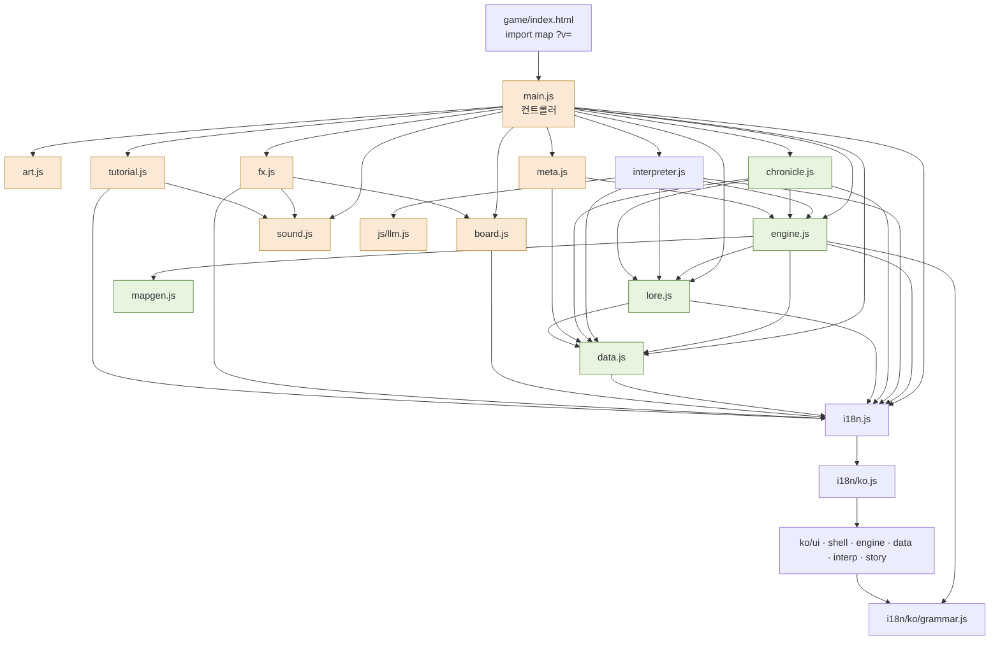
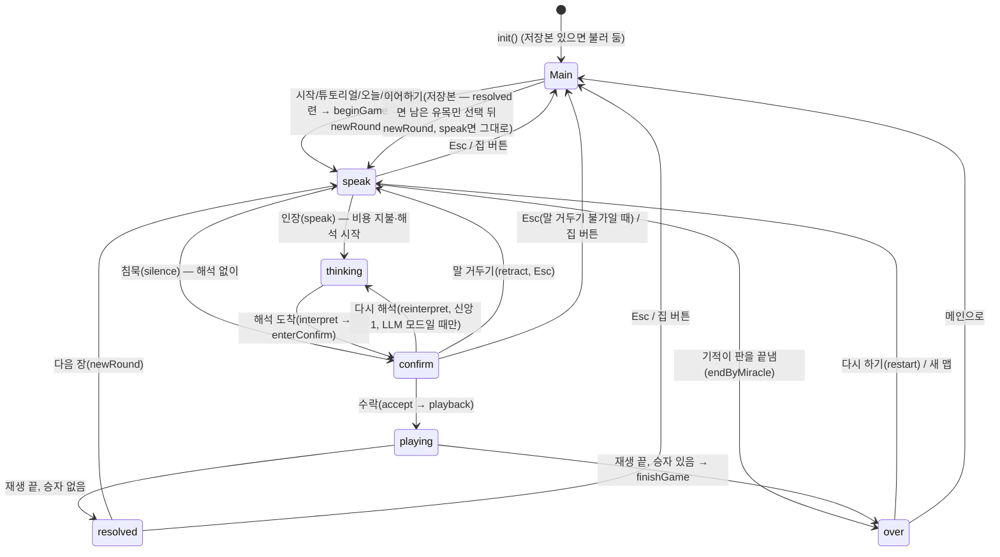

# 04. 소프트웨어 구조 — 모듈 · 상태 · 결정론 · 화면 컨트롤러

> 웹판(정적 ES 모듈, 빌드 없음)의 **현재 구조**를 적는다. 규칙 자체는 [02 규칙](02-rules.md), 데이터 값은 [03 데이터](03-data.md), 해석기는 [05 해석기](05-interpreter.md), 화면과 연출은 [06 UI/UX](06-ui-ux.md), 판 밖 저장은 [07 진행](07-progression.md)에 있다.
> 기준: 커밋 `448f553` (2026-09-30), 명세 검토 수정 `e68a240`, 3차 균형 `9b43bbf`(`doomUsed`, 계시의 `sig`, `speakSnap.spoken`, 엔진↔해석기 `setPlanSig`)와 석판의 곳·수의 말·칩 옮기기 `78c891e`, 4차 `87a0fce`(`miracleUses`, 승점으로 정하는 `first`, `log.rallyJoin`, 석판의 새 곳의 말)·튜토리얼 `2825b37`·판 크기 표 `7a28084`(`sizeRules`)·접근성 `4e2e0f7`(OS 동작 줄이기, 키보드 칩), 5차 `435c3cc`(`superiority` 삭제, `CAPITAL_HP` 2, `hydrateState`의 `doomUsed`·`miracleUses`, ⇄ 칩의 Enter)·`8ba0ef8`(`config.unlock`, `MODULES`·`unlocked`, 해금 안내)·`bcdeb22`(석판의 곳 고르기)·`3a790f5`(`ui.rules.core6`), 6차 `0c95856`(대성당 공사 중 율법파 선공, `revelationCost`·`ui.faithCostCited` 삭제와 비용 알약의 `cite` 상태 없앰, 「새 맵」의 `unlock`, `bestKey`의 `-u`, `hydrateState`의 수도 내구도 자르기, `RULESET` 8)·`b470e03`(석판: 승률 순 조준, `far:` 까닭, "A가 아니라 B" 등)·`0a0a974`(`PRIEST_LABOR`, `ui.priestIntro`, 튜토리얼 세 줄, 어려움의 뜻 공개), 7차 `df1cb16`(`updateLawGuard`가 되풀이를 본다, `log.rallyJoin`과 결집의 신도 삭제, `RULESET` 9)·`16492f4`(보통의 뜻 공개, `actionOdds`의 `wallAhead`, 인용 삭제 — `citedWords`·`pending.cited`·`kw.citeStop`·`ui.tag.cited`, `kw.place.buildWord` 삭제와 한국어 `/에서가?$/`의 언어팩 이전, 메인 화면 최고 기록의 해금 단계, 1장 말풍선 분기)·`c12a1e9`(`bloodKills` 삭제, `EDICT_MAX` 10, `RULESET` 10), 그리고 `55d33dd`(`updateLawGuard` → `startRound`의 `braceLaw`, `lawGuard`는 수 하나, `state.ruleset`과 옛 저장본의 석판 자르기, 석판의 닿지 않는 곳 코드 — `interp.place.*` 삭제·`FAR_NAME`), 8차 `846fd60`(`siegeOf` 삭제, 성인 보정 삭제, 청원 외면 벌과 `state.petitionIgnored`·`ui.log.petitionIgnored` 삭제, `log.villageFog`, 장이 열릴 때 대비 연출, 지도자 반박 돌림, 석판 `kw.partialNeg`·`kw.place.aimBuild`·방향 코사인, `RULESET` 11), 9차 `88878b6`(`streakMiracle`·`log.streak.*`·`ui.banner.streak` 삭제, `readUs`·`braceAhead`, `state.streak`은 교리 칸의 점만, 전쟁 4칸의 성벽 비용 — `buildCost(…, 'wall')`, 대비 기록은 우리 수도 칸, `.wtag.warn`, 석판 "노리는 곳"의 `aimBonus`와 `far:aim`, `RULESET` 12)·`d6167fc`(캐시 번호만)·`1cc1887`(`ui.law.guard` "우리를 읽음"), `d3fe641`(`wouldRead`, `ui.tag.readEcho`, 교리 없는 메아리는 연속을 비움)·10차 `95eca5f`(석판 `kw.place.gatherAt`·`kw.place.farthest`, 곳을 짚은 금지, 전쟁의 헤아린 손은 성벽부터)·11차 `8250dd7`(말투는 수치 없음 — `applyTone`·`roundMods.gatherBonus`/`attackBonus`·`actionOdds`의 `curse` 삭제; 이룬 예언은 은총(`eng.why.prophecy`)·빗나가도 벌 없음 — `PROPHECY.reward`/`penalty` 삭제; `recordRevelation`의 `extra` 인자와 첫 이름의 지혜 +1 삭제; 플레이어 `autoFill`의 남는 손은 모자란 것만; 석판의 절 하나 손 둘 — `kw.count1`, pick의 `nth`; `RULESET` 13)·`1fbb160`(읽힘 예고 꼬리표의 `{n}`, "가장 먼 곳"이 `exact`·`aimBonus`도 비움, `kw.count1`의 `가장 `·`제일 `)·12차 `d7ad6e0`(대성당이 무너지지 않음 — `log.cathedralFall` 삭제, `cathedralVillages` = 1 + 판 크기 더하기, 단계마다 3/3/3; 석판 `rankMatches(…, clause)`의 가까운 과녁과 `kw.place.weakest`, `placeOf`의 `spec`·`generic`·`refs`·`closeRef`, 짓는 일의 한 손 `cap`; `RULESET` 14)·13차 `e174a18`(엔진 `economyOnly` — 살림뿐인 일 목록은 메아리가 아님, `READ_DOCTRINES` = 전쟁·평화; 석판 `lostTiles`·`lastLost`, `kw.rather`, 금지어 `지 마`의 어미, 짚은 칸 수만큼 짓기; `RULESET` 15), 14차 `3f33be1`(대성당 한 번 — `CATHEDRAL` 객체·`state.crusadeEnd`, `cathedral` 0~1; 성지 `holyFor`(`mapgen.js`); 읽힘은 섞인 전쟁·평화도, `streakAfter`; 석판 `kw.aside`·`kw.plentyAnd`·`kw.place.aimWall`; `RULESET` 16), 15차 `637c05a`(읽힘은 칼·말씀 — `swordOrWord`, `streakAfter(state, doctrine, sig)`; 결집 `RALLY_LEAD` 8·결집한 율법파의 손은 신도 수에 묶이지 않음; 원정 `crusading`; 성지 보호 `isHoly`; 첫 판 쉬움 `loadSetup`; 석판 `kw.onlyThis`; `RULESET` 17)와 `24927a6`(계절: 풍년·가뭄 ±2·평온 선교 +1·기도한 장의 역병 — 새 상태 `prayedAt`; 석판의 같은 일 둘까지 — `pick.cnt`, 까닭 `two`; `RULESET` 18), 16차 `76c0053`(엔진 `FLIP_MARKS` 3·선교 성공의 `popCap`·`eng.reject.many`·헤아린 손의 같은 일 둘까지·율법파 `autoFill`은 원정 제외; 석판 `onTerrain`·`kw.place.unwalled`; 확인 화면의 쉬는 신도 칩 `ui.chip.rest`·이은 계시 제안·튜토리얼 `tut.end5.5`; `RULESET` 19), 17차 `238120e`(엔진 — 마지막 한 명은 설득되지 않음, `joined`, `FLIP_MARKS` 내보냄, `swordOrWord`는 전쟁 교리나 공격·선교; 화면 — 헤아린 손 빼기 `pending.noHeed`·`ui.chip.heedOff`, 첫 판 쉬움을 한 판 뒤에 푸는 `setup.firstEasy`, 규칙서의 말투 줄 `ui.rules.words3` 삭제; 석판 `kw.place.foeward`; `RULESET` 20), 18차 `1c81cd4`(엔진 — 저울 `trailing`·`SCALE_GAP`이 신의 분노·결집을 대신하고 `rally`는 그 거울, 분노·심판의 날 코드는 남았지만 닿지 않음, `hydrateState`의 규칙 판 21 처리, 대성당 4·4·4, 평화 궁극 `enemy.pop > 1`; 해석기 `preach:last`; 화면 — 계명 갈래의 `noHeed`, 「새 맵」의 `firstEasy` 풀기, `ui.compose.sub`의 저울 표시; 키 `log.scaleUs` 더함·`ui.rules.words5`·`enemy3` 지움; `RULESET` 21), 19차 `39500e9`(해석기 — `kw.neitherNor`, 곁말·넉넉함·이름 짚은 일의 `pinned`, 석판 어휘 — [05](05-interpreter.md); 화면 규칙서 `ui.rules.core2`의 글; `RULESET`은 그대로), 20차 `b1ff73e`(분노·심판의 날 코드 삭제 — `wrath`·`doomUsed` 필드와 `DOOM`·`doomReady`·`wrathRound`, 불러올 때 두 필드를 지움; 저울 연출 `fx.kind: 'scale'`·`ui.banner.scale`·`ui.fx.scale`; 키 여덟 지우고 둘 이름 바꾸고 석판 둘 더함), 21차 `db4135b`(엔진 `nextLawCard`·`lawThreat` 내보냄; 화면 — 계절 칸 "다음 장"의 둘째 줄 `#nextLaw`(`nextLawHTML`, `scheduleHints`가 고침); 키 `ui.heard.next`·`ui.heard.nextTip`; 벤치 구동기의 `keepVows`), 22차 `e41430e`(엔진 `dilemmaChoice` 내보냄·L6 순서·`RULESET` 22; 화면 — `nextLawHTML()`이 단계를 보고 고르는 해석, `refreshNextLaw`, `.doom` 클래스 삭제; 해석기 `aimPool`·`aimFor`; 석판 사전 스물두 키; 분노 흔적과 `i18n-check`의 정규식 오탐 고침), 23차 `97ddf1b`(성벽을 친 공격의 패배는 둘 — `log.attackFail`에 `lost`, `eng.act.attack`; `RULESET` 23; `chronicle.js`의 `outcomeKind` 회귀 고침과 `edge.mjs` 10번 검사; 석판 마을 제외어), 24차 `cf2c157`(성벽에 막힌 공격의 둘째 사망자 `fallen(key + ':2')`; 해석기의 `far:terrain.*`과 `FAR_NAME`의 지형 이름, 까닭 글 "(지금 그곳에서는 할 수 없어 다른 곳에서 한다)"; 확인 화면의 `far:` 경고 꼬리표; 석판 사전 열넷), 25차 `ba29880`(엔진 `graceOn` 내보냄 — 청원·이름·예언·서원의 은총이 해금 1부터, `state.petition`이 `null`일 수 있다; 표식 감소 삭제·`FLIP_MARKS` 4·`RULESET` 24; 보드의 표식 테는 1/4씩; 해금 안내 `ui.unlock.6`; 해석기의 `field`; 골든 구동기의 `petition: null`), 26차 `749003f`(엔진 `crusadeSurvival` 내보냄 — 대성당 확인 칩의 원정을 버틸 확률; 난이도 `DIFFICULTY` 쉬움 `enemyBonus` 1·어려움 시작 신도 5·`RULESET` 25; 키 `ui.odds.crusade`·`ui.odds.crusadeTip`), 27차 `137001b`(원정 공격 +2 — `CATHEDRAL.crusade.bonus`·`RULESET` 26; `crusadeSurvival`이 다음 장의 계절·막을 본다; 해석기 `placeOf`의 짚은 칸이 "노리는 곳"보다 앞선다; 벤치·골든 구동기는 은총이 잠긴 판에서 예언을 찾지 않는다)까지 반영 — 7차에는 `0a0a974` 기준으로 적혀 있던 줄 번호를 `git diff 0a0a974 c12a1e9`로 한꺼번에 옮겼고(더 옛 기준의 밀림은 그대로 남는다), `55d33dd`에서 다시 `git diff c12a1e9 55d33dd`로, `846fd60`에서 `git diff 55d33dd 846fd60`로, `1cc1887`에서 `git diff d196f5d 1cc1887`로, `95eca5f`에서 `git diff dd51364 95eca5f`로, `8250dd7`에서 `git diff 2da6a39 8250dd7`로, `d7ad6e0`에서 `git diff 0ff0311 d7ad6e0`으로, `e174a18`에서 `git diff a50d3a0 e174a18`로, `3f33be1`에서 `git diff 63a63bb 3f33be1`로 옮겼다(`mapgen.js`는 손으로), `24927a6`에서 `git diff a65443b 24927a6`로, `76c0053`에서 `git diff 53ddafe 76c0053`로, `238120e`에서 `git diff a429341 238120e`로, `1c81cd4`에서 `git diff 4f0f2ca 1c81cd4`로, `39500e9`에서 `git diff 1c81cd4 39500e9`로, `db4135b`에서 `git diff 39500e9 db4135b`로, `e41430e`에서 `git diff db4135b e41430e`로, `97ddf1b`에서 `git diff e41430e 97ddf1b`로, `cf2c157`에서 `git diff 97ddf1b cf2c157`로, `ba29880`에서 `git diff cf2c157 ba29880`로, `749003f`에서 `git diff ba29880 749003f`로 옮겼다(이번부터 `파일:줄` 뒤에 이어 적은 맨 줄 번호도 함께), `137001b`에서 `git diff ad60840 137001b`로 옮겼다. 새로 쓰거나 고친 인용은 `137001b` 기준이다. 또 함수 이름 바로 뒤에 붙은 인용(`이름` (`파일:줄`)·(`이름`, `파일:줄`) 꼴)은 정의를 찾아 `c12a1e9` 줄로 맞췄고 이번에 함께 옮겼다. 6차에 고친 인용은 `0a0a974` 기준 줄 번호다(`3a790f5` 기준으로 적은 인용은 `engine.js` 472행 뒤 +8~+14, 497행 뒤 +14, 616행 뒤 +16, 1161행 뒤 +17줄, `main.js` 494행 뒤 +2(2205행 뒤 +1)줄, `interpreter.js` 160행 뒤 +1~+15줄 밀렸다); 5차에 고친 인용은 `3a790f5` 기준 줄 번호다(`4e2e0f7` 기준으로 적은 인용은 `engine.js` 61행 뒤 +6줄, 303행 뒤 +4줄 밀렸다). 코드와 문서가 다르면 **코드가 기준**이다. 인용은 `파일:줄` 형식 (`engine.js`는 `js/game/engine.js`). `e68a240`에서 줄이 밀린 곳(`engine.js` 460행 뒤 +4~5, `main.js` 1591행 뒤 +5·2190행 뒤 +10, `interpreter.js` 193행 뒤 +10)과 `9b43bbf`·`78c891e`에서 밀린 곳(`e68a240`의 줄 기준으로 `engine.js` 201행 뒤 +2, 222행 뒤 +3, 259행 뒤 +5, 734행 뒤 +15, 760행 뒤 +16, 1397행 뒤 +17~18; `main.js` 359행 뒤 +1, 697행 뒤 +2, 1665행 뒤 +26, 1797행 뒤 +27, 1871행 뒤 +28, 2207행 뒤 +39, 2301행 뒤 +44; `interpreter.js`는 155행 뒤 석판 부분이 새로 짜였다) 중 이번에 고치지 않은 인용은 `448f553` 기준이다.

---

## 0. 한눈에

- **진입점**: `game/index.html`이 import map으로 모든 모듈 주소 뒤에 `?v=202610022016`(`137001b` — 코드 커밋마다 새로 찍는다; `749003f`에는 `202610021929`, `ba29880`에는 `202610021744`, `cf2c157`에는 `202610021603`, `97ddf1b`에는 `202610021505`, `e41430e`에는 `202610021447`, `db4135b`에는 `202610021336`, `39500e9`에는 `202610020840`, `1c81cd4`에는 `202610020808`, `3a790f5`에는 `202609301151`)를 붙이고(`game/index.html:14-42`), `<script type="module" src="../js/game/main.js?v=…">`(`game/index.html:177`)로 컨트롤러를 연다. 배포할 때 `v`를 바꿔 브라우저 캐시를 깬다. 루트 `index.html`은 `game/index.html`로 넘기는 리다이렉트뿐이다.
- **층**: 데이터(`data.js`, 언어팩) → 순수 규칙(`engine.js`, `mapgen.js`, `lore.js`) → 해석(`interpreter.js`, `llm.js`) · 기록(`chronicle.js`) · 저장(`meta.js`) → 표현(`board.js`, `art.js`, `fx.js`, `sound.js`, `tutorial.js`) → 컨트롤러(`main.js`).
- **핵심 원칙**: 수치·판정은 전부 `engine.js`가 한다. LLM은 엔진이 만든 "가능한 행동 목록"에서 고르기만 한다(`engine.js:1-2`). 엔진은 DOM·시간·`Math.random`을 쓰지 않고 시드 RNG 두 흐름과 문자열 해시만 쓴다 → 같은 시드와 같은 입력이면 같은 결과.
- **주의**: `main.js`(UI)도 규칙 일부를 갖고 있다 — 계시 비용 지불, 이름 붙이기 시점, 은총(청원·이름 — 외면당한 청원 벌칙은 `846fd60`에서 없어졌다), 장이 열릴 때 율법파의 대비 연출(`846fd60`), 신학 노트, 말한 기적의 표적, 갈림길 기본 선택, 자동 노동에 계시의 교리 넘기기(`autoFill(…, result.doctrine)` — 남은 손이 그 뜻을 따른다; 몇 손·무엇부터인지는 `0a0a974`부터 엔진이 대사제 성향으로 정한다), 첫 장 사제의 성향 소개(`ui.priestIntro`), 계명 새긴 뒤 재배치, 판결, 말 거두기 비용, 되풀이 판정을 말할 때 해 두었다가 교리 기록에 넘기기(`speakSnap.spoken`), 확인 칩 옮기기(⇄, 같은 종류의 합법 행동으로만) 등(§4.4). 이식할 때는 이 부분을 규칙 층으로 옮겨야 한다.

---

## 1. 모듈 지도

### 1.1 `js/` 파일별 책임

| 파일 | 줄 | 층 | 책임 | 주요 export | 부작용·순수성 |
|---|---|---|---|---|---|
| `js/llm.js` | 58 | 외부 I/O | Chrome Prompt API(`LanguageModel`) 래퍼: 가용성, 시스템 프롬프트 세션 생성(언어 지정 실패 시 재시도), JSON 스키마 강제 스트리밍 응답 | `hasLanguageModel`, `availability`, `createBaseSession`, `promptJSON` | 비동기 I/O. `performance.now()`로 시간 측정 |
| `js/game/main.js` | 2490 | 컨트롤러 | 단계 상태 기계, 모든 화면 그리기, 입력·단축키, 해결 재생, 모달(해금 안내 `showUnlockNote` 포함), 설정, 메타 연동, 디버그 훅 | 없음 (모듈 끝에서 `init()` 실행, `main.js:2490`) | DOM·타이머·localStorage·클립보드. `Math.random`은 시드 뽑기에만 (`main.js:90`) |
| `js/game/engine.js` | 1541 | 규칙 | 상태 생성·모듈 해금 판정(`unlocked`, `8ba0ef8`), 육각 좌표, 판 크기 표 읽기(`sizeRules`), 가능한 행동, 명령 검증, 자동 노동(계시 교리를 헤아린 손 포함 — 손 수·먼저 고르는 일·승률 문턱은 대사제 성향 `PRIEST_LABOR`, `0a0a974`; 플레이어의 나머지 손은 모자란 것만 채우고 쉰다, `8250dd7`), 율법파 오토마(행군·결집(행동 +1·공격 먼저 — `df1cb16`에서 장마다 신도 +1을 뺐다)·막별 공격·원정대 후퇴·대체 마을·대성당 원정(수도 공격 세 번·+1 — `3f33be1`)·7×7 행동 +1), 장 시작(승점이 뒤진 쪽이 선공, 대성당을 지었으면 율법파 — `0c95856`)·해결·유지, 되풀이를 읽는 율법(`df1cb16`)·포위·메아리(글·일, 일은 두 장 전까지), 기적(같은 기적 재사용 +1, 심판의 날 판에 한 번), 발견지, 예언, 석판, 소명, 막, 계명, 갈림길, 승점·승패(남은 자 규칙, 장 끝의 신앙 승리 개종 조건 포함), 저장 직렬화 | `createState`, `startRound`, `legalActions`, `validateOrders`, `autoFill`, `planEnemy`, `enemyIntent`, `resolveRound`, `castMiracle`, `recordRevelation`, `score`, `scoreBreakdown`, `checkVictory`, `snapshot`, `serializeState`, `hydrateState`, `rand`, `d6`, `cathedralVillages`, `faithConverts`, `marchRange`, `enemyZeal`, `lawGuardOf`, `braceAhead`(`88878b6`), `wouldRead`(`d3fe641`), `isEcho`, `spokenOf`, `setPlanSig`, `sizeRules`(`7a28084`), `miracleCost`, `MODULES`·`unlocked`(`8ba0ef8`), `nextLawCard`·`lawThreat`(`db4135b`), `dilemmaChoice`(`e41430e`), `graceOn`(`ba29880`), `crusadeSurvival`(`749003f`) 등 전체 98개(`238120e`에서 `FLIP_MARKS`를 내보냈고, `b1ff73e`에서 `wrathRound`·`doomReady`를 지우고 `db4135b`에서 둘을, `e41430e`·`ba29880`·`749003f`에서 하나씩 더했다) (`updateLiturgy`는 없어졌다; `quick`·`ULT_ROUND`는 내보내지만 규칙에 쓰이지 않는다) | **결정론적**, DOM 없음. 상태를 제자리에서 바꾼다(불변 아님). `t()`로 로그 문장을 만든다. 모듈 변수 둘: `currentAct`(`engine.js:948`)와 해석기가 넣는 일 목록 함수 `planSigFn`(`engine.js:815`, `setPlanSig`로 한 번 설정) |
| `js/game/data.js` | 390 | 데이터 | 지형·비용·규칙 수치·교리·사건·갈림길·미라·기적·율법 카드·지도자·난이도·맵 크기·튜토리얼·경외·은사·시련·승천·RULESET | `TERRAIN`, `COST`, `RULES`, `EVENTS`, `DILEMMAS`, `MIRA`, `MIRACLES`, `LAW_CARDS`, `ENEMY_LEADERS`, `DIFFICULTY`, `MAP_SIZES`, `TUTORIAL`, `AWE_LEVELS`, `BLESSINGS`, `TRIALS`, `ASCENSION`, `RULESET` 등 53개(`0c95856`에서 `revelationCost`를 지웠다) | 순수. 이름·문장은 로드 시 `t()`로 한 번 채운다 |
| `js/game/mapgen.js` | 202 | 규칙 | 시드 맵 생성(점대칭, 사막 제한, 수도 주변 자원 보장 — `637c05a`부터 성지 칸과 그 대칭 칸은 건드리지 않는다, `isHoly`), 성지 자리(`holyFor`, `3f33be1` — 두 수도에서 같은 거리·가운데에서 두 칸 안의 칸 가운데 시드로 하나), 발견지·지형 특징·전생 유적 자리 | `generateMap`, `holyFor`, `placeSites`, `placeFeatures`, `placeLegacy`, `capitalsFor`, `tileLabel`, `mapStats` | 순수. 자체 `mulberry32` 난수(§3.3) |
| `js/game/lore.js` | 107 | 규칙(글) | 문자열 해시 선택, 명사 추출, 말투·이름·예언·기적·계명 파싱, 지도자 대사 (인용 `citedWords`는 `16492f4`에서 지웠다 — `0c95856`부터 확인 화면 꼬리표뿐이었다) | `hashPick`, `nouns`, `frequentNoun`, `parseMiracle`, `parseCommandment`, `detectTone`, `parseNaming`, `parseProphecy`, `leaderLine` (`findLiturgy`·`citedWords`는 없어졌다) | 순수. 정규식 원본은 언어팩 `kw.*` |
| `js/game/interpreter.js` | 578 | 해석 | LLM 프롬프트·스키마 조립과 호출(`interpretWithLLM(state, text, signal)` — 중단 신호는 `main.js`가 건다), 석판(키워드) 해석기("~지 말고"·"~말고"·"그만 ~고"·"~는 됐고" 나누기, ~고/~며/~면서 뒤에서 절 나누기, ~되 뒤에서도 절 나누기(`bcdeb22`), '짓·일·것'만 가리키는 금지 절은 앞 절을 금함·할 일 없이 곳만 짚은 금지는 그곳의 공격·선교를 금함(`bcdeb22`), "잊지 마라"는 금지 아님(`87a0fce`), 제외어, 곳을 가리키는 말로 칸 고르기(`placeOf`·`byPlace` — 율법파 마을, 지형 옆, 신전 옆, 동서남북도 `87a0fce`; 좌표·붙인 이름 우선, 좌표 여럿이면 그만큼, "가까운", 율법파 마을 옆 `bcdeb22`; 누구의 것인지 말하지 않은 "수도"는 공격·선교 말이 없으면 우리 수도, 오아시스 `b470e03`), 절 하나는 손 둘(짚은 칸·붙인 이름이나 `kw.count1` "한 곳"이면 하나 — 수를 말하지 않아 늘어난 둘째 손은 행동 수가 모자라면 다른 절의 첫 손 뒤로, `8250dd7`), 수의 말이면 둘·셋, 채집은 많이 나는 칸부터, 공격·선교는 이길 만한 칸부터(`b470e03`), 한 칸에 한 가지·행동 수는 먼저 말한 순, "A가 아니라 B"·비유 절(~듯·~처럼) 건너뛰기·"차지하라"(`b470e03`), 알아들었으나 지금 못 하는 일 `heard`와 까닭 코드(짚은 칸에서 못 한 일 `far:<칸>` 포함), 대상 없는 금지 `banned`), 메아리용 일 목록(`setPlanSig` 등록), 말→행동 연결, 신학 노트 추출, 해석문 다듬기 | `buildPrompt`, `interpretWithLLM`, `interpretWithTablet`, `linkWords`, `extractLesson`, `cleanSpeech`, `llmStatus`, `prepareLLM`, `voiceOf`, `describeLesson` | LLM 부분은 비동기 I/O와 모듈 세션 캐시(`base`, `preparing`). 석판·연결·노트는 순수. **읽힐 때 한 번** `setPlanSig(…)`로 엔진에 함수를 넣는다(`interpreter.js:578`, `9b43bbf`) |
| `js/game/chronicle.js` | 152 | 기록 | 판 결과 유형, 에필로그·칭호, 결정적 장면, 주사위 운, 판 요약, 업적 목록과 평가 | `outcomeKind`, `epilogue`, `summarizeGame`, `decisiveScene`, `diceLuck`, `topRevelations`, `topDoctrine`, `ACHIEVEMENTS`, `evaluateAchievements`, `closestAchievement` | 상태를 읽기만 한다. `summarizeGame`만 `new Date()` 사용 |
| `js/game/meta.js` | 167 | 저장 | localStorage `gsg.*` 읽기·쓰기(모두 try/catch), 이어하기, 서고, 업적, 오늘의 계시, 정경, 세라의 과제, 최고 기록, 경외, 도감, 어휘집, 시련, 승천, 내보내기 | `get`, `set`, `saveGame`, `loadGame`, `clearSave`, `pushHistory`, `dailyConfig`, `bestKey` 외 — 전부 [07](07-progression.md) | localStorage·`Date` |
| `js/game/board.js` | 192 | 표현 | 육각 보드 SVG 그리기(액자, 타일, 안개, 건물, 이름, 표식, 율법파의 뜻 고리, 예감, 선택 고리, 미플 — 한 칸에 같은 편 미플이 여럿이면 부채꼴로 벌림), 국경선, 좌표 변환 | `renderBoard`, `borderEdges`, `tileCenter`, `tileToHost`, `markerToScreen` | DOM. 모듈 `WeakMap lastEdges`로 새 국경선만 번지게 한다 |
| `js/game/art.js` | 248 | 표현 | 손으로 그린 SVG `<defs>`(그라디언트·무늬·필터·심볼) 문자열과 주입 | `ART`, `installArt`, `icon` | DOM 주입 한 번 |
| `js/game/fx.js` | 849 | 표현 | 연출: 대기(`wait`), 떠오르는 글, 고리, 건물 솟음, 흔들림, 섬광, 번개, 비, 불꽃, 토큰 비행, 장 제목, 3D 주사위, 타자기, 인장·빛기둥, 종료 화면, 배경 먼지, 미플 비행, 카메라 초점, 행동 띠, 숫자 올림, 기울기, 빛줄기, 특전 카드, 양피지 툴팁 | `motion`, `setReduced`, `wait`, `chapter`, `rollDice`, `castRevelation`, `endScreen`, `flyMeeples`, `focusTile`, `actionBanner`, `perkReveal`, `installTips` 외 | DOM·Web Animations. `Math.random` 허용(모양만). 로드 시 `gsg.motion`을 읽고(저장한 값이 없으면 OS의 `prefers-reduced-motion`을 한 번 본다 — `4e2e0f7`) body 클래스를 붙인다(`fx.js:7-20`) |
| `js/game/sound.js` | 411 | 표현 | Web Audio 합성 효과음·배경음악(버스·잔향·덕킹·분위기), 볼륨 | `sfx`, `music`, `unlockAudio`, `soundOn`/`setSound`, `musicOn`/`setMusic`, `volume`/`setVolume`, `duck`, `levels` | 오디오. `Math.random` 허용. 로드 시 첫 입력에 오디오를 여는 리스너 등록(`sound.js:100`), 탭이 숨으면 멈춤(`sound.js:88`) |
| `js/game/tutorial.js` | 193 | 표현 | 튜토리얼 안내자 "사관 세라": 단계(`phase`)·장별 대사(3장 확인 단계 `2825b37`, 4장의 되풀이 규칙과 끝의 성벽·저울 `0a0a974` 포함), 강조 고리, 계시 예시 넣기 | `Tutorial`(class), `NPC` | DOM |
| `js/game/i18n.js` | 49 | 데이터 | 언어 결정(`gsg.lang` → 브라우저 언어 → ko), 언어팩 로드(ko가 아니면 top-level `await import`), `t(key, vars)` | `t`, `has`, `lang`, `LOCALES`, `setLang` | 로드 시 한 번 언어 확정. 빠진 키는 경고 후 키 문자열 반환 |

### 1.2 언어팩 `js/game/i18n/`

`i18n/ko.js`가 여섯 묶음을 펼쳐 합친다(`i18n/ko.js:9`). 값은 문자열(`{name}` 자리 채움), 배열, 또는 `vars`를 받는 함수다(`i18n.js:33-42`). 한국어 조사 도우미는 `ko/grammar.js`.

| 파일 | 키 접두사 (개수) | 쓰는 곳 |
|---|---|---|
| `ko/ui.js` | `ui.*` 578, `kw.ui.*` 2 | `main.js`, `index.html` 정적 글(`data-i18n*`) |
| `ko/shell.js` | `shell.*` 6 | `fx.js`, `board.js` |
| `ko/engine.js` | `eng.*` 76, `log.*` 73, `kw.*` 7 | `engine.js`(행동 설명·거부 사유·로그·승패 문구) |
| `ko/data.js` | `data.*` 326, `kw.data.*` 26 | `data.js` |
| `ko/interp.js` | `interp.*` 14, `kw.*` 121 | `interpreter.js`, `lore.js` (프롬프트, 석판·말의 장치 정규식). 키 밖에 까닭 코드를 문장으로 바꾸는 도우미 `cannotLabel`을 내보내고 `ko/ui.js`가 import한다(`78c891e`). 닿지 않는 곳의 이름 표 `FAR_NAME`(`capital.enemy`·`capital.player`·`holy`, `55d33dd`)도 키 밖에서 `cannotLabel`이 쓴다 |
| `ko/story.js` | `story.*` 84, `tut.*` 39 | `chronicle.js`, `tutorial.js` |
| `ko/grammar.js` | — | `josa(name, 받침형, 무받침형)`, `batchim(w)` (`engine.js`도 직접 import해 다시 내보낸다, `engine.js:14,300`) |

합계 1352키 (`node tools/i18n-check.mjs` 결과 "한국어팩 키: 1352개", `749003f`에서 다시 셈). 같은 결과의 "코드에 남은 한글"은 `i18n.js`의 언어 이름 한 줄이다(`db4135b`에는 6줄 — 검사기가 화살표 뒤 정규식 `(s) => /data-k="…"/`를 문자열로 잘못 읽어 그 뒤 주석 다섯 줄을 셌다; `e41430e`에서 검사기가 `=>` 뒤도 정규식으로 보고, 화면 코드도 그 줄을 `s.match(/…/)`로 바꿨다 — [KNOWN-ISSUES E11](../godot/KNOWN-ISSUES.md)).

`137001b`에서는 키 수가 그대로다(1352). 글이 바뀐 키: `ui.rules.win3`·`ui.odds.crusadeTip`(원정 "+1" → "+2"), `ui.tip.marks`(`of`가 없을 때의 기본값 3 → 4), 석판 사전 아홉 키(`kw.tablet.river`·`attack`·`village`·`villageExcept`·`riverExcept`·`woodExcept`·`attackExcept`, `kw.aside`, `kw.place.forest` — [05](05-interpreter.md)).

`749003f`에서 더한 키 2개(1350 → 1352): 대성당 확인 칩의 `ui.odds.crusade`(함수 — "원정을 버틸 확률 {p}%")와 툴팁 `ui.odds.crusadeTip`("대성당을 지으면 다음 장 율법파가 우리 수도를 세 번 친다(공격 +1). 지금의 성벽·내구도로 셈한, 그 세 번을 버틸 확률 — 율법파의 다른 공격은 셈하지 않았다. 성벽을 두르면 오른다"). 글이 바뀐 키: 난이도 안내 `ui.diffHint.easy`·`normal`·`hard`("율법파 신도 3·행동 +1, 적은 시작 자원, 맞서는 카드 없음" / "율법파 신도 4·행동 +1" / "율법파 신도 5·행동 +2, 율법 카드 두 장 중 위협적인 쪽을 쓴다" — 그 전 "율법파 행동 +0, 적은 시작 자원" / "율법파 행동 +1" / "율법파 행동 +2, …").

`ba29880`에서 더한 키 1개(1349 → 1350): 해금 안내의 은총 줄 `ui.unlock.6`("<b>은총</b> — 신도의 <b>청원</b>에 답하고, 땅에 <b>이름</b>을 붙이고, <b>예언</b>을 봉인하고, 칼을 거두는 <b>서원</b>을 지키면 신앙 +1 (장당 한 번)." — 두 번째 판의 안내에 `ui.unlock.1` 다음, `ui.unlock.5` 앞). 글이 바뀐 키: `ui.rules.words1`·`words2`·`words4`(끝에 "<em>두 번째 판부터</em>"), `ui.tip.marks`(감소 문구 "(두 장 넘게 끊기면 하나씩 지워진다)"를 뺐다), `kw.tablet.wallExcept`(신앙의 굳셈 — [05](05-interpreter.md)).

`cf2c157`에서도 키 수는 그대로다(1349). 글이 바뀐 키: 석판 사전 열네 키 — `kw.tablet.preach`·`attack`·`wall`·`food`·`village`·`villageExcept`·`wallExcept`·`riverExcept`·`stoneExcept`·`attackExcept`, `kw.aside`, `kw.place.river`·`capital`·`aim`([05](05-interpreter.md) 3.1). 키 밖의 도우미: `ko/interp.js`의 `FAR_NAME`에 지형 이름(`terrain.plain` 평원 … `terrain.desert` 사막)을 더하고, `cannotLabel`의 `far:` 글을 "(지금 그곳에서는 할 수 없어 다른 곳에서 한다)"로 바꿨다.

`97ddf1b`에서도 키 수는 그대로다(1349). 글이 바뀐 키: `log.attackFail`(함수 — `{who, place, lost}`, "공격자 {lost}명이 쓰러졌다", 둘이면 " (성벽)"), `eng.act.attack`(성벽 있는 칸이면 "…성벽 있음 — 지면 2명이 쓰러진다"), `kw.tablet.villageExcept`(`e41430e`의 `자들의 (성읍|마을…)` 갈래를 뺐다).

`e41430e`에서는 키 수가 그대로다(1349). 글이 바뀐 키: 석판 사전 스물두 키 — `kw.tablet.preach`·`attack`·`village`·`villageExcept`·`templeExcept`·`wallExcept`·`foodExcept`·`stoneExcept`·`gatherAnyExcept`·`claim`·`attackExcept`, `kw.many`, `kw.aside`, `kw.notNeg`, `kw.place.dir`(객체 — 북동·동북 `[-1, 1]` 등 여덟 겹 방위)·`kw.place.dirWord`·`kw.place.capital`·`kw.place.holy`·`kw.place.aim`, `kw.count1~3`([05](05-interpreter.md) 3.1). `ko/engine.js`의 빈 머리 주석 "// 신의 분노"를 지웠다.

`db4135b`에서 더한 키 2개(1347 → 1349): 다음 장 율법 카드 줄 `ui.heard.next`(함수 — `{name, reacted, alt}` → "율법파 「{name}」", 맞서면 뒤에 `<b class="next-law-react">맞섬</b>`, 어려움은 "… 또는 「{alt.name}」…")와 그 툴팁 `ui.heard.nextTip`("율법파는 우리 말씀의 성격에 맞서는 카드(맞섬)를 덱 위에서 골라 다음 장에 쓴다. 적는 동안 바뀐다 — 무엇을 말하느냐가 다음 장 율법파를 정한다. 어려움은 두 장 가운데 그때 더 위협적인 쪽"). 글이 바뀐 키: `ui.rules.enemy2`("…맞서는 카드를 고른다 — 적는 동안 오른쪽 <b>다음 장</b> 칸에 그 카드가 미리 보인다.").

`b1ff73e`에서 지운 키 8개, 더한 키 2개, 이름을 바꾼 키 2개(1353 → 1347): 지운 키는 분노·심판의 날의 `data.miracle.doom.name`·`data.miracle.doom.text`·`eng.edict.doom`·`eng.win.doom`·`log.doom`·`log.wrathFull`(함수)·`log.wrath`·`ui.hand.wrath`, 더한 키는 석판의 `kw.leaveAnd`("숲은 남겨 두고"의 앞말을 금지 절로)·`kw.idList`(쉼표로 이은 칸 이름을 한 절로), 이름을 바꾼 키는 `ui.banner.wrath` → `ui.banner.scale`("저울")·`ui.fx.wrath` → `ui.fx.scale`("저울 +1"). 글이 바뀐 키: `log.rally`("…6점 이상 앞서자…"), `log.scaleUs`("저울이 기운다 — 크게 뒤진 우리 신도들이 힘을 낸다…"), `ui.mat.edictTip`(심판의 날(−2)을 뺐다), 석판 사전 열네 키([05](05-interpreter.md) 3.1).

`39500e9`에서 더한 키 1개(1352 → 1353): 석판의 `kw.neitherNor`("치지도, 설득하지도 마라"의 앞 "~지도"를 금지 절로 — `splitDont`의 맨 처음, [05](05-interpreter.md)). 글이 바뀐 키: `ui.rules.core2`("<b>땅에 나가는 일</b>(채집·마을·탐험·선교·공격)은 같은 칸을 둘이 고르면 <b>승점이 뒤진 쪽</b>이 먼저 한다(같으면 번갈아) — 율법파가 노리는 칸을 먼저 차지하면 그 일은 막힌다. 수도·건물 안에서 하는 일(기도·신전·대성당·성벽)은 막지도 막히지도 않는다."), 석판 사전 열한 키(`kw.tablet.preach`·`attack`·`wall`·`wallExcept`·`foodExcept`·`woodExcept`·`claim`, `kw.aside`·`kw.enoughAnd`·`kw.negation`·`kw.place.forest` — [05](05-interpreter.md) 3.1).

`1c81cd4`에서 더한 키 1개, 지운 키 2개(1353 → 1352): 더한 키는 저울의 우리 쪽 기록 `log.scaleUs`("저울이 기운다 — 6점 넘게 뒤진 우리 신도들이 힘을 낸다: 행동 +1, 신도 수를 넘어도 하나 더."), 지운 키는 규칙서의 되풀이 줄 `ui.rules.words5`와 되풀이를 읽는 율법 줄 `ui.rules.enemy3`(읽힘은 `core3` 한 줄로 — "<b>읽히지 마라</b> — 율법파는 버릇을 읽는다…"). 글이 바뀐 키: `log.rally`("저울이 기운다 — 우리가 6점 넘게 앞서자 율법파가 결집한다: 행동 +1, 신도가 줄어도 손이 줄지 않는다."), `ui.law.rally`("결집: 행동 +1" — "공격 먼저"를 뺐다), `ui.compose.sub`(함수가 되었다 — `{n, acts, scale}`, `scale`이면 " (저울 +1)"), `ui.rules.core3`·`core6`(저울)·`doctrine2`(대립만)·`enemy4`("<b>원정</b>" — 결집 문장을 뺐다)·`miracle`("기적" — 그 전 "기적과 분노")·`miracle2`("승점이 같으면 우리가 이긴다.")·`win3`(돌 4·나무 4·신앙 4), `tut.end5.4`, `data.ascension[2]`("우리 쪽 저울(행동 +1)이 기우는 격차 6 → 8"), `data.trial.last.desc`(분노 문장을 뺐다), 해석기의 까닭 표에 `preach:last`(키가 아니라 `CANNOT_WHY`의 항목 — [05](05-interpreter.md)). 분노·심판의 날의 키(`log.wrath`·`log.wrathFull`·`log.doom`·`data.miracle.doom.*`·`ui.hand.wrath`·`ui.banner.wrath`·`ui.fx.wrath`)는 남았다 — `log.scaleUs`의 연출이 `ui.banner.wrath`·`ui.fx.wrath`를 쓰는 것 말고는 닿지 않는다([02 §19-68·69](02-rules.md#19-확인-필요)).

`238120e`에서 더한 키 2개, 지운 키 1개(1352 → 1353): 더한 키는 석판의 `kw.place.foeward`("율법파 쪽으로" — 율법파 수도 쪽 방향)와 확인 화면의 `ui.chip.heedOff`("뜻을 헤아린 손을 뺐다"), 지운 키는 규칙서의 말투 줄 `ui.rules.words3`("말투(축복·저주·비유)는 대사제의 말씨를 바꿀 뿐 수치는 바꾸지 않는다." — 말투는 규칙이 아니다). 글이 바뀐 키: `log.preachNone`("…설득할 이가 없었다 — 마지막 남은 이는 끝까지 제 율법을 지킨다."), `log.preachMark`·`log.preach`(함수 — `{n, of, joined}`, 데려오지 못하면 "1명이 흩어졌다(살 곳이 없어 오지 못했다)", 표식 "{n}/{of}"), `ui.tip.marks`(함수 — `{of}`, "{of − n}번 더 전하면 우리 땅 (두 장 넘게 끊기면 하나씩 지워진다)"), `ui.rules.core3`·`doctrine2`·`enemy3`·`ui.mat.streakTip`("…전쟁을 말하면" — 그 전 "전쟁·평화를 말하면"), `tut.end5.1`("대성당을 세우고 율법파의 원정을 한 장 버티기"), 석판 사전 열네 키([05](05-interpreter.md)).

`76c0053`에서 더한 키 5개(1347 → 1352): 확인 화면의 쉬는 신도 칩 `ui.chip.rest`(함수 — "{n}명이 쉰다")·`ui.chip.restTip`("시킨 일이 없어 쉬는 신도 — 계시에 절을 이어 쓰면 그만큼 일한다"), 검증 거절 까닭 `eng.reject.many`("같은 일은 계시 하나에 셋까지"), 석판의 `kw.place.unwalled`("성벽 없는", "무방비", "방비가 약…" — 공격·선교 과녁을 성벽 없는 칸으로 거른다), 튜토리얼 끝의 `tut.end5.5`(이어 쓰는 계시와 쉬는 신도). 글이 바뀐 키: `data.event.drought.rule`("식량 채집 -2" — 그 전 "평원·강 식량 채집 -2"), 석판 사전 여섯 키(`kw.tablet.wall`·`villageExcept`·`temple`, `kw.notNeg`, `kw.place.aim`, `kw.count2` — [05](05-interpreter.md); `kw.tablet.wall`에는 `(?<![a-z])wall`도). 함수 값은 125 → 126(`ui.chip.rest`).

`637c05a`·`24927a6`에서 더한 키 1개(1346 → 1347): 석판의 `kw.onlyThis`("기도와 탐험 말고는 아무것도 하지 마라"의 X 말고는 — X만 남긴다, `splitDont`의 맨 처음). 글이 바뀐 키: `ui.rules.core3`·`doctrine2`·`enemy3`·`ui.mat.streakTip`("칼이나 말씀을 세 장 이어 들면(공격·선교를 시키거나 전쟁·평화를 말하면 — 번갈아도)"), `ui.tag.streak`("칼·말씀 세 장째 — 율법파가 읽는다 (다음 장 선교·공격 방어 +{n})" — `{name}` 자리가 없어졌다), `ui.rules.core6`·`enemy4`·`log.rally`(결집 8점·4점, "신도가 줄어도 손이 줄지 않는다"), 계절 `data.event.calm.text`("평온한 계절 — 율법파의 마음도 누그러졌다.")·`calm.rule`("이번 장 우리 선교 +1")·`drought.rule`("평원·강 식량 채집 -2")·`harvest.rule`("평원·강 식량 채집 +2")·`plague.rule`("…(이번 장 기도했으면 우리는 무사하다)"), 석판 사전 열네 키(`kw.*` — [05](05-interpreter.md)). 키 밖: `ko/interp.js`의 까닭 표 `CANNOT_WHY`에 `two`("같은 일은 계시 하나에 둘까지 — 셋이면 \"세 곳\"이라 말하라").

`3f33be1`에서 더한 키 3개, 지운 키 4개(1347 → 1346): 더한 키는 석판의 `kw.aside`(때·까닭·목적·비유·지나는 곳의 곁말 "…기 전에", "…하는 동안", "…려면", "산처럼", "숲을 지나" — 지운다), `kw.plentyAnd`("곡식이 넘치니"의 넉넉함 — 그 자원을 거두지 않는다), `kw.place.aimWall`("성벽을 쌓으려" — 율법파가 성벽을 두르려는 곳). 지운 키는 대성당 단계의 이름 `data.cathedral.0~2.name`(기초·벽·첨탑)과 승점 줄 `eng.score.cathedral`("대성당"). 글이 바뀐 키: `eng.act.cathedral`(함수 — `{cost}`만 받는다, "대성당을 짓는다 ({cost}) — 다음 장 율법파의 원정을 버티면 승리"; 그 전 `{part, cost, stage}`), `log.cathedral`(`{who}` — "…대성당을 세웠다! 율법파가 원정을 떠난다 — 다음 장 수도를 세 번 친다. 그 장을 버티면 이긴다."), `log.cathedralDone`(인자 없음 — "대성당의 종이 울렸다 — 율법파의 원정을 버텨 냈다!"), `eng.win.cathedral`("대성당이 원정을 버텼다"), `story.ach.cathedral.desc`("대성당을 세우고 원정을 버틴다"), `ui.tip.cathedral`("대성당 — 율법파가 원정 중이다. 이 장을 버티면 승리" — `{n}` 자리가 없어졌다), `ui.rules.win3`·`ui.rules.core4`(대성당), `ui.rules.core3`·`doctrine2`·`enemy3`·`ui.mat.streakTip`("(번갈아도)"), `ui.tag.streak`("전쟁·평화 세 장째({name}) — …"), 석판의 `kw.*` 스물하나([05](05-interpreter.md)).

`e174a18`에서 더한 키 1개(1346 → 1347): 석판의 `kw.rather`("A보다(는/도) "의 A를 지운다). 글이 바뀐 키: `ui.echo.tip`·`ui.mat.streakTip`("+1, 이어지면 +2" — `streakTip`은 "전쟁·평화를 세 장"), `ui.rules.core3`·`ui.rules.enemy3`("전쟁·평화를 세 장"), `tut.speak3.2.suggest`·`ui.suggest.village`("땅을 넓혀 마을 두 곳을 세워라"), 석판 사전 열다섯 키(`kw.negation`의 `지 ?마` 어미, `kw.count1`, `kw.tablet.*`, `kw.place.hill`·`desert`·`dir`·`dirWord` — [05 §3.1](05-interpreter.md#31-규칙표-순서가-곧-우선순위)).

`1fbb160`·`d7ad6e0`에서 더한 키 1개, 지운 키 1개(1346 그대로): 더한 키는 석판의 `kw.place.weakest`("약한", "성벽 없는", "만만한" … — 공격·선교 과녁을 승률 순으로), 지운 키는 `log.cathedralFall`("대성당의 {part}이 무너졌다 ({stage}/3).", 대성당이 무너지지 않게 되어). 글이 바뀐 키: `ui.tag.streak`·`ui.tag.readEcho`(끝에 "(다음 장 선교·공격 방어 +{n})" — `streak`에는 새로 붙고 `readEcho`의 "+1"이 `{n}`으로), `ui.rules.win3`(대성당 비용·마을·"올린 단계는 무너지지 않는다"), 석판 사전 열일곱 키(`kw.count1`의 `가장 `·`제일 `, `kw.negation`·`kw.enoughAnd`·`kw.tablet.*`·`kw.place.capital`·`holy`·`river` — [05 §3.1](05-interpreter.md#31-규칙표-순서가-곧-우선순위)).

`8250dd7`에서 더한 키 2개(1344 → 1346): `eng.why.prophecy`(함수 — "예언 “{name}”이 이루어졌다", 이룬 예언의 은총 까닭)와 석판의 `kw.count1`("한 곳"·"하나만" — 절 하나의 손을 하나로). 글이 바뀐 키: `data.tone.blessing/curse/metaphor.text`(셋 다 "대사제의 말씨가 달라진다 (수치는 그대로)"), `ui.tag.tone`("{name}의 말투" — 효과 글 없음), `ui.sealProphecy`("…{n}장 안에 이루어지면 은총(신앙 +1)" — `{reward}`·`{penalty}` 없음), `log.prophecyDone`·`log.prophecyFailed`(`{n}` 없음), `ui.rules.words1`·`words3`·`words4`(은총 넷, 말투는 말씨뿐, 예언은 벌 없음), `ui.silence.btn`("침묵하기 — 신도들은 기도하고 모자란 것만 채운다"). 번역 규칙은 [../i18n.md](../i18n.md).

`d3fe641`·`95eca5f`에서 더한 키 3개(1341 → 1344): `ui.tag.readEcho`("되풀이 — 율법파가 읽는다 (다음 장 선교·공격 방어 +1)" — 확인 화면), 석판의 `kw.place.gatherAt`("평원에서")·`kw.place.farthest`("가장 먼 곳"). 값만 바뀐 키: `ui.echo.tip`("…율법파도 읽고 대비한다 (다음 장 선교·공격 방어 +1)"를 덧붙임), 석판 어휘 `kw.tablet.preach`·`attack`·`wall`·`stone`·`village`·`villageExcept`·`temple`·`wallExcept`·`pray`·`gatherAny`·`stoneExcept`·`exploreExcept`, `kw.place.plain`·`nearTerrain`·`terrainName`·`capital`·`foe`, `kw.negation`, `kw.clauseSplit`([05](05-interpreter.md)).

`88878b6`에서 지운 키 6개(1347 → 1341): 연속 작은 기적의 기록 `log.streak.peace`·`warWall`·`warFear`·`abundance`·`wisdom`(함수 다섯)과 띠 `ui.banner.streak`("말씀이 이어졌다"). 더한 키는 없다(닿지 않는 "노리는 곳"의 이름 `aim`은 키 밖의 `FAR_NAME`에). 값만 바뀐 키: `log.lawGuard`("율법파가 우리의 말씀을 읽고 대비한다 — …"), `ui.law.guard`("우리를 읽음: 선교·공격 방어 +{n}" — `1cc1887`; `88878b6`·`d6167fc`에는 아직 "되풀이를 읽음"), `ui.rules.core3`·`enemy3`·`doctrine2`(같은 교리 세 장이면 율법파가 읽는다), `ui.mat.streakTip`, `ui.tag.streak`("{name} 세 장째 — 율법파가 읽는다"), `ui.fx.guard`는 그대로, `data.doctrine.war.perk.4`("성벽이 돌 1 (원래 2)"), 석판 어휘 `kw.tablet.attack`·`village`·`villageExcept`·`temple`·`explore`·`foodExcept`·`gatherAnyExcept`·`attackExcept`, `kw.place.aim`([05](05-interpreter.md)).

`846fd60`에서 더한 키 3개, 지운 키 1개(1345 → 1347): 더한 키 `log.villageFog`(함수 — "율법파가 안개 속(C3)에 마을을 세웠다.", 드러나지 않은 칸에 선 마을), `kw.partialNeg`(한정의 부정 "모두 없애지는 마라" — 그 절을 건너뛴다), `kw.place.aimBuild`("지으려는 곳" — 노리는 곳 가운데 건설만). 지운 키 `ui.log.petitionIgnored`("청원이 거듭 외면당해 신도들이 서운해한다. 신앙 -1." — 외면 벌과 함께). 값만 바뀐 키: `log.saint`("(선교 +1)"·"(수도 방어 +1)"을 뺌), `ui.mat.saintPreacher`·`saintGuard`("말씀을 셋 이상 전한 신도"·"수도를 지켜 낸 신도"), `ui.rules.core4`(점령은 "율법파 수도를 친다"), `ui.rules.win1`(포위 문장을 뺌), `ui.fx.guard`("율법파가 대비한다"), 석판 어휘 `kw.tablet.preach`·`attack`·`wall`·`food`·`wood`·`stone`·`village`·`explore`·`claim`·`preachExcept`·`attackExcept`·`wallExcept`·`exploreExcept`, `kw.notNeg`, `kw.negation`([05](05-interpreter.md)).

`55d33dd`에서 지운 키 2개(1347 → 1345): `interp.place.capital`(함수 — "율법파 수도"/"우리 수도")·`interp.place.holy`("성지"). 석판이 닿지 않는 곳을 언어팩 글 대신 언어와 무관한 코드(`capital.enemy`·`capital.player`·`holy`, 또는 칸 id)로 `far:` 까닭에 싣고, 이름은 `ko/interp.js`의 `FAR_NAME`이 붙인다(키 밖 — [05](05-interpreter.md)). 값만 바뀐 키: `log.lawGuard`("율법파가 되풀이된 말씀을 읽고 대비한다 — 이번 장 우리의 선교·공격에 방어 +{n}." — 대비가 걸리는 장의 시작에 남는다), `ui.rules.core2`("수도 안의 일(기도·신전·대성당·성벽)은 칸을 차지하지 않아 막지도 막히지도 않는다."를 더함), `ui.rules.core6`(결집의 "장마다 신도 +1"을 뺌), `ui.rules.win3`("(공격 +1)"을 뺌), `ui.mat.edictTip`("·심판의 날(−2)"을 더함), `kw.place.aim`("노리는 곳"을 뺌 — "노리는"이 이미 잡는다).

`df1cb16`·`16492f4`·`c12a1e9`에서 더한 키 10개, 지운 키 6개(1343 → 1347): 더한 키는 모두 `16492f4`의 석판 — `kw.notButPlace`("숲에서가 아니라"의 앞말, 코드의 `/에서가?$/`를 옮김), `kw.instead`("X 대신"), `kw.place.idOnly`·`kw.place.avoidId`(칸 이름뿐인 앞말·피할 칸 "D2 말고"), `kw.tablet.woodExcept`("나무로 집을"), `kw.place.quarry`("채석장"), `kw.place.oasisAt`(곳이 된 "오아시스에"), `interp.place.capital`(함수 — "율법파 수도"/"우리 수도")·`interp.place.holy`("성지", 닿지 않는 곳의 이름), `interp.tablet.forbidOnly`(함수 — 금지만 알아들었을 때). 지운 키: `log.rallyJoin`(`df1cb16` — 결집의 신도), `ui.tag.cited`·`kw.citeStop`(`16492f4` — 인용), `kw.place.buildWord`(`16492f4` — `b470e03`부터 쓰이지 않던 것), `eng.edict.faith`·`eng.edict.blood`(`c12a1e9` — 석판의 신앙 전환·피의 율법). 값만 바뀐 키: `df1cb16` — `log.rally`("…칼을 먼저 든다."), `log.lawGuard`(인자 `{kind, n}` → `{n}`, "…되풀이되는 말씀을 읽고…"), `ui.law.guard`(`{n}`만, "되풀이를 읽음: 선교·공격 방어 +{n}"), `ui.law.rally`("결집: 행동 +1, 공격 먼저"), `ui.rules.core3`·`enemy3`·`enemy4`, `tut.speak4.2`; `16492f4` — `kw.tablet.*` 열넷(preach·attack·wall·food·village·villageExcept·temple·templeExcept·explore·foodExcept·riverExcept·stoneExcept·prayExcept·gatherAnyExcept·claim·attackExcept 가운데), `kw.place.*` 여덟(지형 여섯·`capital`·`aim`), `kw.negCarry`, `kw.negation`; `c12a1e9` — `ui.mat.edictTip`(인자 `{kills, max}` → `{max}`), `ui.rules.enemy2`. `ui.rules.core6`(저울)은 결집의 "장마다 신도 +1"을 `55d33dd`까지 적었다([02 §4.9](02-rules.md#49-율법파의-반격--원정칼대체-마을결집퇴각되풀이를-읽는-율법)).

`0c95856`·`b470e03`·`0a0a974`에서 더한 키 12개, 지운 키 1개(1332 → 1343): 지운 키 `ui.faithCostCited`("인용 · 신앙 {n}" — 인용이 비용에서 빠져 비용 알약의 `cite` 상태가 없어졌다). 더한 키: `kw.notBut`("숲이 아니라", "마을이 아닌 "), `kw.tablet.stoneExcept`·`prayExcept`·`exploreExcept`·`gatherAnyExcept`(돌·기도·탐험·두루뭉술한 채집의 제외어), `kw.tablet.claim`("차지"), `kw.simile`(비유 절 끝 `~듯/~듯이/~처럼`), `kw.place.oasis`("오아시스") — 여기까지 `b470e03`의 8개; `ui.priestIntro`(함수 — "이번 판의 대사제는 {trait}."), `tut.speak4.2`(되풀이), `tut.end5.3`(성벽·노리는 곳), `tut.end5.4`(저울) — `0a0a974`의 4개. 값만 바뀐 키: `0c95856`의 `kw.place.buildWord`(`짓(?!밟)`·`둘러(?!싸)` — [05](05-interpreter.md)), `ui.tip.temple`·`ui.tip.tower`·`data.prophecy.capital.name`("수도"), `tut.speak2.0`, `ui.rules.flow1`·`words5`·`win3`, `ui.unlock.4`(미라); `b470e03`의 석판 사전 여럿(`kw.tablet.*`, `kw.notNeg`, `kw.negation`, `kw.clauseSplit`, `kw.place.desert`·`holy`·`aim`); `0a0a974`의 `data.priest.*.trait`, `ui.rules.flow2`. 언어팩 밖의 도우미 `cannotLabel`(`ko/interp.js`)도 `far:<칸>` 까닭("E5(손이 닿지 않는 곳 — 다른 칸에서 한다)")을 받게 바뀌었다(`b470e03`).

`435c3cc`·`8ba0ef8`·`bcdeb22`·`3a790f5`에서 더한 키 9개: `ui.hand.reuse`(기적 툴팁의 재사용 가산), `ui.unlock.next`(함수 — 다음 판에 열릴 것), `ui.rules.core6`(저울); `kw.negCarry`(앞 절을 받는 금지 '짓·일·것'), `kw.tablet.riverExcept`·`kw.tablet.preachExcept`(강·선교 규칙의 제외어), `kw.place.foeVillage`·`kw.place.closest`·`kw.place.buildWord`(율법파 마을·"가까운"·짓는 말). 지운 키는 없다(`RULES.superiority`는 키가 아니다). 값만 바뀐 키: 칸 이름 `eng.tile.capital`("우리/율법파 신전(id)" → "우리/율법파 수도(id)"), `eng.edict.lightning`·`eng.edict.temple`·`log.doom`·`log.edictNear`·`data.miracle.doom.text`·`ui.mat.edictTip`("탑" → "수도"·"신전"), `data.destiny.fortress.text`, `ui.rules.core3`·`faith1`(우위 문장 삭제)·`win4`·`win5`·`doctrine2`·`words6`·`miracle1`(해금 판 표시), `ui.unlock.title`("새로 열린 것"), 석판 사전 여럿(`kw.clauseSplit`, `kw.negation`, `kw.tablet.*`, `kw.place.near`·`home`·`forest` — [05 §3.1](05-interpreter.md#31-규칙표-순서가-곧-우선순위)).

`87a0fce`·`2825b37`에서 더한 키 12개: `log.rallyJoin`(결집한 율법파에 신도가 모여듦); `kw.notNeg`(부정어가 있어도 금지가 아닌 "잊지 마라"), `kw.tablet.restExcept`·`kw.tablet.foodExcept`(쉼·식량 규칙의 제외어), `kw.place.village`(율법파/우리 마을), `kw.place.nearTerrain`과 **객체 값** `kw.place.terrainName`(지형 낱말 → 지형 id, "산 옆에"), `kw.place.home`("신전 옆"), **객체 값** `kw.place.dir`(동·서·남·북 → `[행 부호, 열 부호]`)과 `kw.place.dirWord`("동쪽"); `tut.confirm3.0`·`tut.confirm3.1`(튜토리얼 3장 확인 단계). 값만 바뀐 키: `log.rally`·`ui.law.rally`(장마다 신도 +1), `ui.echo.tip`(지난 두 계시), `ui.rules.core2`·`enemy4`·`miracle1`·`win3`, `tut.speak1.4.suggest`, 석판 사전 여럿(`kw.tablet.*`, `kw.place.*`, `kw.negation`, `kw.clauseSplit`, `kw.many`, `kw.enoughAnd` — [05 §3.1](05-interpreter.md#31-규칙표-순서가-곧-우선순위)). `7a28084`·`4e2e0f7`은 키를 더하지 않았다.

`78c891e`에서 더한 키 24개: `ui.move.tip`·`ui.notice.pickMove`(칩 옮기기), `ui.heard.also`·`ui.heard.forbid`·`ui.heard.kindWord`(알아들은 말 줄의 못 함·금함); `kw.nounAnd`·`kw.stopAnd`·`kw.enoughAnd`(금지 절로 떼어 내는 "공격 말고"·"그만 베고"·"기도는 됐고"), `kw.tablet.attackExcept`, `kw.place.river`·`plain`·`forest`·`mountain`·`hill`·`desert`·`capital`·`holy`·`aim`·`near`·`foe`·`ours`·`id`(곳을 가리키는 말), `kw.count2`·`kw.count3`(수의 말). `9b43bbf`는 키를 더하지 않았고 `log.wrathFull`을 문자열에서 `{doom}`을 받는 함수로 바꿨다.

`e634489` 뒤에 생긴 키: `ui.heard.*`(알아들은 말 줄), `ui.law.guard`·`ui.law.rally`·`ui.law.march`(율법 카드 뒷면 메모), `ui.chip.heeded`·`ui.chip.heededTip`, `ui.echo.tip`, `ui.faithCostEcho`, `ui.rules.core`·`core1~5`, `ui.rules.enemy3`·`enemy4`; `log.rally`·`log.echo`·`log.attackRetreat`·`log.lawGuard`·`log.remnant`; `interp.tablet.cannot`; `kw.tablet.wallExcept`·`villageExcept`·`templeExcept`, `kw.tablet.gatherAny`, `kw.many`, `kw.dontAnd`, `kw.dontAndNeg`, `kw.fear`; `story.lose.edict`; `ui.fx.rally`·`ui.fx.guard`(결집·굳은 율법 재생 글, `e68a240`). 지운 규칙의 키 `log.liturgy`, `kw.liturgyStrip`, `ui.tag.liturgy`, `ui.tag.odd`, `ui.grace.odd`, `ui.grace.otherDeed`, `ui.verdict.odd`는 `e68a240`에서 지웠다(1292 → 1287키). `ui.verdict.text`의 `grade === 'odd'` 갈래만 옛 저장본의 판결을 읽으려고 남아 있다.

### 1.3 의존 그래프



순환 의존은 없다. 다만 **실행 때 거꾸로 부르는 곳이 하나** 있다: 메아리의 일 목록(`9b43bbf`) — `interpreter.js`가 읽힐 때 `setPlanSig(fn)`으로 석판 해석 함수를 엔진에 넣고, 엔진의 `isEcho`·`spokenOf`가 그것을 부른다. 엔진만 불러온 환경(해석기를 import하지 않은 스크립트)에서는 일 목록이 `''`이라 메아리가 글로만 판정된다. 언어팩 안에서는 `ko/ui.js`가 `ko/interp.js`의 `cannotLabel`을 import한다(`78c891e`). `mapgen.js`, `sound.js`, `art.js`, `llm.js`는 아무것도 import하지 않는다. `main.js`의 `?debug`에서만 `sound.js`·`engine.js`를 동적 import한다(`main.js:2423-2424`).

### 1.4 순수성 규칙

| 모듈 | 허용 | 금지 |
|---|---|---|
| `engine.js`, `mapgen.js`, `lore.js`, `data.js` | 시드 RNG(`rand`/`mulberry32`), `hashPick`, `t()` | `Math.random`, `Date`, DOM, localStorage, 비동기 |
| `chronicle.js` | 위 + `new Date()`(요약 날짜만) | 상태 변경 |
| `interpreter.js` | 석판·연결·노트는 순수. LLM 호출은 비결정적 I/O | 상태 변경(읽기만) |
| `main.js`, `fx.js`, `sound.js`, `board.js`, `tutorial.js` | DOM, 타이머, `Math.random`(연출·음악·새 시드) | 엔진 규칙 수치를 직접 바꾸기 — 단, §4.4의 예외가 실제로 있다 |

`Math.random`이 나오는 곳은 `fx.js`(파편·흔들림·번개 모양·색종이·먼지), `sound.js`(잡음·음악 즉흥), `main.js:90`(`randomSeed()`: 새 시드 1~999998)뿐이다. 규칙으로 강제하는 린트는 없고 주석으로 지킨다(`engine.js:20-22`, `lore.js:2`, `docs/tickets/WAVE1-REVIEW.md` "결정론").

### 1.5 게임 밖 페이지

| 파일 | 용도 |
|---|---|
| `index.html` (루트) | `game/index.html`로 리다이렉트. 제목이 옛 이름 "계시록: 말씀의 전쟁" 그대로다 |
| `check.html` | 브라우저가 내장 모델을 쓸 수 있는지 점검 |
| `lab/interpret.html`, `lab/scenario.js` | 해석기 프롬프트 실험 페이지와 고정 시나리오 |
| `lab/playtest.js` | 게임 페이지(`?debug&play`)에 주입하는 브라우저 자동 플레이어(§5.3) |
| `.claude/launch.json` | 로컬 서버 `python -m http.server 8080` (Prompt API는 보안 컨텍스트가 필요해 `file://`로는 안 된다) |

---

## 2. 상태 객체

상태는 평범한 JS 객체 하나(`state`)다. `createState(config)`가 만들고(`engine.js:74-171`), 모든 엔진 함수가 제자리에서 바꾼다. 카드·사건은 `data.js`의 객체 참조를 그대로 담는다(저장할 때만 id로 바꾼다).

### 2.1 `config` — 판 설정

`createState`는 `{ ...DEFAULT_CONFIG, ...config }`로 합친다. `DEFAULT_CONFIG = { mode: 'standard', size: 5, difficulty: 'normal', seed: 2026 }`(`engine.js:64`). `unlock`과 `veteran`은 기본값이 없다.

| 필드 | 타입 | 뜻 | 누가 넣나 |
|---|---|---|---|
| `mode` | `'standard' \| 'tutorial'` | 튜토리얼이면 3×3 고정 맵·고정 덱 | `main.js` |
| `size` | 4·5·6·7 | 맵 한 변. 장 수는 `MAP_SIZES[size].rounds` | 설정·도전·시련 |
| `difficulty` | `'easy' \| 'normal' \| 'hard'` | 율법파 추가 행동·시작 자원·공개 범위 | 설정·도전·시련 |
| `seed` | 정수 1~999999 | 모든 결정론의 뿌리 | 설정·오늘·도전·시련 |
| `veteran` | bool | 서고에 판이 하나라도 있으면 true. `8ba0ef8`부터 모듈이 아닌 것만 가른다(침묵 벌, 말 거두기 비용, 정경·유적, 최고 기록) — `unlock`이 없으면 모듈도 이것으로(true면 전부) | `main.js:271` (오늘·시련·새 맵은 true 고정, 도전은 `v` 파라미터) |
| `unlock` | 0~4 \| 없음 | 모듈 해금 단계 = 끝낸 판 수(`8ba0ef8`). 1 율법 석판 · 2 심판의 기준·소명 · 3 대사제 성향·기적 드래프트·갈림길·세 막 · 4 교리 대립·영원한 계명·검열·미라. 엔진은 `unlocked(state, level) = !tutorial && (config.unlock ?? (veteran ? MODULES : 0)) >= level`로 읽는다(`engine.js:68-70`, [02 §16.2](02-rules.md#162-모듈-해금-configunlock과-두-번째-판부터-configveteran)) | 일반 새 게임(`main.js:282`)과 `0c95856`부터 종료 화면 「새 맵」(`main.js:848`): `min(MODULES, 서고 길이)`. 오늘·시련·도전·골든 구동기는 넣지 않는다 → `veteran`이면 전부 |
| `trial` | `TRIALS` 키 \| 없음 | 시련 규칙 비틀기 | `startTrial` (`main.js:961`) |
| `daily` | `'YYYY-MM-DD'` \| 없음 | 오늘의 계시. 숨은 말 선택에 쓰인다 | `meta.dailyConfig` |
| `challenge` | `{ target }` \| 없음 | 도전 링크 판. 소명 없음 | `main.js:280` |
| `canon` | `{ text, doctrine }` \| null | 정경: 시작 교리 +1, 프롬프트 한 줄 | `meta.getCanon()[0]` |
| `god` | `{ name, sigil }` \| null | 신의 이름·상징 | `godConfig()` (`main.js:209`) |
| `legacy` | `{ quote, epithet, god, doctrine }` \| null | 전생의 유적 내용 | `legacyFor()` (`main.js:202`) |
| `blessing` | `BLESSINGS` 키 \| null | 은사 | `blessingPick()` |
| `ascension` | 0~5 | 승천 단계 (어려움만) | 설정 (새 맵 버튼은 열린 단계로 잘라 넘긴다, `main.js:841`) |

`config` 전체가 저장 파일에 들어가고, `restart()`는 같은 `config`로 다시 만든다(`main.js:508`). 모드별 조합은 [07 §16](07-progression.md).

### 2.2 최상위 필드 (`createState`, `engine.js:79-95`)

"hydrate 기본값"은 옛 저장본을 불러올 때 `hydrateState`가 채우는 값이다(`engine.js:1221-1253`). "—"는 기본값 없이 저장본에 반드시 있어야 하는 필드.

| 필드 | 타입 | 초기값 | 뜻 | hydrate 기본값 |
|---|---|---|---|---|
| `config` | object | 합친 설정 | §2.1 | — |
| `tutorial` | bool | `mode === 'tutorial'` | | — |
| `rows`, `cols` | int | 맵 크기 | 튜토리얼 3×3 | — |
| `rng` | `{ deck: int32, dice: int32 }` | `deck = seed ^ 0x5bd1e995`, `dice = seed` (튜토리얼 seed 7) | 두 RNG 흐름의 현재 상태 (§3) | — |
| `round` | int | 0 | 현재 장. `startRound`가 +1 | — |
| `maxRounds` | int | 튜토리얼 5 / `TRIALS[trial].rounds` / `MAP_SIZES[size].rounds` / 12 | 마지막 장 | — |
| `enemyBonus` | int | `DIFFICULTY[d].enemyBonus` (튜토리얼 0) | 율법파 행동 수 보너스 | — |
| `tiles` | Tile[] | 행 우선 순서 | §2.4 | — |
| `tileAt` | `{ [id]: Tile }` | | `tiles`의 색인. **저장하지 않고** 불러올 때 다시 만든다 | 재구성 |
| `sides` | `{ player: Side, enemy: Side }` | §2.3 | | — (`cathedral`·`edict`만 기본 0) |
| `eventDeck` | Event[] | 미리 나눈 덱 | **배열 끝이 맨 위**(`pop`으로 뽑는다) | — |
| `lawDeck` | LawCard[] | 미리 나눈 덱 | 끝이 맨 위 | — |
| `event` | Event \| null | null | 이번 장 계절 (갈림길·미라 포함) | — |
| `lawCard` | LawCard \| null | null | 이번 장 율법 카드 | — |
| `rainActive` | bool | false | 단비를 내린 장 (가뭄 벌칙 무효) | — |
| `leader` | string \| null | 튜토리얼은 null | `ENEMY_LEADERS` 키 | — |
| `bannedWords` | string[] | `[]` | 이번 장 봉인된 말 (0~1개) | `[]` |
| `bannedNext` | string \| null | null | 검열 카드가 다음 장에 봉인할 말 | null |
| `eventChoice` | `[id, id]` \| null | null | 지혜 궁극: 고를 수 있는 두 계절 | null |
| `priest` | string | `'loyal'` | 대사제 성향 (`PRIESTS` 키). `0a0a974`부터 `autoFill`의 헤아린 노동도 정한다(`PRIEST_LABOR`, [02 §3.5](02-rules.md#35-기본-노동-autofill)) | `'loyal'` |
| `names` | `{ [tileId]: string }` | `{}` | 이름 붙인 땅 (최대 `RULES.maxNames`=3) | `{}` |
| `lessons` | `{ word, type, gather, build }[]` | `[]` | 신학 노트 (최대 3, `main.js:742`가 넣는다) | `[]` |
| `petition` | object \| null | null | 청원 `{ from, text, need, alt?, keys }` — `keys`는 정규식 **원본 문자열**. `ba29880`부터 `graceOn`이 거짓(튜토리얼·첫 판)이면 장마다 `null` | — |
| ~~`petitionIgnored`~~ | ~~int~~ | ~~0~~ | ~~연속으로 외면한 청원 수~~ — **없어짐** `846fd60`: 외면 벌과 함께 `createState`·`hydrateState`에서 지웠다(옛 저장본에 있으면 읽는 곳 없이 남는다) | — |
| `prophecy` | object \| null | null | 봉인한 예언 `{ kind, rounds, sealed, due, base:{villages,hp,pop,converted,captured} }` | null |
| `grace` | `{ round, used }` | `{0,0}` | 장당 은총 사용량 | `{0,0}` |
| `roundMods` | object | `{}` | 이번 장 한정 효과: `ark`, `tongues`, `pillar` (`8250dd7` 전에는 말투의 `gatherBonus`·`attackBonus`도 — 옛 저장본에 남아 있어도 읽는 곳이 없다) | `{}` |
| `miracleHand` | string[] | `FIRST_HAND` 또는 시드 손패 | 기적 손패 | `FIRST_HAND` 복사 |
| `miracleOffer` | string[] \| null | null | 기적 드래프트 제안 셋 | null |
| `pendingSite` | tileId \| null | null | 선택이 필요한 발견지(유목민) | null |
| `judgement` | string | `'classic'` | 심판의 기준 (`JUDGEMENTS` 키) | `'classic'` |
| `crusadeEnd` | int \| null | null | 대성당을 지은 장 + 1 — 원정의 장(`3f33be1`). 그 장 유지 단계 끝 `checkVictory`가 우리 수도가 서 있으면 대성당 승리 | null (16 미만 저장본에 대성당 공사가 있었으면 `round + 1`) |
| `prayedAt` | int | 0 | 우리가 마지막으로 기도한 장(`24927a6` — `resolveAction`의 `pray`, 플레이어만). 유지 단계의 역병은 `prayedAt === round`이면 우리 인구를 빼지 않는다 | 0 (`engine.js:1244`) |
| ~~`wrath`~~ | 0~3 | — | 신의 분노 — `1c81cd4`부터 오르지 않았고 `b1ff73e`에서 지웠다([02 §6.4](02-rules.md#64-신의-분노와-심판의-날)) | 옛 저장본의 값을 **지운다**(`delete`, `engine.js:1247`) |
| ~~`doomUsed`~~ | bool | — | 심판의 날을 이미 내렸나 — 판에 한 번(`9b43bbf`~). `b1ff73e`에서 지웠다 | 옛 저장본의 값을 지운다(`engine.js:1247`; `435c3cc`~`39500e9`에는 `??= false`, 그 전에는 `updateLawGuard`가 첫 해결 때 채웠다) |
| `miracleUses` | `{ [miracleId]: int }` | `{}` | 이 판에서 기적마다 쓴 횟수 — `miracleCost`가 그만큼 더한다(같은 기적을 다시 쓸 때마다 +1). `castMiracle`이 성공할 때 `usedMiracle`이 새 객체로 바꿔 +1(`b1ff73e` 전에는 심판의 날도). `87a0fce` | `{}` (`435c3cc`부터; `updateLawGuard`의 `??= {}`도 남아 있다). 옛 저장본은 0부터 센다 |
| `streak` | `{ doctrine, n }` \| null | null | 칼이나 말씀을 이어 든 계시 수 — `637c05a`부터 공격·선교를 시켰거나(`sig`) 전쟁(`238120e` 전에는 전쟁·평화)을 말한 계시를 섞어도 세고(`streakAfter(state, doctrine, sig)`, `engine.js:1507`; `doctrine`은 마지막 교리라 `null`일 수 있다), 어느 것도 아닌 계시는 `null`. `3f33be1`에는 전쟁·평화만 번갈아도, 그 전에는 같은 교리를 이어 말한 수. `88878b6`부터 3에서 멈추고(교리 칸의 점 `연속 ●●●`·확인 화면 꼬리표에만 쓰임) 메아리 계시도 센다(`d3fe641`부터 교리 없는 메아리는 비운다). 그 전에는 3이 되면 연속 기적(`streakMiracle`)과 함께 비웠다. 확인 화면 꼬리표는 `d3fe641`부터 이 값이 아니라 `wouldRead`로 정한다(튜토리얼에서는 점도 숨긴다). 율법파가 읽는지는 이 값이 아니라 `revelations`로 본다(`readUs`) | null |
| `vowNext` | `'attack'` \| null | null | 공격을 금한 서원·도발 → 다음 장 율법파가 `REACT.vow`로 반응 | null |
| `reacted` | string \| null | null | 이번 장 율법 카드를 바꾸게 한 "들은 말"(교리 또는 `'vow'`) | null |
| `lawGuard` | int 0~2 | 0 | 되풀이를 읽는 율법 — 율법파가 우리를 읽은 장이 이어진 수(`df1cb16`, `55d33dd`, `88878b6`). `startRound`가 `round`를 올린 직후 `braceLaw`(`engine.js:1009-1015`)가 `readUs(state, round − 1)`(`953-960` — 바로 지난 장의 계시가 메아리였거나, 마지막 세 계시가 이어진 세 장의 같은 교리였음 — `e174a18`부터 그 교리가 전쟁·평화일 때만, `3f33be1`부터 셋이 모두 전쟁·평화면 섞여도, `637c05a`부터 셋이 모두 칼·말씀(`swordOrWord` — 교리가 전쟁·평화이거나 `sig`에 공격·선교)이면)이면 +1(최대 2), 아니면 0으로 둔다(튜토리얼 제외, 값이 오를 때만 `log.lawGuard({n})` — `88878b6`부터 `fx.tile`은 우리 수도). 다음 장 값은 `braceAhead(state)`(`969` — 이번 장 계시를 기록한 뒤 부른다)로 미리 볼 수 있다(봇이 쓴다). 이번 장 플레이어의 선교·공격에 방어 +n(`lawGuardOf(state, side)`). `55d33dd` 전에는 `{ preach, attack }` 두 칸이었고 `resolveRound` 끝의 `updateLawGuard`가 받아들인 명령의 종류로 갱신했다(`df1cb16`~ 두 값은 늘 같았다; 그 전에는 계시로 명령한 선교·공격을 종류별로 연달아 둔 장 수) | 수가 아니면(옛 두 칸·없음) 두 칸 중 큰 값, 없으면 0 (`engine.js:1234`) |
| `trailing` | `'player'` \| `'enemy'` \| null | null | **저울**이 기운 쪽(`1c81cd4`): `recordHistory`가 장마다 `es − ps >= SCALE_GAP(6) + (승천 ≥ 3 ? 2 : 0)`이면 `'player'`, `ps − es >= 6`이면 `'enemy'`, 아니면 `null`로 다시 정한다(튜토리얼·승자 있을 때는 그대로). 새로 기울 때 `log.rally`(율법파, `fx.kind: 'rally'`)·`log.scaleUs`(우리, `fx.kind: 'scale'` — `b1ff73e` 전에는 `'wrath'`). 다음 장 `actionLimit`이 그쪽에 +1 — 율법파는 신도 수에 묶이지 않고 우리는 `pop + 1`까지(`engine.js:233`, `237-239`) | null (`engine.js:1244`) |
| `rally` | bool | false | `1c81cd4`부터 `trailing === 'enemy'`의 거울(`recordHistory`가 함께 적는다; 화면의 율법 알약 `ui.law.rally`만 읽는다). 그 전 — 율법파의 결집: `recordHistory`가 분노가 차는 장(`wrathRound`)부터 플레이어가 8점(`RALLY_LEAD`) 이상 앞서면 켜고 4점 이내로 좁혀지면 끈다(`637c05a` — `87a0fce`~`3f33be1`에는 12·6점, 그 전에는 8·4점; 켜질 때 `log.rally`, `fx.kind: 'rally'`). 켜져 있으면 율법파 행동 +1이고 `637c05a`부터 그 행동 수가 신도 수에 묶이지 않았다(`actionLimit`)·계획 규칙 앞에 공격 하나(대성당 원정의 수도 공격 다음, `planEnemy`). `87a0fce`~`df1cb16`에는 유지 단계마다 율법파 신도 +1(`upkeep`, `log.rallyJoin`)도 있었다 | false (`e68a240`부터. 그 전에는 hydrate하지 않아 옛 저장본이 첫 해결 전까지 `undefined`였다 — 거짓으로 읽혀 동작은 같았다). 규칙 판 21 미만 저장본은 `false`로 되돌림(`engine.js:1235`) |
| `ruleset` | int | `RULESET` | 이 상태를 만든 규칙 판(`55d33dd`). `hydrateState`가 읽고 곧바로 지금 `RULESET`으로 바꾼다 | 16 미만이고 우리 `cathedral > 0`이면 `cathedral = 1`·`crusadeEnd ??= round + 1`(`engine.js:1243`, `3f33be1`), 21 미만이면 `rally = false`(`1244`, `1c81cd4` — `39500e9`까지는 `wrath = 0`도), 판과 무관하게 `wrath`·`doomUsed`를 지우고(`1245`, `b1ff73e`), 10 미만(없으면 0)이면 두 진영의 `edict`를 `edictMax − 1`로 자른다(`1247`) |
| `edictOn` | bool | `!tutorial && (unlock ?? (veteran ? 4 : 0)) >= 1` (`8ba0ef8` 전에는 `veteran && !tutorial`) | 율법 석판 규칙 | false |
| `destiny` | `{ id, done }` \| null | 베테랑이면 첫 제안 | 소명 | null |
| `destinyOffer` | string[3] \| null | 베테랑이면 셋 | 1장에만 고를 수 있다 | null |
| `holyId` | tileId \| null | 성지 칸 (튜토리얼 null) | | null |
| `commandments` | string[] | `[]` | 새긴 계명 (최대 2) | `[]` |
| `saints` | `{ name, kind }[]` | `[]` | 성인 (최대 2, `preacher`·`guardian`). `846fd60`부터 주사위 보정이 없어 이름·기록·업적(「성인의 시대」)에만 쓰인다 | `[]` |
| `deeds` | `{ [name]: { preach, guard } }` | `{}` | 이름 있는 신도의 공적 | `{}` |
| `fallen` | string[] | `[]` | 쓰러진 이름 | `[]` |
| `silentRun` | int | 0 | 연속 침묵 | 0 |
| `legends` | `{ [tileId]: { name, quote, round } }` | `{}` | 전설이 된 땅 (최대 3) | `{}` |
| `miraDone` | bool | false | 분열의 예언자가 나왔나 | false |
| `miraQuote` | string \| null | null | 미라가 비트는 지난 계시 | null |
| `pendingDilemma` | optionId \| null | null | 비용을 먼저 치른 갈림길 선택 (해결 끝에 결과) | null |
| `sacred` | `{ word, clue }` \| null | 오늘의 계시만 `hashPick(SACRED_WORDS,'sacred',daily)` | 숨은 말 | null |
| `stats` | object | `{ converted:0, captured:0, miracles:0, prophecies:0, petitions:0 }` | 판 통계. 나중에 `turned`, `starved`, `vows`, `sacred`가 필요할 때 생긴다 | 같은 기본 객체 |
| `miracleUsed` | bool | false | 이번 장 기적을 썼나 | — |
| `reinterpretUsed` | bool | false | 이번 장 다시 해석/말 거두기를 썼나 | — |
| `log` | LogEntry[] | `[]` | 모든 사건 기록 (§2.5) | — (`snap`은 null로) |
| `revelations` | `{ round, text, doctrine, echo?, sig? }[]` | `[]` | 내린 계시. 직전 계시를 띄어쓰기·문장부호만 빼고 그대로 되풀이하거나, 석판이 알아듣는 일의 종류(`sig`)가 직전 계시와 같으면(`isEcho`, `9b43bbf`; `e174a18`부터 일 목록이 채집·기도뿐이면 아니다) `echo: true`로 남고 교리는 오르지 않는다(`recordRevelation`). `sig`는 `'gather:food\|pray'`처럼 종류 키를 정렬해 이은 문자열로, 말할 때 `spokenOf`가 계산해 `speakSnap.spoken`으로 넘긴 값이다(비었으면 필드가 없다) | — (옛 계시에는 `sig`가 없어 글로만 비교) |
| `history` | `{ round, ps, es, res, text, verdict? }[]` | `[]` | 장마다 승점·살림 (그래프·회고). `verdict`는 `'full' \| 'half' \| 'miss'` (옛 저장본에는 `'odd'`가 있을 수 있다) | `[]` |
| `winner` | `'player' \| 'enemy' \| 'draw'` \| null | null | | — |
| `winReason` | string | `''` | 표시용 문구(언어팩) | — |
| `winKind` | string \| null | null | 원인 코드: `capital`·(`doom` — `1c81cd4`부터 닿지 않았고 `b1ff73e`에서 지웠다)·`cathedral`·`faith`·`convertAll`·`edict`·`extinct`·`bothExtinct`·`score`·`tutorial`. 튜토리얼 밖에서는 남은 자 규칙(`remnant`, `checkVictory` 첫머리 — 신도가 0이면 수도 내구도 -1(`d7ad6e0` 전에는 플레이어 대성당도 한 단계)·신도 1명 복귀, 내구도가 0이 되면 상대의 `capital` 승리) 때문에 `convertAll`·`extinct`·`bothExtinct`가 나오지 않는다 | null |

(예전의 죽은 필드 `oddUsed`·`liturgy`는 `e68a240`에서 `createState`·`hydrateState` 모두에서 지웠다. 옛 저장본에 있으면 읽는 곳 없이 남는다.)

`createState` 밖에서 생기는 필드:

| 필드 | 생기는 곳 | 뜻 |
|---|---|---|
| `first` | `startRound` (`engine.js:661-664`) | 선공 진영: 튜토리얼은 늘 `'player'`(`2825b37`). 아니면 장 시작 승점(`score`)이 뒤진 쪽, 같으면 홀수 장 `'player'`·짝수 장 `'enemy'`(`87a0fce` — 그 전에는 늘 홀짝). 그리고 우리가 대성당을 지었으면(`cathedral >= 1` — `3f33be1` 전에는 공사 중) 승점과 무관하게 `'enemy'`(`0c95856`) ([02 §3.1](02-rules.md#31-장-시작-startround)) |
| `dilemmaPick` | `startRound`가 null로, `main.js:2196`가 버튼 선택으로 | 갈림길 버튼 선택 |
| `stats.turned` · `stats.starved` · `stats.vows` · `stats.sacred` | `engine.js:1273, 1275, 1451, 1043` | 개종으로 넘어온 마을, 굶은 횟수, 지킨 서원, 숨은 말 찾음 |

### 2.3 진영 `Side` (`engine.js:124-129`)

| 필드 | 초기값 | 뜻 |
|---|---|---|
| `food`, `wood`, `stone`, `faith`, `pop` | `PLAYER_START` / `DIFFICULTY[d].enemyStart` / `TUTORIAL.start` | 자원과 신도 수 |
| `templeLevel` | 1 | 신전 단계 (최대 3) |
| `capitalHp` | 2 (`CAPITAL_HP` — `435c3cc`에서 3 → 2) | 수도 내구도. `0c95856`부터 `hydrateState`가 `CAPITAL_HP`로 자른다(`engine.js:1236`) |
| `faithless` | 0 | 신앙 0으로 버틴 장 수 |
| `cathedral` | 0 | 대성당을 지었으면 1 (플레이어만, `3f33be1` — 신전 3단계·우리 마을 `cathedralVillages`(= 2 + 판 크기 더하기)개·마지막 장 아님. 그 전에는 공사 단계 0~3: `d7ad6e0`~`e174a18`에는 단계마다 마을 1 + 더하기, 그 전에는 다음 단계에 마을 `cathedral + 1`개가 필요했고 수도가 맞거나 남은 자 규칙이 걸리면 한 단계 내려갔다) |
| `edict` | 0 | 율법 석판 (율법파만 쓴다) |
| `doctrine` | `{ peace:0, war:0, abundance:0, wisdom:0 }` | 교리 (최대 6). 율법파의 교리는 늘 0 |

시작 뒤 보정: 시련 `earth` 풍요 1, 시련 `last` 율법파 신도 +2·식량 +8, 승천 1+ 율법파 신도 +1·식량 +4, 은사 `granary` 식량 +2, 정경 교리 +1(오늘·어려움·튜토리얼 제외) — `engine.js:156-162`.

### 2.4 칸 `Tile` (`engine.js:93-97`)

| 필드 | 타입 | 뜻 |
|---|---|---|
| `id` | `'A1'`… | 행 글자(`ABCDEFGHI`) + 열 번호(1부터) |
| `r`, `c` | int | 0부터. 홀수 행이 오른쪽으로 반 칸 밀린다 |
| `terrain` | `plain`·`forest`·`mountain`·`river`·`hill`·`desert` | 수도·마을 칸은 `plain`. 성지는 `hill`로 덮는다 |
| `owner` | `'player' \| 'enemy'` \| null | |
| `building` | `'capital' \| 'village'` \| null | 주인 있는 칸은 반드시 건물이 있다 |
| `wall` | bool | 성벽 |
| `revealed` | bool | 플레이어 시야 (율법파는 안개를 모른다) |
| `site` | `{ id, found }` \| 없음 | 발견지 (`nomads`·`altar`·`spring`·`bones`·`legacy`) |
| `feature` | `'oasis' \| 'quarry'` \| null \| 없음 | 영구 지형 |
| `faithMarks` | `{ side, n, round }` \| null \| 없음 | 마을에 쌓인 믿음의 표식 (n이 `FLIP_MARKS`에 닿으면 넘어온다 — `ba29880`부터 4, `76c0053`~ 3, 그 전 2). `ba29880`부터 사라지지 않아 `round`는 적기만 하고 읽지 않는다 |

### 2.5 기록 `LogEntry` (`engine.js:899-901`)

```js
{ round, side, text, dice, fx, act, snap }
```

| 필드 | 뜻 |
|---|---|
| `side` | 엔진: `'player'`·`'enemy'`. UI가 넣는 줄: `'god'`(계시 원문), `'priest'`(해석문), `'leader'`(지도자 반박) — `main.js:706-707, 757` |
| `text` | 표시 문장 (언어팩으로 만든 완성문 — 저장본에 그대로 남는다) |
| `dice` | `{ attacker, attackerBonus, defender, defenderBonus, win }` \| null |
| `fx` | 연출 정보 `{ tile?, kind, gain?, icon?, capture?, convert?, capital?, up?, label?, doctrine? }` \| null. `kind`: `gain`·`fail`·`build`·`cathedral`·`treasure`·`explore`·`preach`·`attack`·`blocked`·`birth`·`loss`·`warn`·`grace`·`prophecy`·`lightning`·`rain`·`bounty`·`bless`·`scale`(`b1ff73e` — 우리 쪽 저울; 그 전 `wrath`는 분노와 `1c81cd4`~`39500e9`의 우리 쪽 저울)·`edict`·`dilemma`·`saint`·`legend`·`commandment`·`site`·`doctrine`·`ban`·`rally`(율법파의 결집 — `1c81cd4`부터 저울의 율법파 쪽; 우리 쪽 `log.scaleUs`는 `wrath`를 쓴다)·`guard`(되풀이를 읽는 율법 — `df1cb16`부터 되풀이한 장마다, `55d33dd`부터 대비가 오르는 장의 `startRound`에서, `88878b6`부터 칸은 우리 수도). 연속 기적의 `streak`은 `88878b6`에서 없어졌다. `rally`·`guard`는 `e68a240`부터 `playFx`의 제 연출(율법파 수도에 붉은 링 + `ui.fx.rally`/`ui.fx.guard`, 700ms)을 탄다 — 그 전에는 결집이 `wrath`를 빌려 쓰고 `guard`는 기본 400ms였다. `55d33dd`부터 `guard` 줄은 `startRound`에서 남아 해결 재생(`resolved.logs`)에 들어가지 않고, `846fd60`부터 `newRound`가 장 제목 뒤에 그 줄을 `playFx`로 따로 보인다(`846fd60`~`d196f5d`에는 칸이 율법파 수도라 안개 속이면 `playFx`가 건너뛰었다 — [06 §11-23](06-ui-ux.md#11-확인-필요-목록), `88878b6` 고침) |
| `act` | 이 줄을 만든 행동의 `key`(`'type:tile:자원 또는 건물'`, 예 `'gather:B2:food'`). `resolveRound`가 모듈 변수 `currentAct`로 채운다 — 판결·전설·단어 연결이 쓴다 |
| `snap` | 이 일이 일어난 **직후**의 보드 스냅숏(§2.7). UI가 넣는 줄에는 없다(`846fd60` 전에는 외면당한 청원 줄만 예외였다) |

`history` 항목(`engine.js:954-957`): `{ round, ps, es, res: { food, wood, stone, faith, pop }, text: null }` — `text`는 `main.js:749-750`이 계시로, `verdict`는 재생 뒤 `main.js:1370`이 판결 등급으로 채운다.

### 2.6 행동 객체 (참고)

`legalActions`가 만드는 행동: `{ type, tile, gather?, build?, side, key, text }`. `` key = `${type}:${tile}:${gather ?? build ?? ''}` `` (`engine.js:390`). 자동 노동은 `auto: true`가 붙고, 그중 계시의 교리를 헤아려 고른 손(`autoFill`의 `doctrine` 인자 — 대사제 성향에 따라 0~2손, `0a0a974`)은 `heeded: true`도 붙는다(확인 화면 칩 "뜻을 헤아림"). 대성당 공사가 1단계 이상이면 `legalActions`가 율법파에게 플레이어 수도 공격을 (닿는 범위에 없어도) 더하고 `crusade: true`를 붙인다(표식일 뿐 읽는 곳은 없다, `key`는 보통 공격과 같다). 행동 규칙은 [02](02-rules.md).

### 2.7 보기(view)와 스냅숏 — 재생 메커니즘

엔진은 한 장을 **즉시 끝까지** 해결한다. 화면은 그 결과를 로그 순서대로 "다시 틀어" 보여 준다. 이를 위해:

1. `snapshot(state)`(`engine.js:939-944`)는 보드에 보이는 것만 복사한다: `tiles`(칸마다 얕은 복사 + `faithMarks` 복사), `sides`(JSON 깊은 복사).
2. `logEvent`는 로그 한 줄을 남길 때마다 `snap: snapshot(state)`를 붙인다(`engine.js:900`). 즉 **모든 로그 줄이 그 순간의 보드**를 들고 있다.
3. `main.js`의 `makeView(snap)`(`main.js:1303-1305`)은 `{ ...state, tiles: snap.tiles, sides: snap.sides, tileAt: 재구성 }` — 스냅숏에 없는 필드(이름·전설·교리 외 모든 것)는 **현재(해결 후) 상태**를 그대로 쓴다.
4. 전역 `view`(보드용)와 `matView`(매트용)가 있고, `V() = view ?? state`(`main.js:93`). 보드·툴팁은 `V()`, 매트는 `matView ?? V()`를 그린다(`main.js:1810`).
5. 재생(`playback`, `main.js:1307-1394`): 시작 때 `view = makeView(before)`(수락 직전 스냅숏) → 로그마다 `matView = 이전 view; view = makeView(log.snap)` → 보드를 새 스냅숏으로 그리고 연출(`playFx`)을 기다린 뒤 `matView = null`로 매트를 갱신한다. 그래서 토큰이 날아가 도착한 **뒤에** 매트 숫자가 오른다. `snap`이 없는 줄(계시·해석문·반박·저장본에서 불러온 옛 줄)은 건너뛴다(`main.js:1329`).
6. 기적도 같은 방식: `before = makeView(snapshot(state))`로 매트를 붙잡아 두고 연출 뒤 풀어 준다(`main.js:1635-1646`).
7. 끝나면 `view = null` → 다시 실제 상태를 그린다.

선점 막힘 줄을 합칠 때 칸 이름도 그 줄의 스냅숏으로 계산한다(`blockedName`, `main.js:1154-1157`).

### 2.8 저장과 불러오기

**직렬화** (`engine.js:1210-1253`):

```js
export const SAVE_VERSION = 1;
export function serializeState(state) {
  const { tileAt, ...rest } = state;
  return {
    ...rest,
    log: state.log.map(({ snap, ...l }) => l),
    event: state.event?.id ?? null, lawCard: state.lawCard?.id ?? null,
    eventDeck: state.eventDeck.map((c) => c.id), lawDeck: state.lawDeck.map((c) => c.id),
  };
}
```

- 버리는 것: `tileAt`(재구성), 모든 로그의 `snap`(크고 재생에만 쓴다).
- 카드는 id로: 사건은 `EVENTS` → `DILEMMAS` → `'mira'`면 `MIRA` 순으로 찾고, 율법은 `LAW_CARDS`에서 찾는다. 못 찾으면 `eng.unknownCard` 오류를 던진다(`engine.js:1230`).
- 그 밖의 모든 필드(`config`, `rng`, `tiles`, `sides`, `stats`, `log` 본문, `history` …)는 JSON 그대로. `rng` 값은 부호 있는 32비트 정수(음수일 수 있다).
- `hydrateState`는 §2.2의 기본값을 채워 옛 저장본을 살린다(새 필드를 더할 때 저장 형식을 바꾸지 않는 방침 — `WAVE2-REVIEW.md`). `435c3cc`부터 `miracleUses`도 채운다(`engine.js:1235`; `b1ff73e` 전에는 `doomUsed`도). `55d33dd`부터 옛 `lawGuard` 두 칸을 큰 값 하나로 바꾼다(`engine.js:1234`). `c12a1e9`에서 `bloodKills` 필드를 `createState`·`hydrateState` 모두에서 지웠다(옛 저장본의 값은 읽히지 않고 남는다). `0c95856`부터 두 진영의 `capitalHp`를 `CAPITAL_HP`(2)로 자른다(`engine.js:1236` — 채우는 것이 아니라 줄이는 곳; `3f33be1`부터 대성당 단계도 1로 줄인다 — 아래). 저장본의 규칙 판은 `55d33dd`부터 `state.ruleset`에 적힌다 — 10 미만(없으면 0)이면 석판을 새 한계 아래로 자른 뒤(12칸 시절 저장본) `RULESET`으로 바꾼다(`engine.js:1249-1250`). `3f33be1`부터 16 미만이고 우리 `cathedral > 0`(세 단계 시절의 공사)이면 `cathedral = 1`, `crusadeEnd ??= round + 1`로 바꾸고(불러온 다음 장이 원정), 새 필드 `crusadeEnd`는 `??= null`로, `24927a6`부터 `prayedAt`은 `??= 0`으로 채운다(`engine.js:1242-1244`). `1c81cd4`부터 `trailing`은 `??= null`로 채우고(옛 저장본은 다음 장 기록까지 저울이 기울지 않는다), 규칙 판 21 미만이면 `rally = false`로 되돌린다(`engine.js:1244-1246` — 분노·결집이 저울로 바뀌었다; `39500e9`까지는 `wrath = 0`도). `b1ff73e`부터 옛 저장본의 `wrath`·`doomUsed`를 지운다(`engine.js:1247`). `config.unlock`은 `config`와 함께 저장되고, 옛 저장본에는 없어 `veteran`으로 판정된다(두 번째 판 이후라면 모듈 전부 — `8ba0ef8` 전과 같다).

**저장 봉투** (`meta.js:18-29`): localStorage `gsg.save.v1` = `{ v: SAVE_VERSION, savedAt: ms, uiPhase, s: serializeState(state) }`.

- `saveGame(state, uiPhase)`는 튜토리얼이거나 판이 끝났으면 저장하지 않는다.
- `uiPhase`: `'speak'`(장이 시작돼 계시를 기다림) 또는 `'resolved'`(해결 재생이 끝남 → 불러오면 다음 장부터).
- `loadGame()`은 `v !== SAVE_VERSION`이면 무시(null), hydrate가 실패하면 저장을 지우고 null.

**저장 시점** (`main.js`):

| 시점 | uiPhase | 줄 |
|---|---|---|
| 장 시작(`newRound`, `startRound` 직후) | speak | 479 |
| 소명 선택 뒤, 기적 드래프트 뒤 (speak 중일 때) | speak | 1245, 1256 |
| 갈림길 버튼 선택 | speak | 2198 |
| 기적 사용 성공 (카드·번개 표적) | speak | 1655, 1670 |
| 해결 재생 끝 (유목민 선택 모달을 기다린 뒤) | resolved | 1382 |
| 판 끝 | 저장 삭제 | 779, 1382 |

계시를 적은 뒤(`thinking`·`confirm`·`playing`)에는 저장하지 않는다. 그 사이 새로고침하면 마지막 `speak` 저장으로 돌아가므로 계시 비용이 되돌아온다(의도된 동작으로 보인다).

**이어 가기** (`resumeLoaded`, `main.js:287-308`, `async`): `resolved`면 `newRound()` — 다만 `state.pendingSite`(풀리지 않은 유목민 선택)가 남아 있으면 먼저 `phase='speak'`·`pending=null`로 그리고 `showSiteChoice()`를 기다린 뒤 넘어간다(`main.js:293-298`). `speak`면 `startRound`를 다시 부르지 않고 `phase='speak'`로 그리며 "이어서" 장 제목을 띄운다. 드래프트·소명 선택이 남아 있으면 다시 띄운다.

**말 거두기**도 같은 직렬화를 쓴다: 계시를 내리기 직전 `speakSnap = { state: JSON.stringify(serializeState(state)), text, cost, spoken: spokenOf(state, text) }`(`main.js:524` — `spoken`은 `9b43bbf`부터, 말할 때의 되풀이 판정 `{ sig, echo }`를 수락 때 `recordRevelation`에 넘기려고 함께 둔다), 거두면 `hydrateState(JSON.parse(...))`로 되돌린다(`main.js:691`). 거두면 `speakSnap = null`이 되고 다시 말할 때 새로 만든다. 새 장(`newRound`)도 `null`로 비운다. 이때 이번 장 이전 로그의 `snap`도 사라진다(재생에는 영향 없음).

---

## 3. 결정론

### 3.1 원칙

- 같은 `config`(특히 `seed`)와 같은 입력(계시로 정해진 명령·버튼 선택)이면 같은 결과. LLM 해석 자체는 비결정적이지만, 해석 **결과**(명령 목록)가 같으면 엔진 결과는 같다.
- 난수는 **두 흐름**으로 나눈다: `deck`(덱 섞기·드래프트)과 `dice`(주사위·탐험). 덱은 판 시작에 미리 다 나눠 두므로 플레이가 달라도 같은 시드면 같은 계절·율법 순서가 나온다(`engine.js:20-22`).
- 글·이야기의 선택(지도자, 사제, 청원자 이름, 대사, 칭호 …)은 난수를 쓰지 않고 **문자열 해시**로 고른다. 글을 늘리거나 대사를 추가해도 판 결과가 바뀌지 않게 하려는 것이다(`lore.js:2`).
- 맵·발견지·지형 특징·유적 자리는 각자 **별도 시드**의 `mulberry32`로 굴려, 새 기능이 기존 맵을 바꾸지 않게 한다(`mapgen.js:43, 140, 160, 181`). 성지 자리 `holyFor`(`3f33be1`)도 `seed ^ 0x6c0a5e11`의 새 `mulberry32`에서 첫 값 하나만 뽑는다(`mapgen.js:39`) — 부를 때마다 같은 칸이다(`generateMap`·`placeSites`·`placeLegacy`·`createState`가 각자 부른다). 다만 `generateMap` 3단계의 언덕이 가운데 칸에서 성지 칸으로 옮겨 가 성지가 가운데가 아닌 시드는 맵 지형이 `3f33be1` 전과 다르다.

### 3.2 RNG 원문 (그대로 옮길 것)

`engine.js:23-37`:

```js
export function rand(state, stream = 'dice') {
  let t = (state.rng[stream] = (state.rng[stream] + 0x6d2b79f5) | 0);
  t = Math.imul(t ^ (t >>> 15), t | 1);
  t ^= t + Math.imul(t ^ (t >>> 7), t | 61);
  return ((t ^ (t >>> 14)) >>> 0) / 4294967296;
}
export const d6 = (state) => 1 + Math.floor(rand(state) * 6);
function shuffle(state, list) {
  const a = [...list];
  for (let i = a.length - 1; i > 0; i--) {
    const j = Math.floor(rand(state, 'deck') * (i + 1));
    [a[i], a[j]] = [a[j], a[i]];
  }
  return a;
}
```

`mapgen.js:11-19` (같은 알고리즘의 클로저판 — Mulberry32):

```js
function mulberry32(seed) {
  let s = seed | 0;
  return () => {
    let t = (s = (s + 0x6d2b79f5) | 0);
    t = Math.imul(t ^ (t >>> 15), t | 1);
    t ^= t + Math.imul(t ^ (t >>> 7), t | 61);
    return ((t ^ (t >>> 14)) >>> 0) / 4294967296;
  };
}
```

덱 만들기 `engine.js:168-172`:

```js
function dealDeck(state, pool, n) {
  const deck = [];
  while (deck.length < n) deck.unshift(...shuffle(state, pool));
  return deck;
}
```

— 섞은 묶음을 **앞에** 붙이므로 처음 섞은 묶음이 배열 끝(=먼저 뽑힘)에 온다.

세부 의미 (비트 단위로 맞추려면):

- 상태는 부호 있는 32비트(`| 0`)로 저장된다. `>>>`는 부호 없는 오른쪽 시프트, `Math.imul`은 32비트 곱의 하위 32비트.
- `t ^= t + Math.imul(...)`에서 덧셈은 일반 숫자 덧셈이고 XOR가 결과를 32비트로 자른다 → 부호 없는 영역에서 보면 `t ^ ((t + imul) mod 2^32)`.
- 반환값은 `[0, 1)`의 배정밀도 실수 = 부호 없는 32비트 정수 / 2^32.

### 3.3 흐름과 시드

| 흐름 | 초기 시드 | 쓰는 곳 | 저장 |
|---|---|---|---|
| `state.rng.deck` | `seed ^ 0x5bd1e995` (튜토리얼 `7 ^ 0x5bd1e995`) | `shuffle`(판 시작에 `eventDeck`을 `maxRounds+2`장 **이상**, 이어서 `lawDeck`을 `maxRounds×2+2`장 이상 — 풀 전체를 통째로 여러 번 섞어 붙이므로 풀 크기의 배수가 된다. 예: 12장 판 사건 덱 18장, 율법 덱 30장. `engine.js:153-154`), 덱이 떨어졌을 때 다시 나누기(`engine.js:578-579, 555`), 기적 드래프트 제안 셋(`engine.js:638`) | `state.rng.deck` (int32) |
| `state.rng.dice` | `seed` (튜토리얼 7) | `d6`: 선교(`engine.js:1262`), 공격(`1222`), 평화 궁극(`1301`). 탐험 보물: `rand < 0.5`, 그다음 `['wood','stone','faith'][floor(rand*3)]`(`1183-1184`) | `state.rng.dice` |
| `mulberry32(seed)` | `seed` | `generateMap` (지형 뽑기·다듬기·상한·사막 정리) | 저장 안 함 (맵은 `tiles`로 저장) |
| `mulberry32(seed ^ 0x2f6b1a3d)` | | `placeSites` 발견지 쌍 | 〃 |
| `mulberry32(seed ^ 0x51a7c0de)` | | `placeFeatures` 오아시스·채석장 | 〃 |
| `mulberry32(seed ^ 0x1e6ac7)` | | `placeLegacy` 전생 유적 칸 | 〃 |

`createState`는 `dice`를 전혀 쓰지 않는다(판 시작 뒤 `dice`는 여전히 `seed`). 판 중 덱 흐름을 쓰는 곳은 드래프트뿐이고 그 시점(`draftRound`: 빠른 판 3장, 그 외 5장)과 후보(손패 제외)가 플레이와 무관하므로, 드래프트 제안도 시드로 정해진다. 주사위 흐름은 선교·공격·탐험 횟수에 따라 소비량이 달라지므로 플레이에 따라 갈린다.

`e634489` 뒤의 규칙 변경(`afab303`·`5b7a94f`·`448f553`)은 난수를 새로 쓰지 않는다: 굳은 율법·포위·율법파 열성(`enemyZeal`)은 고정 보정이고, 뜻을 헤아린 자동 노동·율법파 대체 마을·대성당 원정의 수도 공격은 `legalActions` 순서와 점수 정렬로 고르며, 석판의 채집 순위(`rankMatches`)는 원래 인덱스로 동점을 깬다. 다만 집 안 행동(기도·신전·대성당·성벽)이 더는 칸을 막지 않아(`5b7a94f`) 해결되는 행동이 늘었고 율법파 계획도 달라졌으므로, 같은 계시라도 주사위 소비량과 결과는 옛 코드와 다르다. 골든 판(`docs/export/golden/`)은 `afab303`·`5b7a94f`에서 다시 뽑았고, `448f553`에서 다시 돌려도 바이트까지 같았다(남은 자 규칙이 걸리는 판이 없다). `e68a240`은 막기를 대칭으로 만들어(후 진영의 집 안 행동도 막히지 않음) 헤아린 성벽을 남은 돌로 따지게 했으므로 역시 난수를 새로 쓰지 않지만 해결되는 행동이 바뀌어, 골든을 다시 뽑았다(네 판의 결과가 달라졌다). `87a0fce`의 선공(장 시작 승점이 뒤진 쪽)도 난수를 새로 쓰지 않지만 해결 단계마다 선 → 후 순서로 굴리는 `rng.dice`의 소비 순서를 바꾼다 — 튜토리얼 밖 골든 10판이 다시 뽑혔다([golden README](../export/golden/README.md)).

판 중에 덱을 다시 나누는 일(`engine.js:610-617`)은 드물지만 생긴다. 사건 덱은 `maxRounds+2`장으로 시작하지만, 베테랑 판은 3막이 시작될 때 덱에서 `calm`을 모두 빼므로(`engine.js:583`) 남은 장보다 카드가 적어지면 판 끝 무렵 `EVENTS`(3막이면 `calm` 제외)를 6장 이상 다시 나눈다 — 이때도 `deck` 흐름을 쓴다. 미라가 이번 사건을 덱에 되돌려 놓으면(+1장, `engine.js:590`) 그 시점이 플레이에 따라 달라질 수 있다. 율법 덱은 어려움(장당 2장)에서도 `maxRounds×2+2`장이라 정상 진행에서는 다시 나누지 않는다. 드래프트는 3막 전이므로 늘 판 시작 직후와 같은 `deck` 상태에서 뽑힌다.

### 3.4 문자열 해시 `hashPick` (그대로 옮길 것)

`lore.js:10-15` — FNV-1a 32비트:

```js
export function hashPick(list, ...salts) {
  if (!list?.length) return null;
  let h = 0x811c9dc5;
  for (const ch of salts.join('|')) { h ^= ch.charCodeAt(0); h = Math.imul(h, 0x01000193); }
  return list[(h >>> 0) % list.length];
}
```

`meta.js:57-61` (오늘의 계시·이번 주 시련용, 같은 알고리즘이 부호 없는 값을 돌려준다):

```js
function hash(text) {
  let h = 0x811c9dc5;
  for (const ch of text) { h ^= ch.charCodeAt(0); h = Math.imul(h, 0x01000193); }
  return h >>> 0;
}
```

세부 의미:

- 소금(salt)들은 `Array.prototype.join('|')`으로 잇는다: 숫자는 JS 숫자→문자열(`2026` → `"2026"`), `null`·`undefined`는 빈 문자열, 문자열은 그대로.
- `for (const ch of str)`는 **코드 포인트** 단위로 돌고 `ch.charCodeAt(0)`은 그 첫 UTF-16 단위다. BMP 문자(한글 포함)는 코드 포인트 그대로, BMP 밖 문자(이모지 등)는 **상위 대리 코드(high surrogate)만** 섞인다.
- 결과 인덱스 = (부호 없는 32비트 해시) `%` 목록 길이.

`hashPick` 호출 지점 (목록과 소금 순서가 곧 규칙이다):

| 무엇 | 호출 | 줄 |
|---|---|---|
| 율법파 지도자 | `hashPick(leaders, 'leader', seed, difficulty)` — `leaders`는 `ENEMY_LEADERS` 키 순서에서 `notOn`에 난이도가 든 것 제외 (쉬움: elder·preacher·builder / 그 외: elder·iron·preacher·builder). 시련 `sword`는 `iron` 고정 | `engine.js:135-136` |
| 대사제 성향 (해금 3) | `hashPick(['literal','dreamer','zealot','cautious'], 'priest', seed)` | `engine.js:144` |
| 심판의 기준 (해금 2) | `hashPick(JUDGEMENTS 키 5개, 'judgement', seed)` | `engine.js:146` |
| 기적 손패 (해금 3) | `a = hashPick(['lightning','rain'], 'hand0', seed)`, `b = hashPick(rest, 'hand1', seed)`, `c = hashPick(rest − b, 'hand2', seed)` — `rest`는 `MIRACLES` 순서에서 번개·단비 제외 | `engine.js:149-154` |
| 소명 제안 순서 | `DESTINIES` 키(시련 earth면 `sword` 제외)를 `hashPick([0..9], seed, 'dest', id)` 오름차순, 같으면 id 사전순 → 앞 셋이 제안, 첫째가 기본 (해금 2) | `engine.js:124-127` |
| 두 갈래 사건 셋 (해금 3) | `DILEMMAS`를 `hashPick([0..96], seed, 'dil', id)` 오름차순 **안정 정렬**(동점 깨기 없음) → 앞 셋 | `engine.js:158` |
| 숨은 말 (오늘의 계시) | `hashPick(SACRED_WORDS, 'sacred', daily)` | `engine.js:92` |
| 이름 있는 신도 | `hashPick(PETITIONERS, seed, actionKey)` | `engine.js:242` |
| 청원자 | `hashPick(PETITIONERS, seed, round, 'petitioner')` | `engine.js:693` |
| 검열 대체어 (계시에 명사가 없을 때) | `hashPick(t('eng.banWords'), seed, round)` | `engine.js:1373` |
| 지도자 대사 | `hashPick(pool, seed, round, kind, cardId ?? '', word ?? '')` | `lore.js:106` |
| 진 판의 칭호 | `hashPick(t('story.forgottenEpithets'), seed, outcomeKind)` | `chronicle.js:82` |

`meta.hash` 사용: 오늘의 계시 시드 `1 + hash('gsg:' + dayKey) % 999998`(`meta.js:64`), 이번 주의 시련 `hash('gsg:week:' + isoWeek) % 시련 수`(`meta.js:165`) — [07](07-progression.md).

### 3.5 이식할 때 결과가 어긋나는 함정

| 함정 | 설명 | 대책 |
|---|---|---|
| **정렬 안정성** | JS `Array.prototype.sort`는 안정 정렬이다. 동점을 원래 순서로 두는 곳이 많다: 두 갈래 사건 셋(`engine.js:158`), 율법파 표적 고르기(`pickForRule`의 점수·거리 정렬, `engine.js:570, 556`), 자동 노동 자원 순서(`engine.js:529, 519`), 이름 붙일 칸(`engine.js:729`), 번개 표적(`main.js:614`), (연속 기적 성벽은 `88878b6`에서 없어졌다) 회고 TOP3(`chronicle.js:35`) 등. 석판 채집 순위(`rankMatches`, `interpreter.js`)는 원래 인덱스를 셋째 키로 비교하므로 안정성에 기대지 않는다 | Godot `sort_custom`은 안정 정렬을 보장하지 않는다 → (키, 원래 인덱스)로 비교하거나 병합 정렬을 직접 쓴다 |
| **객체 키 순서** | `Object.keys/entries` 순서가 목록 순서다(`DESTINIES`, `PRIESTS`, `JUDGEMENTS`, `ENEMY_LEADERS`, `TRIALS`…). JS는 **정수 모양 키를 먼저 오름차순**으로 돌린다(`MAP_SIZES`, `perks` — `PROPHECY.reward`는 `8250dd7`에서 없어졌다) | Godot 4 `Dictionary`는 삽입 순서를 지킨다 → 데이터 정의 순서를 JS와 똑같이 둔다 |
| **JSON 숫자** | Godot `JSON.parse_string`은 모든 숫자를 `float`로 돌려준다. `str(2026.0)`은 `"2026.0"`이라 해시 소금이 달라진다 | 저장본·데이터를 읽으면 정수 필드(`seed`, `rng.*`, 자원, 좌표…)를 `int()`로 바꾼다 |
| **`localeCompare`** | 소명 동점(`engine.js:125`)이 ASCII id 비교다(성지 동점의 비교는 `3f33be1`에서 성지를 `holyFor`로 고르며 없어졌다) | 일반 문자열 `<` 비교로 충분 (id는 소문자·`A1`형) |
| **`Math.round`** | JS는 .5를 +∞ 쪽으로(`-2.5 → -2`), Godot `round`는 0에서 먼 쪽(`-3`) | UI(`directionOf`, `main.js:1453`)뿐이지만 같게 하려면 `floor(x + 0.5)` |
| **언어팩 목록** | `PETITIONERS`, `eng.banWords`, `story.forgottenEpithets`, `data.months` 같은 배열은 길이·순서가 해시 결과를 정한다. `nouns()`·검열·석판 해석은 언어팩 정규식(`kw.*`)에 달렸다. `16492f4`~`c12a1e9`에는 석판의 `heard` 까닭 코드 `far:<곳 이름>`에 언어팩 글(`interp.place.*`)이 들어갔다 — `55d33dd`부터 언어와 무관한 코드(`capital.enemy`·`capital.player`·`holy`·칸 id)이고 이름은 언어팩의 `FAR_NAME`이 붙인다 | 판 결과를 언어와 무관하게 하려면 목록 길이·순서를 언어팩 사이에 맞춘다(`story.js:2` 주석). 정규식 엔진 차이는 [05](05-interpreter.md) |
| **정수 산술** | `Math.imul`·`>>>`·`\| 0`은 32비트, Godot `int`는 64비트 | 아래 참조 구현처럼 매번 `& 0xFFFFFFFF`로 자르고 곱은 16비트로 쪼갠다 |

### 3.6 GDScript 참조 구현

아래 코드는 같은 의미의 파이썬(64비트 부호 정수 흉내)으로 JS 출력과 비트 단위로 대조했다(§3.7 벡터 전부 일치).

```gdscript
# res://core/det_rng.gd — engine.js rand/d6/shuffle, mapgen.js mulberry32, lore.js hashPick, meta.js hash
class_name DetRng
extends RefCounted

const MASK32 := 0xFFFFFFFF

## JS Math.imul의 하위 32비트 (부호 없는 값으로). 곱을 16비트로 쪼개 int64 넘침을 피한다
static func imul(a: int, b: int) -> int:
	a &= MASK32
	b &= MASK32
	return ((a & 0xFFFF) * b + ((((a >> 16) * b) & 0xFFFF) << 16)) & MASK32

## JS `x | 0` (부호 있는 32비트)
static func to_i32(x: int) -> int:
	x &= MASK32
	return x - 0x100000000 if x >= 0x80000000 else x

## engine.js rand(state, stream). rng = {"deck": int, "dice": int} (값은 부호 있는 32비트로 저장)
static func rand(rng: Dictionary, stream: String = "dice") -> float:
	var s: int = (int(rng[stream]) + 0x6D2B79F5) & MASK32
	rng[stream] = to_i32(s)
	var t: int = s
	t = imul(t ^ (t >> 15), t | 1)
	t = t ^ ((t + imul(t ^ (t >> 7), t | 61)) & MASK32)
	return float((t ^ (t >> 14)) & MASK32) / 4294967296.0

static func d6(rng: Dictionary) -> int:
	return 1 + int(floor(rand(rng, "dice") * 6.0))

static func shuffle(rng: Dictionary, list: Array) -> Array:
	var a := list.duplicate()
	for i in range(a.size() - 1, 0, -1):
		var j := int(floor(rand(rng, "deck") * (i + 1)))
		var tmp = a[i]
		a[i] = a[j]
		a[j] = tmp
	return a

## 섞은 묶음을 앞에 붙인다 (배열 끝이 덱 맨 위)
static func deal_deck(rng: Dictionary, pool: Array, n: int) -> Array:
	var deck: Array = []
	while deck.size() < n:
		deck = shuffle(rng, pool) + deck
	return deck

## mapgen.js mulberry32(seed) — 같은 알고리즘을 자체 상태로
class Mulberry32:
	var _st := {"s": 0}
	func _init(seed: int) -> void:
		_st["s"] = DetRng.to_i32(seed)
	func next() -> float:
		return DetRng.rand(_st, "s")

## FNV-1a 32비트. JS for..of + charCodeAt(0)과 같게: BMP 밖 코드 포인트는 상위 대리 코드만 섞는다
static func fnv1a(text: String) -> int:
	var h: int = 0x811C9DC5
	for i in text.length():
		var cp: int = text.unicode_at(i)
		if cp > 0xFFFF:
			cp = 0xD800 + ((cp - 0x10000) >> 10)
		h = imul(h ^ cp, 0x01000193)
	return h

## JS Array.join이 하는 문자열 변환 (null → "", 정수형 실수 → 정수 표기)
static func js_str(v) -> String:
	match typeof(v):
		TYPE_NIL:
			return ""
		TYPE_BOOL:
			return "true" if v else "false"
		TYPE_FLOAT:
			return str(int(v)) if v == floor(v) and absf(v) < 1e15 else str(v)
		_:
			return str(v)

## lore.js hashPick(list, ...salts)
static func hash_pick(list: Array, salts: Array):
	if list.is_empty():
		return null
	var parts := PackedStringArray()
	for s in salts:
		parts.append(js_str(s))
	return list[fnv1a("|".join(parts)) % list.size()]
```

### 3.7 골든 벡터 (JS에서 뽑은 값)

`node`로 현재 코드에서 직접 뽑았다(`448f553`에서 `createState` 줄들을 다시 뽑아 봤다 — 모두 같다). 이식한 코드의 단위 테스트에 그대로 쓴다.

| 입력 | 기대값 |
|---|---|
| `seed 2026` → 초기 `rng` | `{ deck: 1540484735, dice: 2026 }` |
| 위 상태에서 `rand(dice)` 5번 | `0.45540769933722913, 0.30849614599719644, 0.6611574492417276, 0.6184752183035016, 0.15228010178543627` |
| 이어서 `rand(deck)` 5번 | `0.6615174862090498, 0.24715222674421966, 0.8891161982901394, 0.024275775998830795, 0.49531434825621545` |
| 그 뒤 `rng` | `{ deck: 2108379208, dice: 567896499 }` |
| `rng.dice = 1`에서 `d6` 10번 | `4,1,4,6,6,2,4,5,3,6` |
| FNV `""` / `"a"` | `2166136261` / `3826002220` |
| FNV `"leader\|2026\|normal"` | `4087599953` (→ 지도자 목록 4개 중 인덱스 1 = `iron`) |
| FNV `"gsg:2026-09-27"` | `3818879720` → 오늘의 계시 시드 `887357` |
| FNV `"gsg:week:2026-W39"` | `193055210` → 시련 5개 중 인덱스 0 (`storm`) |
| FNV `"가나다"` / `"😀"` | `2822139827` / `931276136` |
| `hashPick([0..999], 'priest', 2026)` | `424` |
| `hashPick([0..999], 2026, 3, 'petitioner')` | `27` |
| `hashPick([0..999], 2026, 'dil', 'refugees')` | `866` |
| `generateMap({rows:5, cols:5, seed:2026})` | `[["desert","river","mountain","E","plain"],["plain","plain","river","plain","forest"],["forest","mountain","hill","mountain","forest"],["forest","plain","river","plain","plain"],["plain","P","mountain","river","desert"]]` |
| `createState({size:5, difficulty:'normal', seed:2026})` | leader `iron`, priest `loyal`, judgement `classic`, holy `D4`(`3f33be1` 전 `C3`), hand `lightning,rain,bounty`, 특징 A1·E5 오아시스, C2·C4 채석장, 발견지 B1·D5 유목민(`3f33be1` 전 B2·D4), 생성 뒤 `rng = { deck: 1156837553, dice: 2026 }` |
| 〃 `eventDeck` (배열 앞→끝, 끝이 맨 위) | `threat,harvest,drought,calm,prophet,plague,threat,calm,prophet,plague,drought,harvest,threat,harvest,calm,prophet,drought,plague` |
| 〃 `lawDeck` | `L9,L5,L3,L1,L4,L2,L6,L8,L5,L7,L4,L5,L2,L9,L8,L1,L7,L6,L5,L3,L9,L1,L5,L7,L5,L2,L3,L6,L8,L4` |
| 같은 설정 + `veteran: true` (`unlock` 없음 → 해금 4) | leader `iron`, priest `literal`, judgement `classic`, hand `lightning,revive,tongues`, destinyOffer `temple,ultimate,villages`, `edictOn` true, eventDeck `harvest,calm,prophet,threat,drought,refugees,merchant,plague,healer,threat,plague,refugees,merchant,harvest,calm,healer,drought,prophet` |

### 3.8 결정적이지 않은 것

- LLM 해석(같은 계시도 매번 다를 수 있다). 도전 링크는 같은 맵·같은 덱을 보장할 뿐 같은 해석은 보장하지 않는다(`docs/tickets/045.md`).
- 시각에 기대는 것: 오늘의 계시 날짜(로컬 시각), 이번 주의 시련(ISO 주), 복귀 인사, 판 요약 날짜.
- 새 시드(`randomSeed`), 모든 연출·음악.

---

## 4. `main.js` 컨트롤러

### 4.1 모듈 변수 (`main.js:41-91`)

| 변수 | 뜻 |
|---|---|
| `state` | 현재 판 |
| `phase` | `'speak' \| 'thinking' \| 'confirm' \| 'playing' \| 'resolved' \| 'over'` |
| `aiMode` / `aiState` / `aiUsable` | `'llm' \| 'tablet'`, `llmStatus()` 결과 문자열, 쓸 수 있는가 |
| `pending` | 확인 화면의 해석 묶음 (아래) |
| `resolved` | 해결 결과 `{ enemyPlan, playerPlan, logs, shown, words, incomingEnemy, ledger, verdict }` |
| `view`, `matView`, `focusId` | 재생 보기(§2.7), 카메라가 비추는 칸 |
| `targeting` | `'lightning'` 번개 표적 고르는 중(speak), 또는 `{ move: key }` 확인 칩을 옮길 칸 고르는 중(confirm, `78c891e`). `newRound`·`speak`·`silence`·`accept`·Esc·칸 클릭이 `null`로 비운다 |
| `draft`, `notice`, `progress` | 두루마리 입력, 제단 알림 한 줄, LLM 내려받기 진행률 |
| `dealSeason`, `flipLaw`, `prevNums`, `prevDoctrine`, `lastAltarPhase`, `inCrisis` | 연출 상태 (카드 나눔·뒤집기, 숫자 튐, 새 교리 보석, 제단 전환, 신앙 위기) |
| `tutorial` | `Tutorial` 인스턴스 또는 null |
| `setup` | 메인 화면 새 게임 설정 (`gsg.setup`) |
| `challenge` | URL 도전 파라미터 (한 번 쓰면 null) |
| `loadedPhase` | 저장에서 불러온 판의 uiPhase |
| `hintTiles`, `hintTimer` | 입력 중 석판 예감 칸. 같은 타이머(`scheduleHints`, 250ms)가 "알아들은 말" 줄 `#heardLine`과 `db4135b`부터 다음 장 율법 카드 줄 `#nextLaw`도 고친다(카드 id나 "맞섬"이 바뀔 때만 다시 그리고 `.flip` — `e41430e`부터 `refreshNextLaw()`, 갈림길 선택 단추를 눌러도 부른다) |
| `acceptLock` | Enter 연타 방지(300ms) |
| `speed` | `'1' \| '2' \| 'instant'` (`gsg.speed`) |
| `resolved_rebuttal`, `speakSnap`, `pendingLesson` | 이번 장 지도자 반박, 말 거두기용 직렬화(`{ state, text, cost, spoken }` — `spoken`은 말할 때의 되풀이 판정), 새로 배운 말버릇 |

`pending`의 모양: `{ text, result: { interpretation, orders, forbidden, doctrine, source: 'llm'|'tablet'|'silence', heard?, banned?, ms? }, fresh, naming, dropped: Set<key>, tone, prophecy, seal, accepted, rejected, auto, links, answered, dilemma, miracle: { id, target, cost, key }|null, command, carve, incoming, prev }` (`heard`·`banned`는 석판 결과에만: 알아들었으나 지금 할 수 없는 일의 까닭 코드, 대상이 없어도 금한 일의 종류 — [05 §1.4](05-interpreter.md#14-결과-객체-해석기-출력)). 칩 옮기기(⇄, `moveChip`)는 `result`를 `{ ...result, orders: 바꿔 끼운 목록 }`으로 새로 만들고 `derivePending()`을 다시 부른다. `derivePending()`(`main.js:589-604`)이 뺀 칩을 제외하고 `validateOrders`·`autoFill`(계시 교리 `result.doctrine`을 넘긴다, `main.js:593`)·연결·청원·갈림길·말한 기적·계명을 다시 계산한다. 기이한 해석(`pending.odd`)은 `afab303`에서 없어졌고, 함수 위 주석에 남아 있던 이름도 `e68a240`에서 지웠다. 인용 낱말 `cited`(`citedWords`)는 `16492f4`에서 지웠다(침묵의 `pending`에서도).

### 4.2 단계 상태 기계

메인 화면(`#mainScreen`)은 `phase`와 따로 겹쳐 뜨는 층이다. 판이 진행 중이어도 Esc·집 버튼으로 메인 화면을 띄울 수 있고, 그동안 `phase`는 그대로다.



같은 세션에서 메인 화면을 띄웠다가 "돌아가기"를 누르면(`startFromMain('resume')`, 저장본에서 온 판이 아니면) 메인 화면만 걷히고 떠나기 전의 `phase`(speak·confirm·resolved)로 그대로 돌아간다(`main.js:267-269`). 판이 끝났으면(`inProgress()`가 거짓) 돌아가기 버튼이 없다(`main.js:135, 144`). thinking·playing 중에는 Esc로 메인 화면을 열 수 없다(`main.js:364`). 목록 모달(규칙서·설정·서고…)이나 연대기 서랍이 열려 있으면 Esc는 그것부터 닫고 끝나고, 확인 칩을 옮길 칸을 고르는 중이면 그 고르기만 취소한다(`main.js:358-362`). 집 버튼은 선택 모달만 없으면 단계와 상관없이 연다(`main.js:434`).

튜토리얼은 같은 기계를 쓰되 `Tutorial.on(phase, round)`를 `speak`(장 제목 뒤, `main.js:500-505`), `confirm`(해석문 타자 뒤, `main.js:2161`), `resolved`(`main.js:1387`), `end`(`main.js:1386, 1712`)에서 부른다. 튜토리얼 끝은 `finishGame`이 아니라 `endTutorial`(`main.js:341-346`)로 간다.

### 4.3 전이 표

| 전이 | 트리거 | 함수 | 하는 일 |
|---|---|---|---|
| 앱 시작 | 모듈 로드 | `init` (`main.js:109-132`) | 정적 글 채우기, 툴팁·배경 설치, 접근성, `meta.loadGame()` 또는 `createState(setup)`(메인 뒤 배경용), 버튼 연결, `llmStatus()`로 `aiMode` 결정(`?ai=tablet`이면 석판), 보드·매트 그림, `?play`면 메인 건너뜀 |
| 메인 → 판 | 시작 버튼·Enter | `startFromMain(mode)` (`main.js:255-284`) | 오디오 열기(`unlockAudio`), LLM 세션 예열(`prepareLLM`), 850ms(연출 줄임 150ms) 퇴장 연출 뒤 모드별 `beginGame(config)` |
| 새 판 | | `beginGame` (`main.js:310-321`) | 400ms 뒤 해금 안내(`showUnlockNote`, `main.js:1181-1190` — `config.unlock`이 있고 전에 보인 단계보다 높을 때 한 번, `8ba0ef8`), 튜토리얼 객체, `createState`, `newRound` |
| 장 시작 | 새 판·다음 장 | `newRound` (`main.js:465-508`) | (전 장이 있으면) 미플 귀환 연출 → `startRound` → `phase='speak'` → 그리기 → 저장(speak) → 스크린리더 알림 → 도감 기록 → 이번 장에 율법파가 대비했으면 그 기록을 `playFx`(2.3초 뒤, `846fd60`) → 드래프트(2.5초 뒤)·소명(2.6초 뒤)·지도자 대사·막 문구·미라 대사 예약 → 장 제목 |
| 인장 | 인장 버튼·Ctrl+Enter | `speak` (`main.js:516-540`) | 빈 입력 거부, 길이 초과·신앙 부족이면 알림과 튕김 연출, 말줄임만 있으면(`kw.ui.speech` 불일치) 침묵, `speakSnap` 저장(말할 때의 되풀이 판정 `spoken` 포함), 비용 지불, 이름 붙이기(해석 전), 해석 작업 시작과 인장·빛기둥 연출을 **동시에**, `interpret` |
| 해석 | | `interpret` (`main.js:571-586`) | `phase='thinking'` → 작업 대기(`runInterpretation`, `main.js:554-569`: 모델 준비가 끝난 뒤 LLM 호출에 30초 `AbortController` 시한을 걸고, 실패·시한 초과면 석판 + 알림 `ui.notice.llmFailed`, `main.js:556-562`) → `pending` 구성 → `derivePending` → `enterConfirm` |
| 확인 진입 | | `enterConfirm` (`main.js:627-639`) | `phase='confirm'`, 매트 미플이 칸으로 날아감. 해석문 타자 → 칩 하나씩 → 수락 버튼 켜짐 → 빛줄기(`renderAltar`, `main.js:2115-2126`) |
| 칩 토글 | 칩 클릭, 또는 칩에 포커스를 두고 Enter·Space (`4e2e0f7`) | `bindAltar` (`main.js:2262-2280`) | 장당 2개까지 빼거나 되살림 → `derivePending`. `data-key`가 있는 칩(받아들인 명령·말한 기적·뺀 명령)에 `role="button"`·`tabIndex = 0`을 달고, `keydown`이 Enter·Space이고 대상이 칩 자신이면 `preventDefault`·`stopPropagation` 뒤 `click()` — 창의 `onKey`까지 올라가지 않아 Enter가 "수락"이 되지 않는다 |
| 칩 옮기기 | 칩의 ⇄ → 빛나는 칸 클릭 (⇄에 포커스를 두고 Enter·Space도, `435c3cc`) | `bindAltar`의 `.chip-move` → `onTileClick` → `moveChip` (`main.js:1672-1684`, `2241-2252`; `78c891e`) | 수락 버튼이 켜진 뒤, 미플 착지 뒤만. ⇄를 누르면 `targeting = { move: key }`와 알림 `ui.notice.pickMove`, 보드의 `selectable` = `moveChoices(key)`의 칸(같은 종류·합법·금지 아님·다른 받아들인 칩의 칸 아님; `2825b37`부터 튜토리얼에서도 — 그 전에는 튜토리얼이면 늘 빈 목록이라 ⇄가 없었다). 같은 ⇄를 다시 누르거나 Esc면 취소. ⇄의 `keydown`이 Enter·Space면 `preventDefault`·`stopPropagation` 뒤 `click()` — 칩 토글처럼 창의 `onKey`까지 올라가 "수락"이 되지 않는다(`main.js:2241`, `435c3cc` 전에는 Enter가 수락으로 새었다). 칸을 고르면 `result.orders`의 그 명령을 바꿔 끼우고 `derivePending` → 다시 그림. 후보가 아닌 칸을 누르면 바꾸지 않고 취소 |
| 다시 해석 | R | `reinterpret` (`main.js:663-674`) | 장당 한 번, 신앙 1. 이전 해석을 `pending.prev`로 남겨 `swapReading`으로 바꿀 수 있다. 버튼은 `aiMode === 'llm'`일 때만 있다(`main.js:2087`, `e68a240`) — 석판 모드에서는 없고(석판은 같은 글에 늘 같은 결과를 낸다), LLM 모드면 이번 해석이 LLM 실패로 석판이 대신한 것이어도 있다(다시 해석은 LLM에 다시 묻는다). `e68a240` 전에는 `result.source === 'tablet'`을 보아 석판 대체 뒤에도 숨었다 |
| 말 거두기 | Esc·버튼 | `retract` (`main.js:691-705`) | 장당 한 번(다시 해석과 공유), 튜토리얼 불가. `speakSnap`으로 복원, 베테랑은 신앙 1, 원문을 두루마리로 |
| 수락 | Enter·버튼 | `accept` (`main.js:707-768`) | §4.4 순서로 규칙 적용 후 `playback` |
| 재생 | | `playback` (`main.js:1307-1394`) | §4.6 |
| 다음 장 | Enter·Space·버튼 | `newRound` | |
| 판 끝 | 재생 끝에 승자 | `finishGame` → `showEnd` (`main.js:802-865`) | [07](07-progression.md) |
| 새 맵 | 종료 화면 버튼 | `showEnd` 안 (`main.js:848`) | 새 시드로 베테랑 판. 승천은 어려움일 때만 `min(setup.ascension, meta.ascensionOpen())`, 그 밖엔 0. 승천 5 이상이면 은사 없음(`null`). `0c95856`부터 `unlock: min(MODULES, 서고 길이)`도 넘겨 일반 새 게임과 같은 해금 단계다(그 전에는 넘기지 않아 모든 모듈이 켜졌다). `1c81cd4`부터 `setup.firstEasy`(첫 판의 쉬움)이면 난이도를 `DEFAULT_CONFIG`로 되돌리고 `firstEasy = false`로 저장한 뒤 연다 |
| 기적 | 카드·Alt+숫자 | `useMiracle` / `onTileClick` (`main.js:1637-1696`) | speak 단계만. 번개는 표적 고르기 모드. 성공하면 튜토리얼이 아닐 때 도감 기록(`meta.markSeen('miracles', …)`, `main.js:1642, 1671` — 예전에는 계시로 말한 기적만 기록했고, `e68a240` 전에는 튜토리얼에서도 기록했다)·저장·연출, 판이 끝나면 `endByMiracle` |

### 4.4 수락 처리 순서 — UI가 가진 규칙

`accept()`(`main.js:707-768`)와 `wordsAfter()`(`main.js:771-777`)는 순서 자체가 규칙이다. 이식할 때는 이 순서를 규칙 층의 "장 해결" 함수 하나로 옮긴다. (퍼저 `tools/tests/lib.mjs`와 골든 생성기 `tools/golden.mjs`도 이 순서를 그대로 흉내 낸다.)

1. 계시가 있으면 로그에 `god`(원문)·`priest`(해석문) 줄.
2. `before = snapshot(state)`, `enemyPlan = planEnemy(state)` — **율법파 계획은 여기서 확정**(말한 기적·계명보다 먼저).
3. 말한 기적(뺀 칩이 아니면) `castMiracle` — 실패하면 로그만.
4. 침묵이면 `streak = null`. (`8250dd7` 전에는 여기서 `applyTone(state, text ? tone : null)` — 축복·저주의 이번 장 보정.)
5. 갈림길: `pick = pending.dilemma ?? state.dilemmaPick ?? choice[0].id` → `payDilemma`(비용 선불. 모자라면 무료 선택 → 치를 수 있는 선택 → 그래도 없으면 고른 것을 가진 만큼만 치른다 — 자원은 0 아래로 내려가지 않는다; `e41430e`부터 그 선택은 `dilemmaChoice(state, pick)`가 정하고, 다음 장 율법 카드 미리 보기도 같은 함수로 「쫓아낸다」의 도발을 본다).
6. 계명 새기기(체크했으면) `carveCommandment` → 성공하면 `kept = accepted.filter((a) => !banned || (a.type !== banned && a.build !== banned))` — 새 계명이 막는 행동(`noSword`→공격, `noExpand`→마을)만 빼고(다른 계명이면 그대로 둔다) `autoFill(state, 'player', kept, [...forbidden, ...pending.dropped], result.doctrine)`로 다시 채움(`main.js:729-735`). `afab303` 전에는 `!banned` 검사가 없어 다른 계명을 새기면 건설이 아닌 명령이 모두 빠졌고, `e68a240` 전에는 확인 화면에서 뺀 칩을 금지로 넘기지 않아 다시 채울 때 되살아날 수 있었다.
7. `findSacred`(계시가 있으면), 예언 봉인(체크했으면) `sealProphecy`.
8. `resolveRound(state, plan, enemyPlan)`(`engine.js:956-985`) — 선점 막힘(선 진영 행동이 차지한 칸을 뒷 진영이 고르면 뒷 진영 행동이 막힌다. 다만 **집 안 행동** — 기도·신전·대성당·성벽 — 은 선 진영이면 칸을 차지하지 않고(`5b7a94f`), 뒷 진영이면 막히지 않는다(`e68a240`). 선 진영이 상대 수도를 쳐도 뒷 진영의 수도 안 기도·건설은 그대로 한다) → 6단계(`gather`→`build`→`pray`→`explore`→`preach`→`attack`, 단계마다 선 → 후) → 갈림길 결과 → 유지(`upkeep` — 봉인한 예언이 이루어지면 여기서 은총(`8250dd7`)이라 9단계의 서원·청원·이름 은총보다 먼저 장당 몫을 가져간다; 끝에 `checkVictory` — 남은 자 규칙이 여기서 걸린다) → `recordHistory`(승점 한 줄 → 소명 → 저울 `trailing` — `1c81cd4` 전에는 신의 분노 → 율법파의 결집). (`df1cb16`~`c12a1e9`에는 이 사이에 `updateLawGuard`가 받아들인 명령으로 되풀이를 읽는 율법을 갱신했다 — `55d33dd`부터는 다음 장 `startRound`의 `braceLaw`가 10단계에 기록된 계시의 `echo`로 정한다.)
9. 승자가 없으면: `applySilence`, `markLegends`(계시), `keepVows`(계시), `wordsAfter` — 청원에 답했으면 은총·통계(`846fd60` 전에는 두 번 외면 시 신앙 −1 — 튜토리얼은 `2825b37`부터 세지 않았다), 이름 붙이기 은총. (기이한 해석 은총은 `afab303`에서 없어졌다.)
10. 계시가 있으면 `recordRevelation(state, text, doctrine, speakSnap?.spoken ?? spokenOf(state, text))`(`main.js:745`) — 되풀이 판정은 **말할 때** 보관한 값을 쓴다(`9b43bbf`). 메아리면 `echo: true`로만 남기고 교리를 올리지 않는다 — `log.echo`. (`8250dd7` 전에는 넷째 인자가 비유의 가속 `extra`(비유면 +1)였고, 이어서 첫 이름이면 지혜 +1(3 미만일 때, 메아리여도)이었다.) (성언 `updateLiturgy`는 없어졌다.) 수락은 `targeting`도 비운다(칩 옮기기 중이었으면 취소).
11. LLM 해석이면 `extractLesson` → `lessons`에 넣고 3개 넘으면 가장 오래된 것 버림.
12. `history` 마지막 줄에 계시 원문. `resolved` 구성.
13. 튜토리얼이 아니면 도감(`laws`, `commandments`, 찾은 `sites`, 말한 `miracles`)·어휘집 기록.
14. 지도자가 있고 계시가 있으면 반박 대사를 로그(`leader`)에 남기고 재생 때 말풍선으로.
15. `playback(before)`.

그 밖에 UI 쪽 규칙: 계시 비용 지불과 부족 검사(`main.js:520-524`), 이름 붙이기는 해석 **전**(`main.js:531`), 다시 해석 신앙 1, 말 거두기 비용, 말한 번개의 표적(이름 부른 적 칸 → 마을 우선·가까운 순, `main.js:611-616`), 자동 노동에 계시의 교리를 넘기는 것(`main.js:596, 734` — 엔진 `autoFill`이 남은 손이 있으면 그 교리의 일을 `heeded`로 먼저 채운다: 평화는 선교(없으면 기도), 전쟁은 성벽(받아들인 건설을 치르고 남은 돌로 낼 수 있을 때만, `e68a240`; `95eca5f`부터 성벽이 먼저) 없으면 공격, 지혜는 탐험(없으면 기도), 풍요는 원래 채집이라 따로 없음(`DOCTRINE_LABOR`에 항목이 없다). 선교·공격은 승률 50% 이상일 때만. `0a0a974`부터 몇 손인지·무엇부터·승률 문턱은 대사제 성향이 정한다 — 충직 1손, 문자주의 0, 몽상가 2, 열혈 공격·선교 먼저 40%, 신중 성벽·기도 먼저 60%(`PRIEST_LABOR`, [02 §3.5](02-rules.md#35-기본-노동-autofill)); 나머지 손은 `8250dd7`부터 모자란 것만 채우고 쉰다), 첫 장 사제의 성향 소개(`newRound`, `main.js:500` — `loyal`이 아니면 3.6초 뒤(연출 줄임이면 0.5초) 사제 말풍선 `ui.priestIntro`), 판결 등급(`verdictOf`, `main.js:1285-1300` — `full`·`half`·`miss`, `history.verdict`로 저장된다), 발견지 선택 결과 로그(`main.js:1260-1262`).

### 4.5 그리기 함수

전부 문자열 HTML/SVG를 만들어 `innerHTML`로 통째로 바꾼다(가상 DOM 없음). `render()`(`main.js:1705-1712`)는 아래 여섯을 차례로 부른다.

| 함수 | 줄 | 그리는 곳 | 내용 |
|---|---|---|---|
| `renderTools` | 1716 | 상단 도구 | AI 칩(LLM/석판), 음악·효과음·연출 토글 아이콘 |
| `renderTrack` | 1732 | 상단 장 트랙 | 장 노드(지난·지금), 달 이름 툴팁, 선공 표시, 넘치면 `fitTopbar`가 두 줄로 |
| `renderSeason` | 1768 | 오른쪽 계절 카드 | 이번 계절(미라 인용), 지혜 궁극 바꾸기 버튼, 다음 계절 예고와 그 둘째 줄의 다음 장 율법 카드(`#nextLaw` — `nextLawHTML`, `db4135b`), 소명 줄 |
| `renderBoardView` | 1806 | 보드 SVG | `renderBoard(board, V(), { markers, highlight, hints, intents, selectable, onTileClick, focus })` — 확인 단계 미플(번호·자동은 흐리게), 해결 단계 양쪽 미플, 번개 표적, 칩을 옮길 칸(`targeting.move`이면 `selectable = moveChoices(key)`의 칸, `78c891e`), 예감 칸, 율법파의 뜻 |
| `renderMats` | 1845 | 양쪽 부족 판 | `matHTML`(자원·신앙 경고·석판 막대·신도 미플·행동 수·신전·마을·수도 방패·교리 보석과 특전·연속·계명·성인·세라의 과제 리본), 신앙 위기 비네트, 숫자 올림 → `renderLaw` |
| `renderLaw` | 1862 | 율법 카드 칸 | speak~confirm: 뒷면에 "율법파의 뜻" 목록(`lawBackHTML`, `main.js:1916-1931`, 난이도만큼만 — 보통은 `16492f4`부터 기도만 빼고 모두, 어려움은 `0a0a974`부터 공격·건설)과 그 아래 `.law-notes` 메모(되풀이를 읽음 — 선교·공격 +n 하나(`df1cb16` 전에는 종류별 둘), 결집, 행군 범위 `marchRange`), 재생부터 앞면으로 뒤집힘 |
| `renderAltar` | 2007 | 아래 제단 | 기적 손패 + 단계별 두루마리: speak(청원·예언·숨은 말·갈림길·제안 칩·입력·"알아들은 말" 줄 `#heardLine`·비용 알약(`costPill(draft)`이 비용·라벨·클래스 `over`/`echo`/`banned`·툴팁을 한 번에 계산해 그리기와 입력 갱신이 같이 쓴다 — `main.js:2201-2210`; `0c95856`에서 인용 라벨 `ui.faithCostCited`와 `cite` 클래스를 지웠다)·인장·침묵), thinking(촛불·내려받기 %·점괘 릴), confirm(해석문·태그(인용 태그는 `16492f4`에서 지웠다)·칩(승률은 `oddsTag`가 예고된 율법파 성벽까지 센다 — `16492f4`; 받아들인 칩 끝에 옮길 곳이 있으면 ⇄ `.chip-move`, 선공 표시는 집 안 행동에 붙지 않음; 자동 칩은 "뜻을 헤아림"/자동)·결과 미리보기·예언/계명 체크·경고·버튼 — 다시 해석은 LLM 모드에서만), playing/resolved/over(율법파 계획·해결 기록·판결·장 결산·속도·건너뛰기/다음 장/다시 하기) → `bindAltar` |

그 밖: `renderSetup`(메인 설정·맵 미리보기·경외 막대·은사·승천, `main.js:211`), `renderMainStatus`(AI 상태 점, `242`), `renderSubtitle`(모드별 부제, `323`), `renderMetaLinks`(서고·성서·오늘·시련 버튼, `908`), `renderWelcome`(복귀 인사, `924`), `renderChron`(연대기 서랍과 신학 노트 지우기, `2368`), `tileTipHTML`(칸 툴팁, `413`), `ledgerHTML`(장 결산, `1433`), `scoreGraph`(승점 곡선 SVG, `894`), `heardHTML`(알아들은 말 줄: 입력을 석판으로 읽어 "낱말 → 일"을 보여 주고, LLM 모드면 '예감'으로 적는다. 명령이 있어도 못 한 일은 `.heard-no` "못 함: …"(`ui.heard.also`), 금한 일은 "금함: …"(`ui.heard.forbid`)을 덧붙이고, 명령 없이 못 하는 일뿐이면 `ui.heard.cannot`, `2339-2355`, `78c891e`).

### 4.6 해결 재생 (`playback`, `main.js:1307-1394`)

1. 적 매트의 미플 자리 좌표를 먼저 잰다. `phase='playing'`. 속도가 `instant`면 `fx.motion.skip = true`.
2. `view = makeView(before)`, 율법 카드 뒤집기, 음악 긴장, 지도자 대사(반박 또는 카드 대사) 0.5초 뒤.
3. 보이는 율법파 행동만 매트에서 칸으로 미플 비행(안개 속 율법파는 날지 않는다).
4. 로그마다(§2.7): 보기 갱신 → 칸이 보이면 카메라 초점 → 행동 띠(`bannerFor`, 안개 속 율법파는 "방향"만, 연달아 안개면 한 번만 알리고 120ms로 넘김) → 속도 1이면 스크린리더 알림 → `playFx(log)` → 우리 성공이 이어지면 콤보 음(2연속부터)·×N 글(3연속부터) → 수도 타격·마을 상실에 지도자 대사 → 매트·트랙 갱신.
5. 끝: 초점·띠 정리, `view = null`, `skip = false`, `phase = winner ? 'over' : 'resolved'`, 장 결산(`ledgerOf`)·판결(`verdictOf`)·특전 해금 카드(`revealPerk`)·신학 노트 말풍선, 유목민 선택 모달(`showSiteChoice`), 저장(resolved) 또는 저장 삭제, 튜토리얼 훅, `over`면 0.7초 뒤 `finishGame`, 아니면 `checkOnboard`.

`playFx`(`main.js:1482-1634`)는 `fx.kind`마다 연출과 대기 시간을 정한다(예: `gain` 고리+토큰 비행+150ms, `build` 솟음 1050ms, `preach`/`attack`은 3D 주사위와 결과 연출, 30% 미만 승률로 이기면 "기적" 섬광, `cathedral` 1700ms, 기본 400ms). 목록과 모양은 [06](06-ui-ux.md).

**속도·건너뛰기**: 모든 대기는 `fx.wait(ms)`를 거친다: `skip`이면 0, 연출 줄임이면 ×0.35, 그리고 `÷ motion.speed`(2×이면 2) — `fx.js:21`. 건너뛰기 버튼·Space는 `fx.motion.skip = true`로 남은 재생을 즉시 끝낸다. 속도 선택은 설정·재생 중 버튼 모두 `gsg.speed`에 저장된다.

### 4.7 입력과 단축키

| 키/입력 | 조건 | 동작 | 줄 |
|---|---|---|---|
| Enter | 메인 화면, 모달 없음, 버튼·입력 밖 | 이어하기 또는 새 게임 | `main.js:354-357` |
| Ctrl/Cmd+Enter | 두루마리 입력 중 | 인장(계시) | `main.js:2188` |
| Enter | confirm (입력 밖) | 수락 (300ms 잠금) | `main.js:2340` |
| R · r · ㄱ | confirm, 다시 해석 버튼이 있고 켜져 있을 때 (석판 모드면 버튼이 없어 아무 일도 없다) | 다시 해석 | `main.js:2351` |
| Esc | 목록 모달(`.list-modal`)이 열림 | 그 모달의 닫기(`.list-head button`, 없으면 첫 버튼)를 누름 — 아래 Esc 처리는 하지 않는다 | `main.js:358-360` |
| Esc | 연대기 서랍(`#chronicle.open`)이 열림 | 서랍 닫기(`#closeChron`) | `main.js:361` |
| Esc | 칩 옮길 칸을 고르는 중(`targeting.move`) | 옮기기 취소(알림도 지움) | `main.js:362` (`78c891e`) |
| Esc | confirm이고 말 거두기 가능 | 말 거두기 | `main.js:363` |
| Esc | 판 화면, thinking·playing 아님, 선택 모달 없음 | 메인 화면 | `main.js:364` |
| Space | playing | 빨리 감기(건너뛰기) | `main.js:2343` |
| Enter · Space | resolved | 다음 장 | `main.js:2345` |
| L | speak (입력 밖) | 연대기 서랍 | `main.js:2346-2347` |
| Alt+1~5 | speak (입력 중에도) | 손패 n번째 기적 | `main.js:2333-2337` |
| 칸 클릭 | 번개 표적 모드 | 번개 | `main.js:1682-1690` |
| 칸 클릭 | confirm, 칩 옮기기 모드 | 그 칸으로 옮기기(`moveChip`) | `main.js:1683` |
| 칸 호버 / 길게 누르기(450ms, 터치) | | 칸 툴팁 | `main.js:368-411` |

`onKey`는 메인 화면이 떠 있거나 종료 화면·튜토리얼 대화·선택 모달이 있으면 아무것도 하지 않는다(`main.js:2330`). Esc 다섯 줄은 `onKey`가 아니라 `bindMain`의 keydown 리스너(`main.js:353-365`, `onKey`보다 먼저 등록)가 위에서부터 차례로 본다. 규칙서에 같은 목록이 있다(`ui.rules.keys1`).

### 4.8 모달과 겹침 화면

| 이름 | 줄 | 모양 | 닫기 |
|---|---|---|---|
| `listModal(title, html)` | 975 | `.choice-modal.list-modal`: 제목 + 닫기 + 스크롤 본문. 요소를 돌려줘 호출자가 버튼을 붙인다 | 닫기 버튼, 바깥 클릭, Esc |
| `choiceModal({ kind, title, text, options })` | 1222 | 카드 여러 장 중 하나 (`options: { id, label, text, cost?, art? }`) → `Promise<id>` | **고를 때까지 닫을 수 없다** |
| `fx.endScreen(won, title, sub, onAgain, opts)` | `fx.js:569` | 종료 양피지(탭 본문, 버튼 목록) + 색종이/재 | 버튼 |
| 튜토리얼 대화 `Tutorial` | `tutorial.js` | 세라 초상·타자 글·다음/건너뛰기/예시 넣기, 강조 고리 | 단계마다 |
| 연대기 서랍 `#chronicle` | 444 | 장별 로그 역순 + 신학 노트 | 닫기, Esc |
| 브라우저 `confirm()`/`alert()` | 1124-1130 | 기록 가져오기·지우기 확인 | |

`listModal` 사용처: 시련 목록, 서고(+도감), 성서, 설정, 규칙서, 두 번째 판 안내. `choiceModal` 사용처: 소명, 기적 드래프트, 유목민 발견지.

### 4.9 알림 수단 (토스트 대신)

별도 토스트 시스템은 없다. 대신:

| 수단 | 줄 | 쓰임 |
|---|---|---|
| `notice` | 제단 두루마리 안의 한 줄 (`renderAltar`) | 입력 오류, 신앙 부족, LLM 실패, 칩 빼기 한도, 말 거두기 |
| `matSay(host, who, text, cls)` | 1905 | 매트 머리 위 말풍선 3.8초(4.4초에 제거). `leaderSay`(율법파 지도자), `priestSay`(대사제), 세라의 과제 칭찬 |
| `announce(text)` | 1191 | 화면 읽기 프로그램용 `#sr`(aria-live polite)에 최근 4줄 |
| `fx.floatText`, `fx.actionBanner`, `fx.chapter`, `fx.perkReveal` | fx.js | 보드 위 떠오르는 글, 행동 띠, 장 제목, 특전 카드 |
| 효과음 | sound.js | 거부(`fail`), 성공(`chime`/`seal`) 등 |

### 4.10 설정 화면 (`main.js:1040-1130`)

음악·효과음 볼륨 슬라이더와 켜기/끄기, 연출(화려/줄임 — 고른 적이 없으면 OS의 동작 줄이기 설정을 따른다, `4e2e0f7`), 재생 속도(1×/2×/즉시), 계시 제안 칩(켜기/끄기), 색각 무늬(`body.cb`), 글자 크기(1 / 1.1 / 1.2 — `.app`·`.ms-inner`에 CSS `zoom`), 언어(언어팩이 둘 이상일 때만, 바꾸면 저장 후 새로고침), 대사제 상태 안내, 이 게임(규칙 판 `RULESET`), 기록 내보내기·가져오기·지우기. 각 값의 저장 키는 [07 §1](07-progression.md).

### 4.11 URL 파라미터

| 파라미터 | 효과 | 줄 |
|---|---|---|
| `?ai=tablet` | LLM이 있어도 석판 해석기 | `main.js:123` |
| `?play` | 메인 화면을 건너뛰고 바로 판 (시험용) | `main.js:130` |
| `?debug` | `window.__gsg` 노출 | `main.js:2422` |
| `?seed=&size=&diff=&target=&v=` | 도전 링크 ([07 §14](07-progression.md)) | `main.js:62-71` |

### 4.12 디버그 훅 `window.__gsg` (`?debug`일 때만, `main.js:2422-2426`)

```js
window.__gsg = {
  get state() { return state; },   // 현재 판 (라이브 참조)
  render, showMiracleDraft, showSiteChoice, finishGame,
  levels, music,   // sound.js (동적 import 뒤): 버스별 RMS dBFS, 음악 객체
  engine,          // engine.js 전체 모듈 (동적 import 뒤)
};
```

`lab/playtest.js`가 이 훅으로 브라우저에서 한 판을 자동으로 둔다.

---

## 5. 테스트와 도구

### 5.1 저장소 안: `tools/i18n-check.mjs`

`node tools/i18n-check.mjs [--all] [--keys]`

1. `js/game` 아래 `.js`(언어팩 폴더 `i18n/` 제외)에서 **주석을 지운 뒤**(문자열·템플릿·정규식 리터럴 안의 `//`는 보존하는 간이 토크나이저, `tools/i18n-check.mjs:13-39`) 한글이 남은 줄을 찾는다. 기본은 파일당 8줄, `--all`이면 전부.
2. 한국어팩(`i18n/ko.js`)의 키를 기준으로 다른 언어팩(`i18n/*.js`)의 빠진 키·남는 키 수를 보여 준다. `--keys`면 키 이름까지.

현재 결과(`95eca5f`에서 돌린 값): 코드에 남은 한글 **1줄** — `i18n.js:8`의 언어 이름 `'한국어'`(의도된 것). `0a0a974`에는 `interpreter.js`의 `splitDont` 안 정규식 리터럴 `/에서가?$/`(`b470e03`)도 있어 2줄이었는데, `16492f4`에서 언어팩 키 `kw.notButPlace`로 옮겼다. 한국어팩 1344키(`1cc1887`의 1341키에 `d3fe641`·`95eca5f`의 3키를 더했다; 1341키는 `846fd60`의 1347키에서 `88878b6`의 6키를 뺀 것; 1347키는 `55d33dd`의 1345키에 `846fd60`의 3키를 더하고 1키를 뺀 것; 1345키는 `c12a1e9`의 1347키에서 `55d33dd`의 `interp.place.*` 2키를 뺀 것; 1347키는 1343키에 `16492f4` 10키를 더하고 `df1cb16` 1키·`16492f4` 3키·`c12a1e9` 2키를 뺀 것; 그 전 1343키는 `0a0a974`에서 돌린 값 — 1332키에 `b470e03` 8키·`0a0a974` 4키를 더하고 `0c95856`의 `ui.faithCostCited`를 뺐다; 그 전 1332키는 `3a790f5`에서 돌린 값 — `4e2e0f7`의 1323키에 `435c3cc` 1키·`8ba0ef8` 1키·`bcdeb22` 6키·`3a790f5` 1키; 그 전은 `78c891e`의 1311키에 `87a0fce` 10키·`2825b37` 2키), 다른 언어팩 없음. `i18n-check`는 키만 세므로 객체 값 키(`kw.place.dir`·`kw.place.terrainName`, `87a0fce`)의 안쪽 낱말이 언어팩끼리 맞는지는 보지 않는다.

### 5.2 결정론·퍼징 검사 스크립트 (`tools/tests/`)

개발 중 세션 스크래치패드에서 돌리던 Node 스크립트를 문서화하면서 [`tools/tests/`](../../tools/tests/README.md)로 옮겼다 (경로만 상대 경로로 고쳤다). 이식판에서 같은 검사를 다시 만들 수 있게 무엇을 봤는지 적는다.

| 스크립트 | 무엇을 봤나 |
|---|---|
| `det.mjs` | 5×5·시드 4242·세 난이도마다 석판 해석기로 한 판을 끝까지 자동 진행. (1) **덱이 플레이와 무관**: 서로 다른 계시 두 벌로 둔 두 판의 장별 `event.id` 순서가 겹치는 구간에서 같은가 — `lawCard.id`는 쉬움에서만 비교한다(보통·어려움은 `REACT`로 지난 계시에 맞서 카드를 바꾸는 것이 설계, `dc9c297`). (2) **저장·복원 동일**: 3장에서 `hydrateState(JSON.parse(JSON.stringify(serializeState(s))))`로 갈아 끼운 판과 안 끼운 판의 순서·승자·사유·장 수가 같은가. (3) 7×7 새 판 저장 크기(바이트) |
| `lib.mjs` | `main.js`의 speak → interpret → accept → wordsAfter를 그대로 흉내 낸 헤드리스 드라이버(석판 경로만 — 계명 새기기는 하지 않는다)(`doSpeak`, `doAccept`, `siteStep`), 계시 문장 풀(빈 문자열·기호·이모지·영어·120자·이름 붙이기·예언·말투 등 50여 개), `roundTrip`(직렬화 왕복), `deepDiff`(`tileAt`·`snap` 제외 깊은 비교) |
| `fuzz.mjs` | N판(기본 600) 자동 대전. 정책 `random`(무작위 계시·기적·드래프트·다시 해석·봉인) 또는 `smart`(후보 계시 21개 — `d7ad6e0`에서 "가장 약한 율법파 마을을 쳐라"·"약한 율법파 마을에 사랑을 전하라"를 더했다 — 를 주사위 시드를 바꿔 두 번씩 한 장 앞을 내다보고 평가 함수 `승점차 + 0.35·신앙 + 0.15·자원 − 굶주림`이 최대인 것). 판의 8%는 튜토리얼, 15%는 정경 포함. 장 중 25%·20% 확률로 저장 왕복을 끼워 넣음. **결정론 검사**: 같은 config·봇 시드로 (a) 왕복 없이 (b) 왕복하며 다시 두어 최종 직렬화가 같은가(`nondeterminism`, `hydrate-changes-outcome`). **불변식**: 장 수 ≤ `maxRounds`, 드래프트 제안 수락·손패 중복 없음, 지혜 궁극 선택이 반영됨, 실패한 기적은 부작용 없음, 기적 장당 1회, 명령 수 ≤ 행동 한도, 한 칸에 한 명령, 명령은 모두 합법, 자동 노동이 금지된 행동을 하지 않음, **보여 준 율법파의 뜻 = 실제 실행**(`intent!=plan`), 장당 은총 ≤ 1, 자원·신도·내구도·신전·신앙 바닥 카운터가 유한하고 음수 아님, 교리 0~6, 수도 정확히 하나, 표식은 1~2이고 마을에만·상대 편 것만, 주인 없는 건물·건물 없는 주인·건물 없는 성벽 없음, 출생이 인구 상한을 넘지 않음, **남은 자**: 튜토리얼이 아니고 판이 이어지면 장 끝에 어느 쪽도 신도 0으로 남지 않음(`extinct-no-remnant`, `e68a240` — 예전 검사 `enemy-extinct-no-win`(율법파 신도가 장 중간에 0이 되면 승부가 나야 함)은 남은 자 규칙(`448f553`) 뒤로 잘못된 경보를 내 바꿨다), 마지막 장에는 승자가 있어야 함, 로그 문장에 `undefined`/`NaN`/`[object` 없음, `history` 장마다 한 줄, 판이 40장 안에 끝남, 요약·에필로그·주사위 운·회고가 비지 않고 유한함. 결과를 `result-random.json`/`result-smart.json`에 쌓고 위반 유형별 최소 재현 설정을 남겼다 |
| `edge.mjs` | 모서리 사례: 율법파가 이미 전멸했는데 신앙 이탈이 적을 되살리는가, 마지막 장 시작에 기적이 판을 끝낸 뒤 해결이 무효가 되는가 등 |
| `heresy.mjs` | 300판: 늘 30자 넘는 계시로 신앙을 말려 이단 이탈 로그가 나오는지, "두려워하지 말고 쳐라"가 공격을 **금지**로 잘못 읽지 않는지. `0c95856`부터 긴 계시도 신앙 1이라 "긴 계시로 신앙을 말린다"는 전제는 더 이상 성립하지 않는다(스크립트는 그대로 30자 넘는 계시를 고른다 — 이탈 로그 수가 줄어든다) |
| `stats.mjs` | 퍼저 결과로 난이도×맵 크기 승률, 승리 유형, 장 수 등 밸런스 표 |
| `sim.mjs`, `bench.mjs`(+`bench-worker.mjs`), `par.mjs` | `afab303`에서 더한 밸런스 측정기: `sim.mjs`가 `lib.mjs`로 고정 스크립트·영리한 봇 정책별 판을 돌려 지표를 모으고(`runGame`), `bench.mjs [quick\|full]`가 정책·맵·난이도 조합을 worker로 병렬 실행해 표로 낸다(목표치: 한 줄 스크립트 승률 < 50%, 공격 0회 판 < 20%, 대차 < 30%, 역전 25~35%). `par.mjs`는 작업 목록 JSON을 병렬로 돌리는 범용 실행기 |
| `tablet-cases.mjs` | 석판 해석기 회귀 시험(`afab303`, 어휘는 `1b582ee`·`78c891e`·`87a0fce`·`bcdeb22`·`b470e03`·`16492f4`에서 넓힘 — 그 뒤 평가마다 문장을 더해 `39500e9`에 1326개, [05 §3.8](05-interpreter.md#38-이해력-측정--회귀-시험)): 새 플레이어가 쓸 법한 문장 1195개(`e68a240`까지 254개 + `78c891e`의 평가자 A·B·C 문장과 눈 가린 묶음 7 = 549개, `87a0fce`의 3차 평가자 A·B·C 문장 등 194개 = 743개, `bcdeb22`의 4차 평가자 A 69·B 153·C 46문장 = 268개 → 1011개, `b470e03`의 5차 평가자 B 126·C 45문장 = 171개 → 1182개, `16492f4`의 6차 평가자 문장 13개)마다 기대하는 행동 종류(`want`)가 모두 나오고 `avoid`가 나오지 않는지. `want`에는 `heard:<까닭 코드>`(예: `heard:pray:tile`)도 쓸 수 있다. 상태는 튜토리얼 3×3 1장 |
| `sim3~5.mjs` (저장소에 없음) | 성향별 규칙 봇(침묵·실용·전쟁·평화·건설)으로 150시드씩 돌린 밸런스 시뮬레이션 |
| `snap.mjs`, `snap_eng2.mjs`, `fuzz_eng.mjs`, `cov.mjs` (저장소에 없음) | 언어팩 추출 전후 회귀 검사: 결정론 플레이에서 사용자에게 보이는 모든 문자열을 덤프해 전후가 **바이트 단위로 같은지** 비교, 옛 엔진(HEAD)과 새 엔진을 같은 무작위 조작으로 돌려 로그 비교, 언어팩 문장 조각이 덤프에 실제로 나오는지(커버리지) |

`smart` 퍼저가 마지막으로 보고한 유형은 `winner-before-resolve`(기적이 speak 단계에서 신앙 승리 등으로 판을 끝냄)였다 — 번개로 끝나는 판은 UI가 `endByMiracle`로 처리하는 정상 경로라 이제 번개가 아닌 기적일 때만 보고한다(`e667acf`).

### 5.3 저장소 안: `lab/playtest.js`

브라우저 자동 플레이어. 게임 페이지를 `?debug&play`로 열고 콘솔에서 `import('/lab/playtest.js').then(m => m.playGame('adaptive'))` → DOM을 실제로 눌러 한 판을 두고 `window.__reports`에 장별 기록을 쌓는다. LLM 모드 플레이테스트([../PLAYTEST-2026-09-27.md](../PLAYTEST-2026-09-27.md))에 썼다.

### 5.4 이식판에서 다시 만들 검사 (권장)

1. **골든 벡터**: §3.7 표 전부 (RNG, FNV, 맵, 덱, 지도자·사제·손패·소명).
2. **골든 판**: JS에서 고정 계시 목록으로 둔 판의 장별 `event/lawCard`, 로그의 `fx.kind`·`dice`, 최종 `score`를 뽑아 두고 이식판과 비교 (석판 해석기만 쓰면 완전 결정론). 이 명세와 함께 만든 `tools/golden.mjs`(출력 `docs/export/golden/`)가 `main.js`의 speak→accept 순서를 따라 이런 판 기록을 만든다.
3. **저장 왕복**: 아무 시점에서 직렬화→역직렬화 후 계속 둔 결과가 같다 (`deepDiff`에서 `tileAt`·`snap` 제외).
4. **덱 독립성**: 계시가 달라도 같은 시드의 첫 N장 계절·율법 순서가 같다 (REACT·미라·지혜 궁극이 끼지 않는 쉬움 난이도에서 가장 깔끔하다).
5. **불변식 퍼저**: §5.2 `fuzz.mjs`의 목록.

---

## 확인 필요

- **`main.js`가 가진 규칙**(§4.4): 퍼저(`tools/tests/lib.mjs`)가 이를 복제해 검사했으나, 엔진 함수로 모이지 않아 두 곳이 어긋날 위험이 있다. 이식판에서는 한 곳으로 모으는 것을 권한다 — 옮긴 뒤 JS 결과와 같은지 골든 판으로 확인할 것.
- **말 거두기와 로그 스냅숏**: 복원하면 이번 장 앞선 로그(예: 계시 전에 쓴 기적)의 `snap`이 사라진다. 재생에는 영향이 없지만(이미 지난 줄) 의도였는지는 코드에 적혀 있지 않다.
- **저장본에 규칙 판이 없다**(`55d33dd`에서 일부 고침): `SAVE_VERSION`은 1 그대로이고 `RULESET`(10 — `87a0fce`에서 5 → 6, `435c3cc`에서 6 → 7, `0c95856`에서 7 → 8, `df1cb16`에서 8 → 9, `c12a1e9`에서 9 → 10, `846fd60`에서 10 → 11, `88878b6`에서 11 → 12, `8250dd7`에서 12 → 13, `d7ad6e0`에서 13 → 14, `e174a18`에서 14 → 15, `3f33be1`에서 15 → 16, `637c05a`에서 16 → 17, `24927a6`에서 17 → 18, `76c0053`에서 18 → 19, `238120e`에서 19 → 20, `1c81cd4`에서 20 → 21, `e41430e`에서 21 → 22, `97ddf1b`에서 22 → 23, `ba29880`에서 23 → 24, `749003f`에서 24 → 25, `137001b`에서 25 → 26; `55d33dd`는 올리지 않았다)은 `55d33dd`부터 `state.ruleset`으로 저장된다. ~~`c12a1e9` 전 저장본을 불러오면 저장된 `edict`가 새 한계 10(승천 2 이상 8)을 넘어도 자르지 않아 다음 `checkVictory`에서 바로 율법파 승리가 될 수 있다~~ — **고침** `55d33dd`: `ruleset`이 10 미만(없으면 0)이면 `edictMax − 1`로 자른다(`55d33dd` 전 규칙 10 저장본도 필드가 없어 자르기를 받지만, 그 판의 석판은 이미 새 한계 아래다). 석판은 신앙 전환·피의 율법 없이 이어진다. `df1cb16` 전 저장본의 `lawGuard`는 `55d33dd`부터 두 칸 중 큰 값 하나로 바뀌어 새 규칙(지난 계시가 메아리면 +1)으로 이어진다. `0c95856` 전 저장본을 불러오면 대성당 선공·길이와 무관한 계시 비용이 새 규칙으로 이어진다. ~~`435c3cc` 전 저장본을 불러오면 수도 내구도는 저장된 값(최대 3) 그대로인데 `CAPITAL_HP`는 2라, 한 번도 맞지 않은 수도는 3을 들고 있지만 매트는 `CAPITAL_HP`(2)칸만 그려 한 번 맞아도 온전해 보이고 소명 「지키는 자」는 3 ≥ 2로 이뤄졌다.~~ — **고침** `0c95856`: `hydrateState`가 `capitalHp`를 `CAPITAL_HP`로 자른다(`engine.js:1236`). 신도 수 우위는 이어 하는 판에서도 사라진다. 저장본의 `config`에 `unlock`이 없으므로 이어 하는 판은 `veteran`으로 모듈을 정한다. `87a0fce` 전 저장본을 불러오면 선공·결집·기적 비용·메아리가 새 규칙으로 바뀌어 이어지고, `miracleUses`가 없어 그 전까지 쓴 기적은 다시 0부터 센다. 규칙이 바뀐 뒤 옛 저장본을 불러오면 새 규칙으로 이어진다(hydrate 기본값만 채움). `afab303`·`5b7a94f`·`448f553`에서 규칙이 크게 바뀌는 동안 `RULESET`은 4 그대로였고 `e68a240`에서야 5로 올랐으므로, 서고·설정의 "규칙 판" 4에는 재조정 전후의 판이 섞여 있다. 옛 저장본은 `lawGuard`·`rally` 모두 기본값을 받는다(`rally`는 `e68a240`부터). `9b43bbf`도 규칙을 바꿨지만 `RULESET`은 5 그대로다. 그 전 저장본은 `doomUsed`가 없어(`435c3cc`부터는 불러올 때 `false`로 채움) 이미 심판의 날을 내린 판이면 한 번 더 내릴 수 있고, 계시에 `sig`가 없어 다음 계시의 메아리는 글로만 본다.
- **`makeView`의 반쪽 스냅숏**: 재생 중 보드는 `tiles`·`sides`만 과거 값이고 `names`·`legends`·`holyId`·`commandments` 등은 해결 뒤 값이다. 예: 이번 장 생긴 전설 이름이 재생 초반부터 보일 수 있다.
- **`hydrateState`에 `first` 기본값이 없다**: `first`는 저장본에 늘 있으므로 문제는 없어 보이나, `startRound` 전 상태(round 0)를 저장하는 경로는 없다. (`rally`는 `e68a240`부터 `false`로 채운다.)
- ~~**지운 규칙의 잔재** (`afab303`): `oddUsed`·`liturgy` 상태 필드, 언어팩 키 `log.liturgy`·`kw.liturgyStrip`·`ui.tag.liturgy`·`ui.tag.odd`·`ui.grace.odd`·`ui.grace.otherDeed`·`ui.verdict.odd`, `style.css`의 `.v-odd`, `derivePending` 위 주석.~~ — **고침** `e68a240`: 모두 지웠다. `ui.verdict.text`의 `'odd'` 갈래만 옛 저장본의 판결을 읽으려고 남았다. 이식판은 옛 저장본을 읽을 때 두 필드를 무시하기만 하면 된다.
- ~~**퍼저 불변식 하나가 규칙과 어긋난다**: `enemy-extinct-no-win`은 남은 자 규칙(`448f553`) 뒤로 잘못된 경보를 냈다.~~ — **고침** `e68a240`: 남은 자 규칙을 검사하는 `extinct-no-remnant`로 바꿨다(§5.2).
- ~~루트 `index.html` 제목이 옛 이름~~ — 문서 정리 때 고쳤다.
- ~~`01-overview.md` 용어집의 성언·전례 혼동~~ — 고쳤다(`SACRED_WORDS` = 오늘의 숨은 말). 성언(`liturgy`/`findLiturgy`/`updateLiturgy`)은 그 뒤 `afab303`에서 규칙째 없어졌고, 01 용어집에도 없어진 항목으로 적혀 있다.

## Godot 이식 메모

- **import map · `?v=` 캐시 깨기 · top-level await**: 필요 없다. Godot는 스크립트를 함께 묶는다. 언어 결정만 autoload 초기화 순서로 맞춘다(`I18n`이 `GameData`보다 먼저).
- **모듈 → Godot 대응 (제안)**

| JS | Godot 4 | 비고 |
|---|---|---|
| `engine.js` | `class_name Rules` (정적 함수) + `GameState`(Dictionary 또는 `RefCounted`) | 이름 `Engine`은 Godot 싱글턴과 겹치므로 피한다. 순수 로직으로 두고 노드에 기대지 않는다 → 헤드리스 테스트(GUT/gdUnit4) 가능 |
| `mapgen.js`, `lore.js` | `class_name MapGen`, `class_name Lore` (정적) | `DetRng`(§3.6) 사용 |
| `data.js` | `GameData` autoload (+ `docs/export/data.json` 적재) | 키 순서 유지 |
| `i18n.js` + 언어팩 | `I18n` autoload, `t(key, vars)` | 값이 함수인 키(조사·복수·조건 문장)가 많아 `TranslationServer`의 CSV/PO만으로는 부족하다. 함수 키는 GDScript `Callable` 사전으로 옮긴다 |
| `interpreter.js` (석판) | `class_name TabletInterpreter` | 정규식은 `RegEx`(PCRE2) — JS 문법 차이 점검은 [05](05-interpreter.md). 엔진의 메아리가 석판의 일 목록을 쓰므로(`setPlanSig`, §1.3) `Rules`에 `Callable`로 넣어 주거나 `Rules`가 `TabletInterpreter`를 직접 부르게 한다 — 어느 쪽이든 순환 로드가 생기지 않게 한다 |
| `interpreter.js` (LLM) + `llm.js` | `LlmClient` 노드 (비동기 `await`) | Chrome Prompt API는 없다. 로컬 LLM(HTTP로 Ollama·llama.cpp 서버, 또는 GDExtension) 또는 석판만. 스키마 강제(JSON enum)는 서버가 지원해야 한다 |
| `chronicle.js` | `class_name Chronicle` (정적) | |
| `meta.js` | `Meta` autoload | [07](07-progression.md) — `user://` JSON |
| `main.js` | `GameController` (씬 루트 스크립트) + UI 씬들 | `phase`를 `enum Phase { SPEAK, THINKING, CONFIRM, PLAYING, RESOLVED, OVER }`로. 메인 화면은 별도 씬/CanvasLayer |
| `board.js` + `art.js` | `BoardView` (Node2D, `_draw` 또는 `Polygon2D`/`TileMapLayer` 육각) | SVG 심볼은 Godot가 가져올 때 텍스처로 굽는다(해상도 지정). 좌표식은 `board.js:8-10` 그대로 |
| `fx.js` | `Fx` autoload + `Tween`/`AnimationPlayer`/`GPUParticles2D` | `wait(ms)`는 `skip`·`reduced`·`speed`를 반영하는 `await Fx.wait(ms)` 하나로(타이머, `skip`이면 즉시). 3D 주사위는 SubViewport 또는 스프라이트 시퀀스 |
| `sound.js` | `Sfx`/`Music` autoload, AudioBus(Music·SFX·Reverb, 사이드체인 덕킹) | 합성음은 미리 녹음한 샘플로 바꾸는 편이 싸다. 탭 숨김 정지 → `NOTIFICATION_APPLICATION_FOCUS_OUT` |
| `tutorial.js` | `TutorialGuide` (CanvasLayer) | `on(phase, round)` 인터페이스 유지 |

- **상태 표현**: 저장·골든 비교를 쉽게 하려면 JS와 같은 키 이름의 `Dictionary`로 두고 직렬화는 `JSON.stringify`, 불러올 때 정수 필드를 `int()`로 되돌린다(§3.5). `tileAt`은 저장하지 않고 재구성, 로그 `snap`은 `duplicate(true)`로 만들되 저장하지 않는다.
- **재생 구조 유지**: "엔진은 즉시 해결 → 로그+스냅숏 → 화면이 차례로 재생"을 그대로 두면 속도·건너뛰기·안개 가림이 쉽다. `view`/`matView` 두 겹도 그대로 옮긴다.
- **결정론**: `DetRng`만 쓰고 `randi()`/`randf()`/`RandomNumberGenerator`는 연출에만. 안정 정렬 도우미를 하나 만들어 엔진 전체에서 쓴다.
- **LLM 대기 중 연출과 해석을 동시에**(`main.js:534-536`): Godot에서는 해석 코루틴을 먼저 시작하고 연출을 `await`한 뒤 해석 결과를 `await`한다.
- **`window.__gsg`** → 디버그 빌드 전용 콘솔 명령 또는 `EditorScript`/원격 디버거에서 `GameController.state`를 노출.
