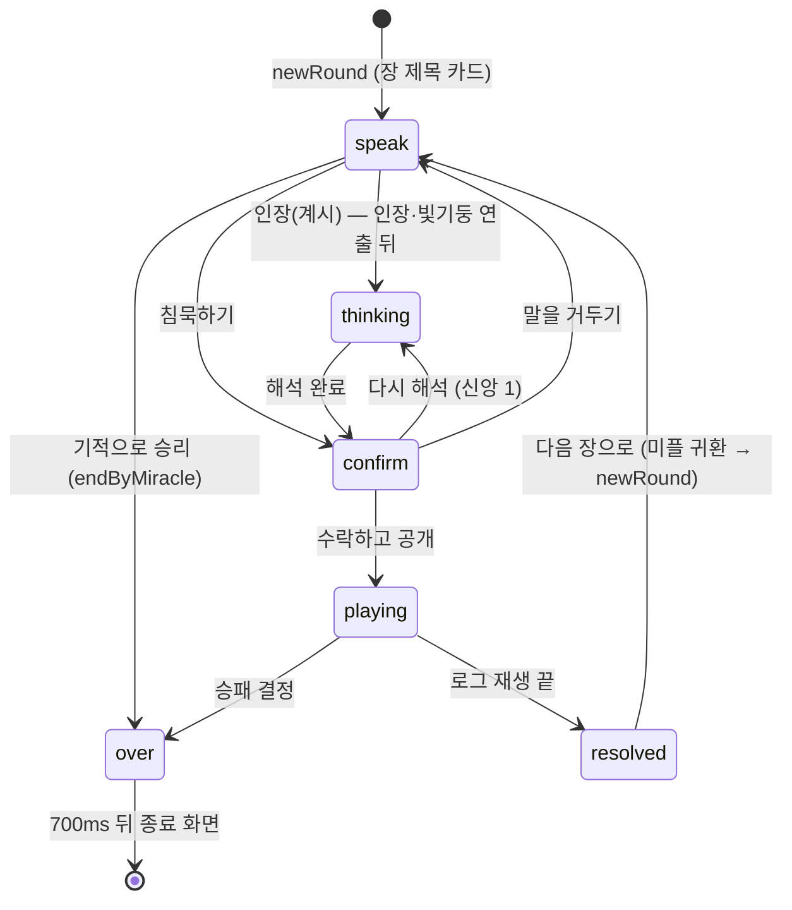
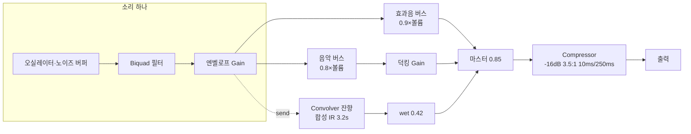

# 06. UI/UX — 화면·연출·소리 (Godot 재구현 명세)

> 웹판(`game/index.html` + `game/style.css` + `js/game/*.js`)의 **보이는 모든 것**을 코드 없이 다시 만들 수 있도록 적은 문서다. 규칙·데이터는 [02 규칙](02-rules.md)·[03 데이터](03-data.md), 화면 컨트롤러 구조는 [04 구조](04-architecture.md), 해석기의 말 장치는 [05 해석기](05-interpreter.md)를 본다.
> **코드가 기준이다.** `style.css`는 뒤에 덧붙인 덮어쓰기 블록이 많아서, 이 문서의 값은 캐스케이드를 끝까지 따라간 **최종 적용값**이다 (예: `.side-col`의 `gap`은 12 → 16 → 최종 **10px**). 출처는 `파일:줄`로 적는다.
> 치수 일부는 2026-09-27 커밋(`8b91681`)을 로컬 서버에서 띄워 `getBoundingClientRect`로 **실측**했다 (§7.6). 분명하지 않은 것은 "확인 필요"로 적었다 (§11에 모음).

---

## 0. 한눈에

| 항목 | 값 |
|---|---|
| 톤 | "촛불 아래 테이블 위의 채색 필사본" (`style.css:1`) — 어두운 나무 테이블, 양피지·금박·밀랍 인장·석판 |
| 렌더링 | HTML/CSS 레이아웃 + 인라인 SVG 보드(`board.js`) + SVG 심볼 라이브러리(`art.js`) + Web Animations API 연출(`fx.js`) + Canvas 2D(배경 먼지, 빛기둥) |
| 소리 | 샘플 파일 **없음**. WebAudio로 전부 합성 (`sound.js`) |
| 화면 상태 | 전역 `phase`: `speak` → `thinking` → `confirm` → `playing` → `resolved` / `over` (`main.js:41`) |
| 렌더 방식 | `render()`가 매번 `innerHTML`로 상단 트랙·계절·보드·매트·제단을 통째로 다시 그린다 (`main.js:1675`). 연출 트리거는 "이전 값" 플래그로 구분 (`dealSeason`, `flipLaw`, `prevNums`, `prevDoctrine`, `lastAltarPhase`) |
| 언어 | 모든 글은 `t(key)` (`js/game/i18n/ko/ui.js`, `shell.js`, `story.js`). 일부 문자열은 HTML(`<b>`, `<small>`, `<em>`, `<kbd>`)을 포함 |

---

## 1. 화면 목록

### 1.1 레이어와 z-order

모든 오버레이는 `position: fixed`. Godot에서는 아래 순서대로 `CanvasLayer`(또는 최상위 Control의 자식 순서)를 나누면 된다.

| z-index | 요소 | 내용 | 출처 |
|---|---|---|---|
| 0 | `#ambient` canvas | 떠오르는 먼지 46개 (촛불빛) | `style.css:32`, `fx.js:614` |
| 1 | `.vignette` | 가장자리 어둡게 + 촛불 깜박임, 신앙 위기 때 붉게 | `style.css:33`, `1050–1054` |
| 2 | `.app` | 상단바·테이블·제단 (게임 본체) | `style.css:38` |
| 2 (보드 안) | `.cloud-shadows` | 보드 위를 지나는 구름 그림자 3개 (multiply) | `style.css:567` |
| 7 / 8 / 9 (보드 안) | `.action-banner` / `.chapter-overlay` / `.dice-overlay` | 보드 액자(`#boardFrame`) 안에 absolute | `style.css:542`, `358`, `368` |
| 10 (앱 안) | `.altar` | 제단 (≤1180px에서 화면 아래 sticky) | `style.css:220` |
| 30 (매트 안) | `.leader-say` | 지도자·대사제 말풍선 | `style.css:756` |
| 40 (보드 안) | `.perk-card` | 교리 특전 해금 카드 | `style.css:902` |
| 60 | `#stage` | 연출 입자·토큰·날아가는 미플·인장·빛기둥 캔버스 (자식 z는 이 안에서만 비교: token 70, fly-meeple 75, stamp 72, impact-ring 71, ascend-line 70, beam-canvas 66, beam-veil 64) | `style.css:37` |
| 60 | `svg.link-layer` | 낱말 → 칸 빛줄기 | `style.css:801` |
| 69 / 70 | `.tut-ring` / `.npc-dialog` | 튜토리얼 강조 링 / 안내자 대화창 | `style.css:700`, `682` |
| 80 | `.drawer` | 연대기 서랍 | `style.css:328` |
| 85 | `.choice-modal`, `.tile-tip` | 선택 카드 모달, 칸 설명 툴팁 | `style.css:812`, `583` |
| 90 | `.main-screen` | 메인 화면 (게임 위에 반투명으로 덮는다) | `style.css:476` |
| 95 | `.list-modal` | 규칙서·설정·서고·성서·시련·해금 안내 (메인 화면 위에도 뜬다) | `style.css:889` |
| 100 / 101 | `.endscreen` / `.confetti`·`.ash` | 종료 화면과 색종이·재 | `style.css:395`, `410` |
| 300 | `.ui-tip` | 양피지 툴팁 (모든 `title` 속성) | `style.css:1292` |

### 1.2 메인 화면 (`#mainScreen`)

**목적**: 첫 화면이자 일시정지 메뉴. 진행 중인 판 위에 반투명하게 덮인다 (뒤로 보드가 흐릿하게 비치도록 `init()`이 보드·매트를 먼저 그림, `main.js:124`).

**배경**: `radial-gradient(ellipse 70% 60% at 50% 40%, rgba(70,40,12,.55), rgba(10,6,2,.96) 75%), rgba(10,6,2,.75)` + `backdrop-filter: blur(6px)` (`style.css:477`). 전체 스크롤 가능, 패딩 32/20 (≥1240: 28/40).

**구성** (`index.html:100–175`, 위→아래):

| 블록 | 내용 | 비고 |
|---|---|---|
| `.ms-hero` | 문장 `#sigil`(108px, ≥1240 88px, 금빛 drop-shadow) · 제목 "말씀이 있으라"(Song Myung, `clamp(40px, 8vw, 84px)`, ≥1240 `min(84px, 5.4vw)`, 금 그라디언트 글자, `letter-spacing .1em`, 한 줄) · 부제 "LET THERE BE"(Hahmlet 700, `clamp(17px,3vw,22px)`, `letter-spacing .42em`) · 금선(240×2) · 소개문(Gowun Batang 16.5px/1.8, `<b>` 강조) | `style.css:486–493`, `1154–1155`, `1267–1270` |
| `.ms-setup` | 왼쪽 옵션 + 오른쪽 맵 미리보기 (나무 패널 18px 라운드) | §1.2.1 |
| `.ms-buttons` | [이어하기(있을 때)] · 새 게임 시작 `Enter` · 튜토리얼 `3×3 · 5장` · 오늘의 계시(힌트) · 시련(힌트) | 서고 기록이 0이면 오늘의 계시·시련 숨김 (`main.js:905`) |
| `.ms-welcome` | 3일 넘게 안 왔으면 지난 판 한 줄 (파란 상자) | `main.js:921`, `style.css:1020` |
| `.ms-awe` | 경외 칭호 · 수치 · 다음 단계까지 + 아래 3px 진행 막대 (경외 0이면 숨김) | `main.js:221–224`, `style.css:992` |
| `.ms-status` | 점(초록=LLM 준비 / 금=내려받기 필요 / 회색=석판) + 대사제 상태 문장 | `main.js:241` |
| `.ms-links` | 칩: 음악 · 효과음 · 연출 토글(글자로 상태 표시) · ? 규칙서 · ⚙ 설정 · 서고 · 성서 · 내장 AI 점검(링크) · 해석기 실험실(링크) · GitHub | 서고·성서는 기록이 있어야 보임 |
| `.ms-foot` | 작은 안내 (12px, 70% 불투명) | |

- **이어하기**: 진행 중인 판이 있으면 `#resumeGame`(btn-primary, "제 N 장으로 돌아가기 `5×5 · 보통` `Enter`")을 맨 앞에 끼우고, 새 게임 버튼은 ghost로 바뀐다 (`main.js:142–157`). 도전 링크(`?seed=`)면 "도전 시작 · 승점 N점을 넘어라".
- **등장**: 자식들이 `fadeUp 1.1s cubic-bezier(.16,1,.3,1)`로 0.12~0.82s 간격 차례로 떠오른다 (`style.css:481–485`, `1253–1254`).
- **퇴장**: 시작 버튼 → `sfx.holy()` → `.leaving`: 화면 `opacity→0` + 안쪽 `scale(1.08) blur(3px)` 0.9s `cubic-bezier(.7,0,.3,1)` → 850ms(연출 줄임 150ms) 뒤 숨기고 판 시작 (`main.js:254–283`, `style.css:512–515`).
- **포커스**: 열릴 때 이어하기(없으면 시작) 버튼에 포커스, `:focus-visible` 3px 금선 offset 4 (`style.css:505`).

#### 1.2.1 새 게임 설정 (`.ms-setup`)

| 필드 | 컨트롤 | 상태·힌트 |
|---|---|---|
| 맵 크기 | `.seg` 4버튼: 빠르게 `4×4 · 8장` / 작게 `5×5 · 12장` / 보통 `6×6 · 12장` / 크게 `7×7 · 14장` (`<small>` 두 줄) | `.on` = 금 그라디언트 |
| 율법파 | `.seg` 쉬움/보통/어려움 + `#diffHint` + (어려움이고 승천이 열렸으면) 승천 seg `기본 · 승천 1…N` | 힌트는 승천 목록으로 바뀜 |
| 은사 | 경외 레벨 ≥1일 때만. "없음" + 열린 은사 짧은 이름들, 힌트 = 은사 설명 | |
| 너의 이름과 문장 | 이름 input(최대 8자, placeholder "이름 없는 신", Song Myung 15px) + 문장 seg 6개(아이콘만): 빛 `i-faith` · 칼 `d-war` · 비둘기 `d-peace` · 이삭 `i-food` · 눈 `e-prophet` · 폭풍 `m-lightning` | 고른 문장이 제단 인장 아이콘이 된다 |
| 맵 시드 | 숫자 input(1~999999, tabular) + "주사위" 칩(무작위, `sfx.dice`) + `#mapHint` "5×5 · 12장 · 사막 N칸 · 성지 N칸 · 이 맵 최고 N" | |
| 미리보기 | 정사각 상자에 같은 설정의 맵을 **모두 드러낸** 채 보드 렌더러로 그림 (클릭 불가) | `main.js:232–234` |

`.seg` 스펙: 배경 `rgba(0,0,0,.35)`, 테두리 금 18%, 패딩 3, 라운드 12; 버튼 min-height 40, Hahmlet 700 14px, 비선택 `--on-table-dim`, 선택 `linear-gradient(180deg, --gold-hi, --gold)` + 글자 `--ink` + `0 2px 10px -2px rgba(255,200,90,.55)` (`style.css:644–651`).

#### 1.2.2 넓은 화면(≥1240px) 두 열

`grid-template-columns: minmax(0,1fr) minmax(0,600px)`, 열 간격 48, 영역 (`style.css:1255–1284`):

```
 .        | setup
 hero     | setup
 buttons  | setup
 awe      | setup
 status   | setup
 .        | setup
 links  links
 foot   foot
```

- 버튼은 460px 폭 2열 그리드, 주 버튼(시작/이어하기)이 두 칸을 차지, ghost 버튼 52px 높이.
- `.ms-setup` 내부는 `1fr 280px`(미리보기 280).
- `.ms-welcome`에는 grid-area가 없다 → 자동 배치 (확인 필요).
- ≤720px: 설정이 한 열, 미리보기 최대 240px 가운데 (`style.css:664–668`).

### 1.3 게임 테이블 개요

1440×900 실측 (`speak` 단계, 5×5):

```
┌ .topbar 1440×72 ──────────────────────────────────────────────────────────────────────┐
│ [문장44][말씀이 있으라 / 5×5 · 보통]   ①─②─③─…─⑫ (트랙 522×38)   [●대사제 석판][♪][🔈][✦][연대기][?][⚙][⌂] │
├ .table (y=72, h=584) 272px | 1fr | 256px, gap 26, padding 10/28/12 ───────────────────┤
│ #matPlayer 272×562      │  .board-area 644×554 (가운데)   │ .side-col 256×562      │
│  (넘치면 안에서 스크롤) │  보드 액자 + 구름 그림자        │  #matEnemy             │
│                         │                                 │  #law (뜻/율법 카드)   │
│                         │                                 │  #season (+다음 장·소명)│
├ .altar-inner (x20,y656) 1400×230 : 300px | 1fr | 240px, gap 20 ──────────────────────┤
│ .hand 300×132 (기적 부채꼴) │ .scroll-wrap 778 (두루마리 196) │ .act 240 (인장 104) │
└────────────────────────────────────────────────────────────────────────────────────────┘
```

테이블 배경: `--table` + 가운데 따뜻한 빛(`radial 80%×60% at 50% 38%, rgba(255,170,80,.16)`) + 세로 나뭇결 두 겹(`repeating-linear-gradient 90deg`) + 위→아래 `#1a100a → #0d0804` (`style.css:22–31`).

### 1.4 상단바 (`.topbar`)

`grid: auto 1fr auto`, gap 24, padding `14px 28px 6px`, 최대 폭 1520 가운데 (`style.css:43–44`).

| 영역 | 내용 | 스타일 |
|---|---|---|
| `.brand` | `#sigil` 44px (금빛 glow) + h1 "말씀이 있으라"(Song Myung 30px, 금 그라디언트 글자 `--gold-hi → --gold 60% → --gold-lo`, `letter-spacing .1em`, 한 줄) + `#subtitle`(Gowun Batang 13px, dim) | 부제 예: `5×5 · 보통`, `튜토리얼 · 첫 계시`, `시련 「…」 · 4×4 · 8장`, `오늘의 계시 · …`, `도전 · …`; 전체 정보는 툴팁 (`main.js:317–325`) |
| `#track` (장 트랙) | 장마다 원 노드(26px, Hahmlet 600 12px) + 연결선(18×2). 지난 장 `.done`(금 22% 배경), 이번 장 `.now`(38px, Hahmlet 700 17px, 금 radial, `0 0 22px` glow, 바깥 링이 2.2s마다 퍼지는 `nowPulse`), 앞으로의 장은 어두운 원. 노드 툴팁 "제 N 장 · 첫봄" | 트랙 아래 `.first` 라벨 "선 · 우리 부족 / 율법파"가 이번 장 노드 밑(44px 아래)으로 `left .6s` 이동, 양 끝에서 잘리지 않게 clamp (`main.js:1702–1719`, `style.css:51–62`) |
| `.tools` | 칩 버튼 8개 (§4.8): `#ai`(상태 점 + "대사제" + **LLM/석판**) · `#music` · `#sound` · `#motion`(아이콘만, 꺼지면 사선 + `.muted`) · `#openChron`(두루마리 아이콘 + "연대기") · `#rules` `?` · `#settings` `⚙` · `#home`(집 아이콘) | `#ai` 클릭 = LLM↔석판 전환 (내장 AI 없거나 thinking 중이면 무시, `main.js:425`) |

좁은 폭에서의 변화는 §7.3 (`fitTopbar`: `compact` → `two-row`).

### 1.5 부족 판 — 우리 (`#matPlayer`, `.mat`)

나무 매트: `linear-gradient(170deg, #34231a, #20150d 70%)`, 테두리 금 28%, 라운드 18, 패딩 `16 16 18`, `--shadow-lg`, 안쪽 6px에 금 점선 테두리(`::before`) (`style.css:145–148`). 내용이 넘치면 안에서 세로 스크롤(얇은 금 스크롤바) + 아래 페이드(§7.4).

위→아래 (`main.js:1906–1964`):

1. **머리** `.mat-head`: 문장 원(40px, 파랑 radial `--player-hi → --player → --player-lo`, 안에 `i-temple` 26px) · h2 "우리 부족"(Hahmlet 700 20px) + small "말씀을 따르는 자들" · 오른쪽 **승점**(Hahmlet 700 28px `--gold-hi`, 아래 "승점" 12px). 승점 툴팁 = 심판의 기준 공식(`scoreTip`, 줄바꿈 포함).
2. **계명·성인 줄** `.vows-row` (있을 때): 계명은 회색 돌 칩 `「이름」`(툴팁 설명), 성인은 금 테 알약 `✦ 이름`.
3. **세라의 과제** `.task-ribbon` (튜토리얼 뒤 첫 판들): 파란 그라디언트 띠, 라벨 "세라의 과제" + 과제 문장 + ✕(끄기).
4. **자원** `.res-grid.row4`: 4칸 한 줄. 칸마다 금화 `.coin`(30px, 안에 아이콘 19px, id `coin-player-{food|wood|stone|faith}` — 토큰이 날아오는 목적지) + 숫자(Hahmlet 700 21px, tabular) + 이름(11.5px). 신앙 칸 이름 뒤에 `+수입`(초록 `<em>`), 툴팁 = 수입 공식.
   - 신앙 낮음(`faith ≤ RULES.lowFaith`): 칸에 붉은 inset 링, 숫자 `--enemy-hi`; 바닥난 채 버틴 상태면 `.critical` 1.4s 맥박 + 아래 `.faith-warn` 줄(붉은 상자) (`style.css:671–679`).
5. **신도** 라벨 `신도 | N / 자리 cap` + 미플 줄 `.meeples`(24×26 SVG, 간격 3): 인구만큼 채운 미플, 보드에 나가 있는 수만큼 `.away`(점선 윤곽, 30%), 빈 자리 `.empty`(25%).
6. **세력** `.stats` 4칸 한 줄(값 위, 이름 아래): 행동 `i-hand` · 신전 `i-temple` `N/3` · 마을 `i-house` · 수도 = 방패 `i-shield` 3개(잃은 것 20% 흑백).
7. **교리** 라벨 "교리 | 계시가 쌓여 문명이 된다" + 4줄 `.dtrack`: 메달(30px, 양피지 radial, 안에 `d-{peace|war|abundance|wisdom}`) · 이름(Hahmlet 700 14px) · 보석 6개(13px 마름모, 간격 8; 채움 `.on` 금 그라디언트+glow; 2·4·6칸 `.perk` 안쪽 테; 6칸 `.ult` 금 테; 새로 찬 칸 `.new` 1s 튀어나옴) · 아래 줄 `.perk-text`(12px): 연속 표시 `연속 ●●○`(금 glow) + `✓ 얻은 특전` + `· N칸: 다음 특전`. 보석 툴팁 = 그 칸의 특전.

숫자 변화 연출: 이전 값과 다르면 `.bump-up`/`.bump-down`(0.7s, 30% 지점 `scale(1.35)` + 초록 `#9be29b`/빨강 `#ff8a7a` glow) + 숫자가 이전 값에서 650ms 동안 굴러 올라감(`countUp`, cubic ease-out) (`main.js:1799–1804`, `1826`).

### 1.6 보드 영역 (`.board-area` → `#boardFrame` → `svg#board`)

- `.board-frame`: 라운드 26, `overflow: hidden`, `filter: drop-shadow(0 30px 40px rgba(0,0,0,.7))` (`style.css:78`, `535`).
- 보드 SVG는 폭 100%, 높이 auto(viewBox 비율). 판 크기는 §3.1.
- 폭 규칙: 기본 `max-width: calc((100vh - 300px) * 1.16)`, `min-width: min(100%, 460px)`; ≥1181px에서 **`min(100%, (100cqh - 8px) × --board-ar)`**(테이블 높이에 꽉 맞춤, `--board-ar`는 렌더러가 viewBox 비율로 설정); ≤1180px에서 한 줄 전체, 최대 760px (`style.css:77`, `1127`, `423`).
- 보드 위 오버레이(모두 액자 안 absolute): 구름 그림자, 행동 띠, 장 제목, 주사위, 특전 카드. 해석 중에는 액자에 `.thinking` → 타일 전체가 1.8s 주기로 밝아지고 세피아 (`style.css:121`).
- 보드 렌더링 전체는 §3.

### 1.7 오른쪽 기둥 (`.side-col`)

세로 grid, gap **10px** (최종값, `style.css:1103`). ≥1181px에서 넘치면 안에서 스크롤 + 아래 페이드. 낮은 데스크톱(높이 ≤860)에서는 **율법(뜻) → 계절 → 율법파 판** 순으로 재배치(§7.5).

| 순서 | 요소 | 내용 |
|---|---|---|
| 1 | `#matEnemy` (율법파 판) | 우리 판과 같은 틀. 문장 원 = 빨강 radial + `s-tablet`; h2 "율법파"; small = 지도자 `이름 · 칭호`(툴팁 설명) 또는 "새겨진 율법대로 움직인다"; 승점. 자원은 `.res-grid.compact`(4칸, 이름 숨김, 금화 28px, 숫자 17px). **율법 석판 막대** `.edict-bar`(두 번째 판부터): "율법 석판" + 8px 막대(`#8a6420 → #e0503c`, 폭 전환 .6s) + `N/max`; 한계 2 전이면 `.danger`(막대 맥박, 값 `#ff9f8e`). 신도 줄, 세력 4칸. 교리 없음. 머리 위 오른쪽에 지도자 말풍선(§1.13). |
| 2 | `#law` (율법 슬롯) | **공개 전**(speak/thinking/confirm): "율법파의 뜻" 붉은 명령서 카드 — `linear-gradient(165deg, rgba(104,30,20,.62), rgba(42,14,10,.78))`, 테두리 `rgba(224,96,72,.5)`, 머리 "● 율법파의 뜻"(붉은 점 glow, 11.5px 자간 .14em `#ffb8a6`), 행동 목록 `li`(13.5px Gowun Batang, 앞 점 색: 공격 `#e0503c`+glow, 선교 `#d9d0ff`, 건설 `#d08a3a`, 채집·기도 `#b89a6a`, 기본 `#c9a24a`), 없으면 "드러난 움직임이 없다", 숨은 것이 있으면 "그 밖에 N가지는 보이지 않는다" (`main.js:1876–1885`, `style.css:1302–1311`). 난이도별 공개: 쉬움=전부, 보통=공격·선교·건설, 어려움=공격만 (안개 속 칸은 제외). 판 시작 전·끝난 뒤에는 단순 뒷면(`s-tablet` + "율법 카드는 공개 단계에 뒤집힌다", 빗금 돌 무늬). **공개 후**(playing/resolved/over): 돌 카드 `.card-stone`(§4.7) "이번 율법 / [석판] 이름 / 설명 / 행동 N회를 율법 순서대로", 처음 보일 때 `cardFlip` 0.9s. 기본 기울기 +1.5°. |
| 3 | `#season` (계절 카드) | 양피지 카드 `.card-parch`, 기본 기울기 −2°: "이번 계절" / [사건 아이콘 `e-{id}`, 갈림길 사건은 `e-prophet`] 이름 / 설명(오른쪽 기둥에서는 3줄 말줄임, 미라 인용이 있으면 예외) / 규칙(점선 위 굵은 줄). 지혜 특전이 있으면 speak 단계에 "지혜의 눈 · 「다른 사건」으로 바꾸기" 점선 버튼. 새 장마다 `cardDeal` 0.8s(위 왼쪽에서 날아와 −3°) + 250ms 뒤 `sfx.deal`. |
| 3a | `.next-season` | "다음 장 · [아이콘] 이름" 점선 상자(툴팁 = 규칙). 마지막 장에는 없음 |
| 3b | `.destiny` | 소명 "소명 「이름」 · 설명" 파란 상자, 이루면 초록 + ✓ |

카드들(`.season .card`, `.law-slot .card`)은 마우스를 따라 3D로 기울고(최대 8°) 커서 위치에 반사광(soft-light radial)이 생긴다 (`fx.attachTilt`, `style.css:576–580`).

### 1.8 제단 (`.altar` / `#altar`)

- 바탕: `linear-gradient(180deg, rgba(58,37,21,.96), rgba(26,16,8,.98))`, 테두리 금 35%, 라운드 `22 22 16 16`, 위쪽 가운데에 금빛 하이라이트 선(`::before`, 좌우 30px 들여 2px) + `0 -18px 40px -10px` 그림자 (`style.css:221–226`).
- `grid: 300px | 1fr | 240px`, gap 20, padding `16 20`, 아래 정렬 (`align-items: end`).
- ≥1181px는 흐름 속(relative), ≤1180px는 `position: sticky; bottom: 0`으로 화면 아래에 붙음(높이 ≤520이면 다시 relative).
- `#altar[data-phase]`에 현재 단계가 들어가 단계별 스타일이 붙는다. 단계가 바뀌면(`resolved`/`over`는 `playing`과 같은 종류로 침) `.phase-in`: 두루마리가 아래서 올라오고(`scrollIn` .5s, scaleY .92→1) 오른쪽 버튼이 0.08s 늦게 `appear` (`main.js:2097–2099`, `style.css:591–593`).

세 구역:

| 구역 | 내용 | 비고 |
|---|---|---|
| `.hand` 기적 손패 | 기적 카드 `.mcard` 92×128, 부채꼴(1번 −9°·+8px, 2번 0°, 3번 +9°·+8px), 겹침 −16px, 호버/선택 시 들림(`translateY(-24px) scale(1.1)` + 3D 기울기 + 금 테 glow). 카드: 남색 그라디언트 + 이중 inset 테 + 금선, 왼쪽 위 비용 원(금 radial 24px; 할인 중이면 초록 `.cut` + 옆에 옛 비용 취소선), 그림 54px, 이름 Hahmlet 700 16px, 호버 시 위로 양피지 설명 풍선(200px). 못 쓰면 흑백·어둡게 + `not-allowed`. 심판의 날 카드는 붉은 테 glow (`.doom`). | `style.css:229–245`, `1243–1244` |
| `.scroll-wrap` 두루마리 | 양피지 `linear-gradient(180deg, #f5e9cd, #eadab1 60%, #e1cc9c)` + 안쪽 갈색 그림자, 패딩 `14 30 12`, 라운드 6, 높이: 기본 148 / ≥1181 `clamp(150px, 24vh, 196px)`; 좌우에 나무 굴대(16px, 위아래 6px 튀어나옴, 원통 그라디언트). 내용은 단계별(§2). | `style.css:248–253`, `1129` |
| `.act` 조작 | 단계별 버튼(§2). 세로 grid gap 10, 가운데 정렬 | `style.css:302` |

### 1.9 모달

#### 1.9.1 목록 모달 `listModal(title, html)` (`main.js:972–981`)

`.choice-modal.list-modal` (z 95): 어두운 배경 `rgba(10,6,2,.72)` + blur 4px, 0.35s 페이드인. 상자 `.list-box`: 폭 `min(720px, 100vw-32px)`, 최대 높이 84vh, 양피지(`--parchment → --parchment-2`), 테두리 2px `--parchment-edge`, 라운드 18. 머리 `.list-head`(제목 Song Myung 24px `--gold-lo` + "닫기" ghost 버튼) + 스크롤 본문(패딩 14/18). 배경 클릭·닫기 → `.out` 0.3s 페이드 후 제거. **Esc로는 닫히지 않는다**: 게임 중 목록 모달이 떠 있을 때 Esc를 누르면 모달은 그대로 두고 그 **아래**(z 90)에 메인 화면이 열린다 (`main.js:353`, 확인 필요: 의도 여부).

| 모달 | 여는 곳 | 내용 |
|---|---|---|
| 규칙서 | 상단 `?`, 메인 "? 규칙서" | `<details>` 8개(첫째만 펼침): 한 장의 흐름 · 이기는 길 · 신도와 신앙 · 교리 · 말의 힘 · 율법파 · 기적과 분노 · 단축키. 요약은 Song Myung 18px, 목록은 Gowun Batang 14px/1.6, "두 번째 판부터" 꼬리표 `<em>`(붉은 알약) (`main.js:1154–1171`) |
| 설정 | 상단 `⚙`, 메인 "⚙ 설정" | 섹션 6개(§8.5 표) — 소리(음악/효과음 슬라이더 0~100 + 켜짐/꺼짐 칩), 연출(화면 효과 · 재생 속도 1×/2×/즉시 · 계시 제안), 보기(진영 무늬 · 글자 크기 · 언어(2개 이상일 때)), 대사제(상태 문장), 이 게임(규칙 판 번호·라이선스·GitHub), 기록(내보내기/가져오기/지우기 + 설명). 가져오기·지우기는 브라우저 `confirm()`/`alert()` 사용 (`main.js:1051–1131`) |
| 서고 | 메인 "서고 · N판" | 통계 줄(판·승·승률·난이도별·평균 장·최고 승점) + 승리 종류 막대(점령/개종/대성당/승점, 금 막대 8px) + 도감·어휘집 `<details>` + 판마다 `<details>`(날짜 · 승패 색 · 메타 · 「별칭」 → 펼치면 계시 목록 + 꼬리) (`main.js:983–1032`) |
| 성서 | 메인 "성서 · a/b" | 업적 카드 격자 `minmax(200px,1fr)`: 얻은 것은 실선+금 배경, 못 얻은 것은 점선 55% (`main.js:1034`) |
| 시련 | 메인 "시련" | 시련 버튼 목록(이번 주 시련은 금 링 + "이번 주의 시련" 알약), 별 `★★☆ · 4×4 · 8장`, 아래 별 기준 설명. 누르면 모달 닫고 바로 시작 (`main.js:934–965`) |
| 해금 안내 | 두 번째 판 시작 400ms 뒤 한 번 | "두 번째 판부터 열리는 것" 목록 5줄 + 안내 (`main.js:1174`) |

#### 1.9.2 선택 카드 모달 `choiceModal({kind,title,text,options})` (`main.js:1218–1232`)

`.choice-modal` (z 85): 같은 어두운 배경. 가운데 `.choice-box`(최대 760): 종류(금 12px 자간 .2em) · 제목(Song Myung `clamp(24px,4vw,34px)` `--gold-hi`) · 설명(Gowun Batang 15px dim) · 카드 줄. 카드 `.choice-card` 190×≥200, 양피지+2px 테, 그림 64px(있으면), 이름 Hahmlet 800 18px, 설명 13.5px, 비용 "신앙 N"(금 이탤릭 아님, 600 12px). 등장 `dealIn` 0.5s(아래에서 회전하며, 0.1s 간격), 호버 3px 금 링 + 3D 기울기(8°). **닫기 버튼 없음 — 반드시 하나를 고른다.** 고르면 `sfx.holy`, 0.35s 페이드.

| 용도 | kind / title | 옵션 |
|---|---|---|
| 소명 (1장, 두 번째 판부터) | "소명" / "이 판에서 이룰 소명을 하나 고르라" | 소명 이름+설명 (2~3장) |
| 기적 드래프트 (5장 등) | "제 N 장 · 새 기적" / "하늘이 새 기적을 내민다 — 하나를 받으라" | 기적 그림(48 viewBox)+이름+설명+비용 |
| 발견지 | "발견 · 칸 이름" / 발견지 이름 | 선택지 라벨+설명 |

선택 모달이 떠 있는 동안 단축키는 막힌다 (§8.1).

### 1.10 연대기 서랍 (`#chronicle.drawer`)

오른쪽에서 밀려 나오는 양피지 패널: 폭 `min(420px, 92vw)`, 전체 높이, `linear-gradient(180deg, #f3e6c8, #e6d3a8)`, 왼쪽 그림자 `-20px 0 50px`. 닫힘 `translateX(105%)` → 열림 0, 0.5s `cubic-bezier(.16,1,.3,1)` (`style.css:328–334`). 여는 곳: 상단 "연대기" 칩, speak 단계 `L` 키. 여는 소리 `sfx.page`.

내용 (`main.js:2336–2347`): 제목 "연대기"(Hahmlet 800 22px) + 닫기 · (있으면) "대사제의 신학 노트" — `'낱말' → 뜻` + "잊게 하기" · 장별 묶음을 **최근 장부터**: 머리 "제 N 장"(Hahmlet 800 15px `--gold-lo`, 아래 선) + 로그 줄 `.chron p`(Gowun Batang 15px/1.55, 앞 7px 점: 우리 `--player`, 율법파 `--enemy`, 기본 `--ink-faint`; `god` 굵게, `priest` 기울임 `--ink-soft`, `leader` 기울임 `#9a3526`, `note` `#1f3f73`; 주사위 줄은 `🎲 a 대 d` 작은 글씨).

### 1.11 종료 화면 (`fx.endScreen` + `main.js:796–859`)

- 전체 화면 z 100. 승: `radial-gradient(circle at 50% 40%, rgba(110,72,18,.8), rgba(16,9,2,.96) 75%)` + **회전하는 햇살**(`repeating-conic-gradient(rgba(255,225,150,.13) 0 6deg, transparent 6deg 18deg)`, 200vmax, 가운데 원형 마스크, 40s 한 바퀴). 패: `radial(rgba(46,14,10,.82) → rgba(0,0,0,.97))`, 햇살 없음. 뒤의 판은 `backdrop-filter: blur(7px) saturate(.75)` (`style.css:1286–1289`).
- 상자(최대 680, 폭 100%−32): 장식 기호 승 `✦`(금 glow 40px) / 패 `✝`(회색) · 제목 "승리/패배/무승부"(Song Myung `clamp(48px,9vw,84px)`, 금 그라디언트 글자, 패는 회색 그라디언트) · 부제 "사유 · 승점 a : b · 도전 결과"(Gowun Batang 17px).
- **탭** `.end-tabs`(검은 알약 안의 버튼, 선택 = 금 그라디언트): **역사가** / **기록** / **경전**. 페이지 `.end-page`: 양피지, 최대 높이 50vh 스크롤.
  - 역사가: 에필로그 제목(Song Myung 26px) · 본문(Gowun Batang 16px/1.85) · 인용(왼쪽 금선 이탤릭) · "「별칭」으로 기억되었다"(붉은 Hahmlet) · 새 구절(금 상자) · 경외 증가(금) · 시련 별 · 새 기록(파랑).
  - 기록: **승점 곡선** SVG 520×150(우리 실선 파랑 3px, 율법파 점선 빨강 2.4px, "성취" 판결 장에 금 점 r4, 오른쪽 끝 라벨 "우리 N"/"율법파 N") · 결정적 장면 · 가장 강한 말씀(+점수 초록) · 주사위 운 · 다음 구절까지(%) (`main.js:891–902`).
  - 경전: 정경 안내 · 전설이 된 땅 · 쓰러진 이름 · 계시 목록(`제 N 장 | “계시” | 교리`, 두 번째 판부터 "봉헌/봉헌됨" 버튼).
- **버튼 줄**: 시편 복사(ghost, 누르면 클립보드 복사 후 1.8s 동안 "복사했다/복사 실패", 화면 유지) · **같은 맵 다시**(primary) · 새 맵 · 메인 화면 · 보드 보기(닫기만). ≤520px에서 한 줄 3개 (`style.css:1191`).
- 등장: 배경 페이드 승 0.7s / 패 1.6s; 제목 `scale(.4)→1`, `letter-spacing .6em→.12em`, 1.2s ease-out. 연출 줄임이 아니면 승 색종이 90개(금·크림·하늘색 9×14, 2.6~5.2s, 흔들리며 회전) / 패 재 60개(회색 5px 원, 5~7.6s 직선) — 0~1.6s 지연 (`fx.js:569–611`).
- 튜토리얼 종료는 본문 없는 단순 판: 제목 "튜토리얼 완료/튜토리얼을 마쳤다", 버튼 "본 게임으로"(→메인) / "보드 보기" (`main.js:335–340`).

### 1.12 튜토리얼 오버레이 (§9에서 흐름)

- `.npc-dialog`: 화면 아래 가운데(24px 위), 폭 `min(640px, 100vw-32px)`, grid `96px 1fr`, 양피지 + 2px 테 + 바깥 5px 어두운 링 + 큰 그림자. 숨김 상태 `translate(-50%, 24px)` 투명 → `.show` 0.35s 페이드 + 0.45s EASE_BACK으로 올라옴. 가리키는 곳의 중심이 화면 55%보다 아래면 `.top`(위 86px에 붙고 위에서 내려옴) (`style.css:682–712`).
  - 초상 96px 원(금 radial 배경, 3px `--gold-lo` 테) 안에 `npc-sera` 심볼; 줄마다 300ms 톡 튀는 등장.
  - 이름 "사관 세라"(Hahmlet 800 17px `--gold-lo`) + small "부족의 기록자".
  - 대사 `.npc-text`(Gowun Batang 16px/1.7, 최소 3.4em): 한 글자씩 22ms, `.` `,` `?` 뒤 160ms, 글자마다 `sfx.type`.
  - 버튼 줄: "튜토리얼 건너뛰기"(밑줄 글자) · 여백 · [제안 "“문장” 적어 넣기" ghost] · "다음 ▶" / 마지막 줄 "알겠네" / 끝 단계 "마치기" (primary 38px).
- `.tut-ring`: 가리키는 요소의 사각형 ±8px에 3px `--gold-hi` 테, 라운드 16, **`box-shadow: 0 0 0 9999px rgba(8,5,2,.45)`로 나머지 화면을 어둡게**(클릭은 막지 않음, `pointer-events:none`), 바깥·안쪽 금 glow, 1.8s 맥박. 위치·크기 0.45s ease-out 이동, 창 크기·스크롤 때 다시 잰다.
- ≤720px: 초상 56px, 대사 14.5px.

### 1.13 알림·띠·말풍선 (토스트 대신 쓰는 것들)

일반 토스트 시스템은 **없다**. 대신:

| 요소 | 위치 | 모양 | 수명 | 출처 |
|---|---|---|---|---|
| 장 제목 카드 `.chapter-overlay` | 보드 액자 전체 | 어두운 radial 위 가운데: `❦`(34px 금 glow) · "제 N 장 · 첫봄"(Song Myung 68px, 금 그라디언트 글자, 자간 .16em) · 금선 260px · 부제(Hahmlet 700 22px, 예: "1막 · 가뭄 · 심판의 기준 「…」") | 2.3s (§5.2) | `fx.js:199`, `style.css:358–366` |
| 행동 띠 `.action-banner` | 보드 위 가운데 16px | 어두운 알약, 왼쪽 4px 진영색 막대, 아이콘 원 36px(양피지 radial) + 제목 "우리 신도 · 채집"(Hahmlet 700 18px) + 세부(로그 문장 13px) | 다음 띠가 올 때까지, 재생 끝나면 0.25s 페이드 | `fx.js:706–725`, `style.css:542–550` |
| 지도자 말풍선 `.leader-say` | 율법파 판 위 오른쪽(판 밖 위로) | 어두운 적갈색, 붉은 테, 오른쪽 아래 꼬리(라운드 `14 14 4 14`), 이름 11.5px `#ff9f8e` + 말(Gowun Batang 14px `#ffe3d8`), 최대 280px | 3.8s 후 0.5s 사라짐 | `main.js:1891–1901`, `style.css:756–761` |
| 대사제/세라 말풍선 `.leader-say.priest` | 우리 판 위 왼쪽 | 남색 그라디언트, 하늘색 테, 왼쪽 아래 꼬리 | 같음 | `style.css:796–797` |
| 특전 카드 `.perk-card` | 보드 42% 높이 가운데 | 260px 밝은 양피지 + 금 테 + 큰 금 glow, "평화 2칸 · 특전 해금" + 아이콘 44 + 문구 | 0.8s 뒤집혀 등장, 2.6s 뒤 0.5s 사라짐 (줄임 1.6s) + 불꽃 30개 | `fx.js:788`, `style.css:902–909` |
| 제단 안내 `.notice` | 두루마리 안 | 붉은 600 12.5px 글 | 다음 렌더까지 | `style.css:265` |
| 경고 줄 `.hint` | 확인 두루마리 | 금 배경 `⚠ …` | | `style.css:283` |
| 신앙 경고 `.faith-warn` | 우리 판 자원 아래 | 붉은 상자 | 상태 동안 | |

---

## 2. 단계별 제단·두루마리 UI

### 2.0 상태 기계



단계별로 바뀌는 화면 (`renderAltar` `main.js:1967–2117`, `renderBoardView` `1776–1796`):

| phase | 두루마리 | 조작(`.act`) | 손패 | 보드 | 오른쪽 율법 슬롯 |
|---|---|---|---|---|---|
| speak | 청원·예언·숨은 말·갈림길·제안 + 작성칸 | 인장 + 침묵하기 | 사용 가능 | 예감 칸 링, 율법파 뜻 배지, 번개 겨누기 | 율법파의 뜻 |
| thinking | 촛불 + "엎드렸다" + 점괘 릴 | 비활성 인장 | 비활성 | 타일 맥박 | 율법파의 뜻 |
| confirm | 해석 + 칩 + 예상 + 봉인 | 수락 / 다시 해석 / 바꾸기 / 거두기 | 비활성 | 번호 미플 + 금 링, 뜻 배지 | 율법파의 뜻 |
| playing | 로그가 한 줄씩 | 속도 + 빨리 감기 | 비활성 | 카메라·띠·연출 | 율법 카드(뒤집힘) |
| resolved | 로그 + 판결 + 결산 | 속도 + 다음 장 | 비활성 | 양쪽 미플 | 율법 카드 |
| over | 같음 | 다시 하기 + 사유 | 비활성 | | 율법 카드 |

### 2.1 speak — 계시 쓰기

두루마리 (`main.js:1981–1997`), 위에서부터 있을 때만:

1. **청원** `.petition`: 왼쪽 3px 금선 알약 상자 — `<b>청원자</b> “청원 문장”` + 오른쪽 작은 "답하면 은총 +1" (툴팁).
2. **봉인된 예언** `.petition.prophecy`(보라 선 `#7a5bd0`): "봉인된 예언 “이름” — N장 남음".
3. **오늘의 숨은 말** (같은 보라 틀): "단서 — “…” (N글자)".
4. **갈림길** `.dilemma`(갈림길 사건일 때): "사건 이름 · 갈림길" + 선택지 알약 버튼 `.dl-opt`(라벨 b + 설명 small, 선택 = 금 그라디언트) + "계시로 답해도 된다". 누르면 즉시 저장·`sfx.click`.
5. **계시 제안** `#suggestRow` — 처음 세 판·튜토리얼 아님·설정 켜짐일 때, 빈 두루마리가 **8초** 이어지면 "이렇게 말씀해 보시겠습니까" + 제안 칩 2개(석판이 알아듣는 문장만, 금지어 제외) + ✕(영구 끄기). 칩을 누르면 28ms 간격으로 한 글자씩 타이핑(`typeInto`) (`main.js:2225–2271`).
6. **안내** `.notice`: 너무 길다 / 신앙 부족 / 말을 거두었다 등.
7. **작성칸** `.compose`: 머리 "신의 말씀"(Hahmlet 700 18px, 한 줄) + [검열 칩 "봉인 · '낱말'"(적갈색 알약, 입력에 그 말이 들어가면 `.hit` 튐)] + 오른쪽 small "제 N 장 · 신도 행동 N회" · `textarea`(2줄, Gowun Batang 22px/1.45, 줄 공책 배경 선, 캐럿 `#8a1c10`, placeholder "강물이 너희를 먹이리라…" 이탤릭 50%, `maxlength` 100 — 시련 cloister는 20) · 아래 줄: 글자 수 "n / 100" + 비용 알약 `.cost-pill`(`i-faith` + "신앙 N"; 인용이 인정되면 "인용 · 신앙 N" 보라; 비용 > 보유면 `.over` 붉음; 금지어 포함 `.banned` 적갈색 흰 글자).
   - ≥1181px에서 작성칸은 두루마리 바닥에 **sticky**(내용이 스크롤돼도 늘 보임, 위쪽 페이드 배경) (`style.css:1120`).
   - ≥721px에서 청원/갈림길/제안이 있으면 두루마리가 **두 열**: 왼쪽 곁정보, 오른쪽 작성칸(sticky top) — `grid-template-columns: minmax(0,1fr) minmax(0,1.25fr)` (`style.css:1131–1136`).
   - ≤720px에서는 두루마리가 내용만큼 늘고 작성칸은 흐름 속 (`style.css:1167–1170`).
   - 입력이 바뀔 때마다: 비용·글자 수 갱신, 제안 숨김, 250ms 디바운스 후 석판 해석으로 **예감 칸**(최대 6) 계산 → 보드에 `.hint-ring` 표시, 새 칸이 생기면 `sfx.hover` (`main.js:2274–2285`).

조작 (`.act`):

- **인장** `.seal-btn`: 104px 원(≤1180 88, ≤720 64), 밀랍 radial `#e0624c → #a82a1c 55% → #6a150c`, 뒤에 불규칙한 원(`border-radius 47% 53% 50% 50% / 52% 48% 52% 48%`)이 삐져나온 밀랍 자국, 가운데 신의 문장 아이콘 40px(세피아로 금박처럼), 아래 "계시"(Song Myung 17px 자간 .3em). 호버 `translateY(-3px) rotate(-4deg) scale(1.04)` + 주황 glow, 누름 `scale(.94)`, 비활성 흑백 60% (`style.css:303–313`). 툴팁 "계시 내리기 (Ctrl+Enter)".
- **침묵하기** `.text-btn`: "침묵하기 — 신도들이 알아서 일한다" 밑줄 글자 → 해석 없이 바로 confirm(기도 우선 자동 배치).

인장 누름 검사 (`main.js:500–524`): 빈 글 → 포커스만; 너무 김 → notice + `rejectFx`; 글자·숫자가 없음 → 침묵; 신앙 부족 → notice + `sfx.fail` + `rejectFx`(인장과 비용 알약이 `rejectShake` 0.42s 흔들림, 알약 붉게). 통과하면 신앙 차감 → 제단 잠금 → **인장 연출**(§5.4) → thinking.

### 2.2 thinking — 대사제가 헤아리는 중

- 두루마리 오른쪽 아래에 인주 자국 `.stamp-mark.static`(66px, 이중 붉은 테, −10°, multiply, "계시").
- `.thinking-box`: 촛불 SVG(46×60, 불꽃이 1.1s `flicker`로 흔들림) + "대사제가 제단 앞에 엎드렸다"(Hahmlet 800 19px) + "말씀의 뜻을 헤아리는 중"(점 세 개가 1.4s `steps(4)`로 늘었다 줄었다) + 모델 내려받는 중이면 " · 모델 내려받는 중 N%".
- LLM 모드·연출 줄임 아님·속도 즉시 아님이면 **점괘 릴** `.omen-reel`: 44px 창 안에서 가능한 행동 아이콘(최대 8)이 슬롯머신처럼 `steps(n)` 0.16s/칸으로 돌고, 0.7s 뒤 나타남. 해석이 끝나면 `sfx.coin(4)` (`main.js:1850–1855`, `style.css:985–999`).
- 인장은 비활성. 보드 타일 맥박(`.thinking .tiles`).
- 석판 모드는 700ms만 기다리므로 인장 연출이 끝날 즈음 이미 끝나 thinking은 순간적으로만 보인다.

### 2.3 confirm — 해석 확인

두루마리 높이 196(≥1181 `clamp(150px,24vh,196px)`, ≤720 180). 내용 (`main.js:2007–2076`):

1. 머리: "대사제의 해석" + small "대사제 이름 · LLM/석판/침묵 · 1.4초 · 교리".
2. **계시 원문** `.rev-line` “…”(Gowun Batang 14px): 행동을 부른 낱말은 **형광펜 밑줄** `u.lw`(아래 38%에 `rgba(244,196,74,.55)` 띠, 굵게), 인용된 낱말은 보라 점선 밑줄 `u.lw.cite`. 같은 낱말은 처음 한 번만 (`markWords`, `main.js:2120`).
3. **말 꼬리표** `.wtags`(알약 11.5px): 말투(축복 초록/저주 빨강/비유 보라) · 기이한 해석(보라, "· 은총") · 청원에 답함(금, "· 은총") · 이름 · 갈림길의 뜻 · 성언 · 인용 · 대립 교리 −1(빨강) · 같은 교리 세 장째. "은총"은 장당 첫 하나에만.
4. **해석문** `.quote`: Gowun Batang(확인 단계 16px, 2줄 말줄임 — 전문은 툴팁), 앞에 큰 금 따옴표 “. 처음 들어올 때 **75자/초 타자기**(쉼표·마침표·느낌표 260ms, 글자마다 `sfx.type`, 끝에 붉은 캐럿 ▍ 깜박임). 최고 교리가 4칸 이상이면 목소리 색: 전쟁 `#7a1f12`, 평화 `#1f4f73`, 풍요 `#5a4a0e`, 지혜 `#3a2a6e` 이탤릭.
5. **명령 칩** `.orders` (타자기가 끝난 뒤 칩이 110ms 간격으로 `appear` + 딸깍; 그 전엔 숨김). 칩 공통: 알약, 반투명 흰 배경, 12.5px, 조각 단위 줄바꿈.

| 칩 | 모양 | 조각 | 클릭 |
|---|---|---|---|
| 명령(수락됨) | 기본 | 파란 미플 · **번호 원**(18px `--player` 흰 글자) · 짧은 이름 "식량 거두기 · 강 E4" · `← '낱말'`(금갈색 11.5px) · 얻을 것 `+2 식량`(초록 알약) · 승률 `63%`(≥50 초록 / 미만 빨강) · 선공 표시 "선공 · 막음"(파랑) 또는 "빼앗김"(빨강) | 빼기(장당 2개까지) |
| 알아서 | 점선, 62% | 미플 · 이름 · 얻을 것 · "알아서" | — |
| 말한 기적 | 보라 테·배경 | 기적 그림 22px · "이름 → 대상 칸" · "기적 · 신앙 N" | 빼기/되살리기 |
| 뺀 명령 | 55%, 취소선, 점선 | 미플 · 이름 · "뺌" | 되살리기 |
| 거절됨 | 붉은 배경·테, 취소선 | 이름 · 사유 | — |
| 금지(서원) | 갈색 | `⊘` 이름 · "서원 · 지키면 은총" 또는 "금지" | — |

   칩은 수락 버튼이 켜진 뒤에만 반응(빼기 제한 초과 시 notice "한 장에 두 개까지만 뺄 수 있다"). 바꾸면 `sfx.lift` + 보드·제단 다시 그림.
6. **예상 줄** `.preview`: "예상 · 식량 4→**6** · 목재 2→**4** · 돌 0→0 · 신앙 3→**3**" (늘면 초록, 줄면 빨강; 주사위 행동·율법파는 제외, 툴팁으로 설명).
7. **예언 봉인** 체크박스(보라 점선 상자, `accent-color #7a5bd0`): "예언으로 봉인 — “이름” N장 안에 이루어지면 신앙 +r, 빗나가면 -p". **영원한 계명** 체크박스(갈색): "영원한 계명으로 새긴다 — 「이름」 … (되돌릴 수 없다)". 체크 시 `sfx.seal`.
8. 경고 `.hint`(⚠ 칠 곳이 없다 등), notice.

조작:

| 버튼 | 모양 | 활성 조건 |
|---|---|---|
| **수락하고 공개** `Enter` | btn-primary big(54px) | 타자기·칩 등장이 끝난 뒤 |
| **다시 해석 · 신앙 1** `R` | btn-ghost | 계시 글이 있고, 이번 장 아직 안 썼고, 신앙 ≥1 |
| ↔ 이전 해석과 바꾸기 | text-btn | 다시 해석한 뒤 (두 해석을 오갈 수 있다) |
| 말을 거두기 `Esc` | text-btn | 계시 글이 있고, 다시 해석을 안 썼고, 튜토리얼 아님 (두 번째 판부터 신앙 1) |

`<kbd>` 꼬리표: 10.5px, 옅은 테 상자 (`style.css:718–719`).

보드: 수락된 명령 칸에 **번호 배지 미플** + 칸에 금 `.hl-ring`(1.4s 맥박), 알아서 미플은 50%. 진입하면 우리 판 미플 자리에서 칸으로 **미플이 날아가 착지**(§5.2 flyMeeples), 착지 전 보드 미플은 `.incoming`(투명). 칩이 다 나오면 밑줄 낱말에서 해당 칸 미플 자리까지 **금빛 곡선**이 그려진다(최대 3개, 260ms 간격, §5.2 linkCurve).

### 2.4 playing — 공개와 해결 재생

- 두루마리: 머리 "공개와 해결" + small "율법 「이름」" · "율법파 배치 — 식량 채집 · 평원 C3, …" · 로그 줄이 재생될 때마다 한 줄씩 추가(마지막 줄 `appear`), 두루마리는 늘 맨 아래로 스크롤.
- 조작: 속도 세그먼트 `.speed`(1× / 2× / 즉시; 작은 검은 알약 안, 선택 금) + "⏩ 빨리 감기 `Space`" ghost. 속도는 저장되며(`gsg.speed`) 즉시를 누르면 곧장 건너뛴다.
- 율법 카드가 뒤집히고(`cardFlip`), 500ms 뒤 지도자 반박 말풍선, 율법파 미플이 율법파 판에서 날아와 착지(안개 속 칸은 제외). 음악은 긴장(tension).
- 로그마다(§5.5): 보드 스냅숏 교체 → 카메라가 칸으로 다가감(`focusTile`) → 행동 띠 → 연출 → 매트 숫자 갱신(토큰 도착 뒤) → 트랙 갱신. 안개 속 율법파 행동은 "율법파 · 북동쪽 안개 속의 움직임 / 무엇을 했는지 보이지 않는다"(`s-tablet` 아이콘, 방향은 우리 수도 기준 8방위), 연달아 나오면 띠 없이 120ms만.
- 연속 성공 콤보: 우리 성공이 2번 이상 이어지면 음이 올라가는 동전 소리, 3번부터 칸 위에 금색 `×N`.
- 속도 1×일 때만 띠마다 화면 읽기 알림.

### 2.5 resolved — 결산

두루마리에 로그 전체 + (계시가 있었으면) **판결** `.verdict`: 비스듬한(−8°) 도장 글씨 `.v-stamp`(Song Myung 17px, 2.5px 테, 판정 색: 성취 `#a3261a`, 반쯤 `#9a6a10`, 빗나감 `#6b645c`, 기이 `#6a3fb0`; `stampIn` 0.5s scale 2.2→1) + 문장 "신께서 '강'이라 하셨고, 강(E4)에서 식량을 1 얻었다." (`main.js:1279–1294`). 성취 기준: 명령 중 성공 비율 ≥0.7 full, ≥0.3 half, 그 밖 miss, 기이한 해석이면 odd. 200ms 뒤 `sfx.seal`(빗나감은 `sfx.fail`).

**결산 줄** `.ledger` (`main.js:1429–1436`): "이번 장" 머리 · 항목 `식량 +2`(늘면 초록 `#2f7a3e`, 줄면 `#a3372a`) · 오른쪽 금 알약 "승점 **−2**" · "율법파 −2" · (마지막 3장에 지고 있으면) 붉은 힌트 "역전까지 N점 — 마을 k개 또는 신도 m명" / 동점 안내. 항목은 `lgIn` 0.45s EASE_BACK로 130ms 간격 차례 등장, 동시에 `sfx.coin(i)` 음이 오르고, 승점이 늘었으면 마지막에 `chime`.

이어서(있으면): 교리 특전 카드(900ms 뒤), 대사제 신학 노트 말풍선(900ms 뒤), **발견지 선택 모달**, 세라 과제 달성 말풍선. 조작: 속도 + "다음 장으로 ▶ `Enter`"(primary big). 다음 장을 누르면 보드 위 미플이 모두 각자 매트 자리로 날아 돌아간 뒤 새 장이 시작된다(최대 10개, 연출 줄임이면 생략).

### 2.6 over

조작이 "다시 하기"(primary big) + 승패 사유(Gowun Batang 13px)로 바뀌고, 음악이 끝남(`setMood('end')`), 700ms 뒤 종료 화면(§1.11). 튜토리얼이면 종료 화면 대신 세라의 마무리 대사.

### 2.7 기적 사용과 번개 겨누기

- speak 단계에서만. 카드 클릭(또는 `Alt+1~5`) → `sfx.click`.
- **번개**: 겨누기 토글. 카드가 `.on`(들린 채), notice "번개를 내릴 율법파의 땅을 보드에서 고르라.", 보이는 율법파 칸에 `.sel-ring`(연노랑 반투명 + 행진하는 점선 0.8s) + 커서 crosshair. 칸 클릭 → 발동 → 번개 연출. 다시 카드 클릭하면 취소.
- 그 밖의 기적: 즉시 발동. 매트는 기적 전 값을 보여 주다가 토큰이 도착한 뒤 숫자가 오른다. 실패하면 notice + `sfx.fail` + 카드 `rejectShake`.
- 계시 속 기적 이름(말한 기적)은 확인 단계 칩으로 들어간다(§2.3).

---

## 3. 보드 렌더링 (`board.js`)

### 3.1 기하

| 상수 | 값 | 출처 |
|---|---|---|
| `R` 육각 반지름(꼭짓점까지) | 48 | `board.js:3` |
| `W` 육각 가로 | `√3·R` ≈ 83.138 | `:4` |
| `PAD` 액자 안쪽 여백 | 34 | `:5` |
| 방향 | **pointy-top**: 꼭짓점 `i` 각도 `60i − 30°` (i=0 → −30°, i=2 → 90° 아래 꼭짓점, i=5 → 270° 위 꼭짓점) | `:13–16` |
| 배치 | **odd-r offset**: 홀수 행(B, D, F…)이 오른쪽으로 `W/2` | `:10` |
| 칸 중심 `center(t)` | `x = PAD + W/2 + W·(c + 0.5·(r & 1))`, `y = PAD + R + 1.5R·r` | `:10` |
| 판 크기 `sizeOf(rows, cols)` | `width = W·(cols + 0.5) + 2·PAD`, `height = 1.5R·(rows−1) + 2R + 2·PAD` | `:8` |
| viewBox | `0 0 round(width) round(height)` | `:91` |
| 칸 id | 행 글자 `A…I`(위=A) + 열 번호 1부터: `A1`, `C4` | `borderEdges` `:69–70` |

판 크기표 (SVG 사용자 단위):

| 맵 | width | height | 가로세로비 (`--board-ar`) |
|---|---|---|---|
| 3×3 (튜토리얼) | 359.0 | 308 | 1.1655 |
| 4×4 | 442.1 | 380 | 1.1635 |
| 5×5 | 525.3 | 452 | 1.1621 |
| 6×6 | 608.4 | 524 | 1.1611 |
| 7×7 | 691.5 | 596 | 1.1603 |

화면에서는 SVG를 영역 폭에 맞춰 늘리므로 칸 크기는 맵이 클수록 작아진다. 수도: 우리 `(rows−1, 1)`(왼쪽 아래), 율법파 `(0, cols−2)`(오른쪽 위) — `mapgen.js:26`.

### 3.2 액자 (`frame()`, `board.js:44–58`)

아래부터:
1. 나무 판: 사각형(2,2)~(W−2,H−2), rx 22, `fill url(#g-wood)`, `stroke url(#g-gold)` 4px.
2. 양피지: 14px 안쪽, rx 14, `fill #ecdcb6` (`.parchment`).
3. 종이 결: 같은 사각형에 `filter url(#f-paper)`(fractal noise를 갈색 α.09로), opacity .9.
4. 안쪽 선: 20px 안쪽, rx 10, `stroke #8a6420` α.55 1.2px.
5. 나침반: 오른쪽 아래 `(W−52, H−50)`에 원 r20(선 α.5) + 남북 다이아(α.55) + 동서 다이아(α.3) + 위에 "北"(Hahmlet 700 11px, α.7).

### 3.3 칸 한 장의 레이어 순서 (`renderBoard`, `board.js:97–149`)

`<g class="tile tile-{지형|fog} [selectable] [focused] [holy]" data-id>` 안에, 그려지는 순서대로:

| # | 요소 | 조건 | 모양 |
|---|---|---|---|
| 1 | `hex-base` | 항상 | 중심을 **3px 아래로** 내린 육각, `#3b2a18` α.55 (타일 두께감). 안개 α.35 |
| 2 | `hex` | 항상 | `fill url(#g-{지형})` radial 그라디언트 (§4.3). 호버 `brightness(1.12) saturate(1.1)`, 안개 호버 1.18 |
| 3 | 무늬 | 항상 | `fill url(#p-{지형})` — **강(river)에는 무늬 정의가 없다**(참조 실패 → 칠하지 않음) |
| 4 | 소유 음영 | 주인 있고 드러남 | `url(#g-own-{player,enemy})`: 가운데 투명, 65%부터 가장자리로 진영색 α.55 |
| 5 | `hex-bevel` | 항상 | `url(#g-bevel)` 위 흰 α.38 → 아래 검정 α.34. 안개 α.5 |
| 6 | `hex-edge` | 항상 | 테두리 `#2a1c0f` α.7 1.4px. 안개 `#1e1812` α.6 |
| 7 | `own-line` | 주인·드러남 | 반지름 R−5 테두리 3px 진영색 + glow, **opacity .35** (국경선이 주 표시) |
| 8 | `own-pat` | 주인·드러남 | R−1, 진영 무늬 채움 — `body.cb`일 때만 보임 (§8.5) |
| 9 | `wall-ring` | 성벽·드러남 | R−9, `#8f877b` 6px 점선 `7 3` + 아래 1.5px 그림자 (돌담) |
| 10 | 그림 `glyph` | — | §3.4 |
| 11 | `coord` | 항상 | 칸 id, 중심 아래 `+0.74R`, IBM Plex 600 9px `#2a1c0f` α.45 (안개 `#f4e9cf` α.28) |
| 12 | `holy-ring` | 성지·드러남 | R−7, `rgba(255,236,170,.75)` 2px 점선 `2 6`, 2.4s glow 맥박 |
| 13 | 대성당 점 | 우리 수도에 대성당 공사 중 | 원 3개 r4, 중심 아래 `+0.5R`, x −12/0/+12, 빈 것 검정 α.35 + 크림 테, 찬 것 `#ffd98a` |
| 14 | 이름 | 드러남 | 중심 위 `−0.52R`. 우선순위: 붙인 이름 `.tile-name`(Song Myung 700 13px `#3a2410`, 3.5px 크림 외곽선) > 전설 `.legend`(12px `#7a2016`) > 특징(오아시스/채석장, 건물 없을 때) `.feat`(IBM Plex 700 11px `#3a5a2a`) |
| 15 | 믿음의 표식 `faith-mark` | 표식 있음 | R−5 테두리 4px 둥근 끝, `pathLength=12`, `dasharray = 6n 12` → 표식 1개 = 테두리 절반. 우리 `#9cc0ff`, 율법파 `#ff9f8e` + glow |
| 16 | 의도 링 + 배지 | 율법파의 뜻이 이 칸 | §3.8 |
| 17 | `hint-ring` | speak 예감 칸 | R−3, 옅은 금 채움 α.14 + 2px 점선 `3 5`, 1.6s 맥박 |
| 18 | `hl-ring` | confirm 명령 칸 | R−2, `--gold-hi` 3px + glow, 불투명도 .45↔1 1.4s |
| 19 | `sel-ring` | 번개 대상 | R−2, 채움 `rgba(255,230,120,.12)`, `#fff2a8` 3px 점선 `8 6` 행진 0.8s |

칸 그룹 다음에 전체 레이어: **국경선**(§3.6) → **말(미플)**(§3.7). 그 위는 연출이 SVG에 직접 붙이는 떠오르는 글·링·번개·건물 솟음.

### 3.4 지형 그림(glyph) 배치

심볼 viewBox는 `-30 -30 60 60`(중심 원점). `use(id, x, y, size)`는 중심 (x,y)에 size×size (`board.js:42`).

| 경우 | 그림 |
|---|---|
| 안개 | `s-fog` 58px 가운데, 7s 좌우 3px 흔들림(`fogDrift`). 발견지가 숨어 있으면 `?`(Hahmlet 800 22px `#f0c75a` glow, 2.2s 맥박) |
| 수도 | 지형 그림 34px(+14 아래, α.35) + 우리 `s-temple` / 율법파 `s-tower` 64px(−2 위). 깃발이 1.4s 펄럭임(`flagWave`) |
| 마을 | 지형 그림 32px(−12, +10, α.55) + `s-village` 50px(+4, −2) |
| 그 밖 | 지형 그림 60px(0, −2). 강은 물결 점선이 3.6s 흐름, 언덕은 꼭대기 빛 점이 2.4s 반짝임 |

### 3.5 안개

안개 칸은 **어두운 미지의 땅**으로 드러난 땅이 떠오르게 한다 (`style.css:1224–1230`): 그라디언트 `#8a8273 → #655d51 → #453f37`, 무늬 45° 가는 줄(α.06), 두께 α.35, 베벨 α.5, 테두리 짙은 실선. 좌표 글자는 크림 α.28. 안개 속 율법파 미플은 그리지 않는다. 국경선 계산에서 안개 너머는 주인 없음으로 친다.

### 3.6 국경선 (`borderEdges`, `board.js:63–84`, `152–165`)

- 드러난 소유 칸마다 6변을 보고, 이웃이 다른 주인(또는 없음·안개)이면 그 변을 긋는다. 변 k는 꼭짓점 k→k+1(반지름 **R−2**), 이웃 방향 k = 동, 남동, 남서, 서, 북서, 북동. 짝수 행 오프셋 `[[0,1],[1,0],[1,-1],[0,-1],[-1,-1],[-1,0]]`, 홀수 행 `[[0,1],[1,1],[1,0],[0,-1],[-1,0],[-1,1]]`.
- 선: 3.2px 둥근 끝, 우리 `--player-hi #9cc0ff`, 율법파 `--enemy-hi #ff9f8e`, 각각 3px glow. 진영 무늬 켜면 율법파 선은 점선 `5 4`.
- **잉크 번짐**: 지난 렌더에 없던 변은 `pathLength=1` + `stroke-dashoffset 1→0` 0.7s `cubic-bezier(.6,0,.3,1)`로 그어진다(보드별 이전 변 집합을 기억).

### 3.7 말(미플) (`board.js:167–182`)

- 자리 `markerPos`: 칸 중심에서 우리 **x −0.46R**, 율법파 **x +0.46R**, 둘 다 **y −0.3R**. 한 칸에 같은 진영 여러 개면 같은 자리에 겹친다(확인 필요: 겹침 처리 없음).
- 구성: 그림자 타원(rx10 ry3.2, +13 아래, 검정 α.35) → 몸 `s-meeple` 30px, `fill url(#g-meeple-{side})`, 테 검정 α.55 1.1px + drop-shadow → (번호 있으면) 배지 원 r7 at (+10, −12) `#f7ecd3` 테 `#2a1c0f` + 숫자 IBM Plex 800 9.5px.
- 상태: `.dim`(알아서) α.5, `.incoming`(날아오는 중) 투명, `.land`(착지) 몸이 `scale(1.25,.72)→1` 0.35s, 평상시 2.8s `bob`(1.8px 위로 숨쉬기, 2n·3n번째는 위상 어긋남).

### 3.8 율법파의 뜻 표시 (`board.js:135–143`, `style.css:735–742`, `1086–1089`)

| type | 링(R−4) | 배지 원(r10, 칸 안 오른쪽 아래 `(+0.46R, +0.36R)`) | 아이콘(14px) |
|---|---|---|---|
| attack | `rgba(220,60,40,.85)` 2.4px 점선 `7 5`, 1.2s 행진 | `#7d1f14` / 테 `#ffb0a0` | `d-war` |
| preach | `rgba(160,130,230,.85)` 행진 | `#3e2d6e` / `#cfc2ff` | `d-peace` |
| build | `rgba(220,140,40,.8)` 행진 | `#7a4a12` / `#ffd29a` | `i-house` |
| gather | `rgba(210,180,140,.6)` 점선 `3 6`, **정지** | `#5e4a32` / `#e8d3a8` | `i-food` |
| pray | gather와 같음 | 같음 | `i-temple` |
| (그 밖, 예: explore) | attack 스타일 | attack 스타일 | `d-war`(기본값) — 안개 칸 대상이라 실제로는 안 보임 (확인 필요) |

배지는 1.6s 주기로 2px 오르내린다. 표시는 speak/thinking/confirm, 게임 진행 중에만.

### 3.9 강조·선택·초점

- 클릭: 모든 칸 `click → onTileClick(id)`. 번개 겨누기일 때만 의미 있음(§2.7).
- 초점(카메라): 재생 중 비추는 칸에 `.focused`, 액자에 `.spot` → 다른 칸 `brightness(.48) saturate(.55)`, 초점 칸 테두리 `#fff2b0` 2.4px + glow, 미플 `brightness(.7)` (`style.css:537–539`). 카메라는 §5.2.
- 축복 물결(인장 빛기둥이 닿을 때): 칸마다 보드 중심에서의 화면 거리 × 1.6ms 지연으로 `bless` 1.1s(밝기 1.75, 세피아) (`fx.js:553–565`, `style.css:630–633`).

### 3.10 칸 툴팁 (`#tileTip`, `main.js:358–417`)

- 마우스: 보드 위 `pointermove`마다 커서 +18px 오른쪽 아래(화면 끝에서 안쪽으로 clamp). 보드를 벗어나면 숨김. 양피지 상자 170~250px, 0.15s 페이드+6px 올라옴.
- 터치: 칸을 **450ms 길게 누르면** 손가락 위(−24px)에 표시, 8px 넘게 움직이면 취소, 표시 직후의 click은 삼킨다. 보드 밖을 탭하면 닫힘. 보드 컨텍스트 메뉴 막음.
- 내용: 제목 **칸 이름**(Hahmlet 700 16px) + 줄들(Gowun Batang 13px, `<br>` 구분), 있는 것만 이 순서로: 전설 「이름」 — “인용” (N장) · 소유(우리 부족의 땅/율법파의 땅/주인 없는 땅) · 건물(신전/율법파의 탑/마을 설명) · 채집("오아시스 — 식량 채집 +2" 또는 "메마른 땅") · 성벽 · 성지 · 대성당 N/3 · 믿음의 표식 N/2 · 율법파가 노림(선공 설명).
- 안개 칸: "안개 지대 · C4" + "아직 아무도 가 보지 않은 땅…".

### 3.11 보드의 생기

- **구름 그림자**: 액자 위 3개 흐린 타원(폭 60%/45%/70%, `rgba(40,25,10,.24)` blur 8px, multiply)이 55s/75s/95s에 왼쪽 밖에서 오른쪽 밖으로 흐름 (`style.css:567–573`).
- 깃발 펄럭임, 미플 숨쉬기, 강 물결, 안개 흔들림, 성지 반짝임, 의도 배지 오르내림 — 전부 무한 CSS 애니메이션(§5.3).

### 3.12 미니맵(메인 화면 미리보기)

같은 `renderBoard`에 모든 칸을 드러낸 상태만 넘긴다(말·링 없음). 칸 pointer-events 없음. 액자·나침반 포함.

---

## 4. 비주얼 디자인 시스템

### 4.1 색 토큰 (`:root`, `style.css:2–19`)

| 토큰 | 값 | 쓰임 |
|---|---|---|
| `--table` | `#120b06` | 바탕 |
| `--table-2` | `#1f140b` | (예비) |
| `--wood` | `#3a2515` | (예비) |
| `--wood-2` | `#24170c` | (예비) |
| `--parchment` | `#f0e3c3` | 양피지 모달·대화창 위 |
| `--parchment-2` | `#e5d3a8` | 양피지 아래 |
| `--parchment-edge` | `#c4a86f` | 양피지 테두리 |
| `--ink` | `#2a1c0f` | 양피지 위 본문 |
| `--ink-soft` | `#5d4731` | 보조 글 |
| `--ink-faint` | `#8a7152` | 메타 글 |
| `--gold` | `#c9a24a` | 금 기본 |
| `--gold-hi` | `#f4dc92` | 금 하이라이트, 포커스 링 |
| `--gold-lo` | `#7c591b` | 금 그림자, 양피지 위 제목 |
| `--player` | `#3d6fb6` | 우리 진영 |
| `--player-hi` | `#9cc0ff` | 우리 국경선·표식 |
| `--player-lo` | `#1f3f73` | 우리 짙은 |
| `--enemy` | `#b3392a` | 율법파 |
| `--enemy-hi` | `#ff9f8e` | 율법파 국경선·표식 |
| `--enemy-lo` | `#651a11` | 율법파 짙은 |
| `--on-table` | `#eadcbf` | 어두운 바탕 위 글 |
| `--on-table-dim` | `#a8957a` | 어두운 바탕 위 보조 글 |
| `--ok` | `#5aa468` | 준비됨 점, 수입 `+N` |
| `--bad` | `#d0493a` | (정의만, 직접 사용 드묾) |
| `--r` | `14px` | 정의만 되어 있고 쓰이지 않음 |
| `--shadow-lg` | `0 18px 40px -12px rgba(0,0,0,.75), 0 2px 0 rgba(255,230,180,.06) inset` | 매트·모달 |
| `--shadow-md` | `0 8px 20px -8px rgba(0,0,0,.7)` | 작은 카드·풍선 |
| `color-scheme` | `dark` | 스크롤바·폼 컨트롤 |

### 4.2 자주 쓰는 리터럴 색

| 의미 | 값 |
|---|---|
| 좋은 변화(양피지 위) | `#2f7a3e`, 초록 알약 `rgba(90,164,104,.18~.2)` 글 `#245a31` |
| 나쁜 변화(양피지 위) | `#a3372a`, `#9b2618`, 붉은 알약 `rgba(180,50,40,.14)` 글 `#7a2016` |
| 숫자 튐 | 올라 `#9be29b`, 내려 `#ff8a7a` |
| 보라(예언·비유·기이·인용·기적 칩) | `#7a5bd0`, 글 `#46318a`/`#3a2a6e`, 판결 기이 `#6a3fb0` |
| 떠오르는 글 | 좋음 `#ffe38a`, 나쁨 `#ff8f7f`, 정보 `#fff8e8`, 콤보 금 `#ffd98a`; 외곽선 `rgba(30,18,5,.85)` 5px |
| 밀랍 인장 | `#e0624c → #a82a1c → #6a150c` (도장 연출은 `#ec7a62 → #b3301f → #6a150c`), 인주 자국 `#9b2618` |
| 신앙 위기 비네트 | `rgba(150,20,10,.5)` 가장자리, 맥박 `rgba(170,25,12,.7)` |
| 연출 링 기본 | `#ffd76a`; 우리 행동 `#8fb4f2`, 율법파 `#ff8f7f`, 공격 성공 `#ff4b3a`, 전설 `#ffe28a`, 탐험 `#f4efe4`, 출생 `#9be29b` |

### 4.3 지형 색 (`art.js:4–12`)

radial 그라디언트 `cx 42% cy 34% r 75%`, 정지점 0 / .62 / 1:

| 지형 | 밝은 | 중간 | 어두운 | 무늬 (`p-*`) | 그림 |
|---|---|---|---|---|---|
| plain 평원 | `#f6e7a6` | `#d9b45a` | `#b98f36` | 8×8, −24° 짧은 획 `#7a5a18` α.35 | 밀 이삭 셋 |
| forest 숲 | `#a6c77d` | `#5e8a42` | `#3d6230` | 9×9 짙은 점 + 옅은 점 | 전나무 셋 |
| mountain 산 | `#ddd2bf` | `#a2927a` | `#76654f` | 7×7, 35° 가는 선 α.22 | 눈 덮인 봉우리 둘 |
| river 강 | `#a9d9ec` | `#5aa0c6` | `#34729b` | **없음** | 흰 물결 세 줄(흐름) |
| hill 언덕(성지 후보) | `#f1dcef` | `#bf9dbd` | `#8f6d8c` | 12×12 옅은 점 | 선돌 셋 + 반짝이는 빛 |
| desert 사막 | `#f6dfa6` | `#e2b86a` | `#b8843e` | 16×8 물결선 | 모래 언덕 + 해 + 작은 피라미드 |
| fog 안개 | `#8a8273` | `#655d51` | `#453f37` | 6×6, 45° 선 α.06 | 윤곽 구름 |

### 4.4 SVG 공용 정의 (`art.js:23–78`, `237–238`)

| id | 종류 | 값 |
|---|---|---|
| `g-bevel` | 세로 선형 | 0 흰 α.38 → .45 흰 0 → .7 검정 0 → 1 검정 α.34 |
| `g-gold` | 대각 선형 | `#f7e3a1` → .45 `#c99a3b` → .7 `#8a6420` → 1 `#e9cd7c` |
| `g-wood` | 세로 선형 | `#5a3a22 → #2e1c0f` |
| `g-meeple-player` | radial 35%/25% r80% | `#9cc0ff` → .55 `#3d6fb6` → `#1f3f73` |
| `g-meeple-enemy` | 같음 | `#ff9f8e` → .55 `#b3392a` → `#651a11` |
| `g-own-player` / `g-own-enemy` | radial 가운데 | .65까지 투명 → 1에서 진영색 α.55 |
| `g-pillar` | (m-pillar 안) 세로 | `#fff6c8` → `#ffb347` → `#d9483a` |
| `pat-own-player` | 8×8 45° | 3px 줄 `rgba(31,63,115,.35)` |
| `pat-own-enemy` | 9×9 | 점 r1.8 `rgba(101,26,17,.4)` |
| `f-shadow` | drop-shadow | dy 3, σ 2.4, `#1a0e03` α.55 |
| `f-soft` | drop-shadow | dy 1.5, σ 1.2, α.45 |
| `f-glow` | blur 4 + merge | (쓰이지 않음) |
| `f-paper` | fractalNoise .9, 2옥타브, seed 3 → 갈색 α.09 | 보드 양피지 결 |

### 4.5 글꼴 (Google Fonts, 모두 OFL — `index.html:10`)

| 변수 | 글꼴(두께) | 쓰는 곳 |
|---|---|---|
| `--font-title` | **Song Myung** 400 → Hahmlet, serif | 로고·메인 제목, 장 제목, 종료 제목, 주사위 결과, 인장/도장 글자, 칸 이름, 판결 도장, 모달 제목, 에필로그 제목, 설정 소제목, 규칙 요약, 신 이름 입력, 떠오르는 계시 글자, 경외 칭호 |
| `--font-display` | **Hahmlet** 400–800 → Gowun Batang | 헤딩·숫자·버튼: 매트 제목·승점·자원 숫자, 카드 제목, 트랙 노드, 세그먼트·일반 버튼, 기적 카드, 떠오르는 숫자, 결산 숫자, 부제 LET THERE BE |
| `--font-body` | **Gowun Batang** 400/700 | 서사: 부제, 카드 본문, 두루마리 입력(22px), 해석문, 연대기, 대사, 소개문, 툴팁, 말풍선, 청원, 에필로그 |
| `--font-ui` | **IBM Plex Sans KR** 400/500/600 → system-ui | 기본 본문 15px/1.55, 칩·라벨·메타·칸 좌표·명령 칩 |

전역: `word-break: keep-all; overflow-wrap: break-word`(한국어 어절 단위 줄바꿈, `style.css:30`). 숫자는 `font-variant-numeric: tabular-nums`인 곳이 많다.

### 4.6 모서리·그림자·간격

| 요소 | 라운드 | 그림자 |
|---|---|---|
| 보드 액자 | 26 | drop-shadow 0 30 40 α.7 |
| 매트 | 18 (안쪽 점선 13) | `--shadow-lg` |
| 제단 | 22 22 16 16 | 위로 0 −18 40 −10 |
| 카드(계절·율법) | 12 | 0 10 22 −8 α.8 + inset 링 |
| 기적 카드 | 10 (≤720 8) | 0 10 18 −6 α.8 + inset 링 |
| 두루마리 | 6 | inset 0 0 30 갈색 α.25 + 0 12 24 −10 |
| 버튼 | 12 | primary: inset 위 흰 α.6 + 0 6 14 −4 |
| 칩·알약 | 999 | — |
| 모달 상자 | 18 | `--shadow-lg` |
| 툴팁 | 10 | 0 12 28 α.55 + inset 1px 갈색 |
| 튜토리얼 대화창 | 18 | 0 24 60 −16 α.85 + 0 0 0 5 어두운 링 |

테이블 여백: 좌우 28, 칼럼 간격 26, 제단 바깥 20, 최대 폭 1520.

### 4.7 재질 레시피

| 재질 | 레시피 | 쓰는 곳 |
|---|---|---|
| **테이블 나무** | §1.3 (radial 빛 + 두 겹 세로 결 + 세로 그라디언트) | body |
| **매트 나무** | `linear-gradient(170deg, #34231a, #20150d 70%)` + 금 28% 테 + 6px 안쪽 금 점선 | 매트 |
| **제단 나무** | `linear-gradient(180deg, rgba(58,37,21,.96), rgba(26,16,8,.98))` + 금 35% 테 + 윗선 하이라이트 | 제단 |
| **보드 액자** | `g-wood` + `g-gold` 4px 테 + 양피지 `#ecdcb6` + 종이 노이즈 + 안쪽 선 | 보드 |
| **양피지 카드** | `linear-gradient(160deg, #f6ead0, #e6d3a6)` + inset 1px 갈색 α.5 + inset 5px `#f3e6c8` + inset 6px 갈색 α.35 (이중 테) | 계절 카드, 칸 툴팁(비슷) |
| **양피지 두루마리** | `linear-gradient(180deg, #f5e9cd, #eadab1 60%, #e1cc9c)` + inset 30px 갈색 그림자 + 좌우 굴대 `linear-gradient(90deg, #8a6a3e, #d9bd84 35%, #f1dfb4 50%, #b8955c 75%, #6b4f2a)` | 제단 두루마리 |
| **양피지 모달** | `linear-gradient(175deg, --parchment, --parchment-2)` + 2px `--parchment-edge` | 목록 모달, 선택 카드, 종료 페이지, 대화창 |
| **석판 카드** | `linear-gradient(165deg, #6f665d, #4d453e)` + inset 1px `#2a211b` + inset 5px `#5c534a` + inset 6px `rgba(255,159,142,.5)`, 글 `#f3eadb` | 율법 카드 앞면 |
| **석판 뒷면** | `repeating-linear-gradient(45deg, #3c3129 0 6px, #342a23 6px 12px)` + 테 `#5b4b3d` + inset 링 | 율법 뒷면 |
| **붉은 명령서** | §1.7 #2 | 율법파의 뜻 |
| **금화** | `radial-gradient(circle at 35% 30%, #fbf1d8, #e3cf9f 60%, #b99a5a)` + inset 2px `#8a6420` + inset 4px `#f4e6c4` + 그림자 | 자원 아이콘 받침, 날아가는 토큰(`#fff8e2, #ecd8a6, #b99a5a` + 금 glow) |
| **메달** | `radial(#fbf1d8, #d8c08a 65%, #9b7b3c)` + inset 1.5px `#7c591b` | 교리 메달, 행동 띠 아이콘 |
| **보석** | 13px 45° 마름모, 빈 = 검정 α.3 + 금 테; 찬 = `linear-gradient(135deg, --gold-hi, --gold 55%, --gold-lo)` + glow; 궁극 찬 = `radial(#fff6d0, #f4c24a, #a8741a)` | 교리 칸 |
| **밀랍** | radial `#e0624c → #a82a1c → #6a150c` + 여러 겹 inset + 뒤 불규칙 원 | 인장 버튼, 도장 |
| **남색 카드** | `linear-gradient(160deg, #2e3b5c, #172036)` + inset `#0c1120`/`#25304c`/금 α.55 | 기적 카드 |
| **금 버튼** | `linear-gradient(180deg, #f7e3a1, #d9b25a 50%, #b88a32)` + 1px `#f4dc92` 테 | btn-primary |
| **금 글자** | `background: linear-gradient(180deg, #fff7dc, --gold-hi 45%, --gold 75%, --gold-lo)` + `background-clip: text` + drop-shadow | 메인 제목, 장 제목, 종료 제목 |

### 4.8 공통 컴포넌트

| 컴포넌트 | 스펙 |
|---|---|
| `.chip` | 높이 34, 좌우 12, 999 라운드, 1px 금 α.35 테, 배경 검정 α.3, IBM Plex 500 13px `--on-table`; 호버 테 `--gold` + 배경 금 α.12; 누름 1px 아래. `.icon-only` 34×34, 아이콘 17px. `.muted` dim 글 + 테 α.2. 꺼짐 표시 = 아이콘 위 −40° 사선(`.slash::after`). ≤720 30/32px, ≤480 30px, ≤380 28px |
| `.btn-primary` | 높이 44(`.big` 54), 좌우 18, 라운드 12, Hahmlet 700 16px, 금 버튼 재질, 글 `#2a1c0f`; 호버 밝기 1.08 + 1px 위 + 금 glow; 비활성 α.4 |
| `.btn-ghost` | 같은 크기, 배경 검정 α.25, 테 금 α.45, 글 `--on-table`; 호버 테·글 `--gold-hi`. 양피지 위에서는 글 `--ink`, 테 갈색 α.5 |
| `.text-btn` | 배경·테 없음, 13px dim, 밑줄(offset 3); 호버 `--gold-hi` |
| `.seg` | §1.2.1 |
| `kbd` | 10.5~11px, 1~2px/5~6px 패딩, 라운드 5, 옅은 테 상자 |
| `.card` 기울기 | `perspective(700px) rotateX(--rx) rotateY(--ry) rotate(--base-rot)`, 0.25s ease-out 복귀, 호버 반사광 |

### 4.9 아이콘·그림 목록 (`art.js` 심볼 전부)

뷰박스: 지형·건물 `-30 -30 60 60`, 미플 `-14 -16 28 30`, 아이콘 `0 0 24 24`, 기적 `0 0 48 48`, 문장 `0 0 48 48`, NPC `0 0 64 64`. 심볼 안의 색은 대부분 **고정**(`fill` 속성)이라 `use`의 `fill`은 미플·`currentColor` 아이콘에만 먹힌다.

| id | 그림 | 쓰는 곳 |
|---|---|---|
| `s-plain` | 금빛 밀 이삭 세 줄기 | 평원 칸 |
| `s-forest` | 전나무 세 그루(줄기 갈색, 잎 짙은 녹색, soft 그림자) | 숲 칸 |
| `s-mountain` | 회갈색 봉우리 둘 + 흰 눈 | 산 칸, 성벽 건설 솟음 |
| `s-river` | 흰 물결선 셋(`.waves`, 흐름 애니) | 강 칸 |
| `s-hill` | 선돌 셋 + 바닥 그림자 + 꼭대기 빛 점(`.holy-spark`) | 언덕 칸 |
| `s-desert` | 모래 언덕 + 해(`#ffd36b`) + 작은 피라미드 + 모래 결 | 사막 칸 |
| `s-fog` | 윤곽선 구름(크림 α.34 선, α.07 채움) | 안개 칸 |
| `s-temple` | 기둥 셋 신전 + 박공 + 금 구슬 + **파란 깃발**(`.flag`) | 우리 수도, 신전·대성당 솟음 |
| `s-tower` | 회색 탑 + 총안 + 검은 아치문(금 줄) + **붉은 깃발** | 율법파 수도 |
| `s-village` | 붉은 지붕 집 둘 + 문 + 불 켜진 창 | 마을 |
| `s-meeple` | 클래식 미플 실루엣(채움 없음 → 그라디언트로 칠함) | 보드 말, 매트, 칩, 날아가는 미플 |
| `i-food` | 밀 다발 | 식량, 채집 띠, 의도 배지(gather), 문장 "이삭" |
| `i-wood` | 통나무 | 목재 |
| `i-stone` | 돌덩이 | 돌 |
| `i-faith` | 불꽃(노랑+크림 속불) | 신앙, 기본 인장 문장, 도장·은총·예언 띠 |
| `i-hand` | 편 손 | 행동 수 |
| `i-shield` | 금 방패 | 수도 내구도, 막힘·실패 띠 |
| `i-trophy` | 금 트로피 | (쓰이지 않음) |
| `i-house` | 붉은 지붕 집 | 마을 수, 건설 띠, 의도 배지(build) |
| `i-temple` | 신전 정면 | 신전 단계, 우리 문장 원, 기도 띠, 의도 배지(pray) |
| `d-peace` | 올리브 가지 문 비둘기 | 평화 교리, 선교 띠·배지, 문장 "비둘기" |
| `d-war` | 엇갈린 두 칼 | 전쟁 교리, 공격 띠·배지, 분노 띠, 문장 "칼" |
| `d-abundance` | = `i-food` | 풍요 교리 |
| `d-wisdom` | 펼친 책 | 지혜 교리 |
| `e-calm` | 해 | 사건 "평온" |
| `e-drought` | 주황 해 + 갈라진 땅 | 사건 "가뭄" |
| `e-harvest` | = `i-food` | 사건 "풍년" |
| `e-plague` | 해골 | 사건 "역병" |
| `e-threat` | 붉은 깃발 | 사건 "위협" |
| `e-prophet` | 빛살 달린 눈 | 사건 "예언자", 갈림길 사건, 탐험·발견 띠, 점괘 릴(explore), 문장 "눈" |
| `s-tablet` | 두 장 돌판 | 율법 카드, 율법파 문장 원, 안개 띠, 검열·석판·계명 띠 |
| `m-lightning` | 먹구름 + 노란 번개 | 기적 번개, 문장 "폭풍" |
| `m-rain` | 흰 구름 + 파란 빗줄기 | 단비 |
| `m-bounty` | 풍요의 뿔 + 과일 + 밀 | 풍요 |
| `m-manna` | 구름 + 흰 알갱이 | 만나 |
| `m-ark` | 물결 위 방주 | 방주 |
| `m-tongues` | 불꽃 + 두 갈래 혀(물결) | 방언 |
| `m-pillar` | 불기둥(`g-pillar`) | 불기둥, **심판의 날(doom)** |
| `m-revive` | 빛 속 흰 미플 + 땅선 + 빛살 | 되살림 |
| `sigil` | 금 동전 테 + 어두운 원 + 금 번개 | 로고(상단·메인), 파비콘 계열 |
| `npc-sera` | 금 테 초상: 붉은 두건·흰 머리 노인 사관, 두루마리, 깃펜 | 튜토리얼 초상 |
| `u-music` | 음표(선) | 음악 칩 |
| `u-speaker` | 스피커 + 음파(선) | 효과음 칩 |
| `u-off` | 사선 | (쓰이지 않음 — 사선은 CSS) |
| `u-sparkle` | 큰 별 + 작은 별 | 연출 칩 |
| `u-scroll` | 두루마리 문서(선) | 연대기 칩 |
| `u-home` | 집(선) | 메인 화면 칩 |

그 밖의 텍스트 기호: `❦`(장 제목), `✦`/`✝`(종료), `⊘`(금지 칩), `✕`(실패 떠오름·닫기), `✓`, `●○`(연속), `★☆`(시련), `🎲`(로그 주사위), `▶`, `⏩`, `?`, `⚙`, `♪`, `✧`.

---

## 5. 모션·피드백

### 5.1 공통 원칙 (`fx.js:6–24`)

- **`motion` 전역**: `{ skip, reduced, speed }`. 기본은 화려하게 — OS의 "동작 줄이기"를 **따르지 않는다**(연출이 게임의 핵심이라 기본 켜고 직접 끄게 함, `fx.js:7`). 저장 키 `gsg.motion`(`reduced`/`full`).
- **모든 대기는 `wait(ms)`**: `skip`이면 0, `reduced`면 `ms × 0.35`, 그리고 `÷ speed`(1 또는 2). 단, **WAAPI/CSS 애니메이션 자체 길이는 speed로 줄지 않는다** — 2×에서는 다음 연출이 앞 연출과 겹친다.
- `off() = skip || reduced` → 대부분의 입자·링·섬광 연출은 아예 생략.
- 이징 상수: `EASE_OUT = cubic-bezier(.16,1,.3,1)`, `EASE_BACK = cubic-bezier(.34,1.56,.64,1)`, 빛기둥 내부 `EASE(x) = 1 − (1−x)³`.
- 모든 화면 좌표 연출은 `#stage`(fixed, 전체 화면)에 붙고, 보드 좌표 연출은 보드 SVG 안(`tileCenter`)에 붙는다. 보드 좌표 → 화면 좌표는 `svg.getScreenCTM()` (`board.js:19–34`).

### 5.2 JS 연출 목록 (`fx.js`)

| 함수 | 무엇 | 길이·이징 | 줄임/빨리감기 |
|---|---|---|---|
| `floatText(svg,tile,text,kind,offset)` | 칸 중심 −8+offset에서 글자가 튀어나와 떠오름: (0) y+10 scale .5 α0 → (22%) y−4 scale 1.18 → (60%) y−10 scale 1 → (100%) y−40 scale .96 α0 | 1500ms EASE_OUT | skip이면 없음 (reduced에서도 보임) |
| `ring(svg,tile,color,big)` | 원 2개가 r8 → 58(큰 것 96)로 퍼지며 선 5→0.5, α.95→0; 둘째는 140ms 뒤 | 800/1000ms EASE_OUT | off |
| `rise(svg,tile,symbol)` | 건물 68px가 아래(+28, .2배)에서 솟아 1.25배로 튀고(55%) 자리 잡은 뒤(80%) 사라짐 + 흙먼지 | 1100ms EASE_OUT | off |
| `dust(at)` | 먼지 12개(12px 갈색 radial)가 아래 반원으로 20~54px 퍼지며 1.6배·α0 | 700~1000ms | off |
| `puff(at)` | 착지 먼지 8개, 반원 22px | 520ms | off |
| `shake(el,s)` | 무작위 8 키프레임 ±s px, ±0.3° → 원위치 | 460ms linear | off |
| `flash(color,ms)` | 전체 화면 색 α1→0 | ms(기본 500) ease-out | off |
| `lightning(svg,tile)` | 위(−20)에서 칸까지 지그재그 폴리라인 2개(5px·2px, 흰색 + 노랑 glow), 깜박임 키프레임 0→1→.2→1→0 + thunder + 섬광 520 + 액자 흔들림 10 + 큰 노랑 링 + 불꽃 24 | 700ms | off면 소리만 |
| `rain(host)` | 빗줄기 110개(1.6×22px)가 보드 위에서 12° 기울어 떨어짐, 0~1.1s 무작위 지연 | 550~900ms linear | off면 소리만 |
| `sparks(at,n,colors)` | 6px 빛 점 n개가 무작위 방향 30~120px(+30 아래로) 퍼지며 .2배 | 800~1400ms EASE_OUT | off |
| `flyTokens(from,toEl,icon,count)` | 금화 토큰(36px) 최대 4개가 칸에서 매트 금화로 **포물선** 비행: (15%) 튀어나와 1.15배 → (55%) 중간 지점 위로 `−80 − abs(dx)×0.15` → 도착 .55배. 도착마다 목적지 `pulse` + `sfx.coin(i)` | 900ms + 110ms 간격, `cubic-bezier(.45,0,.3,1)` | off면 목적지 pulse만 |
| `pulse(el)` | scale 1→1.35(밝기 1.4)→1 | 420ms EASE_BACK | — |
| `chapter(host,title,sub)` | §1.13 카드. 전체 α: 0→1(12%)→1(80%)→0 / 제목 `clip-path inset(0 100% 0 0)→0` + blur 4→0, 900ms 지연 150 / 금선 scaleX 0→1 800ms 지연 450 / 부제 8px 올라오며 600ms 지연 800 / `❦` scale .4 −40° → 1, 700ms EASE_BACK | 2300ms | off면 `sfx.chapter`만 |
| `rollDice(host,d,labels)` | 보드 위 어두운 판에 **3D 주사위 둘**(76px 정육면체, 우리 흰-파랑 / 율법파 흰-분홍, 눈 3×3 격자) "대" 사이. 오버레이 200ms 페이드, 패널 350ms 튐. 주사위: 회전(X 720/1080°, Y 1080/720° + 오프셋)에서 결과 면으로 `cubic-bezier(.2,.7,.2,1)`, 동시에 위(−70)에서 떨어져 45%에 착지, 62%에 −18 튀고 78%에 정지. 끝나면 합계 "3 + 1 = **4**", 결과 글자(승 `--gold-hi` / 패 `#ff9f8e`, Song Myung 52px)가 scale 2.2, 자간 .4em → 1, .08em (450ms EASE_BACK), 이긴 쪽 금 glow. 1250ms 유지 후 250ms 페이드 | 굴림 1300ms(reduced 300) → 약 2.9s | skip이면 없음 (reduced는 짧게 보임) |
| `typewriter(el,text,cps)` | 한 글자씩, `,` `.` `!` 뒤 260ms, 글자마다 `sfx.type`, 끝에 ▍ | cps(해석문 75) — **speed와 무관** | off면 즉시 |
| `castRevelation` | 인장(`stampSeal`) → 글자 승천(`ascendWords`) → 650ms → 빛기둥(`heavenlyBeam`) | §5.4 | off면 `sfx.seal`만 |
| `stampSeal` | ① 인장 버튼 눌림(260ms) ② 두루마리 72%/55% 지점 위 −170px에서 1.9배 도장이 나타나 −120까지 내려왔다 −132로 들림(420ms, `cubic-bezier(.2,.8,.3,1)`), 그림자 커짐, `sfx.lift` ③ 470ms 뒤 **쾅**: 150ms `cubic-bezier(.7,0,1,.6)`로 찍힘(찌그러짐 .94×.9 → 1.04×.98) ④ `sfx.seal` + 두루마리 눌림 380ms + 제단 흔들림 7 + 보드 흔들림 3 + 충격 링 2개(90px, .3→2.4배, 520ms) + 먼지 + 붉은 불꽃 16 + **인주 자국**(`.stamp-mark` −14~−4° 무작위, `markIn` .35s) ⑤ 260ms 뒤 도장이 −70 위로 1.3배 사라짐(380ms) | 약 1.07s | — |
| `ascendWords` | 계시 글자(36자 넘으면 말줄임)가 두루마리 위 한 줄로 나타나 글자마다 28ms 간격으로 떠올라(−14, 1.15배) 보드 윗부분(높이 20%)으로 흩어지며 날아가 .3배·blur 4·α0. 불꽃 글자(Song Myung 30px, 주황 3겹 glow) + `sfx.whoosh` | 1100ms/글자, `cubic-bezier(.45,0,.2,1)` | — |
| `heavenlyBeam(boardEl)` | 전체 화면 캔버스(가산 합성 `lighter`) + 어두운 베일(2.6s: 20%까지 0→1, 70%부터 사라짐). 총 **T=2400ms**, 착지 **HIT=700ms**. 세기 = `(t/700)^1.5` 후 `(1−(t−700)/1700)^0.8`. ① 보드 중심 위(−40)에서 부채꼴 광선 16개(각도 ±0.45rad, 흔들림, 금빛 선형 그라디언트) ② 중심 빛기둥 4겹(폭 40+150×세기, 겹별 배율 1.8/1/.45/.15, 주황→흰) — 착지 전엔 아래로 자라남(EASE) + 기둥 속 흘러내리는 빛줄기 9개 ③ 입자: 착지+600ms까지 프레임마다 6개가 위에서 나선으로 모여 내려옴, 착지 순간 80개가 튀어 오름 ④ 착지: `sfx.impact` + **칸 축복 물결** + 1100ms 동안 타원 충격파 2개(가로 30→보드 폭 75%, 세로 42%) + 가운데 bloom | Promise는 HIT+500=1200ms에 풀림(나머지는 겹쳐 흐름) | skip이면 즉시 끝 |
| `endScreen` | §1.11 | 700/1600ms, 제목 1200ms | reduced면 색종이 없음 |
| `ambient(canvas)` | 먼지 46개가 아주 천천히 위로(속도 0.00012~0.00047 화면/프레임), 좌우 사인 흔들림, 알파 0~0.5 깜박임, 따뜻한 `rgba(255,214,150,a)`, DPR 반영 | 무한 rAF | reduced면 지움 |
| `flyMeeples(items,onLand)` | 미플(34×36)이 매트 자리에서 칸으로: (20%) 1.25배 ±10° 들림 → (55%) 중간 `−110 − abs(dx)×0.12` 위, 1.45배 ±18° → (92%) 착지 찌그러짐 1.05×.9 → 1. 시작마다 `sfx.lift`, 착지마다 `sfx.drop` + puff + 보드 미플 `.land` | 720ms + 170ms 간격, `cubic-bezier(.45,.05,.35,1)` | off면 즉시 착지 |
| `focusTile(frame,svg,tile)` | 보드 SVG `scale(1.22)`, transform-origin = 칸 위치를 가운데 쪽으로 15% 당긴 점(가장자리 칸 쏠림 방지) + `.spot` | CSS transition 0.6s EASE_OUT (`style.css:536`) | reduced면 안 함 |
| `actionBanner` | 띠가 위 −24px, .94배에서 내려옴 | 380ms EASE_BACK | skip이면 없음 |
| `clearBanner` | 위로 −10px 페이드 | 250ms | |
| `countUp(el,from,to)` | 숫자 보간, cubic ease-out, 탭이 숨겨져도 마지막 값은 타이머로 확정 | 650ms | off면 즉시 |
| `attachTilt(el,max)` | 포인터 위치로 `--rx/--ry`(±max°), 반사광 `--mx/--my`; 떠나면 0; 들어올 때 `sfx.hover` | CSS transition | reduced면 기울지 않음 |
| `linkCurve(from,to,delay)` | 화면 전체 SVG에 2차 베지어(제어점 = 중간 x, `min(y) − abs(dx)×0.25 − 60`), 금 3px glow, `stroke-dashoffset 1400→0` 800ms `cubic-bezier(.6,0,.2,1)` + 끝 점 원(r9) 520ms 뒤 .2→1배 600ms, 2s 뒤 둘 다 600ms 페이드 | 약 2.8s | reduced면 없음 |
| `perkReveal` | §1.13, `perkFlip` rotateY 90°→0, .7→1배, 800ms `cubic-bezier(.2,1.2,.4,1)` + `sfx.holy` + 불꽃 30 | 3.1s | reduced 2s |
| `installTips` | §8.3 | 260ms 지연, .14s 페이드 | |

### 5.3 CSS 애니메이션 목록 (이식할 것)

| 이름 | 대상 | 길이·반복 | 내용 | 출처 |
|---|---|---|---|---|
| `candle` | 비네트 | 5s 무한 alternate | α .92→1→.9→.97 | `style.css:36` |
| `crisisPulse` | 신앙 위기 비네트 | 2.4s 무한 | 붉은 inset 160/40 → 200/60 | `:1051` |
| `nowPulse` | 이번 장 노드 링 | 2.2s 무한 ease-out | scale .85→1.35, α1→0 | `:61` |
| `waves` | 강 물결 | 3.6s linear 무한 | dashoffset → −32 (점선 10 6) | `:103` |
| `fogDrift` | 안개 구름 | 7s 무한 alternate | x −3→+3, α .85→1 | `:105` |
| `twinkle` | 언덕 빛 | 2.4s 무한 | α .4↔1, scale .7↔1.2 | `:107` |
| `hlPulse` | 명령 칸 금 링 | 1.4s 무한 alternate | stroke α .45→1 | `:110` |
| `march` | 선택 링·의도 링 | .8s / 1.2s linear 무한 | dashoffset → −28 | `:112` |
| `thinkPulse` | 해석 중 타일 | 1.8s 무한 alternate | brightness 1→1.1 + sepia .3 | `:122` |
| `cardFlip` | 율법 카드 | .9s `cubic-bezier(.34,1.3,.64,1)` | rotateY 180°, y −30, .9배 → 0 | `:139` |
| `cardDeal` | 계절 카드 | .8s EASE_OUT | (−60,−80) −18° .8배 α0 → −3° | `:141` |
| `bumpUp`/`bumpDown` | 바뀐 숫자 | .7s ease-out | 30%에 1.35배 + 초록/빨강 glow | `:173–174` |
| `gemIn` | 새 교리 보석 | 1s EASE_BACK | 0 → 1.5배(60%) + 퍼지는 금 링 | `:203` |
| `appear` | 칩·새 로그 줄·버튼 | .45s EASE_OUT | y+8 .96배 α0 → 제자리 | `:282` |
| `caret` | 타자기 커서 | .7s steps(1) | 깜박 | `:270` |
| `flicker` | 촛불 불꽃 | 1.1s 무한 alternate | 찌그러짐·기울기 | `:288` |
| `dots` | "헤아리는 중..." | 1.4s steps(4) | 점 0~3개 | `:291` |
| `spinRays` | 종료 햇살 | 40s linear 무한 | 360° | `:401` |
| `fadeUp` | 메인 화면 자식 | 1.1s EASE_OUT, 0~.82s 지연 | y+14 α0 → 제자리 | `:485` |
| `msLeave` / `msZoom` | 메인 화면 퇴장 | .9s `cubic-bezier(.7,0,.3,1)` | α→0 / 1.08배 blur 3 | `:514–515` |
| `land` | 착지 미플 | .35s EASE_BACK | scale(1.25,.72)→1 | `:557` |
| `flagWave` | 깃발 | 1.4s 무한 alternate | skewY −9°·.86 ↔ 7°·1.05 | `:563` |
| `bob` | 보드 미플 | 2.8s 무한 | 50%에 −1.8px, scaleY 1.03 | `:566` |
| `drift` | 구름 그림자 | 55/75/95s linear 무한 | x → 260% | `:573` |
| `scrollIn` | 단계 전환 두루마리 | .5s EASE_OUT | y+14 scaleY .92 → 1 | `:593` |
| `markIn` | 인주 자국 | .35s ease-out | 1.25배 α0 → 1배 α.92 | `:622` |
| `bless` / `blessGlyph` | 빛기둥 착지 물결 | 1.1s ease-out, 거리 지연 | 밝기 1.75·세피아 / glow | `:632–633` |
| `faithPulse` | 신앙 위급·석판 위험 | 1.4s / 1.2s 무한 | 붉은 테 + glow | `:675` |
| `ringPulse` | 튜토리얼 링 | 1.8s 무한 | glow 24→38px | `:704` |
| `hintPulse` | 예감 링 | 1.6s 무한 | 채움 α .14→.26 | `:716` |
| `lgIn` | 결산 항목 | .45s EASE_BACK, 130ms×i + 120ms | y+8 .8배 → 1 | `:731` |
| `intentBob` | 의도 배지 | 1.6s 무한 | −2px | `:741` |
| `saysIn` | 말풍선 | .45s EASE_BACK | +10px .9배 α0 → | `:761` |
| `banHit` | 검열 칩 적중 | .5s | 1.15배 | `:766` |
| `verdictIn` / `stampIn` | 판결 / 도장 | .6s EASE_BACK / .5s `cubic-bezier(.2,1.6,.4,1)` 지연 .15 | y−6 / 2.2배 → 1 | `:794–795` |
| `linkDraw`/`linkDot`/`linkFade` | 낱말 빛줄기 | .8s / .6s / .6s(2s 지연) | §5.2 | `:804–806` |
| `dealIn` | 선택 카드 | .5s EASE_BACK, .1s 간격 | y+30 −4° .9배 α0 → | `:828` |
| `fadeIn` | 모달·제안 줄 | .35s/.5s | α0 → | `:829` |
| `sitePulse` | 안개 속 `?` | 2.2s 무한 | 금 ↔ 갈색 | `:831` |
| `perkFlip` | 특전 카드 | .8s | §5.2 | `:909` |
| `reel` / `reelIn` | 점괘 릴 | n×.16s steps(n) 무한 / .4s .7s 지연 | 세로 스트립 스크롤 | `:989`, `:999` |
| `rejectShake` | 인장·비용·기적 카드 거절 | .42s | ±6px ±3° 흔들림 | `:1023` |
| `inkIn` | 새 국경선 | .7s `cubic-bezier(.6,0,.3,1)` | dashoffset 1→0 | `:1045` |
| `holyGlow` | 성지 링 | 2.4s 무한 | 밝아지며 glow | `:946` |

호버·전환(transition): 칩 .2s, 버튼 .15~.2s, 기적 카드 .3s EASE_BACK, 트랙 노드 .5s, 서랍 .5s, 칸 필터 .25s, 보드 카메라 .6s, 튜토리얼 링 .45s, 툴팁 .14~.15s, 대화창 .35/.45s, 석판 막대 폭 .6s.

### 5.4 한 장의 연출 타임라인 (1× 기준)

```
[새 장]  제단 잠금 → (지난 장 미플이 매트로 귀환 720+170n ms) → startRound → render
         ├ 0ms     장 제목 카드 2300ms + sfx.chapter, 계절 카드 deal(250ms에 sfx.deal)
         ├ 2300ms  (튜토리얼) 세라 등장
         ├ 2400ms  지도자 인사/반응 말풍선
         ├ 2500ms  기적 드래프트 모달 (해당 장)
         └ 2600ms  소명 선택 모달 (1장) / 막 시작 말
[계시]   인장 클릭 → 해석 작업 시작(병렬)
         ├ 0      인장 버튼 눌림, 도장 등장·들림 (sfx.lift)
         ├ 470    내려찍기 시작 (150ms)
         ├ 610    쾅: sfx.seal(덕킹), 두루마리 눌림·흔들림·링·먼지·불꽃·인주 자국
         ├ 870    도장이 들리며 사라짐 (380ms)
         ├ ~1070  글자 승천 시작 (sfx.whoosh), 글자당 28ms
         ├ ~1720  빛기둥 시작 (sfx.holy)
         ├ ~2420  착지 (sfx.impact), 타일 축복 물결
         └ ~2920  thinking 렌더 (빛기둥 여운은 ~4.1s까지)
[확인]   phase=confirm 렌더 → 미플 비행(720+170n) ∥ 해석문 타자기(75cps) → 칩 110ms 간격 → 수락 버튼 켜짐 → 빛줄기
[공개]   수락 → 율법 카드 뒤집힘 + sfx.deal, 음악 tension
         ├ 450     율법파 미플 비행
         ├ 500     지도자 반박 말풍선
         ├ +350    로그 재생 루프 (§5.5)
         └ 끝      카메라 원위치, 띠 제거, resolved 렌더, 결산 동전음, 판결 도장(200ms), 특전(900ms)
```

### 5.5 재생 페이싱 (`playback`, `playFx` — `main.js:1301–1388`, `1476–1630`)

로그 한 줄마다: 스냅숏으로 보드 교체 → 제단 갱신 → 카메라 → 띠(있으면 띠 애니 + **420ms**) → `playFx` → 매트·트랙 갱신. 모든 대기는 `wait()`(§5.1).

| `fx.kind` | 보드 연출 | 소리 | 끝 대기 |
|---|---|---|---|
| (안개 속 율법파) | 없음 | — | 380 (연달아면 120) |
| `gain` | 진영색 링 + 토큰 비행 + "+N 자원" 떠오름(자원별 22px씩 위로) | coin | 토큰 도착 후 150 |
| `treasure` | 불꽃 26 + 토큰 | chime, coin | 200 |
| `explore` | 큰 흰 링 + "안개가 걷혔다" | whoosh | 900 |
| `build` | 솟음(마을 `s-village` / 성벽 `s-mountain` / 우리 `s-temple` / 율법파 `s-tower`) + 링 | build | 1050 |
| `cathedral` | `s-temple` 솟음 + 금 섬광 1000 + 불꽃 50 | holy | 1700 |
| `blocked`, `fail` | "✕" | fail | 700 |
| `preach`, `attack` | 주사위(§5.2, 왼쪽 라벨 "우리 신도 · 공격 (승률 58%)" / 오른쪽 "율법파 · 방어") → 우리 승 & 승률 <30%면 "기적!" + 섬광. 공격 승: 흔들림 10 + 붉은 섬광 + 큰 붉은 링 + 불꽃, 공격 패: "막혔다". 선교 승: 흰·하늘 불꽃 18(개종 40) + "+1 신도"/"마을이 넘어왔다!"(개종이면 큰 링 + holy + page) | dice → chime/fail → hit/shield/preach | 600 |
| `edict` | "석판 +"(나쁨) / "석판 −"(좋음) | fail/chime | 600 |
| `legend` | 큰 금 링 + 이름 | chime | 800 |
| `saint`, `commandment` | 수도에 큰 금 링 + 불꽃 | holy | 800 |
| `dilemma` | 수도에 흰 링 | page | 700 |
| `streak` | 섬광 + 큰 링 + 불꽃 40 + 토큰 | holy | 900 |
| `wrath` | 붉은 섬광 600 + 수도에 "신의 분노" | thunder | 700 |
| `bless` | 링 + 불꽃 + 라벨 | holy | 800 |
| `site` | 흰 링 + "무언가를 만났다" | chime | 700 |
| `grace` / `prophecy` | 수도 불꽃 16/44 + 토큰 (+ 예언은 섬광) | chime | 400 / 900 |
| `warn` | "신도들이 흔들린다" | fail | 900 |
| `loss` / `birth` | "−1 신도" / "+1 신도" + 초록 링 | loss / birth | 750 |
| `lightning` | §5.2 번개 | thunder | 900 |
| `rain` | 비 + 수도로 토큰 | rain | 600 |
| `bounty` | 불꽃 30 + 토큰 | chime | 300 |
| 그 밖 | — | — | 400 |

- 행동 띠 제목 = "우리 신도/율법파 · 동사", 아이콘은 종류별(`bannerFor`, `main.js:1457–1474`): gain → `i-{자원}`(신전 칸 신앙이면 "기도" `i-temple`), treasure `i-faith`, explore `e-prophet`, build `i-house`, cathedral `i-temple`, preach `d-peace`, attack `d-war`, blocked/fail/loss `i-shield`, birth `i-house`, warn/grace/prophecy/bless/streak/saint/legend `i-faith`, ban/edict/commandment `s-tablet`, dilemma/site `e-prophet`, wrath `d-war`, lightning/rain/bounty `m-*`.
- 속도: `1`(기본) / `2`(wait ÷2) / `instant`(재생 시작 시 `skip=true` → 모든 wait 0, 대부분 연출 생략, 결과만). 빨리 감기(Space/버튼)는 이번 재생만 skip. 재생이 끝나면 skip 해제.
- 기적을 speak 단계에서 쓸 때도 같은 `playFx`를 탄다.

### 5.6 연출 줄이기 (`body.reduce-motion`)

- CSS: 비네트·물결·안개·반짝임·링 맥박·행진·카드 flip/deal·트랙 링·종료 햇살·촛불·타일 맥박·깃발·미플 숨쉬기·구름·신앙 맥박·튜토리얼 링·예감 링·결산 등장·의도 배지·성지·안개 `?`·툴팁 전환·메인 화면 등장을 **끔**; 새 국경선은 바로 그어짐 (`style.css:414–417`, `516`, `595` 등).
- JS: 입자·링·섬광·흔들림·솟음·비·번개 그림 생략(소리는 남김), 장 제목 카드 생략, 인장 연출 → 소리만, 카메라 없음, 낱말 빛줄기 없음, 미플·토큰 비행 없음(즉시), 미플 귀환 없음, 결산 동전음 없음, 타자기 즉시, 숫자 즉시, 카드 기울기 없음, 배경 먼지 없음, 점괘 릴 없음, 심장 박동음 없음, 종료 색종이 없음. 대기는 35%. 주사위는 짧게(300ms) **보인다**. 메인 → 게임 전환 150ms.

### 5.7 포팅하지 않아도 되는 죽은 스타일·자산

`.gone`, `.cast-words`, `.seal-stamp`, `.beam`, `.board-fx`, `.ms-steps*`, `.meeple.drop`/`meepleDrop`(마커에 `drop`을 넣는 코드 없음), `i-trophy`, `f-glow`, `u-off`, `--r`, `--table-2`, `--wood`, `--wood-2`, `.token`의 z-index(스테이지 안에서만 의미).

---

## 6. 소리 (`sound.js`)

### 6.1 구조 — **샘플 없음, 전부 WebAudio 합성**



- 사용자 입력 전에는 아무것도 만들지 않음. 첫 `pointerdown`/`keydown`(capture, once)이나 시작 버튼에서 `unlockAudio()` → 컨텍스트 생성 → 음악 켜짐이면 2.5s 페이드인 + 음악 시작 (`sound.js:94–100`).
- 잔향 IR: 스테레오 3.2s 화이트노이즈 × `(1 − i/len)^2.6` (`:58–66`).
- 탭이 숨으면 `ctx.suspend()`, 돌아오면 `resume()`.
- 레벨 측정용 Analyser(디버그 `levels()`).

### 6.2 악기 레시피 (`sound.js:107–230`)

| 악기 | 합성 | 엔벨로프·기본값 |
|---|---|---|
| `pluck` 하프 | 삼각파 1배 + 사인 2배(.35) + 사인 3배(.12) → 로우패스 Q1.2, 컷오프 `bright`(3200)에서 `max(freq×1.5,300)`까지 60% 동안 내려감 | 어택 4ms, dur 1.6s, gain .2, send .35 |
| `bell` 종 | 사인 부분음 배율 1, 2.76, 5.4, 8.93, 0.5 (레벨 1, .5, .28, .14, .3; 감쇠 배율 1, .6, .4, .25, 1.2) | 어택 3ms, dur 3s, gain .14, send .5 |
| `choir` 합창 "아—" | 음마다 톱니파 2개(−6, +5 cent) → 밴드패스 2개(모음 포먼트 `[760,1150]` Q6) + 비브라토 5.2Hz ±4Hz | 어택 .5, dur 2.5, 서스테인 30%, gain .06, send .6 |
| `brass` 금관 | 톱니파 3개(−8, 0, +7) → 로우패스 Q2: 300 → freq×6(80ms) → freq×2.5 | 어택 40ms, dur .8, gain .09 |
| `pad` 패드 | 음마다 톱니(−7) + 삼각(+6) → 로우패스(cutoff 900, LFO .15Hz ±35%) | 선형 어택 1.4s, dur 4s, 선형 릴리스 |
| `flute` 피리 | 사인 + 비브라토 5Hz(깊이 0→1.2%) + 숨소리(밴드패스 노이즈 12%) | 80ms 어택, 70%부터 페이드 |
| `noise` | 화이트노이즈 버퍼 → biquad(type·freq·Q, 선택적 지수 sweep) | 지수 엔벨로프 |
| `thud` 둥 | 사인 pitch drop `freq → end` | 3ms 어택 |
| `clack` 딱 | 50ms 노이즈(Q9) + 사인 짧은 drop | 나무 부딪힘 |
| `clash` 챙 | 노이즈 4200Hz Q12 350ms + 사인 1780/2530/3310 | 칼 |

음 높이: `NOTE(n) = 440 × 2^((n−69)/12)`(MIDI), 음계 **D 도리안** `[62,64,65,67,69,71,72]`.

### 6.3 효과음 목록과 발생 지점

| 이름 | 소리 | 언제 |
|---|---|---|
| `click` | 높은 딱 (2400Hz) | 거의 모든 버튼, 칩 등장마다, 기적 카드, 설정 |
| `hover` | 아주 짧은 5000Hz 노이즈 | 기울기 카드에 포인터 진입, 예감 칸이 새로 생김 |
| `type` | 3.5~5.5kHz 틱(45ms 간격 제한) | 타자기·NPC 대사·제안 타이핑 글자마다 |
| `page` | 1800→5200 sweep 노이즈 + 딱 | 모달·서랍 열기, 튜토리얼 줄, 말풍선, 침묵, 거두기, 해석 바꾸기, 종료 탭, 시편 복사, 갈림길 연출, 개종 |
| `deal` | 2500→900 노이즈 + 딱 | 선택 모달 열림, 재생 시작(율법 카드), 계절 카드(250ms 뒤), 계절 바꾸기 |
| `whoosh` | 250→4200 sweep .8s | 글자 승천, 탐험 |
| `seal` ⤵ | 로우패스 노이즈 + 둥(140→48) + 딱 | 인장 쾅, (줄임 모드의 계시), 판결 도장, 예언·계명 체크, 정경 봉헌 |
| `holy` ⤵ | 합창 D-A-D-F# + 종 4개 아르페지오 + 고음 반짝 노이즈 | 게임 시작, 빛기둥, 선택 카드 고름, 특전, 대성당, 기적적 승리, 개종, 성인·계명·연속·축복 |
| `impact` ⤵ | 깊은 둥(80→30, 1.4s) + 반짝 노이즈 + 높은 종 4개 | 빛기둥 착지 |
| `chime` | 종 A5-D6-E6 | 주사위 승, 보물, 전설, 발견, 은총·예언, 풍요, 석판 내림, 결산 승점 + |
| `coin(i)` | 종 `NOTE(91 + (i%4)×2)` + 딱 | 토큰 도착(i=순번), 콤보(2 이상: combo+2, 최대 7), 결산 항목, LLM 해석 완료(4) |
| `drop` | 딱 둘(1100~1400Hz) | 미플 착지 |
| `lift` | 1200→3000 노이즈 | 도장 들림, 미플 이륙, 명령 칩 빼기 |
| `dice` | 딱 12번 간격 ×1.16씩 벌어짐 + 둥 | 주사위, 메인 "주사위" 시드 |
| `hit` ⤵ | 챙 + 둥(90→38) + 저음 노이즈 | 공격 성공 |
| `heartbeat` | 둥-둥(70/62Hz, 0.26s 간격) | 신앙 위기에 들어설 때 |
| `shield` | 둥(200→90) + 딱 | 공격 막힘 |
| `fail` | 하프 A3→G#3 내려감 | 주사위 패, 막힘·헛걸음, 신앙 부족, 기적 실패, 석판 오름, 경고, 판결 빗나감 |
| `build` | 딱+둥 3번(0.16s) + 종 C6 | 건설 |
| `thunder` ⤵ | 고음 크랙 + 220→50 저음 우르릉 2.4s + 둥 | 번개, 신의 분노 |
| `rain` | 하이패스 노이즈 2.4s + 무작위 물방울 딱 18개 | 단비 |
| `birth` | 하프 D 장화음 아르페지오 5음 | 신도 +1 |
| `loss` | 낮은 종 A2 3.5s | 신도 −1 |
| `chapter` | 낮은 종 D2 4.5s + 도리안 하프 상행 7음 + 합창 D-A-D | 장 제목 |
| `preach` | 합창 D-F#-A-D (모음 `[650,1080]`) | 선교 성공 |
| `win` ⤵ | 금관 팡파르 4화음(0.42s 간격, 마지막 2.2s) + 북 5번 + 합창 + 종 5개 | 승리 화면 |
| `lose` ⤵ | 어두운 합창 + 하프 하행 A-G-F-D(0.55s) + 낮은 종 D2 | 패배 화면 |

⤵ = **덕킹**: 음악을 depth까지 50ms에 내리고 hold 유지 후 0.9s에 복귀. `seal/impact/thunder/holy/hit` depth .4(holy는 hold .3, 나머지 .5), `win/lose` depth .25 (`sound.js:404–407`).

### 6.4 배경음악 (절차 생성, `sound.js:329–401`)

- 템포 72 BPM, 한 마디 = 3박 = **2.5s**(느린 6/8 느낌). 8마디 진행 반복 (베이스 MIDI, 화음):
  `50 [62,65,69]` · `48 [60,64,67]` · `46 [58,62,65]` · `48 [60,64,67]` · `50 [62,65,69]` · `53 [60,65,69]` · `48 [60,64,67]` · `50 [62,65,69]` (Dm · C · B♭ · C · Dm · F/C · C · Dm).
- 레이어(마디마다 예약): ① 저음 패드(베이스−12, 베이스, 베이스+7; cutoff 700) ② 화음 패드(gain .06+.02×세기, cutoff 1500+700×세기) ③ 하프 아르페지오(평온 6스텝·22% 쉼 / 긴장 12스텝·12% 쉼, 화음+옥타브 음 순환) ④ 홀수 마디 75% 확률로 피리 동기 2~4음(도리안 한 옥타브 위, 마지막 음 2박) ⑤ 긴장 세기 > .3이면 북(둥 0, 1.5박, 2박 + 가죽 노이즈) + 베이스 맥박 6번.
- **분위기**: `calm`(세기 목표 0) / `tension`(1) — 마디마다 목표로 50%씩 다가감. `end`: 스케줄러 정지 + 1.2s 페이드아웃, 6s 뒤 게인만 복구(다음 장 시작 시 `music.start()`로 재개).
- 전환 시점: 새 장·재생 끝 → calm, 재생 시작 → tension, 판 종료 → end.
- 스케줄러: `setInterval 120ms`, 0.4s 앞까지 예약.

### 6.5 볼륨·설정·저장 키

| 키 | 값 | 기본 | 효과 |
|---|---|---|---|
| `gsg.sound` | on/off | on | 효과음 버스 0 ↔ 0.9×볼륨 (0.15s 램프) |
| `gsg.music` | on/off | on | 음악 버스 0 ↔ 0.8×볼륨 (0.8s 램프), 스케줄러 시작/정지 |
| `gsg.vol.sfx` | 0~1 | 1 | 슬라이더 (0.1s 램프) |
| `gsg.vol.music` | 0~1 | 1 | 슬라이더 (0.2s 램프) |

---

## 7. 반응형

### 7.1 브레이크포인트 표

| 조건 | 핵심 변화 | 출처 |
|---|---|---|
| **≥1181px** (데스크톱 한 화면) | `.app` 높이 `100dvh`(최소 560), 행 `auto / minmax(0,1fr) / auto`; 테이블 `container-type: size`; 매트·오른쪽 기둥은 테이블 높이 안에서 **각자 스크롤**; 보드는 높이에 맞춰 `min(100%, (100cqh−8px)×비율)`로 가운데; 제단은 흐름 속(sticky 아님); 두루마리 `clamp(150px, 24vh, 196px)` | `style.css:1122–1130` |
| ≥1181 & 높이 ≤860 | 오른쪽 기둥 순서 **율법(뜻) → 계절 → 율법파 판** | `:1219–1223` |
| ≥1240px (메인 화면) | 두 열 메인 화면 (§1.2.2) | `:1255–1284` |
| **≤1180px** (태블릿 공통) | 테이블 2열; 보드는 **맨 위 한 줄 전체**(order −1, 최대 760); 그 아래 왼쪽 우리 판, 오른쪽 기둥; 매트 높이 제한 없음(페이지 스크롤); 제단 sticky 아래; 손패 118, 기적 카드 78×110, 인장 88; 트랙 연결선 8px | `:421–431` |
| 721~1180 | 상단바 두 줄 고정(장 트랙이 아랫줄 전체), 도구 라벨 숨김 | `:1140–1145` |
| 901~1180 | 제단 `190px / 1fr / 180px` | `:1177–1179` |
| 721~900 | 제단 두 줄: 두루마리 윗줄 전체, 아랫줄 손패(왼쪽 정렬) + 조작(최소 170) | `:1181–1186` |
| ≥721 | speak 두루마리 두 열(곁정보 / 작성칸) | `:1131–1136` |
| **≤720px** (휴대폰) | 상단바: [문장+제목] [도구] 한 줄 + 장 트랙 아랫줄(가로 스크롤, 스크롤바 숨김); 부제 숨김, 제목 21px; 칩 30~32px, 라벨 숨김; 테이블 한 열(보드 → 우리 판 → 오른쪽 기둥); 제단: 두루마리 윗줄, 손패(56×80 카드, 설명 풍선 숨김) + 조작(인장 64) 아랫줄; speak 두루마리는 내용 높이, 작성칸 흐름 속; confirm 두루마리 180; 장 제목 36px, 종료 제목 60px, 주사위 간격 18·결과 30px; 튜토리얼 대화창 작게; 가로 넘침 금지 | `:432–473`, `1027–1038`, `1167–1170` |
| ≤520px | 종료 화면 버튼 한 줄 3개 | `:1191` |
| ≤480px | 상단 제목 글자를 시각적으로 숨김(문장만), 도구 한 줄 고정 | `:1193–1198` |
| ≤380px | 좌우 10px, 문장 28px, 칩 28px, 대사제 칩은 상태 점만 | `:1200–1208` |
| 높이 ≤520 (가로 휴대폰) | 제단 sticky 해제 (보드를 덮지 않게) | `:1147–1149` |

### 7.2 데스크톱 한 화면 맞춤의 원리

1. `.app`이 뷰포트 높이 고정 3행 → 가운데 행(테이블)이 남은 높이를 전부 가짐.
2. 테이블이 size container → 보드 폭 = 테이블 높이 × 보드 비율(맵 크기마다 다름, 렌더러가 `--board-ar` 갱신), 단 가운데 열 폭을 넘지 않음.
3. 양옆 기둥은 `max-height: 100%` + `overflow-y: auto` → 넘치면 기둥 안에서 스크롤 + 아래 페이드(§7.4).
4. 제단은 고정 높이 두루마리로 예측 가능한 높이.

### 7.3 `fitTopbar` (`main.js:1722–1736`)

`renderTrack()` 때마다(리사이즈는 120ms 디바운스) 실행. 폭 ≤720이면 클래스만 지우고 끝(CSS가 처리).

```
bar.classList.remove('two-row', 'compact')
over() = bar.scrollWidth > bar.clientWidth + 1
      || tools.right > bar.right + 1
      || track.left < brand.right + 8
      || track.right > tools.left - 8
if over(): add 'compact'   # 도구 라벨("대사제", "연대기") 숨김, 부제 220px 말줄임, 도구 간격 6
if over(): add 'two-row'   # grid auto|1fr, 장 트랙을 아랫줄 전체(가운데)로, 아래 여백 22 (first 라벨 자리)
```

실측: 1440/1366px은 한 줄, 1024px(12장)은 `compact two-row`.

그 뒤 `.first` 라벨 위치를 이번 장 노드 중심으로 옮기되 `[반폭, 트랙폭 − 반폭]`으로 clamp.

### 7.4 스크롤 힌트 (`markScrollHints`, `main.js:1270–1276`)

`.table > .mat`, `.table > .side-col`마다: `scrollHeight > clientHeight + 4` 이고 바닥에서 4px 이상 떨어져 있으면 `.more-below` → `mask-image: linear-gradient(to bottom, #000 calc(100% − 36px), transparent)`(아래 36px가 사라지듯 흐려짐). 스크롤·리사이즈·매트 렌더 때 갱신.

### 7.5 짧은 화면에서 재배치되는 것

- 데스크톱 높이 ≤860: 오른쪽 기둥 순서 바뀜(§7.1) — 이번 장에 당장 필요한 것(뜻·계절)을 위로.
- 두루마리 높이는 `24vh`로 줄어듦(최소 150).
- 가로 휴대폰(높이 ≤520): 제단이 sticky를 풀어 보드를 가리지 않음.
- 휴대폰: 제단이 sticky라 아래에 늘 붙어 있다(실측 390×844에서 speak 제단 높이 436px — 화면 절반, 확인 필요: 의도된 것인지).

### 7.6 실측 (로컬, `?ai=tablet`, 5×5 보통, speak 단계)

| 뷰포트 | 상단바 | 테이블 열 | 보드 영역 | 우리 판 | 오른쪽 기둥 | 제단(열) |
|---|---|---|---|---|---|---|
| 1440×900 | 한 줄 72 | 272 / 804 / 256 | 644×554 | 272×562 (스크롤) | 256×562 | 1400×230 (300/778/240) |
| 1366×768 | 한 줄 72 | 272 / 730 / 256 | 504×434 | 272×442 + more-below | 256×442, 순서 law→season→enemy, more-below | 1326×218 (300/704/240) |
| 1024×768 | 두 줄 130 (`compact two-row`) | 463.5 / 463.5 | 760×654 (맨 위 전체) | 464×649 (아래 왼쪽) | 464×601 (아래 오른쪽) | sticky 969×182 (190/529/180) |
| 390×844 | 108 (도구 한 줄 + 트랙 줄) | 366 | 366×315 | 366×649 | 366×601 | sticky 378×436 (두루마리 윗줄, 손패+인장 아랫줄) |

---

## 8. 입력·접근성

### 8.1 키보드 단축키 (`main.js:342–356`, `2288–2308`, 규칙서 `ui.rules.keys1`)

| 키 | 언제 | 동작 |
|---|---|---|
| `Enter` | 메인 화면(버튼·입력에 포커스 없음, 선택 모달 없음) | 이어하기/새 게임 |
| `Ctrl/⌘+Enter` | 두루마리 입력 중 (선택 모달 없음) | 계시(인장) |
| `Enter` | confirm (300ms 연타 잠금) | 수락하고 공개 |
| `R` / `ㄱ`(한글 자판) | confirm | 다시 해석 |
| `Esc` | confirm이고 "말을 거두기"가 있을 때 | 말을 거두기 |
| `Esc` | 게임 중, thinking·playing 아님, 선택 모달 없음(목록 모달은 무시) | 메인 화면 |
| `Space` | playing | 빨리 감기 |
| `Enter` / `Space` | resolved | 다음 장 |
| `Alt+1~5` | speak (입력 중에도) | 기적 카드 n번째 |
| `L` | speak (입력 중 아님) | 연대기 열기 |

막힘 조건: 메인 화면이 보이거나, 종료 화면·**튜토리얼 대화창**·선택 모달이 떠 있으면 게임 단축키 전체 무시. 입력칸에 포커스가 있으면 Alt 조합 외 무시.

### 8.2 마우스·터치

- 보드: 칸 클릭(번개 겨누기), 호버 칸 밝아짐 + 칸 툴팁(§3.10), 터치 길게 누르기 450ms. `#board { touch-action: manipulation; user-select: none; -webkit-touch-callout: none }`.
- 카드 기울기: 계절·율법·기적·선택 카드(포인터 이동 = 3D 기울기 + 반사광).
- 명령 칩 클릭 = 빼기/되살리기.
- 선택 모달은 카드 클릭만(배경 클릭으로 안 닫힘). 목록 모달은 배경 클릭으로 닫힘.

### 8.3 양피지 툴팁 (`fx.installTips`, `fx.js:801–847`)

- **마우스가 있는 기기만**(`(hover: none)`이면 설치 안 함).
- 문서 전체 `mouseover`에서 가장 가까운 `[title]` 또는 `[data-tip]`을 찾아, `title`을 **떼어** `data-tip`으로 옮김(브라우저 기본 툴팁 억제). 글자 없는 아이콘 버튼이고 `aria-label`이 없으면 그 값을 `aria-label`로도 옮김.
- 260ms 뒤 표시: 요소 가운데 위 10px(화살표 아래), 위 공간이 8px 미만이면 아래로 뒤집고(`.below`, 화살표 위), 가로는 화면 안 8px로 clamp, 화살표 x = 요소 중심(12px 여유로 clamp).
- 모양: 최대 300px, 양피지 `linear-gradient(165deg, #f7ecd3, #e8d6ab)`, Gowun Batang 13px/1.55, **`white-space: pre-line`**(툴팁 문자열의 `\n` 줄바꿈 유효, 예: 승점 공식), 11px 45° 마름모 화살표. .14s 페이드 + 4px.
- 숨김: 마우스가 나감, 스크롤(캡처), 리사이즈, mousedown, keydown.

### 8.4 화면 읽기 프로그램

- `#sr` (`aria-live="polite"`, 시각적으로 숨김): `announce(text)`가 `<p>`를 추가, 최근 4개만 유지 (`main.js:1187–1194`).
- 알리는 것: 새 장("제 N 장. 사건. 계시를 적을 차례다."), 재생 중 행동 띠(속도 1×일 때만, "제목. 로그 문장"), 장 결산("이번 장 결산: 식량 +2, … 승점 +1.").
- 보드 SVG `role="img"` + `aria-label` 매 렌더 갱신: "육각 보드 — 제 N 장. 우리 땅 a칸, 율법파 땅 b칸 보임. 승점 x 대 y."
- 영역 `aria-label`: 매트, 보드, 율법, 계절, 트랙, 메인 화면, 연대기 (`data-i18n-aria`). 아이콘에는 `aria-hidden`. 종료 탭은 `role="tablist"`. 속도는 `role="group"`.

### 8.5 설정의 접근성 옵션 (`main.js:1041–1107`)

| 설정 | 키 | 값 | 효과 |
|---|---|---|---|
| 화면 효과 | `gsg.motion` | 화려하게 / 줄이기 | §5.6 |
| 재생 속도 | `gsg.speed` | 1× / 2× / 즉시 | §5.5 |
| 계시 제안 | `gsg.suggest` | 처음 세 판 / 끄기 | §2.1 |
| **진영 무늬** | `gsg.a11y.cb` | 색만 / 무늬 더하기 | `body.cb`: 소유 칸에 무늬 채움(우리 45° 빗금, 율법파 점), 율법파 소유선 점선 `2 4`, 율법파 국경선 점선 `5 4` (`style.css:1003–1007`, `1047`) |
| **글자 크기** | `gsg.a11y.zoom` | 1 / 1.1 / 1.2 | CSS `zoom`을 `.app`과 `.ms-inner`에 적용(레이아웃 포함 확대). 모달·서랍·종료 화면·오버레이는 확대 안 됨 (확인 필요: 의도 여부) |
| 언어 | `gsg.lang` | 로캘 목록(현재 ko만, 2개 이상일 때만 표시) | 저장 후 새로고침 |

### 8.6 선택 막기·포커스

- 전역 `user-select: none; -webkit-touch-callout: none`, 입력칸·textarea·contenteditable만 선택 허용 (`style.css:1115–1116`).
- 포커스 링: 전역 `:focus-visible { outline: 2px solid --gold-hi; outline-offset: 2px }`, 시작 버튼 3px/4, 세그먼트 2px/1, 시드 입력 2px/0.
- 자동 포커스: 메인 화면 → 이어하기/시작 버튼; speak 렌더 → textarea(번개 겨누기 중 제외); 선택 모달 열릴 때 기존 포커스 해제.
- 한국어 줄바꿈 `word-break: keep-all`.

---

## 9. 튜토리얼 흐름 (`tutorial.js`)

- 판: 3×3 고정 맵(시드 7), 5장. 맵(행 A가 위):
  `A: 숲 · 율법파 마을 · 율법파 수도` / `B: 산 · 평원 · 강` / `C: 우리 수도 · 평원 · 숲` (`data.js:378–392`). 율법파는 공격 없는 율법만, 의도는 전부 보임(쉬움 규칙).
- 튜토리얼에서 꺼지는 것: 계시 제안 칩, 말을 거두기, 세라 과제 리본, 신앙 위기 표시, 두 번째 판 기능 전부. 부제 "튜토리얼 · 첫 계시".
- 안내자 호출: `newRound` 2300ms 뒤(`speak`, 그새 인장을 눌렀으면 건너뜀), 해석문·칩이 다 나온 뒤(`confirm`), 재생 끝(`resolved`), 판 끝(`end`). 같은 `phase:round` 조합은 한 번만.

| 단계 | 줄 | 강조(`focus`) | 제안 버튼 |
|---|---|---|---|
| speak 1 | ① 인사 | — | |
| | ② 보드 설명(파랑/빨강 테두리, 위의 붉은 마을) | `#boardFrame` | |
| | ③ 부족 살림(자원·신도, 식량 소비) | `#matPlayer` | |
| | ④ 계시로만 움직인다, 두루마리에 적고 인장 | `.scroll-wrap` | |
| | ⑤ "처음이니 이렇게 말씀해 보시지." | `.seal-btn` | “강물이 너희를 먹이리라” |
| confirm 1 | ① 번호 미플 = 계시를 따르는 자, "알아서" | `.orders` | |
| | ② 다시 해석(신앙 1), 이번엔 수락 | `.accept` | |
| resolved 1 | ① 율법파도 동시에, 율법 카드 순서 | `#law` | |
| | ② 계절 카드 | `#season` | |
| | ③ 다음 장으로 | `.next` | |
| speak 2 | ① 계시 비용(30자 이하 1, 넘으면 2), 기도 | `#coin-player-faith` | |
| | ② 신앙 바닥 경고 | `.seal-btn` | “신전에서 기도하라” |
| speak 3 | ① 땅 넓히기·마을 | `#boardFrame` | |
| | ② 신도 넷마다 행동 +1 | `#matPlayer .stats` | |
| | ③ 마을을 세우라 | `.seal-btn` | “땅을 넓혀 새 마을을 세워라” |
| speak 4 | ① 개종 또는 칼 | `#boardFrame` | |
| | ② 주사위 판정 | `.seal-btn` | “이웃에게 나의 말씀을 전하라” |
| speak 5 | ① 기적 카드 | `.hand` | |
| | ② 마지막 장, 자유롭게(은유 가능) | `.scroll-wrap` | |
| end 5 | ① 칭찬 ② 본 게임 소개(승리 조건 넷) ③ 메인 화면 안내 | — | |

- 게이팅: 대화창은 화면을 막지 않는다(링은 클릭 통과). 대신 **대화창이 떠 있는 동안 게임 단축키가 막힌다**(§8.1). 제안 버튼 → 두루마리에 글을 넣고(`maxlength`에 맞춰 자름, input 이벤트 발생, 포커스) 대화창 닫음. 인장·수락을 누르면 대화창 숨김.
- "다음 ▶"을 대사가 나오는 중에 누르면 **다음 줄로 넘어간다**(주석은 "한 번에 다 보여 준다"라고 하지만 구현은 넘김 — 확인 필요).
- 건너뛰기 → 튜토리얼 비활성 + 종료 화면 "튜토리얼을 마쳤다 / 언제든 메인 화면에서 다시 볼 수 있다." 끝까지 → 업적 `tutorial` + "튜토리얼 완료 / (승리 사유)". 버튼 "본 게임으로"(메인) · "보드 보기".
- 튜토리얼 뒤 첫 판들: 우리 판 위 "세라의 과제" 리본(마을 하나 → 기적 한 번 → 교리 2칸 → 한 판 승리), 달성하면 세라 말풍선 칭찬 (`main.js:1197–1215`).

---

## 10. Godot 이식 메모

### 10.1 씬 트리 제안

```
Main (Control, full rect, theme = res://ui/theme.tres)
├─ Background (TextureRect: 테이블 나무 + 중앙 빛 — 셰이더 또는 구운 텍스처)
├─ Ambient (CPUParticles2D: 먼지 46, 위로 느리게, 알파 깜박임)
├─ Vignette (ColorRect + 셰이더: radial 어둠, 촛불 alpha 5s, crisis 붉은 inset)
├─ App (MarginContainer → VBoxContainer)          ← 글자 크기 zoom은 여기만 scale
│  ├─ TopBar (HBoxContainer / 두 줄 모드 VBox)
│  │  ├─ Brand (HBox: TextureRect sigil, VBox[Label title(금 셰이더), Label subtitle])
│  │  ├─ RoundTrack (HBoxContainer: 노드 Button×N + 연결선, 아래 FirstLabel)
│  │  └─ Tools (HFlowContainer: Chip 버튼들)
│  ├─ Table (레이아웃 모드별로 HBox 3열 / Grid 2열 / VBox 1열)
│  │  ├─ PlayerMat (PanelContainer → ScrollContainer → VBox)
│  │  ├─ BoardArea (AspectRatioContainer ratio=보드비율)
│  │  │  └─ BoardFrame (Control, clip_contents)
│  │  │     ├─ BoardView (Node2D: HexBoard, 스케일로 맞춤, 카메라 줌)
│  │  │     ├─ CloudShadows (TextureRect×3, blend=mul)
│  │  │     └─ BoardOverlay (Control: ActionBanner, ChapterCard, DicePanel, PerkCard)
│  │  └─ SideCol (ScrollContainer → VBox: EnemyMat, LawSlot, SeasonCard, NextSeason, Destiny)
│  └─ Altar (PanelContainer → HBox/Grid: Hand, ScrollPanel, ActPanel)
├─ FxLayer (CanvasLayer 60): 토큰, 날아가는 미플, 입자, 도장, 승천 글자, 빛기둥, 링크 곡선
├─ TutorialLayer (CanvasLayer 69/70): SpotlightRing, NpcDialog
├─ DrawerLayer (CanvasLayer 80): Chronicle
├─ ChoiceLayer (CanvasLayer 85): ChoiceModal, TileTooltip
├─ MainMenuLayer (CanvasLayer 90): MainMenu
├─ ListModalLayer (CanvasLayer 95): ListModal
├─ EndLayer (CanvasLayer 100): EndScreen + Confetti
└─ TooltipLayer (CanvasLayer 300): ParchmentTooltip
```

- 웹의 "매번 innerHTML 다시 그림"은 **영구 노드 + `update(state)`**로 바꾸고, 연출 트리거는 웹과 같은 "이전 값" 비교(숫자 bump, 새 보석, 새 국경선, 단계 전환, 계절 deal, 율법 flip)로 발동한다.
- 제단은 단계별 서브씬 5개(`SpeakPanel`, `ThinkingPanel`, `ConfirmPanel`, `PlaybackPanel`(playing/resolved/over 공용))를 `phase`로 교체하고, 교체 시 `scrollIn`/`appear` 트윈.

### 10.2 Theme / StyleBox

| 웹 재질 | Godot |
|---|---|
| 매트·제단 나무(그라디언트 + 점선 안쪽 테) | `StyleBoxTexture`(9-patch, 구운 텍스처) 권장. `StyleBoxFlat`은 단색·단일 그림자·테두리만 되므로 그라디언트는 `GradientTexture2D`를 9-patch로 쓰거나 셰이더 |
| 양피지 카드·모달(이중 inset 테) | 9-patch 텍스처(테 포함) |
| 칩(999 라운드, 1px 금 테, 반투명 검정) | `StyleBoxFlat` corner 999→높이/2, border 1, bg `#0000004d` — 그대로 가능. hover/pressed/disabled 스타일 별도 |
| btn-primary(세로 그라디언트 금) | `StyleBoxTexture` 또는 `StyleBoxFlat` + 셰이더 |
| 세그먼트 | `ButtonGroup` + 토글 버튼, 선택 스타일 금 |
| 금 글자(제목) | `Label` + CanvasItem 셰이더(세로 그라디언트 `#fff7dc → #f4dc92 → #c9a24a → #7c591b`) + 그림자, 또는 미리 렌더한 텍스처 |
| `box-shadow` 여러 겹 | `StyleBoxFlat.shadow_*`는 1겹 — 나머지는 텍스처에 굽는다 |
| `backdrop-filter: blur` | `BackBufferCopy` + 화면 텍스처 blur 셰이더(메인 화면 6px, 모달 4px, 종료 7px+채도 .75) |
| `mix-blend-mode: multiply/screen/soft-light` | `CanvasItemMaterial.blend_mode` = MUL / ADD(근사), soft-light는 셰이더 |
| `mask-image` 아래 페이드(more-below) | ScrollContainer 위에 그라디언트 오버레이, 또는 셰이더로 아래 36px 알파 |
| 폰트 | Theme에 4종 `FontFile`(Song Myung, Hahmlet 가변, Gowun Batang, IBM Plex Sans KR) + `theme_type_variation`(Title/Display/Body/UI) |

### 10.3 SVG 아트

- Godot 4는 SVG를 **가져올 때 래스터화**(ThorVG)한다. `<use href>`로 다른 정의를 참조하는 심볼은 **자립 SVG로 풀어야** 한다(그라디언트 `g-gold`, 무늬, `i-food`를 쓰는 `d-abundance`/`e-harvest`/`m-bounty`, `s-meeple`을 쓰는 `m-revive`). 이 작업과 병행해 `tools/export-svg.mjs`가 `docs/export/svg/<id>.svg`를 만들고 있다(다른 작업, 있으면 그대로 사용 — 확인 필요).
- **SVG 필터(`feDropShadow`, `feTurbulence`)는 가져오기에서 지원되지 않는다**(확인 필요: ThorVG 버전별). 그림자는 텍스처에 굽거나 Godot 쪽 그림자 노드로.
- 가져오기 배율: 가장 크게 그려지는 크기 × 화면 배율 × 카메라 줌(1.22) × 2 정도(예: 타일 그림 60px → 256px 텍스처). 아이콘 24 viewBox는 64~96px.
- 미플은 그라디언트 채움이 진영별이므로 **흰 실루엣 + 셰이더(radial 그라디언트)** 또는 진영별 두 텍스처.
- `currentColor` 선 아이콘(`u-*`)은 흰색으로 가져와 `modulate`로 색.
- 깃발(`.flag`) 펄럭임이 필요하면 신전/탑을 몸체 + 깃발 두 텍스처로 나눔.

### 10.4 보드: TileMap vs 직접 그리기

**권장: 직접 그리기**(`HexBoard` Node2D, 칸마다 `HexTile` Node2D).

- 이유: 칸마다 반지름이 다른 링 12종(R−1…R−9), 부분 테두리(믿음의 표식 `pathLength` 대시), 점선·행진 애니, 국경선 변 단위 선, 이름 글자, 배지 등 **칸 단위 오버레이**가 많고, 칸 크기 반올림 오차 없이 웹과 같은 좌표(`center()` 공식)를 쓰는 게 검증(스크린샷 비교)에 유리하다.
- `HexTile` 자식 순서 = §3.3 표. 육각형은 `Polygon2D`(채움: `GradientTexture2D` radial을 texture로, 무늬는 반복 텍스처 + UV) 또는 `_draw()`의 `draw_colored_polygon`/`draw_polyline`. 점선은 `draw_dashed_line`(Godot 4)로 변마다, 행진은 오프셋을 시간으로.
- 부분 테두리(믿음의 표식): 둘레 12 단위 중 6n만 그리기 = 6변 중 3n변(시작 꼭짓점은 −30°, 시계 방향).
- 국경선 잉크: `Line2D` + `width_curve`/셰이더로 진행률 0→1(0.7s).
- 클릭: `Area2D` + `CollisionPolygon2D`(육각) 또는 픽셀→헥스 변환(odd-r).
- TileMapLayer를 쓴다면: `TileSet.tile_shape = HEXAGON`, `tile_offset_axis = HORIZONTAL`(pointy-top), `tile_layout = STACKED`(홀수 행 오른쪽 반 칸 — 확인 필요), 칸 크기 약 83×96. 바닥 칸만 TileMap, 오버레이는 별도 노드.
- 맞춤: `BoardView.scale = min(frame.w / boardW, frame.h / boardH)`. 카메라 초점: `BoardView`의 `scale ×1.22` + origin을 칸 쪽 85%로(§5.2) 0.6s 트윈, `BoardFrame.clip_contents = true`. 스포트라이트는 다른 칸 `modulate = Color(.48,.48,.48)` + 채도 셰이더.

### 10.5 오버레이 / CanvasLayer

- §1.1 z 표대로 CanvasLayer. 보드 좌표 → 화면 좌표는 `BoardView.get_global_transform_with_canvas() * tile_center`.
- 튜토리얼 스포트라이트: 전체 화면 ColorRect(검정 α.45) + 셰이더로 사각형 구멍(라운드 16) + 금 테 `Panel` — 입력 통과(`mouse_filter = IGNORE`).
- 칸 툴팁: Control을 포인터 +18로, 뷰포트 안 clamp. 터치 길게 누르기는 `InputEventScreenTouch` + 타이머 450ms + 이동 8px 취소.

### 10.6 트윈 대응

| 웹 | Godot 4 `Tween` |
|---|---|
| `EASE_OUT` `cubic-bezier(.16,1,.3,1)` | `TRANS_EXPO` + `EASE_OUT` (근사, 정확히는 `Curve` 리소스로) |
| `EASE_BACK` `cubic-bezier(.34,1.56,.64,1)` | `TRANS_BACK` + `EASE_OUT` |
| `cubic-bezier(.45,0,.3,1)`, `(.45,.05,.35,1)`, `(.45,0,.2,1)` | `TRANS_CUBIC` + `EASE_IN_OUT` |
| `cubic-bezier(.2,.7,.2,1)` 주사위 | `TRANS_CUBIC`/`QUART` + `EASE_OUT` |
| `cubic-bezier(.7,0,.3,1)` 메인 퇴장, `(.6,0,.3,1)` 잉크 | `TRANS_CUBIC` + `EASE_IN_OUT` |
| `cubic-bezier(.7,0,1,.6)` 도장 쾅 | `TRANS_QUAD`/`CUBIC` + `EASE_IN` |
| `ease-out` / `ease-in` / `linear` | `TRANS_QUAD EASE_OUT` / `TRANS_QUAD EASE_IN` / `TRANS_LINEAR` |
| `steps(n)` | 정수 프레임을 코드로(점괘 릴, 점 세 개, 캐럿) |
| 키프레임 offset 여러 개 (WAAPI) | 순서 트윈 체인(`tween_property` 여러 번, 각 구간 길이 = 전체×Δoffset) 또는 `AnimationPlayer` |
| 무한 CSS 루프 | `AnimationPlayer` loop 또는 셰이더 `TIME` |
| `wait(ms)` | 중앙 `Fx.wait(ms)`: `skip`이면 한 프레임, 아니면 `ms × (reduced ? .35 : 1) / speed` 타이머 — **모든 연출 대기가 이것을 거쳐야** 빨리 감기·속도가 동작한다 |
| `countUp` | `tween_method(func(v): label.text = str(round(v)), from, to, .65)` cubic out |

고정 시퀀스(장 제목, 도장, 주사위, 종료 화면, 특전 카드)는 `AnimationPlayer`, 데이터에 따라 달라지는 것(토큰·미플 비행, 링, 떠오르는 글)은 코드 `Tween`.

### 10.7 소리

- `AudioStreamGenerator`로 웹과 같은 실시간 합성이 가능하지만 GDScript 샘플 루프는 느리고(필터·잔향 직접 구현 필요) 비용이 크다.
- **권장**: 효과음은 웹 코드를 그대로 `OfflineAudioContext`로 돌려 **WAV/OGG로 구워** 가져온다(무작위가 있는 `type`, `dice`, `drop`, `rain`, `coin(0~7)`은 변형 여러 개). 음악은 ① 하프 음(MIDI 50~86 필요 음만), 패드 화음 8종, 피리 음, 북을 샘플로 굽고 §6.4 알고리즘을 GDScript 시퀀서로 재현(120ms 틱, 0.4s 선예약 → `AudioStreamPlayer.play()` 시각 맞춤), 또는 ② calm/tension 루프를 길게 구워 세기에 따라 크로스페이드.
- 버스: `Master`(Compressor: threshold −16dB, ratio 3.5, attack 10ms, release 250ms; 볼륨 0.85≈−1.4dB) ← `SFX`(0.9×v) ← 효과음; `Music` → `Duck` → Master; `Reverb`(AudioEffectReverb, room 크게, wet ≈ .42, 각 소리 send는 샘플에 굽거나 send 버스 둘).
- 덕킹: `Duck` 버스 볼륨을 트윈(50ms 내림, hold, 0.9s 복귀).
- 창이 포커스를 잃으면 멈추는 동작은 선택(`NOTIFICATION_APPLICATION_FOCUS_OUT`).

### 10.8 반응형

- 모드: `DESKTOP`(≥1181), `TABLET_WIDE`(901~1180), `TABLET_NARROW`(721~900), `PHONE`(≤720) + 플래그 `SHORT`(데스크톱 높이 ≤860), `LANDSCAPE_PHONE`(높이 ≤520). `get_viewport().size_changed`에서 모드를 계산해 컨테이너를 재배치(Table: HBox 3열 ↔ Grid 2열 ↔ VBox, Altar 3열 ↔ 2줄).
- 데스크톱은 `Main`이 뷰포트에 딱 맞고 기둥만 ScrollContainer. 태블릿·휴대폰은 `App` 전체를 ScrollContainer에 넣고 제단을 화면 하단 고정 레이어로(웹의 sticky).
- 프로젝트 설정: `display/window/stretch/mode = canvas_items`, `aspect = expand`, 기준 1440×900(확인 필요: 휴대폰 세로에서 글자 크기 — 웹은 CSS px 그대로라 390폭에서도 폰트가 같다. Godot에서는 기준 해상도를 모드마다 바꾸거나 `content_scale_factor` 조정).
- `fitTopbar`: TopBar 자식들의 최소 폭 합 > 가용 폭이면 `compact`(라벨 숨김) → 여전히 넘치면 `two_row`. 한 프레임 뒤(`await get_tree().process_frame`) 크기를 재서 판단.
- 글자 크기 1.1/1.2: `App`(과 메인 메뉴 안쪽)만 Theme 폰트 크기 배율 또는 `scale`(레이아웃 포함이 필요하면 폰트 크기 변경이 맞다).

### 10.9 텍스트

- 언어팩 문자열에 HTML이 있다(`<b>`, `<small>`, `<em>`, `<kbd>`, `<br>`, `<i>`). `RichTextLabel` BBCode로 변환 규칙 필요: `<b>`→`[b]`, `<small>`→`[font_size=…]`, `<em>`(규칙서 꼬리표)→`[bgcolor][color]`, `<kbd>`→작은 테두리 이미지나 `[bgcolor]`.
- 형광펜 밑줄(`u.lw`)은 `[bgcolor=#f4c44a8c]` 근사, 인용 점선 밑줄은 커스텀 `RichTextEffect`.
- **낱말 → 칸 빛줄기**는 RichTextLabel 안 글자 위치가 필요하다 — Godot 4의 `RichTextLabel`에는 글자 사각형을 직접 주는 API가 제한적이다(확인 필요). 대안: 원문 줄을 `HFlowContainer` + 낱말별 `Label`로 조립하면 낱말 위치를 쉽게 얻는다.
- **한국어 줄바꿈**: 웹은 `word-break: keep-all`(어절 단위). Godot `autowrap_mode = AUTOWRAP_WORD`는 ICU 줄바꿈 규칙을 따르며 한글 음절 사이에서도 끊을 수 있다(확인 필요). 어절 단위를 강제하려면 `AUTOWRAP_WORD` + 공백 기준 끊기 옵션(TextServer break flags)을 시험해 보고, 안 되면 직접 줄 나누기.
- 타자기: `visible_characters` 증가 + 문장부호에서 지연.
- `white-space: pre-line` 툴팁 → `\n` 그대로.

### 10.10 만들어야 할 아트 에셋 목록

| 분류 | 에셋 | 원본 |
|---|---|---|
| 지형 그림 | `s-plain`, `s-forest`, `s-mountain`, `s-river`(물결은 애니 가능하게 선 분리 권장), `s-hill`(빛 점 분리), `s-desert`, `s-fog` | `art.js:81–132` |
| 칸 채움 | 지형 7종 radial 그라디언트(또는 구운 육각 텍스처) + 무늬 6종 반복 텍스처 + 베벨 오버레이 + 소유 음영 2종 + 진영 무늬 2종 | §4.3, §4.4 |
| 건물 | `s-temple`, `s-tower`, `s-village`(+ 깃발 분리) | `art.js:135–159` |
| 말 | 미플 실루엣 + 진영 그라디언트 2종 + 그림자 | `art.js:162–164` |
| 아이콘 24 | `i-food/wood/stone/faith/hand/shield/house/temple`, `d-peace/war/wisdom`(`d-abundance`=`i-food`), `e-calm/drought/plague/threat/prophet`(`e-harvest`=`i-food`), `s-tablet` | `art.js:167–194` |
| 기적 48 | `m-lightning/rain/bounty/manna/ark/tongues/pillar/revive` | `art.js:197–236` |
| 로고·인물 | `sigil`, `npc-sera`, `favicon.svg` | `art.js:202–221` |
| UI 선 아이콘 | `u-music/speaker/sparkle/scroll/home` | `art.js:224–230` |
| 재질 텍스처 | 테이블 나무(결 포함), 매트 나무 9-patch, 제단 나무 9-patch, 양피지 카드 9-patch, 양피지 모달 9-patch, 두루마리 본체 + 굴대, 석판 카드·석판 뒷면(빗금), 붉은 명령서, 남색 기적 카드, 금 버튼, 칩, 세그먼트, 금화 받침, 메달, 보석(빈/찬/궁극), 밀랍 인장(버튼·도장·인주 자국), 보드 액자(나무+금 테+양피지+종이 노이즈+나침반), 비네트 | §4.7 |
| 주사위 | 3D면 6면 텍스처 × 2진영(흰-파랑, 흰-분홍, 눈 색 진영별) 또는 굴림 스프라이트 시트 | `style.css:381–393` |
| 입자 | 빛 점(spark), 먼지(dust), 빗줄기, 색종이, 재, 떠다니는 먼지, 빛기둥 입자(부드러운 원) | §5.2 |
| 셰이더 | 금 글자 그라디언트, 빛기둥(광선·기둥·충격파), 스포트라이트 구멍, 배경 블러, 카드 반사광·기울기, 무늬 대시 행진, 타일 축복 밝기 | |
| 글꼴 | Song Myung, Hahmlet(가변 400~800), Gowun Batang(400/700), IBM Plex Sans KR(400/500/600) — 모두 OFL | `index.html:10` |
| 소리 | §6.3 효과음 28종(+변형), 음악 샘플 또는 루프 | §6 |

### 10.11 이식이 까다로운 부분

1. **빛기둥**(`heavenlyBeam`): 가산 합성 캔버스 — 광선 16, 4겹 기둥, 흐르는 빛줄기, 수백 입자, 타원 충격파, bloom, 칸별 거리 지연 축복. → 셰이더 1개(광선·기둥·충격파) + GPUParticles2D 2개(내려오는 나선, 튀어 오름) + `HexTile` 밝기 트윈.
2. **3D 주사위**: CSS 3D 정육면체. → 작은 `SubViewport` 3D(MeshInstance 큐브 + 면 텍스처)나 미리 렌더한 스프라이트 시트(결과 면 6가지 × 착지 프레임).
3. **카드 3D 기울기 + 반사광**: 2D엔 원근이 없다. → 셰이더로 원근 왜곡(버텍스 셰이더 skew) 또는 스케일·기울기 근사, 반사광은 radial 오버레이.
4. **반응형 CSS 그리드**: container query(`cqh`)로 보드를 높이에 맞춤, `:has()`로 speak 두루마리 두 열, sticky 제단·작성칸, `fitTopbar` 넘침 측정, more-below 마스크 — 전부 Godot 컨테이너 + 모드 전환 코드로 다시 짜야 한다.
5. **WebAudio 합성 전체**(잔향 컨볼버, 포먼트 합창, 절차 음악) → 오프라인으로 굽는 도구가 필요.
6. **SVG 필터·무늬·금 글자·backdrop blur·blend mode**: Godot 가져오기가 지원하지 않거나 셰이더가 필요.
7. **인장 → 글자 승천 → 빛기둥 → 칸 물결**의 시간 맞춤과, **밑줄 낱말에서 보드 칸까지 곡선**(텍스트 안 글자 위치 필요).
8. **양피지 툴팁 시스템**(모든 `title`을 가로채기, 위/아래 뒤집기, 화살표) — Godot `_make_custom_tooltip`으로 모양은 되지만 위치·화살표는 직접.
9. **칸 오버레이 세부**: 믿음의 표식 절반 테두리, 행진 점선, 새 국경선 잉크 번짐, 스포트라이트 카메라.
10. **한국어 어절 줄바꿈**과 HTML이 섞인 언어팩 문자열.

---

## 11. 확인 필요 목록

| # | 내용 | 근거 |
|---|---|---|
| 1 | 강(`river`)에는 무늬 `p-river`가 정의되어 있지 않다 — 의도(무늬 없음)인지 누락인지 | `art.js:46–63`, `board.js:104` |
| 2 | `explore` 의도는 아이콘이 없어 `d-war`로 떨어진다. 안개 칸 대상이라 실제로는 표시되지 않는 것으로 보임 | `board.js:87`, `engine.js:693` |
| 3 | 한 칸에 같은 진영 미플이 여럿이면 같은 자리에 겹쳐 그려진다(배지 번호만 위에 보임) | `board.js:27`, `171` |
| 4 | 튜토리얼 "다음"을 타이핑 중에 누르면 주석과 달리 다음 줄로 넘어간다 | `tutorial.js:131–138` |
| 5 | 글자 크기(zoom)가 `.app`·`.ms-inner`에만 걸려 모달·서랍·종료 화면·툴팁은 커지지 않는다 | `main.js:1041–1046` |
| 6 | 휴대폰에서 speak 제단(sticky)이 화면 절반(390×844에서 436px)을 차지한다 | 실측 §7.6 |
| 7 | 메인 화면 ≥1240 그리드에서 `.ms-welcome`의 자리 | `style.css:1257–1259`, `main.js:930` |
| 8 | 목록 모달은 Esc로 닫히지 않고, 게임 중이면 모달 아래로 메인 화면이 열린다 | `main.js:353` |
| 9 | `setMood('end')` 뒤 6초에 게인만 되돌리고 스케줄러는 다음 `music.start()`(새 장)까지 멈춰 있다 — 종료 화면에서는 음악이 없음 | `sound.js:397` |
| 10 | Godot: TileMap `STACKED` 레이아웃의 홀수 행 방향, SVG 필터 가져오기 지원, RichTextLabel 글자 위치 API, 한국어 AUTOWRAP 동작 | §10 |
| 11 | 계절 카드의 `cardDeal`(fill both)이 끝난 뒤에도 같은 렌더 동안은 −3° 고정이라 그동안 기울기 효과가 먹지 않는다(다음 렌더에서 풀림) | `style.css:141`, `576` |
