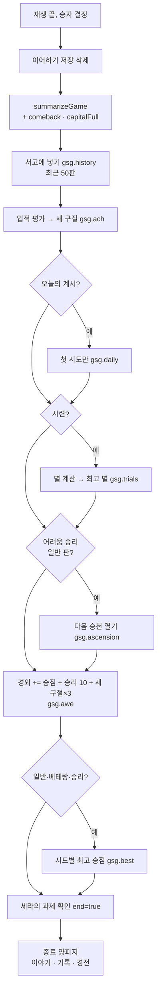

# 07. 판 밖의 진행 — 저장 키 · 기록 · 경외 · 성서 · 오늘의 계시 · 시련 · 승천

> 한 판(match) 밖에 남는 모든 것을 적는다. 상태 객체와 판 저장(이어하기)의 직렬화는 [04 §2.8](04-architecture.md), 판 안의 규칙은 [02](02-rules.md)에 있다.
> 기준: 커밋 `448f553` (2026-09-30; 처음 쓴 때는 `8b91681`), `e68a240`의 `RULESET` 5와 튜토리얼 도감 수정, `9b43bbf`(규칙은 바뀌었으나 `RULESET`은 그대로, 저장본의 새 필드 `doomUsed`·계시 `sig`)까지 반영. `78c891e`는 판 밖 진행을 바꾸지 않았다. `87a0fce`에서 `RULESET` 6(최고 기록 키 `-r6`, 저장본의 새 필드 `miracleUses`), `2825b37`의 튜토리얼 변경(판 밖 진행은 그대로), `4e2e0f7`의 `gsg.motion` 기본값(없으면 OS 동작 줄이기), `435c3cc`의 `RULESET` 7(최고 기록 키 `-r7`, `hydrateState`가 `doomUsed`·`miracleUses`를 채움), `8ba0ef8`의 **모듈 단계 해금**(`config.unlock`, 판마다 해금 안내, `gsg.unlockNote`가 숫자로)까지 반영. `bcdeb22`·`3a790f5`는 판 밖 진행을 바꾸지 않았다. 6차 `0c95856`의 `RULESET` 8(최고 기록 키 `-r8`), 최고 기록 키의 해금 단계 `-u{n}`, 종료 화면 「새 맵」의 `unlock`, `hydrateState`의 수도 내구도 자르기까지 반영. `b470e03`(석판)·`0a0a974`(대사제 성향 노동, 튜토리얼 대사, 어려움의 뜻 공개)는 판 밖 진행을 바꾸지 않았다(`RULESET`도 그대로). 7차 `df1cb16`의 `RULESET` 9(최고 기록 키 `-r9`), `16492f4`의 메인 화면 최고 기록(다음 판의 해금 단계 키로 읽음 — §13), `c12a1e9`의 `RULESET` 10(최고 기록 키 `-r10`, 저장본의 `bloodKills` 필드 삭제), `55d33dd`(저장본의 `state.ruleset`과 옛 저장본의 석판 자르기; 규칙은 바뀌었으나 `RULESET`은 그대로), `846fd60`(`RULESET` 11 — 최고 기록 키 `-r11`, 저장본의 `petitionIgnored` 필드 삭제), `88878b6`(`RULESET` 12 — `-r12`; 저장본의 `streak`은 3에서 멈추는 점으로만 쓰인다), 11차 `8250dd7`(`RULESET` 13 — `-r13`; 말투는 수치가 없고 이룬 예언은 은총이라 업적 「예언자」·「세 번 맞힌 입」의 `stats.prophecies`는 그대로 센다), 12차 `d7ad6e0`(`RULESET` 14 — `-r14`; 대성당이 무너지지 않고 단계마다 마을 하나·3/3/3, 석판의 가까운 과녁), 13차 `e174a18`(`RULESET` 15 — `-r15`; 살림뿐인 계시는 되풀이가 아니고 율법파는 전쟁·평화의 세 장만 읽음; 튜토리얼 제안 "땅을 넓혀 마을 두 곳을 세워라"), `3f33be1`(`RULESET` 16 — `-r16`; 대성당은 한 번 짓고 원정을 버티면 승리 — 업적 「종이 울리다」 설명 "대성당을 세우고 원정을 버틴다"; 번갈아 말한 전쟁·평화도 읽힘; 성지 자리가 시드마다라 같은 시드의 맵이 바뀌기도 함), `637c05a`(`RULESET` 17 — 칼·말씀 읽힘, 결집 8점; 처음 오는 사람의 첫 판 난이도 쉬움 — `loadSetup`), `24927a6`(`RULESET` 18 — 계절 효과, 석판의 같은 일 둘까지), `76c0053`(`RULESET` 19 — 선교 세 번에 넘어오는 마을, 데려오지 못하는 개종; 튜토리얼 끝 `tut.end5.5`), `238120e`(`RULESET` 20 — 마지막 한 명은 설득되지 않음, 데려온 개종만 셈; 첫 판 쉬움은 한 판을 끝내면 `setup.firstEasy`로 풂), `1c81cd4`(`RULESET` 21 — `-r21`; 저울 하나가 신의 분노·심판의 날·결집을 대신함 — 승천 3 문구, 시련 「마지막 예언자」 설명; 대성당 4·4·4; 종료 화면 「새 맵」도 첫 판 쉬움을 풂), `b1ff73e`·`db4135b`(`RULESET` 21 그대로 — 분노·심판의 날 코드 삭제(결말 `doom`이 없어졌다 — 옛 서고 항목의 `conquest`는 그대로 읽힌다), 다음 장 율법 카드 미리 보기는 판 안의 화면만 바꾼다), `e41430e`(`RULESET` 22 — `-r22`; L6 경건이 신전부터; 결말 분류 `outcomeKind`의 `capital` 갈래가 주석에 먹혀 `cathedral`로 떨어진다 — §4.1·확인 필요), `97ddf1b`(`RULESET` 23 — `-r23`; 성벽을 친 공격의 패배는 둘; `outcomeKind` 고침)까지 반영. 7차에는 `0a0a974` 기준으로 적혀 있던 줄 번호를 `git diff 0a0a974 c12a1e9`로 옮겼고, `55d33dd`에서 다시 `git diff c12a1e9 55d33dd`로 옮겼다. 또 함수 이름 바로 뒤에 붙은 인용(`이름` (`파일:줄`)·(`이름`, `파일:줄`) 꼴)은 정의를 찾아 `c12a1e9` 줄로 맞췄다. 코드가 기준이다. 인용은 `파일:줄` (`js/game/` 생략).

---

## 0. 한눈에

판이 끝나면 `main.js`의 `finishGame()`(`main.js:781-800`)이 아래를 차례로 한다. 튜토리얼은 이 경로를 타지 않는다(§2).



"판 밖" 데이터는 전부 브라우저 localStorage의 `gsg.*` 키에 있다. 서버·계정은 없다.

---

## 1. 저장소

### 1.1 접근 방식 (`meta.js:6-15`)

```js
export function get(key, fallback) {
  try { const v = localStorage.getItem(key); return v == null ? fallback : JSON.parse(v); }
  catch { return fallback; }
}
export function set(key, value) {
  try { localStorage.setItem(key, JSON.stringify(value)); } catch { /* 저장소가 가득 찼거나 막혔다 */ }
}
```

- 모든 접근이 try/catch다. 저장소가 막혀도(시크릿 창·용량 초과) 게임은 돌아가야 한다(`meta.js:2`). 읽기 실패·깨진 JSON은 기본값을 쓴다.
- `meta.get/set`을 거치는 키는 **JSON**으로 저장된다. 몇 개 키는 다른 모듈이 localStorage를 직접 쓰며 **JSON이 아닌 원문 문자열**로 저장한다(아래 표의 "형식"). 내보내기·가져오기는 원문 문자열을 그대로 옮기므로 둘이 섞여도 문제없다(§17).

### 1.2 키 전체 목록

| 키 | 형식 | 모양 (기본값) | 쓰는 곳 | 읽는 곳 | 용도 |
|---|---|---|---|---|---|
| `gsg.save.v1` | JSON | `{ v: 1, savedAt: ms, uiPhase: 'speak'\|'resolved', s: 직렬화한 상태 }` | `meta.saveGame` (`meta.js:20-23`) | `meta.loadGame` (`meta.js:24-28`) | 이어하기 — [04 §2.8](04-architecture.md) |
| `gsg.history` | JSON | 판 요약 배열, 최신이 앞, 최대 50 (`[]`) | `meta.pushHistory` (`meta.js:32-36`) | 서고, 베테랑 판정, 유적, 복귀 인사, 메인 버튼 표시 | 서고 (§3) |
| `gsg.ach` | JSON | `{ [업적 id]: 'YYYY-MM-DD' }` (`{}`) | `meta.unlockAchievements` (`meta.js:41-49`) | 성서, 종료 화면 | 업적 (§6) |
| `gsg.daily` | JSON | `{ 'YYYY-MM-DD': { winner, score: [a, b], rounds } }` (`{}`) | `meta.recordDaily` (`meta.js:68-74`) | 메인 오늘 버튼 힌트 | 오늘의 계시 첫 시도 (§10) |
| `gsg.canon` | JSON | `[{ text, doctrine }]`, 최신이 앞, 최대 3 (`[]`) | `meta.addCanon` (`meta.js:79-83`) | 새 판 설정 | 정경 (§8) |
| `gsg.onboard` | JSON | `{ step: 0~4, off: bool }` (`{ step: 0, off: false }`) | `meta.setOnboard` | `currentTask` (`main.js:1210-1214`) | 세라의 과제 (§15) |
| `gsg.best` | JSON | `{ [bestKey]: 승점 }` (`{}`) | `meta.setBest` (`meta.js:108-115`) | 메인 맵 힌트, 종료 화면 | 시드별 최고 기록 (§13) |
| `gsg.awe` | JSON | `{ awe: 정수 }` (`{ awe: 0 }`) | `meta.addAwe` (`meta.js:119-125`) | 메인 경외 막대, 은사 잠금 | 경외 (§5) |
| `gsg.seen` | JSON | `{ events: [], laws: [], leaders: [], sites: [], miracles: [], commandments: [] }` (`{}`) | `meta.markSeen` (`meta.js:128-136`) | 도감 | 도감 (§7.2) |
| `gsg.lexicon` | JSON | `{ [행동 키]: { first: 처음 문구 20자, n: 횟수 } }` (`{}`) | `meta.noteWords` (`meta.js:140-146`) | 어휘집 | 어휘집 (§7.3) |
| `gsg.trials` | JSON | `{ [시련 id]: 별 0~3 }` (`{}`) | `meta.recordTrial` (`meta.js:151-157`) | 시련 목록, 메인 힌트 | 시련 (§11) |
| `gsg.ascension` | JSON | 정수 0~5 (`0`) | `meta.openAscension` (`meta.js:167`) | 메인 승천 선택 | 승천 (§12) |
| `gsg.setup` | JSON (직접) | `{ mode: 'standard', size, difficulty, seed, ascension? }` | `saveSetup` (`main.js:89`) | `loadSetup` (`main.js:82-88`) — 크기·난이도가 유효하고 seed > 0일 때만. 저장된 설정이 없으면 `DEFAULT_CONFIG`에 무작위 시드를 주되, `637c05a`부터 서고(`meta.getHistory()`)가 비었으면 난이도를 **쉬움**으로 둔다(처음 오는 사람의 첫 판 — 한 판을 끝내면 보통이 기본; 13차 평가 B: 보통의 초심자 대본 13%, 쉬움 28%). `76c0053`에는 설정 단추를 누르거나 종료 화면 「새 맵」(`main.js:848` — 시드만 바꿔 `saveSetup`)으로 이어 가면 그때의 쉬움이 `gsg.setup`에 저장되어 남았다. `238120e`부터 첫 판 기본값에 `firstEasy: true`를 함께 두고, 저장된 설정을 읽을 때 `firstEasy`이고 서고가 비지 않았으면 난이도를 `DEFAULT_CONFIG`(보통)로 되돌리고 `firstEasy: false`로 둔다(`main.js:82-88`). 난이도 단추를 직접 누르면 `firstEasy = false`(고른 난이도를 지킨다). 되돌림은 `loadSetup`이 다시 불릴 때(새로 열기·도전 끝)와 `1c81cd4`부터 종료 화면 「새 맵」(`main.js:848` — `setup.firstEasy`이면 `difficulty = DEFAULT_CONFIG.difficulty`, `firstEasy = false`로 두고 `saveSetup`)이다. `238120e`에는 「새 맵」에 이 되돌림이 없어 같은 세션에서 바로 이어 가면 그 판도 쉬움이었다. 「같은 맵 다시」(`restart`)는 끝난 판의 `config`를 그대로 넘겨 쉬움 그대로다 | 메인 화면 새 게임 설정 |
| `gsg.blessing` | JSON | 은사 id 또는 `null` | 메인 은사 버튼 (`main.js:185`) | `blessingPick` (`main.js:200`) | 고른 은사 (§5.3) |
| `gsg.god` | JSON | `{ name: 최대 8자, sigil: SIGILS 키 }` (`{ name: '', sigil: 'light' }`) | 메인 이름 입력·상징 버튼 (`main.js:186-188`) | `godOf`, `godConfig` (`main.js:198, 209`) | 신의 이름과 상징 (§9) |
| `gsg.speed` | JSON | `"1"` \| `"2"` \| `"instant"` (`"1"`) | 설정·재생 중 속도 버튼 (`main.js:1094, 2229`) | `main.js:76` | 재생 속도 |
| `gsg.suggest` | JSON | bool (`true`) | 설정, 제안 칩 ✕ (`main.js:1095, 2268`) | `suggestOn` (`main.js:2298`) | 계시 제안 칩 |
| `gsg.a11y.cb` | JSON | bool (`false`) | 설정 (`main.js:1096`) | `applyA11y` (`main.js:1048`) | 색각 무늬 |
| `gsg.a11y.zoom` | JSON | `1` \| `1.1` \| `1.2` (`1`) | 설정 (`main.js:1097`) | `applyA11y` (`main.js:1049-1051`) | 글자 크기 |
| `gsg.unlockNote` | JSON | 정수 0~4 — 마지막으로 보인 해금 단계 (`8ba0ef8`; 그 전에는 `true` — 읽을 때 `Number(…) \|\| 0`이라 옛 `true`는 1) | `showUnlockNote` (`main.js:1184`) | `main.js:1182` | 해금 안내를 단계마다 한 번 (§16.1) |
| `gsg.lastVisit` | JSON | ms 시각 | `renderWelcome` (`main.js:927`) | 같은 곳 | 복귀 인사 (§16) |
| `gsg.lang` | **원문** | `'ko'` 등 | `setLang` (`i18n.js:47-49`) | `i18n.js:12` | 언어 |
| `gsg.motion` | **원문** | `'reduced'` \| `'full'` (없으면 OS의 `prefers-reduced-motion`을 따른다 — `4e2e0f7`; 그 전에는 없으면 화려하게) | `fx.setReduced` (`fx.js:18`) | `fx.js:9` (`loadReduced`) | 연출 줄이기 |
| `gsg.sound` | **원문** | `'on'` \| `'off'` (없으면 켜짐) | `setSound` (`sound.js:26`) | `sound.js:10` | 효과음 |
| `gsg.music` | **원문** | `'on'` \| `'off'` (없으면 켜짐) | `setMusic` (`sound.js:49`) | `sound.js:11` | 배경음악 |
| `gsg.vol.music`, `gsg.vol.sfx` | **원문** | `'0'`~`'1'` 숫자 문자열 (`'1'`) | `setVolume` (`sound.js:32`) | `sound.js:28` | 볼륨 |

해시 소금으로만 쓰는 문자열 `gsg:YYYY-MM-DD`, `gsg:week:YYYY-Www`는 저장 키가 아니다(§10, §11).

---

## 2. 판이 끝날 때

### 2.1 일반 판 (`finishGame`, `main.js:781-800`)

1. 튜토리얼이 아니면 `meta.clearSave()`.
2. `summary = summarizeGame(state, { comeback, capitalFull })` — `comeback`: 이겼고 `history` 어느 장에서든 `es − ps ≥ 6`, `capitalFull`: 우리 수도 내구도가 3 그대로.
3. `had = getAchievements()` (이번 판 전 상태), `pushHistory(summary)` — **이 순간의 요약이 JSON으로 굳는다**. 뒤에서 `summary`에 붙이는 `stars`·`newStars`·`awe`·`newBest`는 서고에 저장되지 않고 종료 화면에서만 쓴다.
4. `fresh = unlockAchievements(evaluateAchievements(summary))`.
5. 오늘의 계시면 `recordDaily(daily, { winner, score, rounds })`.
6. 시련이면 `summary.stars = trialStars(summary)`, `summary.newStars = recordTrial(trial, stars)`.
7. 이겼고 어려움이며 시련·오늘·도전이 아니면 `openAscension(ascension + 1)`.
8. `aweGain = score[0] + (승리 ? 10 : 0) + fresh.length × 3` → `summary.awe = addAwe(aweGain, AWE_LEVELS)`.
9. `standard = !튜토리얼 && !오늘 && !도전 && !시련 && veteran` → 이겼으면 `summary.newBest = setBest(config, score[0])`.
10. `checkOnboard(true)` → `showEnd(summary, fresh, had)`.

기적으로 판이 끝나도(`endByMiracle`, `main.js:1698-1702`) 같은 `finishGame`을 탄다.

### 2.2 튜토리얼

튜토리얼은 `finishGame`을 부르지 않는다. 판이 끝나면 `tutorial.on('end')` → 세라의 마지막 대사 → `endTutorial({ skipped })`(`main.js:341-346`): 건너뛰지 않았으면 업적 `tutorial`만 연다. 서고·경외·과제는 남지 않는다. 따라서 튜토리얼만 마친 사람은 아직 베테랑이 아니다(§16).

판 안에서는 `2825b37`부터 튜토리얼의 선이 늘 우리이고(4장 선교 수업이 막히지 않게), 청원 외면을 세지 않으며(설명 없는 신앙 −1 없음 — `846fd60`부터는 어느 판에도 외면 벌이 없다), 3장 확인 단계에 ⇄ 칩 옮기기와 곳의 말을 가르치는 대사가 있다([02 §16.1](02-rules.md#161-튜토리얼), [06 §9](06-ui-ux.md#9-튜토리얼-흐름-tutorialjs)). 어느 것도 판 밖 기록을 바꾸지 않는다 — 업적 `tutorial`은 여전히 `endTutorial`이 연다.

---

## 3. 판 요약 — 서고 항목 (`chronicle.js:92-105`)

| 필드 | 타입 | 뜻 |
|---|---|---|
| `date` | ISO 문자열 | `new Date().toISOString()` |
| `seed` | int | |
| `size` | int | `state.rows` |
| `difficulty` | string | |
| `leader` | string \| null | 지도자 **표시 이름**(언어팩 문장) |
| `daily` | `'YYYY-MM-DD'` \| null | |
| `winner` | `'player' \| 'enemy' \| 'draw'` | |
| `kind` | string | `outcomeKind` (§4.1) |
| `reason` | string | `winReason` (표시 문장). 수도 점령은 `448f553`부터 승자 쪽에서 읽는다: 우리가 이기면 "적 수도 점령", 율법파가 이기면 "우리 수도 함락" (`eng.win.capital`이 `{who}`를 받는 함수) |
| `score` | `[우리, 율법파]` | 마지막 승점 |
| `rounds` | int | 끝난 장 |
| `doctrine` | `{ peace, war, abundance, wisdom }` | 우리 교리 |
| `top` | string | `topDoctrine` (§4.2) |
| `epithet` | string | 칭호 (§4.3) |
| `revelations` | `{ round, text, doctrine }[]` | 모든 계시 |
| `stats` | object | `state.stats` 복사: `converted`, `captured`, `miracles`, `prophecies`, `petitions` + 있으면 `turned`, `starved`, `vows`, `sacred` |
| `names` | string[] | 붙인 이름들 |
| `god` | string \| null | 신의 이름 |
| `saints` | int | 성인 수 |
| `commandments` | int | 새긴 계명 수 |
| `ruleset` | int | `RULESET` (지금 23 — `e68a240`에서 4 → 5, `87a0fce`에서 5 → 6, `435c3cc`에서 6 → 7, `0c95856`에서 7 → 8, `df1cb16`에서 8 → 9, `c12a1e9`에서 9 → 10, `846fd60`에서 10 → 11, `88878b6`에서 11 → 12, `8250dd7`에서 12 → 13, `d7ad6e0`에서 13 → 14, `e174a18`에서 14 → 15, `3f33be1`에서 15 → 16, `637c05a`에서 16 → 17, `24927a6`에서 17 → 18, `76c0053`에서 18 → 19, `238120e`에서 19 → 20, `1c81cd4`에서 20 → 21, `e41430e`에서 21 → 22, `97ddf1b`에서 22 → 23; `55d33dd`는 그대로) |
| `trial` | string \| null | |
| `ascension` | int | |
| `comeback`, `capitalFull` | bool | `finishGame`이 더한 값 |

`tutorial` 필드는 없다(업적 `tutorial`의 `check`는 요약으로는 참이 될 수 없다 — §6).

---

## 4. 에필로그와 회고 (`chronicle.js`)

모두 상태를 읽기만 하는 순수 함수다.

### 4.1 결과 유형 `outcomeKind` (`chronicle.js:10-22`)

`winner === 'draw'`면 `draw`. 아니면 `winKind`로:

| `winKind` | 우리가 이김 | 우리가 짐 |
|---|---|---|
| `doom`, `capital` | `conquest` (`e41430e`~`97ddf1b` 직전에는 `cathedral` — 아래) | `conquered` (그 사이에는 `lost`) |
| `cathedral` | `cathedral` | `lost` |
| `faith`, `convertAll` | `faith` | `lost` |
| `extinct` | — | `extinct` |
| `edict` | (`score` — 율법 석판 승리는 늘 율법파라 실제로는 없다) | `edict` |
| 그 밖 (`score`, `tutorial`) | `score` | `outscored` |

**`e41430e`의 회귀(`97ddf1b`에서 고침)**: `chronicle.js:14`에 옛 기록용 주석을 달면서 `case 'doom': case 'capital': // 'doom'은 옛 기록(심판의 날) return mine ? 'conquest' : 'conquered';`가 한 줄이 되어 `return`이 주석 안으로 들어갔다. 그래서 `capital`(수도 점령·함락)은 다음 `case 'cathedral'`로 떨어져 우리 점령은 `cathedral`, 우리 수도 함락은 `lost`가 된다 — 에필로그(`story.win.cathedral.*`·`story.lose.lost`), 칭호(`story.title.cathedral`), 서고 항목의 `kind`, 업적 「무너진 탑」(`kind === 'conquest'`, §6 — 더는 열리지 않는다)에 닿는다. `97ddf1b`에서 주석을 앞줄(`chronicle.js:14`)로 옮겨 `case 'doom': case 'capital': return …`(`15`)이 다시 `conquest`/`conquered`를 돌려주고, `tools/tests/edge.mjs` 10번 검사가 `capital`·`cathedral`·`doom`을 확인한다. 그 사이에 끝낸 판의 서고 항목은 `kind`가 `cathedral`·`lost`로 남는다 — 서고에는 `winKind`가 없어 되돌릴 수 없다([KNOWN-ISSUES C12](../godot/KNOWN-ISSUES.md)).

**남은 자**(`448f553`, [02 §15.2](02-rules.md#152-checkvictoryfinal--true)): 튜토리얼이 아니면 한 진영의 신도가 모두 쓰러져도 수도가 서 있는 한 수도가 흔들리고(내구도 −1) 한 명이 돌아온다. 그래서 서고에 남는 판(튜토리얼 제외)에서는 `extinct`·`lost`(전원 개종 `convertAll`)·`draw`(`bothExtinct`)가 더는 나오지 않고, 그 자리를 수도 점령(`conquest`/`conquered`)이 대신한다. 표의 줄과 에필로그 본문은 튜토리얼과 옛 기록을 위해 남아 있다.

율법 석판 패배는 `afab303` 전에는 `outscored`(승점에 밀림)로 분류되어 에필로그가 곳간 이야기를 했다. 이제 결말 종류 `edict`와 본문 `story.lose.edict`가 따로 있다. 판 요약의 `kind`(§3)와 진 판 칭호의 해시(`hashPick(forgottenEpithets, seed, kind)`)도 이 값을 쓰므로, 같은 시드의 석판 패배 칭호가 바뀌었을 수 있다.

### 4.2 가장 깊은 교리 `topDoctrine` (`chronicle.js:24-27`)

`DOCTRINES.reduce((best, k) => d[k] > d[best] ? k : best, 'wisdom')` — 시작값이 `wisdom`이고 **엄격히 클 때만** 바뀐다. 동점이면 `wisdom`이 이기고, 그다음은 `peace → war → abundance` 순으로 먼저 나온 쪽. 모두 0이면 `wisdom`.

### 4.3 에필로그 `epilogue(state)` (`chronicle.js:76-89`)

```text
kind = outcomeKind(state); top = topDoctrine(state); won = winner === 'player'
title   = won ? t(kind ∈ {conquest, faith, cathedral, score} ? `story.title.${kind}` : 'story.title.win')
              : t('story.title.lost')
body    = won ? WIN_TEXT[kind][top] ?? WIN_TEXT.score[top]
              : LOSE_TEXT[kind] ?? LOSE_TEXT.lost
epithet = won ? t(`story.epithet.${top}`)
              : hashPick(t('story.forgottenEpithets'), seed, kind)
quote   = topRevelations(state, 1)[0]?.text ? t('story.quote', { text, round }) : null
```

| 키 | 한국어 |
|---|---|
| `story.title.conquest` · `faith` · `cathedral` · `score` · `win` · `lost` | 탑이 무너진 날 · 모두가 돌아온 날 · 종이 울린 날 · 마지막 계절 · 승리 · 말씀이 저물다 |
| `story.epithet.peace` · `war` · `abundance` · `wisdom` | 말씀으로 이긴 자 · 칼을 든 신 · 곳간을 채운 신 · 안개를 걷은 신 |
| `story.forgottenEpithets` (진 판, 해시 선택) | `['잊힌 신', '돌판 아래 잠든 신', '반쯤 기억된 신']` — 순서·개수를 바꾸면 같은 시드의 결과가 달라진다(`i18n/ko/story.js:2`) |
| `story.win.{conquest,faith,cathedral,score}.{peace,war,abundance,wisdom}` | 16개 본문 (`i18n/ko/story.js:12-27`) |
| `story.lose.{conquered,lost,outscored,edict,extinct,draw}` | 6개 본문 (`i18n/ko/story.js:28-33`). `edict`: "율법 석판의 마지막 줄이 새겨지자, 말씀은 돌 속에 갇혔다…" |
| `story.quote` | `“{text}” — 제 {round} 장` |

### 4.4 회고 도구

| 함수 | 줄 | 계산 |
|---|---|---|
| `topRevelations(state, n=3)` | `chronicle.js:30-36` | `history`의 장마다 `gain = (ps − 이전 ps) − (es − 이전 es)`. 첫 장의 "이전"은 자기 자신이라 0. 계시(`text`)가 있는 장만 남겨 `gain` 내림차순(안정 정렬) 앞 n개 `{ round, text, gain, verdict }` |
| `decisiveScene(state)` | `chronicle.js:39-50` | 로그 중 `side`가 player·enemy인 줄에 가중치: `fx.capital` 5, `fx.capture`·`fx.convert` 3, 이긴 `preach` 2, `fx.kind ∈ {lightning, rain, bounty, bless}` 2. 가중치가 같으면 **나중 줄**(`>=`). `{ w, round, text, side, revelation: 그 장의 계시 }` 또는 null |
| `diceLuck(state)` | `chronicle.js:53-70` | 우리(`side === 'player'`) 주사위 줄마다 기대 승률 `P_WIN[clamp(attackerBonus − defenderBonus, −8, 8)]`(두 d6에서 `a + d > b`인 비율)을 더하고 실제 승리 수와의 차 `{ n, luck = 실제 − 기대 }` |
| `closestAchievement(summary, have)` | `chronicle.js:140-148` | 아직 없는 업적 중 `progress`가 있는 것의 `min(0.99, progress)`가 가장 큰 것 (0이면 제외) |
| `scoreGraph(history)` | `main.js:890-901` | 장별 우리·율법파 승점 꺾은선 SVG, 판결이 `full`인 장에 점 |

### 4.5 종료 양피지 (`showEnd`, `main.js:802-865`)

| 탭 | 내용 |
|---|---|
| 이야기 | 제목·본문·명대사, "기억된 이름"(신 이름 + 칭호), 새 구절, 경외 증가(레벨이 올랐으면 새 칭호와 새 은사), 시련 별(새 기록 여부), 새 최고 기록 |
| 기록 | 승점 곡선, 결정적 장면(그 장의 계시와 결과 문장), 승점을 가장 크게 움직인 계시 TOP3(+gain), 주사위 운(`±x.x`), 가장 가까웠던 업적(%) |
| 경전 | 정경 안내(베테랑이 아니면 "두 번째 판부터"), 전설이 된 땅, 쓰러진 이름, 모든 계시(베테랑이면 줄마다 `봉헌` 버튼) |

버튼: **시편 복사**(§14.2), **다시 하기**(`restart` = 같은 `config`), **새 맵**(§16.1), **메인으로**, **보드 보기**(닫기). 부제에는 도전 성공·실패(§14)를 붙인다.

---

## 5. 경외 · 칭호 · 은사

### 5.1 경외 (awe)

- 판(튜토리얼 제외)이 끝날 때마다 `경외 += 우리 승점 + (이겼으면 10) + 새로 연 업적 수 × 3` (`main.js:787`). 진 판도, 오늘의 계시·도전·시련도 쌓인다. 음수는 더하지 않는다(`addAwe`의 `Math.max(0, n)`).
- `addAwe(n, levels)`(`meta.js:119-125`) 반환: `{ awe, gained: n, levelBefore, level }`. 레벨 = `AWE_LEVELS.filter(x => awe >= x).length`.

### 5.2 레벨과 칭호 (`data.js:230, 244`)

| 레벨 | 필요 경외 (`AWE_LEVELS`) | 칭호 (`AWE_TITLES[레벨]`) | 열리는 은사 |
|---|---|---|---|
| 0 | 0 | 이름 없는 신 | — |
| 1 | 20 | 속삭이는 신 | 설교자 |
| 2 | 50 | 불리는 신 | 석공 |
| 3 | 100 | 섬김받는 신 | 곳간 |
| 4 | 160 | 두려운 신 | 눈 밝은 자 |
| 5 | 240 | 영원한 신 | (칭호만) |

메인 화면 경외 막대(`#msAwe`, 경외가 0이면 숨김): `칭호 · 경외 N · 다음 은사/칭호까지 M`과 현재 레벨 구간의 진행률(`main.js:222-225`).

### 5.3 은사 (blessing) (`data.js:231-236`)

| id | 레벨 | 이름 | 효과 | 코드 |
|---|---|---|---|---|
| `preacher` | 1 | 설교자의 은사 | 처음 개종에 성공할 때까지(`stats.converted === 0`) 선교 주사위 +1 (교리·계명과 합쳐 최대 +2 한도 안 — `846fd60` 전에는 설교자 성인도 이 한도 안에 들었다) | `engine.js:279` |
| `mason` | 2 | 석공의 은사 | 신전 1→2단계 비용 돌 −1 | `engine.js:327` |
| `granary` | 3 | 곳간의 은사 | 시작 식량 +2 | `engine.js:164` |
| `seer` | 4 | 눈 밝은 자의 은사 | 1장까지 수도 둘레 시야 반경 3 (평소 2) | `engine.js:192` |

- 고르기: 메인 화면 "은사" 칸(경외 레벨 1 이상일 때 보임)에서 `없음` 또는 열린 은사 하나 → `gsg.blessing`. `blessingPick()`은 저장된 은사가 현재 레벨로 열려 있을 때만 돌려준다(`main.js:200`).
- 적용: **일반 새 게임과 종료 화면 "새 맵"에만** 넘긴다. 오늘의 계시·도전·시련·튜토리얼에는 넘기지 않는다. 승천 5 이상이면 null — 일반 새 게임(`main.js:282`)과 새 맵(`main.js:841`, `afab303`부터) 모두.

---

## 6. 성서 — 업적 (`chronicle.js:108-138`)

`evaluateAchievements(summary)`는 각 `check(summary)`를 try/catch로 돌려 참인 id 목록을 돌려준다. 이미 가진 것을 뺀 새 id에 오늘 날짜(`dayKey`)를 붙여 `gsg.ach`에 넣는다(`meta.js:41-49`). 게임 안 보상은 없다(경외 +3만). 모두 25개.

| id | 이름 | 조건 (`summary` 기준) | 진행률 |
|---|---|---|---|
| `first_win` | 첫 번째 기적 | 이김 | |
| `faith_win` | 모두가 돌아오다 | 이김 ∧ `kind === 'faith'` (신앙 승리·전원 개종) | |
| `conquest` | 무너진 탑 | 이김 ∧ `kind === 'conquest'` (수도 점령 — `b1ff73e` 전에는 심판의 날도; `chronicle.js:14`의 `outcomeKind`에는 옛 기록용 `'doom'` 갈래가 남았다. `e41430e`~`97ddf1b` 직전에는 그 줄의 주석이 `return`을 삼켜 수도 점령이 `cathedral`로 분류되어 이 업적이 열리지 않았다 — §4.1) | |
| `cathedral` | 종이 울리다 (설명 `story.ach.cathedral.desc` — `3f33be1`부터 "대성당을 세우고 원정을 버틴다", 그 전 "대성당을 완공한다") | 이김 ∧ `kind === 'cathedral'` | |
| `pacifist` | 피 없는 승리 | 이김 ∧ `doctrine.war === 0` | |
| `no_miracle` | 말씀만으로 | 이김 ∧ `stats.miracles === 0` | |
| `hard` | 굽지 않는 율법을 넘어 | 이김 ∧ `difficulty === 'hard'` (시련 `last` 포함) | |
| `big` | 넓은 세상 | 이김 ∧ `size === 7` | |
| `prophet` | 예언자 | `stats.prophecies ≥ 1` | `prophecies` |
| `seer` | 세 번 맞힌 입 | `stats.prophecies ≥ 3` | `prophecies / 3` |
| `namer` | 이름을 주는 자 | `names.length ≥ 3` | `/3` |
| `shepherd` | 목자 | `stats.petitions ≥ 6` | `/6` |
| `turned` | 물든 마을 | `stats.turned ≥ 1` | |
| `ultimate` | 궁극의 계시 | 어떤 교리든 6 | 최고 교리 / 6 |
| `terse` | 짧은 말씀 | 이김 ∧ 계시 6개 이상 ∧ 모든 계시가 공백 빼고 10자 이하 | |
| `comeback` | 되찾은 계절 | 이김 ∧ `comeback` | |
| `fortress` | 흔들림 없는 신전 | 이김 ∧ `capitalFull` | |
| `daily` | 오늘의 계시 | `daily`가 있음 (승패 무관) | |
| `all_doctrines` | 네 갈래 길 | 네 교리 모두 ≥ 2 | 2 이상인 교리 수 / 4 |
| `tutorial` | 사관의 제자 | 요약에 `tutorial`이 없어 여기선 참이 안 됨 → `endTutorial`이 직접 연다 | |
| `trial` | 시련을 넘은 자 | 이김 ∧ `trial` | |
| `ascend` | 하늘 계단 | 이김 ∧ `ascension ≥ 1` | |
| `sacred` | 숨은 말 | `stats.sacred` (오늘의 계시에서만 가능) | |
| `saint` | 성인의 시대 | `saints ≥ 1` | `846fd60`부터 성인은 주사위 보정 없이 이름·기록·이 업적으로만 남는다 |
| `lawgiver` | 돌에 새긴 말 | 이김 ∧ `commandments ≥ 1` | |

화면: 메인 `성서 · a/25` 칩(서고가 비었고 업적도 없으면 숨김), 목록은 가진 것에 날짜, 없는 것은 흐리게(`showBible`, `main.js:1040-1044`). 종료 화면에 새 구절 이름과 가장 가까웠던 업적. (티켓 #023은 20개로 적었지만 코드는 25개다.)

---

## 7. 서고 · 도감 · 어휘집

### 7.1 서고 (`showLibrary`, `main.js:989-1013`)

메인 `서고 · N판` 칩(서고가 비면 숨김)으로 여는 목록 모달.

- **머리 통계**: 판 수, 승리 수, 승률(%), 난이도별 `승/판`, 평균 장 수(소수 1자리), 최고 승점(이긴 판 중), 승리 유형 막대(`conquest`·`faith`·`cathedral`·`score`).
- **도감 · 어휘집** 접이식(§7.2, §7.3).
- **판별 행**(`<details>`): 날짜(MM/DD), 승·패·무, `크기 · 난이도 (· 오늘의 계시) · 장 · 승점`, 칭호 → 펼치면 계시 전문, 시드·지도자·사유.

### 7.2 도감 (`gsg.seen`)

`markSeen(kind, id)`는 처음 본 id만 배열 끝에 더한다(`meta.js:128-136`). 튜토리얼에서는 기록하지 않는다 — 부르는 쪽이 `!state.tutorial`로 거른다. 카드·번개로 쓴 기적(`main.js:1642`, `1671`)도 `e68a240`부터 `r.ok && !state.tutorial`일 때만 적는다(그 전에는 거르지 않아 튜토리얼에서 쓴 기적이 도감에 남았다).

| 분류 | 전체 목록 (표시 순) | 기록 시점 |
|---|---|---|
| `events` (계절) | `EVENTS` 6 + `DILEMMAS` 6 + `'mira'` = 13 | 장 시작(`main.js:481`), 이어하기(`305`), 지혜 궁극으로 바꾼 계절(`1761`) |
| `laws` (율법) | `LAW_CARDS` 10 | 수락 뒤 이번 장 율법 카드(`745`) |
| `leaders` (지도자) | `ENEMY_LEADERS` 4 | 장 시작(`481`) |
| `sites` (발견) | `SITES` 5 (`nomads`·`altar`·`spring`·`bones`·`legacy`) | 수락 뒤 이미 찾은 발견지 전부(`747`) |
| `miracles` (기적) | `MIRACLES` 8 (심판의 날 제외) | 수락 때 계시로 말한 기적(`748`), 카드로 쓴 기적이 성공했을 때(`useMiracle` `1648`), 번개 목표를 골라 성공했을 때(`onTileClick` `1666`). 카드 기적 기록은 `afab303`에서 더했다 |
| `commandments` (계명) | `COMMANDMENTS` 4 | 수락 뒤 새겨진 계명 전부(`746`) |

못 본 것은 `?`로 표시하고 툴팁 "아직 보지 못했다"(`main.js:1012-1015`).

### 7.3 어휘집 (`gsg.lexicon`)

수락할 때 계시가 있으면(`main.js:757-760`) 명령한 행동마다(자동 노동 제외) 키를 만들어 `noteWords(key, text)`: 처음이면 `{ first: text.slice(0, 20), n: 0 }`, 매번 `n += 1`. 말투가 명령이 아니면 `tone:<말투>`도 기록한다(`8250dd7`부터 말투는 수치가 없지만 어휘집 항목은 그대로다).

키 15개(`main.js:1016-1021`): `gather:food`, `gather:wood`, `gather:stone`, `gather:faith`, `pray`, `explore`, `preach`, `attack`, `build:village`, `build:wall`, `build:temple`, `build:cathedral`, `tone:blessing`, `tone:curse`, `tone:metaphor`. 화면: `이름 — “처음 문구” ×n` 또는 `?`.

판 안의 **신학 노트**(`state.lessons`, 최대 3)는 이것과 별개로 판마다 사라진다.

---

## 8. 정경 봉헌 (canon)

- **봉헌**: 종료 양피지 "경전" 탭에서, 베테랑 판(튜토리얼 아님)이면 계시 줄마다 `봉헌` 버튼 → `addCanon({ text, doctrine: r.doctrine ?? 'wisdom' })`(`main.js:854-856`). 같은 문장은 중복 제거 후 맨 앞에 넣고 3개까지(`meta.js:79-83`). 버튼 글은 `봉헌`/`봉헌됨`.
- **적용**: 다음 **일반 새 게임**(베테랑)과 **새 맵**이 `getCanon()[0]`(가장 최근 봉헌)을 `config.canon`으로 넘긴다. 쓴다고 지워지지 않으므로 새로 봉헌할 때까지 같은 구절이 계속 적용된다.
- **효과**: 엔진이 시작 교리 `canon.doctrine`을 +1(`engine.js:160`) — 오늘의 계시·어려움·튜토리얼은 제외. LLM 프롬프트에는 어려움에서도 "이 부족의 경전" 줄로 원문이 들어간다(`interpreter.js:44`).
- `removeCanon(text)`(`meta.js:84`)은 있지만 화면에서 부르는 곳이 없다.

---

## 9. 신의 이름과 상징 · 전생의 유적

### 9.1 신 (`gsg.god`)

메인 화면에서 이름(최대 8자)과 상징 6종을 고른다. 상징 → 아이콘: `light`→`i-faith`, `sword`→`d-war`, `dove`→`d-peace`, `grain`→`i-food`, `eye`→`e-prophet`, `storm`→`m-lightning`(`data.js:260`). `godConfig()`는 이름이 비었고 상징이 기본(`light`)이면 null(`main.js:209`).

쓰이는 곳: 인장 버튼 아이콘, LLM 프롬프트(`god`), 종료 화면 "기억된 이름", 시편, 판 요약 `god`, 다음 판 유적의 `god`. 일반 새 게임·새 맵·오늘의 계시·시련에 넘기고 **도전·튜토리얼에는 넘기지 않는다**.

### 9.2 전생의 유적 (legacy)

- `legacyFor(seed)`(`main.js:202-208`): 서고에서 계시가 있는 판 중 **최근 3판**을 고르고 `past[seed % past.length]` 하나 → `{ quote: 그 판 계시 중 가운데(⌊len/2⌋) 것, epithet, god, doctrine: top }`. 서고가 비면 null.
- 일반 새 게임(베테랑)과 새 맵에만 넘긴다. 엔진이 `placeLegacy`로 빈 칸 하나에 `site = { id: 'legacy' }`(`engine.js:103-105`), 발견하면 그 교리가 3 미만이면 +1, 아니면 신앙 +2와 "여기 {칭호} {신}이 “{말}”이라 말씀하셨다" 로그(`engine.js:855-861`).

---

## 10. 오늘의 계시 (daily)

### 10.1 설정 유도 (`meta.js:52-65`)

```js
export function dayKey(date = new Date()) {
  const p = (n) => String(n).padStart(2, '0');
  return `${date.getFullYear()}-${p(date.getMonth() + 1)}-${p(date.getDate())}`;   // 로컬 날짜
}
export function dailyConfig(date = new Date()) {
  const day = dayKey(date);
  return { mode: 'standard', size: 5, difficulty: 'normal', seed: 1 + (hash(`gsg:${day}`) % 999998), daily: day };
}
```

- `hash`는 FNV-1a 32비트(부호 없는 값) — [04 §3.4](04-architecture.md). 같은 날짜면 누구나 같은 맵·덱. 예: `2026-09-27` → 시드 `887357`.
- 날짜는 **기기의 로컬 시각**이다. 시간대가 다르면 같은 순간에 다른 "오늘"일 수 있다.
- 시작(`main.js:273`): `beginGame({ ...dailyConfig(), veteran: true, god: godConfig() })`. 정경·유적·은사·승천은 넘기지 않는다. 엔진도 오늘의 계시에는 정경 수치를 적용하지 않는다.
- 지도자는 시드 해시로(부제에 표시), 모듈은 모두 켜진다(`veteran: true`이고 `unlock`이 없다 → 해금 4, §16.1).

### 10.2 숨은 말

오늘의 계시에만 `state.sacred = hashPick(SACRED_WORDS, 'sacred', day)`(`engine.js:90`). 제단에 "오늘의 숨은 말 — 단서 “…” (n글자)"가 뜬다(`main.js:1989`). 수락 때 계시 원문에 그 낱말이 **들어 있으면**(부분 문자열) 판당 한 번 `stats.sacred = 1`과 로그(`engine.js:1074-1079`) → 업적 `sacred`.

| # | 낱말 | 단서 |
|---|---|---|
| 0 | 무지개 | 비 뒤에 걸리는 일곱 빛의 다리 |
| 1 | 등불 | 어둠 속에서 길을 비추는 작은 불 |
| 2 | 씨앗 | 땅에 묻혀야 비로소 사는 것 |
| 3 | 샘물 | 땅이 몰래 흘리는 맑은 눈물 |
| 4 | 새벽 | 밤이 끝나는 자리 |
| 5 | 소금 | 바다가 남기고 간 흰 것 |
| 6 | 날개 | 새가 하늘을 붙잡는 손 |

### 10.3 기록과 화면

- 메인 `오늘의 계시` 버튼은 서고에 한 판 이상 있을 때 보인다(`main.js:908`).
- 힌트: 오늘 기록이 있으면 `오늘 승리/패배 · 이번 달 N일`, 없으면 `M월 D일 · 이번 달 N일`(`main.js:912-914`). "이번 달 N일" = `gsg.daily` 키 중 이번 달(`YYYY-MM`)로 시작하는 날 수(`meta.js:75`).
- `recordDaily`는 **그날 첫 시도만** 저장한다(`meta.js:68-74`). 종료 화면 "다시 하기"로 같은 오늘의 계시를 다시 둘 수 있지만 기록은 바뀌지 않는다(서고·경외·업적은 쌓인다).
- 부제: `오늘의 계시 · YYYY-MM-DD · 지도자`.

---

## 11. 시련과 이번 주의 시련

### 11.1 시련 다섯 (`data.js:243-254`)

모두 고정 시드·`veteran: true`·신 이름 포함으로 시작하고(`main.js:953-964`), 시작 2.6초 뒤 지도자 말풍선으로 도입 글. 정경·유적·은사·승천은 없다. "비틀린 규칙"은 `config.trial`로 엔진이 강제한다.

| id | 이름 | 맵 | 난이도 | 시드 | 장 | 비틀린 규칙 (코드) |
|---|---|---|---|---|---|---|
| `storm` | 폭풍의 주 | 5×5 | 보통 | 11101 | 12 | 손패 번개·풍요·불기둥 고정(`engine.js:140`), 번개 비용 −1(`743`), 드래프트에 단비 없음(`604`) |
| `earth` | 대지모 | 6×6 | 보통 | 22202 | 12 | 풍요 1로 시작(`157`), 우리 공격 불가(`390`), 계명 `noSword` 새길 수 없음(`1032`), 소명 `sword` 제외(`120`), 인구 증가 비용 1(`1279`) |
| `sword` | 칼의 해 | 5×5 | 보통 | 33303 | 12 | 지도자 `iron` 고정(`137`), 율법 풀에 `L5`(성전) 두 장 추가(`181`) |
| `cloister` | 침묵의 수도원 | 5×5 | 보통 | 44404 | 12 | 계시 최대 20자(`main.js:1841`) |
| `last` | 마지막 예언자 | 5×5 | 어려움 | 55505 | 8 | 8장(`engine.js:74`), 율법파 신도 +2·식량 +8(`158`). `1c81cd4` 전에는 신의 분노가 1장부터 — 설명 `data.trial.last.desc`는 그때 "여덟 장, 어려운 율법파가 둘 더 많은 채로 시작한다."로 고쳤고, 남아 있던 코드 갈래(`wrathRound`)는 `b1ff73e`에서 지웠다 |

### 11.2 별 (`trialStars`, `main.js:972-976`)

- 지면 0. 이기면 `격차 = score[0] − score[1]`:
  - `격차 ≥ 20` **또는** `rounds < maxRounds`(마지막 장 전에 끝남) → 3
  - `격차 ≥ 10` → 2
  - 그 밖 → 1
- `recordTrial(id, stars)`는 기존보다 클 때만 바꾸고 새 기록이면 true(`meta.js:151-157`).

### 11.3 이번 주의 시련

```js
export function isoWeek(date = new Date()) {
  const d = new Date(Date.UTC(date.getFullYear(), date.getMonth(), date.getDate()));
  const day = d.getUTCDay() || 7;
  d.setUTCDate(d.getUTCDate() + 4 - day);
  const y = new Date(Date.UTC(d.getUTCFullYear(), 0, 1));
  return `${d.getUTCFullYear()}-W${Math.ceil(((d - y) / 86400000 + 1) / 7)}`;
}
export const weeklyIndex = (n, date = new Date()) => hash(`gsg:week:${isoWeek(date)}`) % n;
```

(`meta.js:158-165`) — 로컬 날짜로 ISO 8601 주(월요일 시작, 그해 첫 목요일이 든 주가 1주)를 구한다. 주 번호는 **0을 채우지 않는다**(`2026-W9`). 인덱스는 `Object.keys(TRIALS)` 순서(`storm, earth, sword, cloister, last`)에 대한 것이다. 예: 2026-09-27 → `2026-W39` → 인덱스 0 = `storm`.

이번 주의 시련은 **표시만** 한다: 목록에서 강조와 "이번 주의 시련" 딱지, 메인 힌트 `별 got/15 · 이번 주 「이름」`. 별도 보상·기록은 없다.

### 11.4 화면

메인 `시련` 버튼(서고 한 판 이상, `main.js:909`) → 목록 모달(`showTrials`, `main.js:940-959`): 이름(이번 주 딱지)·설명·`★☆☆ · 크기 · 장 수`, 아래에 별 규칙 안내. 부제: `시련 「이름」 · 크기 · 장`.

---

## 12. 승천 (ascension)

### 12.1 단계 (누적, `data.ascension`)

| 단계 | 안내 문구 | 실제 효과 | 코드 |
|---|---|---|---|
| 1 | 율법파 시작 신도 +1, 식량 +4 | 율법파 신도 +1, 식량 +4 | `engine.js:156` |
| 2 | 율법 석판 한계 −2 | `edictMax` 10 → 8 (`c12a1e9` 전에는 12 → 10) | `engine.js:1024` |
| 3 | 우리 쪽 저울(행동 +1)이 기우는 격차 6 → 8 (`1c81cd4` — 그 전 "신의 분노가 차는 격차 6 → 8") | 저울이 우리 쪽으로 기우는 승점 격차 8, 율법파 쪽은 6 그대로(그 전에는 분노가 오르는 격차) | `engine.js:1012` |
| 4 | 3막에 율법파 공격·선교 주사위 +1 | 3막에서 율법파 공격 `atk +1`, 선교 `preachBonus +1` (`enemyZeal`). `afab303` 전에는 "3막 율법파 행동 +1"이었다 | `engine.js:266` |
| 5 | 은사 없이 시작 | 일반 새 게임과 새 맵에서 은사를 넘기지 않음 | `main.js:282`, `845` |

### 12.2 열기와 고르기

- **열기**: 이겼고 어려움이며 시련·오늘의 계시·도전이 아니면 `openAscension(현재 승천 + 1)`(`main.js:786`). 저장값보다 클 때만 올리고 최대 5(`meta.js:167`). 베테랑 여부는 보지 않는다.
- **고르기**: 메인 화면에서 난이도를 어려움으로 두고 열린 단계가 1 이상이면 `기본 · 승천 1 … 승천 k` 버튼이 뜬다(`main.js:226-231`). 어려움이 아니면 `setup.ascension`을 0으로 되돌린다. 난이도 힌트가 `승천 n — 제약1 · 제약2 …`(누적 목록)로 바뀐다.
- **넘기기**: 일반 새 게임은 `ascension: difficulty === 'hard' ? setup.ascension : 0`(`main.js:282`). 종료 화면 "새 맵"은 `asc = difficulty === 'hard' ? min(setup.ascension, ascensionOpen()) : 0`을 넘기고 `asc >= 5`면 은사를 넣지 않는다(`main.js:841`). 기록 키(§13)와 판 요약에 남고 업적 `ascend`의 조건이 된다.

---

## 13. 시드별 최고 기록 (`meta.js:105-115`)

```js
export const bestKey = (c) => `${c.size}-${c.difficulty}-${c.seed}${c.ascension ? `-a${c.ascension}` : ''}${c.unlock != null && c.unlock < 4 ? `-u${c.unlock}` : ''}-r${RULESET}`;
```

- 예: `5-normal-2026-r8`(해금 4 또는 `unlock` 없음), `5-normal-2026-u2-r8`(세 번째 판 — 해금 2), `5-hard-123-a2-r8` (`0c95856` 전 기록은 `-r7`, `435c3cc` 전 기록은 `-r6`, `87a0fce` 전 기록은 `-r5`, `e68a240` 전 기록은 `-r4`). `0c95856`부터 **해금 단계**가 4 미만이면 `-u{n}`이 붙어, 두 번째~네 번째 판(해금 1~3)의 기록은 다섯 번째 판부터(해금 4)의 기록과 따로 비교된다(그 전 `-r7` 기록에는 단계 없이 섞여 있다). 해금 4와 `unlock`이 없는 설정(베테랑이면 전부 켜진다)은 접미사가 없어 같은 키다. 예전 키의 값은 지우지 않고 남지만 새 판과 비교되지 않는다.
- **기록 조건**: 튜토리얼·오늘의 계시·도전·시련이 아니고 **베테랑**이며 **이긴** 판(`main.js:789-790`). 값은 우리 승점. 기존 값보다 클 때만 바꾼다(같으면 그대로, false).
- **표시**: 메인 맵 힌트 끝에 `이 맵 최고 N`(현재 `setup`으로 `getBest`), 종료 화면 "새 기록 — 이 맵(시드 S)에서 승점 N".
- `RULESET`이 바뀌면 키가 달라져 예전 기록과 비교하지 않는다(§17.1). 메인 화면의 맵 힌트는 `16492f4`부터 `getBest({ ...setup, unlock: min(MODULES, 서고 판 수) })`로 읽는다(`main.js:238`) — `beginGame`이 새 판에 넘기는 `unlock`(`main.js:282`)과 같은 값이라 "이 맵 최고"가 다음 판이 남길 키와 같다. 그 전에는 `setup`에 `unlock`이 없어 늘 접미사 없는 키(해금 4)를 보아, 해금 1~3 단계의 플레이어에게는 자기 판의 최고 기록이 힌트에 나오지 않았다. 남은 점: 최고 기록은 `veteran`(서고에 판이 하나라도 있음)일 때만 남으므로, 서고가 비어 있으면(해금 0) 힌트에 나올 기록이 없다.

---

## 14. 도전 링크와 시편

### 14.1 도전 링크 `?seed=&size=&diff=&target=&v=` (`main.js:62-71, 274-281`)

| 파라미터 | 해석 |
|---|---|
| `seed` | 숫자로 바꿔 0보다 커야 도전으로 본다. `min(999999, floor(seed))` |
| `size` | `MAP_SIZES`(4~7)에 있으면 그 값, 아니면 5 |
| `diff` | `easy`/`normal`/`hard` 중 하나, 아니면 `normal` |
| `target` | `max(0, Number(target) \|\| 0)` — 0이면 목표 없음 |
| `v` | `'0'`이면 첫 판 규칙(`veteran: false`), 그 밖(없음 포함)은 베테랑. `unlock`은 넘기지 않으므로 베테랑이면 모든 모듈(해금 4) |

- 페이지를 열면 메인 설정 표시를 도전 값으로 덮어쓴다(저장하지 않음 — 다만 그 상태에서 설정 버튼을 누르면 `saveSetup`이 덮어쓴 값째 저장한다). 시작 버튼이 `도전 시작 · 승점 N점을 넘어라`(또는 `시드 S`)로 바뀐다.
- 새 게임을 누르면(이어하기가 아니라) 한 번만: 주소창에서 도전 파라미터를 지우고(`history.replaceState`), `setup`을 저장된 설정으로 되돌린 뒤 `beginGame({ mode: 'standard', size, difficulty, seed, veteran, canon: null, challenge: { target } })`. 신 이름·유적·은사·승천 없음. 엔진은 도전 판에 소명을 주지 않는다(`engine.js:122`).
- 부제 `도전 · 크기 난이도 · 시드 S · 승점 N점을 넘어라`. 종료 부제에 `도전 성공 (s > target)` — **이기고 승점이 목표보다 커야** 성공 — 또는 `도전 실패 — s : target`(목표가 있을 때만).
- 도전 판은 최고 기록·승천 열기에서 빠지지만 서고·경외·업적은 쌓인다.

### 14.2 시편 복사 (`copyPsalm`, `main.js:868-894`)

종료 화면 버튼. 결정적 장면의 장(없으면 마지막 계시의 장)을 골라 여러 줄 텍스트를 클립보드에 복사한다(실패하면 숨긴 textarea + `execCommand('copy')`):

```text
「말씀이 있으라」 제 N 장
신: “그 장의 계시”
대사제: “그 장의 해석문”
→ 결정적 장면 문장
승리/패배 (사유) · 승점 a : b · 크기 난이도
{신 이름}은(는) 「칭호」로 기억되었다.   ← ui.end.remembered (이름이 없으면 "이 신은")
같은 맵에 도전하기: {origin}{pathname}?seed=S&size=R&diff=D&target=a&v=0|1
```

링크의 `target`은 **내 승점**이라 받은 사람은 "내 점수를 넘어라"가 된다. LLM 해석은 같지 않을 수 있다(맵·덱만 같다).

---

## 15. 사관 세라의 과제 (onboarding)

튜토리얼이 아닌 판의 우리 매트 머리에 리본으로 뜨는 과제 넷(`main.js:1197-1215`). `gsg.onboard = { step, off }`.

| step | 과제 | 완료 조건 | 달성 칭찬 |
|---|---|---|---|
| 0 | 마을 하나를 세우소서 | 우리 마을 ≥ 1 | 다음은 기적입니다 |
| 1 | 기적을 한 번 내리소서 | `stats.miracles ≥ 1` | 교리를 쌓아 보시지요 |
| 2 | 교리 하나를 두 칸까지 쌓으소서 | 어떤 교리든 ≥ 2 | 이제 이기실 차례 |
| 3 | 한 판을 이기소서 | 판이 끝났고(`end`) 우리가 이김 | (판 끝이라 말풍선 없음) |

- 확인 시점: 해결 재생 뒤(`main.js:1387`), 기적 성공 뒤(`1658`), 판 끝(`finishGame`, `end = true`).
- 한 번 확인에 **한 단계만** 오른다. 판 중이면 세라 말풍선(`matSay`)으로 칭찬하고 매트를 다시 그린다.
- ✕ 버튼이면 `off: true`로 끈다. `step ≥ 4`면 사라진다. 첫 판부터(튜토리얼을 안 해도) 뜬다.

---

## 16. 두 번째 판 · 모듈 해금 · 복귀 · 제안

### 16.1 "베테랑"과 모듈 해금 — 판을 끝낼 때마다 한 묶음씩

`veteran = 서고에 판이 하나 이상`(`main.js:271`). 튜토리얼은 서고에 남지 않으므로 세지 않는다. 오늘의 계시·시련·새 맵은 늘 베테랑, 도전은 링크의 `v`를 따른다.

`8ba0ef8`부터 모듈은 베테랑이 되자마자 한꺼번에 켜지지 않고 **끝낸 판 수**로 한 묶음씩 열린다. 일반 새 게임만 `config.unlock = min(MODULES, 서고 길이)`(`MODULES = 4`, `main.js:282`)를 넘기고, 엔진은 `unlocked(state, level) = !tutorial && (config.unlock ?? (veteran ? 4 : 0)) >= level`로 본다(`engine.js:68-70`, [02 §16.2](02-rules.md#162-모듈-해금-configunlock과-두-번째-판부터-configveteran)). `0c95856`부터 종료 화면 「새 맵」도 같은 값을 넘긴다(`main.js:848`). `unlock`을 넘기지 않는 경로(오늘의 계시·시련·도전·골든)는 예전처럼 베테랑이면 전부 켜진다. 서고에는 오늘의 계시·시련·도전 판도 들어가므로 그런 판을 끝내도 다음 일반 판의 단계가 오른다. 평가자 A의 지적("두 번째 판에 모듈이 일곱 개쯤 한꺼번에 켜진다" — planner의 5×5 어려움 승률이 그 단계에서 52% → 28%)에 따른 것이다.

| 영역 | 켜지는 때 | 코드 |
|---|---|---|
| 율법 석판·성지의 석판 효과 | 해금 1 — 두 번째 판 | `engine.js:87` |
| 소명 셋 중 하나 | 해금 2 — 세 번째 판 (도전 제외) | `engine.js:122` |
| 심판의 기준 | 해금 2 — 해시로 다섯 중 하나 | `engine.js:144` |
| 대사제 성향 | 해금 3 — 네 번째 판, `loyal` 대신 해시로 넷 중 하나(`0a0a974`부터 헤아린 노동의 손 수·먼저 고르는 일도 바뀌고, 1장에 사제가 성향을 말한다 — [02 §3.5](02-rules.md#35-기본-노동-autofill)) | `engine.js:142` |
| 기적 손패 | 해금 3 — 번개/단비 하나 + 해시 둘 | `engine.js:147-152` |
| 두 갈래 사건 셋 | 해금 3 — 사건 덱에 섞음 | `engine.js:156` |
| 세 막 규칙 | 해금 3 — 2막 성전 카드 삽입, 3막 평온 제거, 막 문구 | `engine.js:581-585`, `main.js:495` |
| 기적 드래프트 | 해금 3 — 5장(4×4는 3장) | `engine.js:636` |
| 검열 카드 `L10` | 해금 4 — 다섯 번째 판, 보통·어려움 율법 풀에 | `engine.js:181` |
| 분열의 예언자 미라 | 해금 4 — 2막부터 조건이 맞으면 한 번 | `engine.js:591` |
| 영원한 계명 · 교리 대립 | 해금 4 (성언은 `afab303`에서 없앴다) | `engine.js:1101, 1449` |
| 침묵 벌칙 | 베테랑 — 두 번째 신앙 −1, 세 번째부터 신도 이탈 | `engine.js:1076` |
| 말 거두기 | 베테랑 — 신앙 1 (첫 판은 무료) | `main.js:696` |
| 정경 봉헌 버튼 · 정경 적용 · 유적 | 베테랑 | `main.js:282, 817` |
| 최고 기록 | 베테랑 — 기록됨 | `main.js:794` |

메인 화면: 서고·성서·오늘의 계시·시련 버튼은 서고에 판이 있을 때 보인다(`renderMetaLinks`, `main.js:911-924`).

**해금 안내**(`showUnlockNote`, `main.js:1181-1190`, `8ba0ef8`): 새 판을 시작하고 0.4초 뒤, 튜토리얼이 아니고 `level = config.unlock`이 1~4이며 `gsg.unlockNote`(마지막으로 보인 단계)보다 크면 한 번 목록 모달을 띄우고 `gsg.unlockNote = level`로 적는다. 제목 "새로 열린 것"(`ui.unlock.title`), 이번 단계의 줄 `ui.unlock.{level}` — 1 율법 석판과 성지 / 2 심판의 기준과 소명 / 3 대사제의 성향·기적 드래프트·두 갈래 사건·세 막 / 4 교리 대립·영원한 계명·검열·분열의 예언자 미라(미라는 `0c95856`부터 적는다) — 에 1단계면 `ui.unlock.5`(정경 봉헌·오늘의 계시·시련)를 더하고, 4단계 전이면 "다음 판에는: …"(`ui.unlock.next`, 다음 단계의 줄)와 안내 `ui.unlock.note`를 붙인다. 단계를 건너뛰면(예: 서고가 3판인데 안내를 처음 보는 경우) 이번 단계의 줄만 보인다. `8ba0ef8` 전에는 서고가 정확히 1판일 때 다섯 줄을 한 번에 보였다(값 `true`).

**종료 화면 "새 맵"**(`main.js:848`): 새 시드를 뽑아 `setup`에 저장하고 `{ ...setup, ascension: asc, mode: 'standard', veteran: true, unlock: min(MODULES, 서고 길이), canon: getCanon()[0], god, legacy: legacyFor(새 시드), blessing: asc >= 5 ? null : blessingPick() }` (`asc`는 §12.2). 방금 끝난 판이 오늘의 계시·시련·도전이었어도 메인 화면 설정으로 일반 판을 연다. `1c81cd4`부터 저장 전에 첫 판의 쉬움(`setup.firstEasy`)을 풀어 기본 난이도로 둔다(§1 `gsg.setup`). `0c95856`부터 `unlock`도 넘겨 메인 화면의 새 게임과 같은 해금 단계이고 해금 안내도 뜬다(그 전에는 넘기지 않아 모든 모듈이 켜지고 안내가 없었다). 「다시 하기」(`restart`)는 같은 `config`라 해금 단계가 그대로다.

### 16.2 복귀 인사 (`renderWelcome`, `main.js:927-937`)

메인 화면을 띄울 때마다 `gsg.lastVisit`를 지금으로 바꾼다. 그 전 방문이 **3일 이상** 전이고 서고가 있으면 한 줄: `다시 오셨군요. 지난 판 — 크기 승패, n장, 승점 a : b. 「칭호」 (· 이어하던 판이 있다.)`.

### 16.3 계시 제안 칩 (`main.js:2230-2286`)

speak 단계에서 두루마리가 **8초** 동안 비어 있으면 제안 두 개를 띄운다. 조건: 튜토리얼 아님, `gsg.suggest`가 참, **서고가 3판 미만**. 후보는 청원의 필요·율법파 공격 예고(성벽)·신앙 부족(기도)·마을·탐험·선교 순이고, 봉인된 말이 든 것과 석판이 아무 명령도 못 읽는 것을 뺀다. 누르면 한 글자씩 입력된다. ✕는 영구히 끈다.

---

## 17. 판 · 저장 · 기록의 버전

### 17.1 `RULESET` (`data.js:239-240`)

`RULESET = 23` (`97ddf1b`에서 22 → 23 — 성벽을 친 공격이 지면 공격측 신도 둘이 쓰러진다(그 전 하나). 그 전에 `e41430e`에서 21 → 22 — 율법 카드 L6 경건의 규칙 순서가 신전 → 기도 → 식량이 되어 율법파가 신전을 높인다(그 전에는 기도가 늘 먼저 손을 써 0/300). 그 전에 `1c81cd4`에서 20 → 21 — 6점 이상 뒤진 쪽이 다음 장 행동 +1을 받는 저울 하나가 신의 분노·심판의 날·결집을 대신하고(불러올 때 21 미만이면 `rally`를 끈다 — `b1ff73e`부터 `wrath`·`doomUsed`는 판과 무관하게 지운다), 대성당 비용 4·4·4, 평화 궁극은 마지막 한 명을 데려오지 않는다. `39500e9`·`b1ff73e`·`db4135b`는 올리지 않았다(석판 어휘, 죽은 분노 코드 삭제, 다음 장 율법 카드 미리 보기 — 승패 규칙은 그대로). 그 전에 `238120e`에서 19 → 20 — 상대 신도가 하나뿐이면 선교가 합법이 아니고 실패한다(양쪽 — 선교만으로 상대를 비워 남은 자로 수도를 흔들지 못하게), 데려오지 못한 개종은 신앙 승리의 개종 셈에 들지 않고, 칼·말씀의 말씀은 선교뿐(평화 교리만으로는 읽지 않는다), 석판 어휘. 그 전에 `76c0053`에서 18 → 19 — 같은 마을에서 선교로 세 번 이겨야 마을이 넘어오고(그 전 두 번), 인구가 가득 차면 선교로 신도를 데려오지 못하며, 같은 종류 넷째 명령은 거절되고 헤아린 손은 이미 둘인 일을 고르지 않는다(열혈은 전쟁·평화 계시에서만 칼·말씀을 먼저), 석판의 지형·성벽 없는 곳·차지. 그 전에 `24927a6`에서 17 → 18 — 풍년 평원·강 식량 +2, 가뭄 −2, 평온한 장은 우리 선교 +1, 그 장에 기도했으면 역병이 우리를 비킨다(새 상태 `prayedAt`, 옛 저장본은 0), 석판의 같은 일은 계시 하나에 둘까지. 그 전에 `637c05a`에서 16 → 17 — 율법파는 칼이나 말씀(공격·선교를 시킨 계시도)을 세 장 이어 들으면 읽고, 결집은 8점에 켜져 4점에 풀리며 결집한 율법파의 손은 신도 수에 묶이지 않고, 원정의 세 번은 신도·손 수와 무관하며, 성지와 그 대칭 칸이 언덕으로 남는다(같은 시드의 맵이 드물게 바뀔 수 있다). 그 전에 `3f33be1`에서 15 → 16 — 율법파는 전쟁·평화를 번갈아 말해도 세 장이면 읽고, 대성당은 신전 3단계에서 한 번 짓고 다음 장 율법파의 원정(수도 공격 세 번 +1)을 버티면 이긴다(단계·단계 승점 없음, 마지막 장에는 못 짓는다), 성지 자리가 시드마다(`holyFor` — 같은 시드라도 맵 지형이 바뀔 수 있다); 불러온 16 전 저장본은 대성당 공사가 있었으면 지은 것으로 바뀌어 다음 장이 원정이다. 그 전에 `e174a18`에서 14 → 15 — 채집·기도뿐인 계시는 되풀이가 아니고, 율법파는 전쟁·평화를 세 장 이어 말할 때만 읽는다; 석판: 금지어 `지 마`의 어미, 율법파가 선공으로 먼저 차지할 칸을 짚지 않은 일이 피함, 짚은 칸 수만큼 짓기. 그 전에 `d7ad6e0`에서 13 → 14 — 대성당: 맞아도·남은 자에도 단계가 무너지지 않고, 단계마다 우리 마을 하나(큰 판은 더)·돌 3·나무 3·신앙 3; 석판: 곳을 말하지 않은 공격·선교는 가까운 과녁, 짓는 일은 한 손. 그 전에 `8250dd7`에서 12 → 13 — 은총 하나: 말투의 수치·첫 이름의 지혜 +1·비유의 교리 +1 삭제, 이룬 예언은 은총이고 빗나가도 벌 없음; 석판의 절 하나는 손 둘; 플레이어의 남는 손은 모자란 것만 채움. 그 전에 `88878b6`에서 11 → 12 — 연속 작은 기적 삭제·같은 교리 세 장이면 율법파가 읽음, 전쟁 교리 4칸은 성벽 돌 1. 그 전에 `846fd60`에서 10 → 11 — 포위·성인 보정·청원 외면 벌 삭제(석판 어휘 변경과 함께). 그 전에 `c12a1e9`에서 9 → 10 — 율법 석판의 신앙 전환·피의 율법 삭제, 한계 12 → 10. 그 전에 `df1cb16`에서 8 → 9 — 되풀이 규칙을 하나로(되풀이면 율법파가 선교·공격에 대비), 결집의 장마다 신도 +1 삭제. 그 전에 `0c95856`에서 7 → 8 — 대성당 공사 중 율법파 선공, 계시 비용의 30자 가산·인용 할인 삭제; 같은 커밋에서 최고 기록 키에 해금 단계 `-u{n}`을 더했다(§13). 그 전에 `435c3cc`에서 6 → 7 — 신도 수 우위 주사위 삭제, 수도 내구도 3 → 2. 그 전에 `87a0fce`에서 5 → 6 — 승점으로 정하는 선공, 결집 12·6점과 장마다 신도 +1, 같은 기적 재사용 +1, 두 장 전 메아리, 석판의 절 나누기·곳의 말. 그 전에 `e68a240`에서 4 → 5 — `afab303`·`5b7a94f`·`448f553`·`e68a240`의 규칙 변경을 한 번에 반영했다). "규칙이 바뀌면 올린다 (같은 시드의 기록끼리만 비교한다)". 쓰이는 곳: 최고 기록 키 끝 `-r12`, 판 요약 `ruleset`, 설정 "이 게임" 문구. 올리면 예전 최고 기록은 남지만 새 키와 비교되지 않는다. 서고 항목은 섞여 남는다. `-r4` 기록에는 재조정(`afab303`) 전후의 판이 섞여 있다. `9b43bbf`(심판의 날 판에 한 번, 신앙 승리는 장 끝·개종 2명(빠른 판 1명), 6×6·7×7 대성당 마을 더하기, 원정 +1, 7×7 율법파 행동 +1, 일 메아리)는 승패에 닿는 규칙 변경이지만 `RULESET`을 올리지 않아 `-r5` 기록에도 전후 판이 섞인다([02 §19-30](02-rules.md#19-확인-필요)). `87a0fce`가 6으로 올려 `-r5`는 거기서 닫혔다. 그 뒤 `7a28084`의 7×7 대성당 비용 ×1.5(다른 크기는 같은 값)는 올리지 않아 `-r6`의 7×7 기록에는 전후 판이 섞인다. `2825b37`(튜토리얼)·`4e2e0f7`(접근성)은 기록에 닿지 않는다. `435c3cc`가 7로 올려 `-r6`은 거기서 닫혔다. `8ba0ef8`의 모듈 단계 해금은 일반 판의 구성을 바꾸지만(두 번째~네 번째 판은 모듈이 덜 켜진다) `RULESET`을 올리지 않았고 그때 키에도 해금 단계가 없었다(`0c95856`부터 `-u{n}` — §13). `bcdeb22`(석판)·`3a790f5`(규칙서 글)는 규칙을 바꾸지 않았다 — 석판 해석이 바뀌면 같은 계시의 결과가 달라지지만 `RULESET`은 해석기를 다루지 않는다. `0c95856`이 8로 올려 `-r7`은 거기서 닫혔다. 그 뒤 `b470e03`(석판: 승률 순 조준 등)과 `0a0a974`(대사제 성향이 헤아린 노동을 정함, 어려움에서 율법파의 건설이 보임)는 올리지 않았다 — `0a0a974`는 해금 3 이상 판과 어려움 판의 결과를 바꾸므로 `-r8` 기록에 그 전후 판이 섞인다. `df1cb16`이 9로 올려 `-r8`은 거기서 닫혔다. 그 뒤 `16492f4`(보통에서 율법파의 뜻을 기도만 빼고 보임, 확인 칩 승률이 예고된 성벽을 셈, 석판 해석기)는 올리지 않았다 — 보통 판의 정보와 석판의 읽음이 바뀌므로 `-r9` 기록(잠깐이지만)에 전후 판이 섞일 수 있다. `c12a1e9`가 10으로 올려 `-r9`는 거기서 닫혔다. 그 뒤 `55d33dd`(대성당 원정의 공격 +1 삭제, 율법파의 대비를 비용의 "되풀이"와 같은 판정으로, 헤아린 노동이 예고된 성벽을 셈)는 승패에 닿지만(골든 `s7-hard-first` 41:41 → 율법파 39:46) 올리지 않아 `-r10` 기록에 전후 판이 섞인다([02 §19-50](02-rules.md#19-확인-필요)). `846fd60`이 11로 올려 `-r10`은 거기서 닫혔다. `88878b6`이 12로 올려 `-r11`도 닫혔다(`d6167fc`·`1cc1887`은 글과 캐시 번호만). `8250dd7`이 13으로 올려 `-r12`에는 `88878b6`~`95eca5f`의 판만 남는다(`d3fe641`·`95eca5f`는 올리지 않았다 — 확인 화면 꼬리표와 석판·전쟁의 헤아린 손이 바뀌었다). `d7ad6e0`이 14로 올려 `-r13`에는 `8250dd7`·`1fbb160`의 판이 남는다(`1fbb160`은 올리지 않았다 — "가장 먼 곳"과 `가장 `·`제일 `의 한 손이 석판의 읽음을 바꿨다). `e174a18`이 15로 올려 `-r14`에는 `d7ad6e0`·`a50d3a0`의 판이 남고, `3f33be1`이 16으로 올렸다. 성지 자리(`holyFor`)는 맵을 바꾸므로 `-r16`의 같은 시드는 `-r15`와 다른 판일 수 있다. `637c05a`가 17, `24927a6`이 18, `76c0053`이 19, `238120e`가 20으로 올렸다(`-r17`은 두 커밋 사이 잠깐).

### 17.2 `SAVE_VERSION`

`SAVE_VERSION = 1`(`engine.js:1191`), 이어하기 키 `gsg.save.v1`. 규칙 판과 무관하다 — 규칙 판은 `55d33dd`부터 상태 안의 `state.ruleset`(`createState`가 `RULESET`으로)에 적힌다. 새 필드는 저장 형식을 바꾸지 않고 `hydrateState` 기본값으로 흡수한다 — [04 §2.8](04-architecture.md). `9b43bbf`의 `doomUsed`와 `87a0fce`의 `miracleUses`는 `435c3cc`부터 `hydrateState`가 `false`·`{}`로 채운다(그 전에는 첫 해결 때 채워졌다). `revelations[].sig`는 옛 계시에 없다(그 계시와는 글로만 메아리를 본다). `87a0fce` 전에 저장한 판을 이어 하면 그때까지 쓴 기적의 재사용 가산이 0부터 다시 센다. `8ba0ef8` 전 저장본의 `config`에는 `unlock`이 없어 `veteran`으로 판정된다(베테랑이면 모든 모듈 — 저장할 때와 같다). 이어 한 판은 새 규칙(지금 `RULESET` 20)으로 이어진다. `76c0053` 전 저장본의 믿음의 표식(`faithMarks.n`)은 그대로 남아 이제 셋째 표식에 넘어온다. `24927a6` 전 저장본에는 `prayedAt`이 없어 `hydrateState`가 0으로 채운다(기도는 해결 때 적히고 역병은 같은 해결의 유지 단계에서 보므로 저장 시점과 무관하다). `3f33be1` 전 저장본에 대성당 공사(1~3단계)가 있으면 `hydrateState`가 지은 대성당 하나(`cathedral = 1`)로 바꾸고 `crusadeEnd`를 불러온 장 + 1로 둔다 — 불러온 다음 장이 원정이다(`engine.js:1207-1209`). 성지 자리는 저장된 `holyId`·칸을 그대로 쓰므로 옛 판은 옛 성지로 이어진다. `c12a1e9` 전 저장본의 `bloodKills`는 읽히지 않고 남는다. ~~저장된 석판 값이 새 한계(10, 승천 2 이상 8) 이상이면 `hydrateState`가 자르지 않아 그 장 끝에 곧바로 율법파가 이긴다~~ — **고침** `55d33dd`: `state.ruleset`이 10 미만(없으면 0)이면 두 진영의 석판을 `edictMax − 1`로 자르고 `ruleset`을 `RULESET`으로 바꾼다(`engine.js:1230-1231`, [KNOWN-ISSUES C10](../godot/KNOWN-ISSUES.md)). `55d33dd` 전 규칙 10 저장본도 필드가 없어 자르기를 받지만 그 판의 석판은 이미 새 한계 아래다. `55d33dd` 전 저장본의 `lawGuard`(`{preach, attack}`)는 큰 값 하나로 바뀐다. `846fd60` 전 저장본의 `petitionIgnored`는 읽히지 않고 남는다(외면 벌이 없어졌다). `55d33dd`~`846fd60`의 저장본은 `ruleset` 10이라 석판 자르기를 받지 않고, 불러오면 11로 바뀌어 새 규칙(포위·성인 보정 없음)으로 이어진다. `435c3cc` 전 판은 수도 내구도 3을 들고 이어졌으나, `0c95856`부터 `hydrateState`가 `CAPITAL_HP`(2)로 자른다([04 확인 필요](04-architecture.md#확인-필요)).

---

## 18. 기록 내보내기 · 가져오기 · 지우기 (`main.js:1107-1129`, `meta.js:91-103`)

| 동작 | 하는 일 |
|---|---|
| 내보내기 | `exportAll()` = `gsg.`로 시작하는 모든 localStorage 키의 **원문 문자열** → `{ app: 'gsg', exported: ISO 시각, data: { 키: 원문 } }`를 JSON(들여쓰기 1)으로 `revelation-YYYY-MM-DD.json` 파일 다운로드 |
| 가져오기 | 파일을 읽어 `app === 'gsg'`이고 `data`가 객체인지 확인 → `confirm` → `importAll(data)`: `gsg.`로 시작하고 값이 문자열인 키만 **덮어쓴다**(파일에 없는 기존 키는 그대로) → 새로고침. 실패하면 `alert` |
| 지우기 | `confirm` → `exportAll()`의 모든 키(설정·언어·소리 포함 `gsg.*` 전부)를 지우고 새로고침 |

이어하기 저장(`gsg.save.v1`)도 함께 옮겨지고 지워진다.

---

## 19. 모드별 설정 매트릭스

`main.js`가 `beginGame(config)`에 넘기는 값과 끝난 뒤 남는 기록.

| 경로 | veteran (해금) | 정경 | 신 | 유적 | 은사 | 승천 | 소명 | 서고·경외·업적 | 최고 기록 | 승천 열기 | 기타 기록 |
|---|---|---|---|---|---|---|---|---|---|---|---|
| 일반 새 게임 (`main.js:282`) | 서고 > 0 (`unlock = min(4, 서고 길이)`) | 베테랑이면 첫 정경 | ✓ | 베테랑이면 | 승천 5 미만이면 | 어려움이면 설정값 | 해금 2부터 | ✓ | 베테랑·승리 | 어려움·승리 | |
| 새 맵 (종료 화면, `main.js:848`) | true (`0c95856`부터 `unlock = min(4, 서고 길이)`; 그 전에는 `unlock` 없음 → 전부) | 첫 정경 | ✓ | ✓ | 승천 5 미만이면 | 어려움이면 `min(설정값, 열린 단계)`, 아니면 0 | ✓ | ✓ | 승리 | 어려움·승리 | |
| 다시 하기 | 같은 `config` (해금 단계도 그대로) | | | | | | | 원래 모드대로 | | | |
| 오늘의 계시 | true (전부) | — | ✓ | — | — | — | ✓ | ✓ | — | — | `gsg.daily` 첫 시도 |
| 도전 링크 | `v` (`v=1`이면 전부) | — | — | — | — | — | — | ✓ | — | — | 종료 부제 성공/실패 |
| 시련 | true (전부) | — | ✓ | — | — | — | ✓ (earth는 `sword` 제외) | ✓ | — | — | `gsg.trials` 별 |
| 튜토리얼 | — | — | — | — | — | — | — | 업적 `tutorial`만 | — | — | |

---

## 확인 필요

- ~~**새 맵 버튼의 은사·승천**: 승천 5여도 은사가 붙고, 어려움이 아닌 난이도에 승천이 남아 넘어갈 수 있었다.~~ — **고침** `afab303`(`main.js:841`, §12.2). 남은 차이: 일반 새 게임(`main.js:282`)은 `setup.ascension`을 열린 단계로 자르지 않는다(설정 화면이 이미 정리한 값을 믿는다).
- ~~**도감의 기적**: 카드를 눌러 쓴 기적은 기록되지 않았다.~~ — **고침** `afab303`(§7.2). ~~튜토리얼에서도 이 두 곳은 `markSeen`을 불러 튜토리얼에서 카드로 쓴 기적이 도감에 남았다.~~ — **고침** `e68a240`: 이 두 곳도 튜토리얼을 거른다(`main.js:1642`, `1671`).
- ~~**율법 석판 패배의 유형**: `edict` 패배가 `outscored`로 분류되어 곳간 에필로그가 나왔다.~~ — **고침** `afab303`: 결말 종류 `edict`와 `story.lose.edict`(§4.1, §4.3).
- **업적 `tutorial`의 `check`**: 요약에 `tutorial` 필드가 없어 영원히 거짓이다. 실제로는 `endTutorial`이 직접 연다. 이식 때 둘 중 하나로 정리할 것.
- ~~**(버그) 수도 점령·함락의 결말 종류**(`e41430e`, §4.1): `outcomeKind`의 `case 'doom': case 'capital':` 줄에 붙인 주석이 `return`을 삼켜 수도 점령이 `cathedral`, 함락이 `lost`가 되고 업적 「무너진 탑」이 열리지 않았다.~~ — **고침** `97ddf1b`: 주석을 앞줄로 옮기고 `edge.mjs` 10번 검사를 더했다.
- **정경이 소모되지 않음**: 봉헌한 첫 구절이 새로 봉헌할 때까지 모든 일반 판에 계속 적용된다. 티켓 #026의 "판마다 적용은 1개"와 맞지만, 한 번 쓰고 사라지는 설계였는지는 적혀 있지 않다. `removeCanon`은 화면에서 쓰이지 않는다.
- **시편 링크의 `size`**는 `state.rows`다(정사각 맵이라 같다).
- ~~**종료 화면 「새 맵」은 해금 단계를 건너뛴다**(`8ba0ef8`): `unlock`을 넘기지 않아 `veteran: true`로 모든 모듈이 켜졌다.~~ — **고침** `0c95856`: 일반 새 게임처럼 `unlock: min(MODULES, 서고 길이)`를 넘긴다(`main.js:848`, [02 §19-38](02-rules.md#19-확인-필요)).
- **해금은 끝낸 판 수만 센다**: 오늘의 계시·시련·도전 판도 서고에 들어가 단계를 올린다. 이기든 지든 같다. ~~최고 기록 키(§13)에는 해금 단계가 없어 해금 1~3 판과 해금 4 판이 같은 키로 비교된다.~~ — **고침** `0c95856`: 키에 `-u{n}`(해금 4 미만)이 붙는다. ~~남은 점: 메인 화면의 맵 힌트는 `getBest(setup)`로 읽는데 `setup`에는 `unlock`이 없어 늘 해금 4 키를 본다 — 해금 1~3 단계에서 이긴 기록은 힌트에 나오지 않는다.~~ — **고침** `16492f4`: 힌트도 `unlock: min(MODULES, 서고 판 수)`를 붙여 읽는다(`main.js:238`, §13).
- **세라의 과제 4단계 "승리"**: 티켓 #024는 "쉬움 승리"로 적었지만 코드는 난이도 무관 승리다. 이 단계는 판 끝(`end = true`)에서만 완료되고 그때는 말풍선을 띄우지 않으므로 마지막 칭찬 `ui.task.cheer4`는 화면에 나오지 않는다.
- **오늘의 계시 날짜**는 로컬 시각이라 기기 시계를 바꾸면 다른 날의 판을 할 수 있다(의도된 가벼움으로 보인다).
- **은사 `seer`의 "1장까지"**: `updateVision`은 판 시작(0장)과 장마다 유지 단계에서 불리고 `round <= 1`이면 반경 3이다. 1장 유지 단계까지 반경 3이 적용된다는 뜻 — 티켓의 "시작 시야 3칸"과 맞다.

---

## Godot 이식 메모

- **localStorage → `user://`**: 키 하나당 파일 하나보다 **파일 하나**(`user://records.json`)에 `{ "gsg.history": …, "gsg.ach": … }` 사전으로 두는 편이 단순하다. 쓰기는 임시 파일에 쓴 뒤 이름을 바꿔(원자적 교체) 깨짐을 막는다. 설정류(`speed`, `suggest`, `a11y.*`, `lang`, `motion`, `sound`, `music`, `vol.*`)는 `ConfigFile`(`user://settings.cfg`, 섹션 `[audio]`·`[display]`·`[play]`)로 나눠도 좋다. 이어하기(`gsg.save.v1`)는 크니까 `user://save_v1.json` 따로.
- **실패 허용**: JS가 모든 접근을 try/catch로 감쌌듯이, `FileAccess.open`이 null이면 기본값으로 진행한다. 깨진 JSON(`JSON.parse_string`이 null) → 기본값.
- **원문 vs JSON 키**: 이식판에서는 모두 JSON 값으로 통일해도 되지만, **웹판 내보내기 파일을 가져오려면** `data`의 값이 "원문 문자열"(대부분 JSON 문자열, `gsg.lang`·`gsg.motion`·`gsg.sound`·`gsg.music`은 맨 문자열)임을 알고 키별로 해석해야 한다. 가져오기 형식 `{ app: 'gsg', exported, data }`를 그대로 받아 두면 웹판 기록을 옮길 수 있다.
- **숫자 타입**: `JSON.parse_string`은 숫자를 float로 준다 → `seed`, `score`, `awe`, `step`, 별, 승천 등은 `int()`로. 특히 `bestKey`의 `seed`가 `2026.0`이 되지 않게 한다.
- **해시**: `dailyConfig`·`weeklyIndex`는 [04 §3.6](04-architecture.md)의 `DetRng.fnv1a`로. 날짜는 `Time.get_datetime_dict_from_system()`(로컬)로 `YYYY-MM-DD`를 만들고, ISO 주는 위 알고리즘을 그대로 옮긴다(`Time.get_unix_time_from_datetime_dict`로 UTC 날짜 계산).
- **순서 보존**: 서고(최신이 앞, 50개), 정경(최신이 앞, 3개), 도감 배열(처음 본 순)은 `Array`로. `TRIALS` 키 순서가 이번 주 시련 인덱스를 정하므로 데이터 정의 순서를 지킨다.
- **모듈 대응**: `meta.js` → `Meta` autoload(위 파일 입출력 + 같은 함수 이름 `save_game`, `load_game`, `push_history`, `unlock_achievements`, `daily_config`, `best_key`, `add_awe`, `mark_seen`, `note_words`, `record_trial`, `iso_week`, `weekly_index`, `open_ascension`, `export_all`, `import_all`). `chronicle.js` → `Chronicle` 정적 클래스(업적 목록은 `check`를 `Callable`로). `finishGame`·`showEnd`·`trialStars`·`legacyFor`·세라의 과제는 `main.js`에 흩어져 있으니 `Progression`(또는 `Meta` 안) 한 곳으로 모은다.
- **클립보드·파일**: 시편 복사는 `DisplayServer.clipboard_set`. 내보내기는 데스크톱이면 `FileDialog`, 웹 익스포트면 `JavaScriptBridge.download_buffer`. 가져오기·지우기의 확인은 `ConfirmationDialog`.
- **도전 링크**: 데스크톱 Godot에는 URL 파라미터가 없다 → 명령줄 인자(`OS.get_cmdline_user_args()`)나 "도전 코드" 입력 칸(`seed-size-diff-target-v` 문자열)으로 바꾸고, 웹 익스포트면 `JavaScriptBridge.eval("location.search")`로 같은 파라미터를 읽는다. 시편 문구의 링크도 같은 코드 형식으로.
- **import map · 캐시 깨기**: 필요 없다. 대신 저장 파일에 `ruleset`과 `save_version`을 함께 적어 두면 규칙이 바뀐 뒤 옛 저장본을 구분할 수 있다(웹판은 `55d33dd`부터 상태에 `ruleset`을 남긴다 — §17.2).
